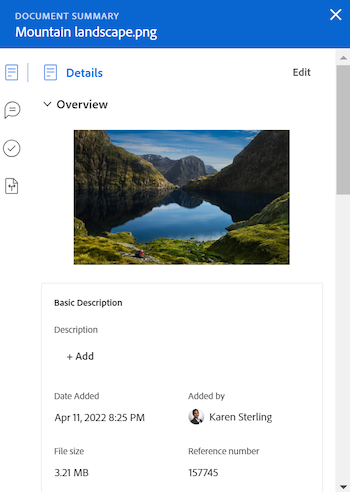

# 檔案摘要概覽

<!--Audited: April, 2024-->

您可以使用「摘要」面板，直接從檔案清單存取和更新重要資訊。

+++ 展開以檢視本文中功能的存取需求。

## 存取需求

您必須具有下列存取權才能執行本文中的步驟：

<table style="table-layout:auto"> 
 <col> 
 </col> 
 <col> 
 </col> 
 <tbody> 
  <tr> 
   <td role="rowheader">Adobe Workfront計畫</td> 
   <td> 
 任何
 </td> 
  </tr> 
  <tr> 
   <td role="rowheader">Adobe Workfront授權</td> 
   <td> 
新增：投稿人或更高版本
 
   
目前：要求或以上

   </td> 
  </tr> 
  <tr data-mc-conditions=""> 
   <td role="rowheader">存取層級設定</td> 
   <td> 
編輯檔案的存取權
  </td> 
  </tr> 
  <tr data-mc-conditions=""> 
   <td role="rowheader">物件許可權</td> 
   <td> 
檢視與檔案關聯之物件的存取權
 </td> 
  </tr> 
 </tbody> 
</table>

如需有關此表格的詳細資訊，請參閱Workfront檔案中的[存取需求](/help/quicksilver/administration-and-setup/add-users/access-levels-and-object-permissions/access-level-requirements-in-documentation.md)。

+++

## 開啟摘要檢視

{{step1-to-documents}}

1. 在&#x200B;**檔案**&#x200B;頁面上，選取清單中的檔案。

1. 在頁面的右上角，按一下&#x200B;**開啟摘要**&#x200B;圖示。 **檔案摘要**&#x200B;側面板隨即開啟。

   

   開啟「摘要」後，它仍會在此頁面上保持開啟狀態（即使您按一下其他檔案），直到您手動關閉它為止。

## 詳細資料

使用詳細資訊區段檢視高階總覽資訊並與自訂表單互動。 按一下區段頂端的詳細資訊，即可移至完整的檔案詳細資訊頁面。

* [總覽](#overview)
* [自訂表單](#custom-forms)

### 概觀 {#overview}

展開「概觀」區段以檢視或下載影像縮圖、開啟校樣、更新基本說明、取出檔案等等。

### 自訂表單 {#custom-forms}

使用自訂Forms區段來新增、編輯或檢視與檔案相關聯的任何自訂表單。 開始輸入自訂表單的名稱，以將其新增到檔案。 如需詳細資訊，請參閱[新增或編輯檔案的自訂表單](../../documents/managing-documents/add-custom-form-documents.md)。

## 更新

使用更新區段來檢視某人對該檔案或校訂進行的更新。 摘要會顯示前2個註解。 如需更新的詳細資訊，請參閱[對校訂的註解](../../review-and-approve-work/proofing/reviewing-proofs-within-workfront/comment-on-a-proof/comment-on-proof.md)。

摘要面板中的

## 核准

使用核准區段來要求檔案核准。 您也可以提醒某人有關核准的資訊、重新提交核准並取消先前的決定，或刪除核准。 檔案核准者可使用摘要來做出決定。

校訂核准必須新增到校訂工作流程中。 如需核准的詳細資訊，請參閱

* [核准工作](../../review-and-approve-work/manage-approvals/approving-work.md)
* [請求文件核准](../../review-and-approve-work/manage-approvals/request-document-approvals.md)

## 版本

使用「版本」區段可檢視針對特定檔案建立的版本數目。 按一下「更多」圖示以執行下列動作：

* 開啟校訂。
* 下載校訂或檔案。
* 預覽瀏覽器支援的檔案。
* 前往檔案詳細資訊。
* 刪除校訂或檔案。

