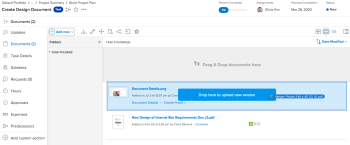

# 上傳檔案的新版本

您可以新增先前上傳至Adobe Workfront的檔案的新版本。

如果新版本的檔案名稱與先前版本的檔案名稱不同，則Workfront會顯示具有較新檔案名稱的檔案。

如果檔案包含校訂，而您想要建立新版本的校訂檔案，請參閱文章[建立檔案的校訂](../../review-and-approve-work/proofing/creating-proofs-within-workfront/generate-proof-for-a-document.md)中的[上傳檔案並建立新版本的校訂](../../review-and-approve-work/proofing/creating-proofs-within-workfront/generate-proof-for-a-document.md#uploading-a-document-and-creating-a-new-version-of-a-proof)小節。

如需有關從外部應用程式新增連結至Workfront的檔案新版本的資訊，請參閱[從外部應用程式連結檔案](../../documents/adding-documents-to-workfront/link-documents-from-external-apps.md)中的[新增連結檔案](../../documents/adding-documents-to-workfront/link-documents-from-external-apps.md#add)的新版本。

## 存取權要求

+++ 展開以檢視這篇文章中所述功能的存取權要求。

<table style="table-layout:auto"> 
 <col> 
 </col> 
 <col> 
 </col> 
 <tbody> 
  <tr> 
   <td role="rowheader">Adobe Workfront 封裝</td> 
   <td> 
使用舊版Workfront儲存來管理檔案的任何Workfront套件

使用Adobe雲端儲存空間管理檔案的任何Workflow套件
</td> 
  </tr> 
  <tr> 
   <td role="rowheader">Adobe Workfront 授權</td> 
   <td> 
   
投稿人或以上

   
要求或更高版本
 </td> 
  </tr> 
  <tr data-mc-conditions=""> 
   <td role="rowheader">存取層級設定*</td> 
   <td> 
編輯檔案的存取權
  </td> 
  </tr> 
  <tr data-mc-conditions=""> 
   <td role="rowheader">物件許可權</td> 
   <td> 
編輯與檔案關聯之物件的存取權
 </td> 
  </tr> 
 </tbody> 
</table>

如需有關此表格的詳細資訊，請參閱Workfront檔案中的[存取需求](/help/quicksilver/administration-and-setup/add-users/access-levels-and-object-permissions/access-level-requirements-in-documentation.md)。
+++

## 在舊版檔案區域中上傳新檔案版本

如果您的組織位於舊版Workfront儲存空間，當您存取Workfront中的檔案時，將會看到舊版檔案區域。 如需有關舊版Workfront儲存空間的詳細資訊，請參閱[舊版Workfront儲存空間與Adobe雲端儲存空間之間的差異](/help/quicksilver/review-and-approve-work/esm-overview.md)。

### 使用拖放功能來新增版本

>[!NOTE]
>
>Internet Explorer無法使用拖放功能。

1. 前往檔案上傳所在區域。
1. 從您的案頭或單獨的瀏覽器索引標籤，將檔案的新版本拖曳到Workfront中現有版本的上方。

   

   拖曳新版本時，您可以將游標停留在Workfront檔案資料夾上以開啟。 然後，您就可以將檔案拖曳至熒幕的頂端或底部，上下捲動。

1. 將新版本拖放到&#x200B;**檔案**&#x200B;索引標籤上的現有檔案上。

   如需有關管理檔案版本的資訊，請參閱[管理檔案版本](../../documents/managing-documents/manage-document-versions.md)。

### 使用「更多」選單來新增新版本

1. 選取您要新增新版本的檔案。
1. 按一下&#x200B;**新增** > **版本**。

   

1. 選取您要上傳的檔案型別，然後依照提示操作。

## 在新的檔案區域中上傳新的檔案版本

如果您的組織使用Adobe雲端儲存空間，當您存取Workfront中的檔案時，將會看到新的檔案區域。 如需Adobe雲端儲存空間的詳細資訊，請參閱[Adobe雲端儲存空間概觀](/help/quicksilver/review-and-approve-work/esm-overview.md)。

### 使用拖放功能來新增版本

>[!NOTE]
>
>Internet Explorer無法使用拖放功能。

1. 前往檔案上傳所在區域。
1. 將檔案的新版本拖曳到Workfront中現有版本的上方。

   

1. 將新版本拖放到&#x200B;**檔案**&#x200B;索引標籤上的現有檔案上。

   如需有關管理檔案版本的資訊，請參閱[管理檔案版本](../../documents/managing-documents/manage-document-versions.md)。

### 使用「更多」選單來新增新版本

1. 選取您要新增新版本的檔案。
1. 開啟右側的[顯示版本]圖示。
1. 按一下&#x200B;**新增版本**。

   

1. 尋找您的檔案，然後按一下&#x200B;**開啟**。

