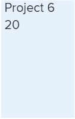

# 在增強型分析中檢視專案樹狀圖視覺效果

<!-- Audited: 12/2023 -->

「專案樹狀圖」視覺效果是在特定時段內工作的小時（或天數）檢視，並與其他工作量的大小進行比較。 這有助於您瞭解人們花多少時間投入專案。

{width="700"}

## 存取需求

您必須具備下列條件：

<table style="table-layout:auto"> 
 <col> 
 <col> 
 <tbody> 
  <tr> 
   <td role="rowheader"><a href="https://www.workfront.com/plans" target="_blank">Adobe Workfront計畫</a></td> 
   <td> 
商務或以上版本
 </td> 
  </tr> 
  <tr> 
   <td role="rowheader"><a href="../administration-and-setup/add-users/access-levels-and-object-permissions/wf-licenses.md" class="MCXref xref">Adobe Workfront授權總覽</a></td> 
   <td>   
新增：
 
   <ul><li>淺色或更高</li></ul>
   
目前：

   <ul><li>評論或以上</li></ul>
 </td> 
  </tr> 
  <tr> 
   <td role="rowheader">存取層級設定</td> 
   <td> 
檢視專案的存取權
 <!--
Note: If you still don't have access, ask your Workfront administrator if they set additional restrictions in your access level. For information on how a Workfront administrator can change your access level, see <a href="../administration-and-setup/add-users/configure-and-grant-access/create-modify-access-levels.md" class="MCXref xref">Create or modify custom access levels</a>.
--> </td> 
  </tr> 
  <tr> 
   <td role="rowheader">物件許可權</td> 
   <td> 
檢視
 <!--
For information on requesting additional access, see <a href="../workfront-basics/grant-and-request-access-to-objects/request-access.md" class="MCXref xref">Request access to objects </a>.
--> </td> 
  </tr> 
 </tbody> 
</table>

如需有關此表格的詳細資訊，請參閱 [Workfront檔案中的存取需求](/help/quicksilver/administration-and-setup/add-users/access-levels-and-object-permissions/access-level-requirements-in-documentation.md).

## 先決條件

如需使用增強型Analytics的必要條件，請參閱 [增強型分析概述](../enhanced-analytics/enhanced-analytics-overview.md).

## 瞭解專案樹狀圖視覺效果

「專案樹狀圖」視覺效果中的方塊代表專案，而方塊的大小顯示在不同專案上所花費時間的比較。 方塊越大，花在專案上的時間就越多。

專案樹狀圖視覺效果包含：

* **較小的淺藍色方塊**：小時數或天數較少的專案會顯示為淺藍色的小方塊。

  

* **較大的深藍色方塊**：有更多小時（或天數）的專案會顯示為藍色深藍的大方塊。

  

* **中等大小的藍色方塊**：屬於兩個類別的專案會顯示為中等大小的方塊，深藍色和淺藍色之間有藍色陰影。 中型盒子有3種可能的藍色色調。

右側的圖例顯示每個藍色陰影的完成時數劃分。 此圖例為動態圖例，會根據資料進行更新。

>[!NOTE]
>
>如果您是依期間而非計畫時數檢視「專案樹狀圖」視覺效果，此圖例會顯示每個藍色陰影的工作日劃分。\
>>

查看這些資訊可協助您判斷：

* 在選定的日期範圍內正在處理的事項之優先順序。
* 哪些團隊正在花費時間。
* 如果團隊聚焦於正確的事。
* 按一下特定專案時，該時段內專案範圍的變更量。

若要瞭解如何針對此視覺效果取得最佳資料，請參閱 [增強型分析概述](../enhanced-analytics/enhanced-analytics-overview.md).

## 檢視專案樹狀圖視覺效果

1. 按一下主要功能表圖示 ，然後選取 **Analytics**.
1. （可選）若要使用不同的日期範圍，請從日期範圍篩選器中選取新的開始和結束日期。

   

   如需有關使用日期範圍篩選的資訊，請參閱 [在增強型分析中套用篩選器](../enhanced-analytics/use-enhanced-analytics-filters.md).

1. （視條件而定）如果您需要限制專案資料集，請選取並套用您要使用的篩選器。

   如需在增強型分析中新增篩選器的詳細資訊，請參閱 [在增強型分析中套用篩選器](../enhanced-analytics/use-enhanced-analytics-filters.md).

   新增篩選器後，系統會顯示最多50個專案的資料，而且即使您離開頁面或登出Workfront，篩選器仍會保持作用中。

1. （選用）若要變更專案的排序方式，請按一下 **排序依據：** 「專案樹狀圖」視覺效果右上角的功能表，然後選取新的排序選項：

   * **A - Z**
   * **Z - A**
   * **計畫完成日期**
   * **計劃開始日期**

   頁面上的其他所有視覺效果都會更新以符合您的排序選擇。

1. （條件式）如果您的資料集超過50個專案，請使用視覺效果左下角的箭頭，從一個50個專案群組瀏覽至下一個專案。

   頁面上的所有其他視覺效果都會更新以符合您的頁面選擇。

   

1. （可選）變更檢視從 **計畫時數** 至 **期間**.

   預設會選取計畫時數。

1. 將滑鼠停留在專案上可檢視專案狀況、計畫時數總計、完成時數總計以及每天在專案上花費的平均時數。

   

   >[!NOTE]
   >
   >如果您已選取 **期間** 檢視，您將會看到下列期間詳細資料：
   >
   >* **計畫時間範圍**：計畫完成專案的天數。
   >* **已工作天數**：在上方所選日期範圍內完成的每項工作的計畫期間除以一天中的小時數。
   >   
   >
   >
   >如需有關持續時間的詳細資訊，請參閱以下的「持續時間檢視」一節： [增強型分析概述](../enhanced-analytics/enhanced-analytics-overview.md).

1. （選用）若要匯出視覺效果資料，請按一下 **「匯出」圖示**  然後選取匯出格式：

   * **圖表(PNG)**
   * **資料表格(XSLX)**

1. 按一下專案以開啟「待執行工作」和「小眾測試版中的任務」視覺效果，以更深入地瞭解任務和小時（或天數）對專案大小的貢獻。

如需有關待執行工作視覺效果的詳細資訊，請參閱 [在增強型分析中檢視待執行工作視覺效果](../enhanced-analytics/burndown-overview.md). 如需小眾測試版中任務視覺效果的詳細資訊，請參閱 [在Enhanced Analytics中檢視小眾測試版中的任務視覺效果](../enhanced-analytics/tasks-in-flight-overview.md).

