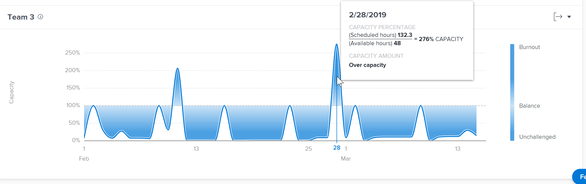

# 在Enhanced Analytics中檢視團隊容量視覺效果

<!-- Audited: 01/2024 -->

團隊容量視覺效果會顯示主團隊的總容量，不論是過度配置還是配置不足，以及容量在一段時間內的動態變化。

## 存取需求

您必須具有下列存取權才能執行本文中的步驟：

<table style="table-layout:auto"> 
 <col> 
 <col> 
 <tbody> 
  <tr> 
   <td role="rowheader">Adobe Workfront計畫</td> 
   <td>
      
新增：任何

      
或

      
目前：商務或以上
</td>
  </tr> 
  <tr> 
   <td role="rowheader">Adobe Workfront授權</td>
   <td>
      
新增：淺色或更高

      
或

      
目前：檢閱或以上

   </td>
  </tr> 
  <tr> 
   <td role="rowheader">存取層級設定</td> 
   <td>檢視專案的存取權</td> 
  </tr> 
  <tr> 
   <td role="rowheader">物件許可權</td> 
   <td>檢視 </td> 
  </tr> 
 </tbody> 
</table>

如需有關此表格的詳細資訊，請參閱 [Workfront檔案中的存取需求](/help/quicksilver/administration-and-setup/add-users/access-levels-and-object-permissions/access-level-requirements-in-documentation.md).

## 先決條件

如需使用增強型Analytics的必要條件，請參閱 [增強型分析概述](../enhanced-analytics/enhanced-analytics-overview.md).

## 瞭解團隊容量視覺效果

團隊容量視覺效果會顯示指定日期指派給主團隊的工作量。

* **待執行**：當較深的藍色填色顏色在虛線上方時，主團隊分配給他們的工作時間多於他們可以在團隊可以工作的時數內完成。 這表示團隊配置過度，可能接近待執行工作。

  

* **未受挑戰**：當較暗的藍色填色顏色在虛線下方時，主團隊的可用工作時數多於指派給他們的工作量。 這表示團隊配置不足，可能無可挑戰。

  

* **平衡**：當較淺或更透明的藍色填色顏色位於正上方、正下方或虛線時，主團隊擁有指派給主團隊的工作時間量，他們應能在其可用工作時間內完成。 這表示團隊的工作量較為平衡。

  

將游標暫留在視覺效果上的任何點上，會顯示指定日期的下列詳細資料：

* **排定小時**：這是團隊需要完成的計畫工作時數。
* **可用時數**：這是團隊可工作的小時數。
* **容量**：除了產能百分比之外，也會顯示「產能不足」、「產能不足」或「產能過剩」等指定。

查看這些資訊可協助您判斷：

* 主團隊配置過多或配置不足時。
* 如果主團隊每天都分配過多或分配不足。
* 主團隊每天的工作負載是否維持一致。
* 您的新工作是否造成產能問題。

若要瞭解如何針對此視覺效果取得最佳資料，請參閱 [增強型分析概述](../enhanced-analytics/enhanced-analytics-overview.md).

## 檢視團隊容量視覺效果

{{step1-to-analytics}}

1. 在左側面板中，選取 **人員**.

   

1. （可選）若要使用不同的日期範圍，請從日期範圍篩選器中選取新的開始和結束日期。

   

   如需有關使用日期範圍篩選的資訊，請參閱 [在增強型分析中套用篩選器](../enhanced-analytics/use-enhanced-analytics-filters.md).

1. （視條件而定）如果您尚未設定團隊篩選器，請新增團隊篩選器，並選取您要檢視其資料的每個團隊。

   如需在增強型分析中新增篩選器的詳細資訊，請參閱 [在增強型分析中套用篩選器](../enhanced-analytics/use-enhanced-analytics-filters.md).

   新增篩選器後，系統會顯示最多50個專案的資料，而且即使您離開頁面或登出Workfront，篩選器仍會保持作用中。

1. 在資源容量視覺效果上，按一下團隊以檢視更多資訊。

   團隊容量視覺效果隨即顯示。

   如需有關資源容量視覺效果的詳細資訊，請參閱 [在增強型分析中檢視資源容量視覺效果](../enhanced-analytics/resource-capacity-overview.md).

1. （可選）若要放大日期範圍，請在視覺效果上選取一個點，作為日期範圍的起點，並拖曳至日期範圍的終點。

   所有其他視覺效果會更新至相同的日期範圍，並建立時間範圍篩選器。

   

1. 將滑鼠停留在圖示生產線上的某個點，可檢視指定日期的排程時數與計畫時數、產能百分比，以及主團隊當時是超出、不足或處於產能。

   

1. （選用）若要匯出視覺效果資料，請按一下 **匯出** 圖示  然後選取匯出格式：

   * 圖表 (PNG)
   * 資料表格(XSLX)

