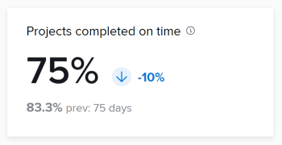

# 瞭解增強型分析KPI

>[!IMPORTANT]
>
>增強型Analytics將於5月26日起一週從Workfront中移除。 Workfront Data Connect是全新的替代解決方案，可用來複製您目前使用的任何Enhanced Analytics視覺效果。  如需詳細資訊，請參閱[Enhanced Analytics淘汰指南](/help/quicksilver/product-announcements/announcements/enhanced-analytics-deprecation.md)。

使用此功能需要商務計畫或更新版本。\
如需各種可用計畫的詳細資訊，請參閱[Adobe Workfront計畫](https://www.workfront.com/plans)。

在熒幕頂端的增強型分析區域中，顯示4個關鍵績效指標(KPI)。 這些量度可讓您快速瞭解專案需要多久的時間、專案的大小，以及在特定時間範圍內完成多少專案。 這些數字並不僅限於此頁面上視覺效果顯示的50個專案上限。 相反地，此資料以套用至任何集合篩選條件的所有專案為基礎，如果您變更所選日期範圍或任何篩選條件，這些數字會進行調整。

若要瞭解如何新增篩選器，請參閱[在增強型分析中套用篩選器](../enhanced-analytics/use-enhanced-analytics-filters.md)。

## 已完成專案

「已完成專案KPI」會顯示篩選期間內已完成多少專案，以及百分比自上一個時段以來如何增加或減少。 在這些數字下方，您可以看到上一個時段完成的專案數目，以及上一個時段中的天數。

## 已準時完成專案

「準時完成專案」KPI會顯示篩選期間內準時完成專案的百分比，以及自上一個時段以來該百分比如何增加或減少。 在這些數字下方，您可以看到上一個時段準時完成的專案百分比，以及上一個時段中的天數。

完成

## 平均 專案期間

平均 專案期間KPI會顯示實際結束日期在篩選期間內之專案的平均完成時間量（以天、周或年為單位），以及百分比自上一個期間以來如何增加或減少。 在這些數字底下，您可以看到具有前一個時段中實際結束日期之專案的平均完成時間量，以及前一個時段中的天數。

## 每專案平均任務數

「每專案平均任務數」KPI會顯示篩選期間內指派給專案的平均任務數，以及自上一個時段以來百分比增加或減少的方式。 在這些數字下方，您可以看到在前一個時段內指派給專案的平均任務數，以及前一個時段內的天數。

每個專案的
