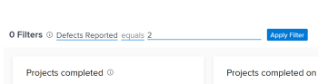
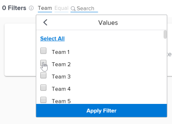
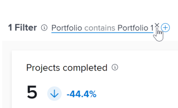

# 在增強分析中套用篩選器

「增強分析」區域中的篩選器可協助您專注在特定專案或特定資料類型上。 您使用的篩選器類型可為您提供以下分析：

* 您擁有的專案
* 特定產品組合或方案檢視
* 特定時間範圍（周、季、會計年度）的關鍵績效指標

您可以視需要新增和移除篩選器，即使您登出，Adobe Workfront仍會保留您套用的篩選器。

## 存取需求

要完成此任務，您必須具備以下條件：

<table style="table-layout:auto"> 
 <caption style="text-align: left;">
  *若要了解您擁有的計畫、授權類型或存取權，請聯絡您的Workfront管理員。
 </caption> 
 <col> 
 <col> 
 <tbody> 
  <tr> 
   <td> 
<a href="https://www.workfront.com/plans" target="_blank">Workfront計畫</a>*
 </td> 
   <td>業務或更高版本</td> 
  </tr> 
  <tr> 
   <td> 
<a href="../administration-and-setup/add-users/access-levels-and-object-permissions/wf-licenses.md" class="MCXref xref">Adobe Workfront授權概觀</a>*
 </td> 
   <td> 
審核或更高版本
 </td> 
  </tr> 
  <tr> 
   <td><b>存取層級*</b> </td> 
   <td> 
檢視專案的存取權
 
您還必須有「查看」權限，才能查看「任務」、「Portfolio」和「用戶」，才能查看特定的項目欄位篩選選項。
 
注意：如果在「編輯存取層級」對話方塊的「設定其他限制」區段中選取了限制，在套用篩選器後，您可能無法在篩選器或「增強分析」頁面上看見所有資訊。 如需Workfront管理員如何變更您的存取層級的詳細資訊，請參閱 <a href="../administration-and-setup/add-users/configure-and-grant-access/create-modify-access-levels.md" class="MCXref xref">建立或修改自訂存取層級</a>.
 </td> 
  </tr> 
  <tr> 
   <td> 
<b>物件權限</b> 
 </td> 
   <td> 
檢視
 
有關請求其他訪問的資訊，請參閱 <a href="../workfront-basics/grant-and-request-access-to-objects/request-access.md" class="MCXref xref">請求對對象的訪問 </a>.
 </td> 
  </tr> 
 </tbody> 
</table>

## 必要條件

如需使用增強分析的必要條件，請參閱 [必要條件](../enhanced-analytics/enhanced-analytics-overview.md#prerequi) in [增強的分析概觀](../enhanced-analytics/enhanced-analytics-overview.md).

## 變更日期範圍篩選 {#change-the-date-range-filter}

依預設，「增強」分析區域中的視覺效果會顯示過去60天和未來15天的資料。 您可以選取新的日期範圍，並套用至「增強分析」區域中的所有視覺效果。 如果您離開頁面，則會在您下次導覽時套用預設日期範圍。

>[!TIP]
>
>您也可以使用鍵盤上的鍵來導覽、開啟日曆介面工具集，並選取日期範圍。\
>如需詳細資訊，請參閱 [鍵盤快速鍵](../enhanced-analytics/enhanced-analytics-overview.md#keyboard) 文章一節 [增強的分析概觀](../enhanced-analytics/enhanced-analytics-overview.md).

若要選取新日期範圍：

1. 按一下「主菜單」表徵圖 ，然後選取 **Analytics**.
1. 在畫面的右上角，按一下日期範圍欄位以開啟日曆檢視。
1. 使用日曆上方的箭頭來找出開始日期的月份，然後選取開始日期。

   

1. 使用日曆上方的箭頭來找出結束日期的月份，然後選取結束日期。
1. （可選）若要放大較小的日期範圍，請在其中一個視覺效果中將滑鼠從某個特定日期拖曳至另一個日期。

   畫面上的所有視覺效果都會更新，以符合選取的時間範圍，而「時間範圍」篩選器會出現在任何現有篩選器旁。 如果您登出或離開「增強分析」區域導覽，則不會保留此篩選。

   

## 新增篩選

您可以根據預設專案欄位、自訂表單欄位和指派給專案的主團隊來新增篩選。

>[!TIP]
>
>您也可以使用鍵盤上的鍵來導覽至並新增篩選器。\
>如需詳細資訊，請參閱 [鍵盤快速鍵](../enhanced-analytics/enhanced-analytics-overview.md#keyboard) 文章一節 [增強的分析概觀](../enhanced-analytics/enhanced-analytics-overview.md).

* [新增專案欄位篩選器](#add-a-project-field-filter)
* [新增專案欄位篩選器](#add-a-project-field-filter)
* [新增團隊篩選](#add-a-team-filter)

### 新增專案欄位篩選器 {#add-a-project-field-filter}

專案欄位篩選可讓您根據在專案包含的欄位中輸入的值，依預設篩選專案和工作的資料。

可使用下列專案欄位篩選類型：

| **專案** | 僅顯示所選項目的資料 |
|---|---|
| **方案** | 僅顯示所選方案中項目的資料 |
| **專案組合** | 僅顯示所選產品組合中專案的資料 |
| **狀況** | 僅顯示最近有選取條件（在目標上、有風險或有問題）的專案的資料 |
| **狀態** | 僅顯示最近處於選定狀態（完成、當前、暫掛、取消等）的項目的資料 |
| **贊助者** | 僅顯示選定贊助商的項目的資料 |
| **專案所有者** | 僅顯示具有選定項目所有者的項目的資料 |

{style=&quot;table-layout:auto&quot;}

自訂表單篩選器的運作方式不同。 如需詳細資訊，請參閱 [新增專案欄位篩選器](#add-a-project-field-filter).

若要新增專案欄位篩選器：

1. 按一下「主菜單」表徵圖 ，然後選取 **Analytics**.
1. 在畫面的左上角，按一下 **新增篩選**，然後選取所需的篩選類型。

   >[!NOTE]
   >
   >不同的篩選類型會顯示不同的資料。 一個篩選器中只能使用一個篩選器類型。 選取後，篩選類型無法用於其他專案欄位篩選。

1. 在 **搜尋** 欄位，然後選取您要納入篩選器的每個值。

   若要選取所有目前值，請按一下 **全選**.

   

1. 選取所有所需值後，按一下 **套用篩選**.\
   頁面更新右上角的專案計數會反映您套用的篩選。
1. 對每個要新增的篩選器重複這些步驟。

   新增篩選器時，資料會顯示在下方的視覺效果中，最多可顯示50個專案。

   >[!TIP]
   >
   >若要查看50個以上專案的資料（預設顯示），您可以：
   >
   >   
   >   
   >   * 使用左下角的箭頭，顯示該視覺效果中接下來的50個專案。\
      >     
   >   
   >   * 使用視覺效果上的「排序依據」下拉式功能表，以不同順序檢視專案。\
      >     

   若要調整日期範圍，請參閱 [變更日期範圍篩選](#change-the-date-range-filter).

### 新增專案自訂表單篩選器

「自訂表單」篩選類型可讓您根據在專案的「自訂表單」欄位中輸入的值，篩選專案和工作的資料。 與其他增強分析篩選器類型不同，您可以新增多個自訂表單篩選器。 每個「自訂表單」篩選器都僅包含在特定自訂表單的選定欄位內輸入的值。

若要新增自訂表單篩選器：

1. 按一下「主菜單」表徵圖 ，然後選取 **Analytics**.
1. 在畫面的左上角，按一下 **新增篩選**，然後選取 **自訂表單**.

   

1. 在 **搜尋** 欄位，然後選取自訂表單。
1. 選取您想要的欄位，然後根據您要新增至篩選器的欄位類型，完成下列其中一個動作：

   >[!NOTE]
   >
   >並非所有自訂表單欄位類型都可新增至篩選器。 目前，Enhanced Analytics僅支援上述欄位類型。

   * **核取方塊**, **下拉式清單**，或 **單選按鈕**:在選取的欄位中選取您要納入篩選的每個值，或按一下 **全選** 核取方塊。\
      

   * **日期**:使用箭頭來導覽至特定月份，然後在您要納入篩選條件的選取欄位中選取日期。\
      

   * **文字**:在您要納入篩選的選取欄位中輸入文字。\
      

   * **數字**:在您要納入篩選的選取欄位中輸入數字。\
      

1. 輸入或選取要篩選的值後，按一下 **套用篩選**.

   頁面更新右上角的專案計數會反映您套用的篩選。

1. 對每個要新增的篩選器重複這些步驟。

   新增篩選器時，資料會顯示在下方的視覺效果中，最多可顯示50個專案。

   >[!TIP]
   >
   >若要查看50個以上專案的資料（預設顯示），您可以：
   >
   >   
   >   
   >   * 使用左下角的箭頭，顯示該視覺效果中接下來的50個專案。\
      >     
   >   
   >   * 使用視覺效果上的「排序依據」下拉式功能表，以不同順序檢視專案。\
      >     

   若要調整日期範圍，請參閱 [變更日期範圍篩選](#change-the-date-range-filter).

### 新增團隊篩選 {#add-a-team-filter}

1. 按一下「主菜單」表徵圖 ，然後選取 **Analytics**.
1. 在左側面板中，按一下 **人員**.

   

1. 在畫面的左上角，按一下 **新增篩選**，然後選取 **團隊** 篩選。
1. 在 **搜尋** 欄位，然後選取您要納入篩選器的每個團隊。 要選擇所有團隊，請按一下 **全選**.

   

   >[!NOTE]
   >
   >無論您的存取層級為何，所有團隊都會納入為篩選選項。

1. 選取所有需要的團隊後，按一下 **套用篩選**.

   新增篩選器時，資料會顯示在下方的視覺效果中。

   若要調整日期範圍，請參閱 [變更日期範圍篩選](#change-the-date-range-filter).

## 移除篩選器

您隨時都可以移除篩選器。 如果您移除篩選，則下次造訪增強分析區時不會顯示篩選。

>[!TIP]
>
>您也可以使用鍵盤上的鍵來導覽至並移除現有篩選器。\
>如需詳細資訊，請參閱 [鍵盤快速鍵](../enhanced-analytics/enhanced-analytics-overview.md#keyboard) 文章一節 [增強的分析概觀](../enhanced-analytics/enhanced-analytics-overview.md).

若要移除篩選器：

1. 按一下「主菜單」表徵圖 ，然後選取 **Analytics**.
1. 如果要移除「工作」篩選器，請保留在 **工作** 的上界。

   或

   如果要移除「人員」篩選器，請選取 **人員** 中。

1. 找出所需的篩選器，然後按一下 **X** 來移除它。

   

   篩選器不再作用中，除非您再次新增，否則不會顯示。
