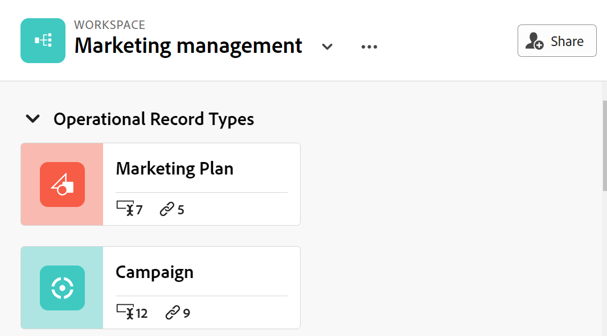

<!--update the metadata and description when we turn this article live; also, update title after Bob adds Maestro as a product-->

# 共用工作區

{{maestro-important-intro}}

您可以在使用Adobe Workfront Maestro時，與其他人共用工作區以確保共同作業。

>[!NOTE]
>
>授予工作區許可權不會授予其他使用者記錄型別頁面上檢視的許可權。 您必須授予記錄型別頁面中個別檢視的許可權，才能與其他使用者共用檢視。 如需詳細資訊，請參閱 [共用檢視](/help/quicksilver/maestro/access/share-views.md).

## 存取需求

您必須具有下列存取權才能執行本文中的步驟：

<table style="table-layout:auto">
 <col>
 </col>
 <col>
 </col>
 <tbody>
    <tr>
<tr>
<td>
   
 產品
 </td>
   <td>
   
 Adobe Workfront
 </td>
  </tr>  
 <td role="rowheader">
Adobe Workfront合約
</td>
   <td>

貴組織必須註冊AdobeMaestro封閉測試版計畫。 請聯絡您的客戶代表以查詢此新產品/服務。 

   </td>
  </tr>
  <tr>
   <td role="rowheader">
Adobe Workfront計畫
</td>
   <td>

任何

   </td>
  </tr>
  <tr>
   <td role="rowheader">
Adobe Workfront授權
</td>
   <td>
   
任何
 
  </td>
  </tr>

<tr>
   <td role="rowheader">
存取層級設定
</td>
   <td> Adobe大師沒有存取控制
  
</td>
  </tr>

<tr>
   <td role="rowheader">
權限
</td>
   <td> 
管理工作區的許可權
  
</td>
  </tr>

<tr>
   <td role="rowheader">
版面配置範本
</td>
   <td> 
必須為所有使用者(包括Workfront管理員)指派一個版面配置範本，該範本包含主功能表中的Maestro區域。 
 
如需詳細資訊，請參閱 <a href="/help/quicksilver/maestro/access/access-overview.md">存取權總覽</a>. 
 
</td>
  </tr>
 </tbody>
</table>

## 與工作區共用許可權

下列使用者可以與其他使用者共用工作區：

* 系統管理員可以共用所有工作區，包括他們未建立的工作區。
* 所有其他使用者只能共用他們對其具有管理許可權的工作區。

要與其他人共用工作區：

{{step1-to-maestro}}

1. 開啟您要共用的工作區，然後按一下 **共用** 在畫面的右上角。

   

1. 在 **將工作區存取權授予** 欄位，開始輸入使用者或群組的名稱，然後在其顯示在清單中時按一下它。

   

1. 從下拉式功能表中選取下列其中一個許可權等級：
   * 檢視
   * 參與
   * 管理

     如需許可權層級以及使用者可針對每個層級執行的動作的相關資訊，請參閱 [在Adobe Maestro中共用許可權概觀](../access/sharing-permissions-overview.md).
1. 按一下 **複製連結** 將指向工作區的連結複製到剪貼簿。
1. 與他人共用複製的連結。 收到連結的使用者必須是作用中使用者，並登入Workfront才能存取工作區。
1. 按一下「**儲存**」。

## 移除工作區的許可權

{{step1-to-maestro}}

1. 開啟您要移除其許可權的工作區，然後按一下 **共用** 在畫面的右上角。
1. 按一下使用者或群組名稱右側的下拉式功能表，然後按一下 **移除**.
1. 按一下「**儲存**」。

   屬於已移除群組的使用者或使用者無法再存取工作區或其物件。