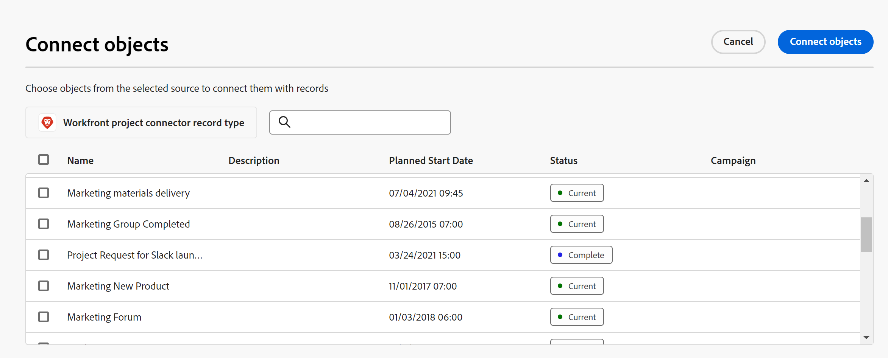

# 連線記錄型別和記錄的範例

>[!IMPORTANT]
>
>本文資訊是指Adobe Maestro，這是Adobe的新產品。
>
>目前，Adobe大師是測試版計畫的一部分，向有限數量的客戶開放。
>
>如需加入Maestro測試版計畫的詳細資訊，請聯絡您的客戶代表。
>
>如需詳細資訊，請參閱 [Adobe大師概觀](../maestro-overview.md).

本文會說明下列範例：

* 如何在兩個Maestro記錄型別和兩個Maestro記錄之間建立連線。

* 如何在AdobeMaestro記錄型別與Workfront專案物件型別之間建立連線，以及在Maestro記錄與專案之間建立連線。

如需詳細資訊，另請參閱下列文章：

* [連線記錄型別](../architecture-and-fields/connect-record-types.md)
* [連線記錄](../records/connect-records.md)

## 連線兩個Maestro記錄型別和記錄（範例）

例如，您有一個名為Campaign的記錄型別作為原始記錄型別。

您還有另一個記錄型別，稱為「產品」，其貨幣欄位稱為「預算」。

您想要在「促銷活動」的記錄型別上建立欄位，以顯示「產品」記錄型別上「預算」欄位的值。

若要這麼做：

1. 開啟行銷活動記錄型別的表格檢視。
1. 按一下 **+** 圖示以新增欄位，然後按一下「 」 **新連線**.
1. 新增下列資訊，例如：

   * **記錄型別**：產品 <!--did they change the casing here?-->
   * **名稱**：產品資訊。 這是連結的記錄欄位名稱。
   * **說明**：這些是我希望「行銷活動」相關聯的產品。
   * **允許多筆記錄**：如果您保留選取此選項，當連結的記錄型別欄位（產品資訊）顯示於原始記錄（行銷活動）時，這可讓使用者選取多個記錄。 在我們的案例中，他們可選取多個產品以連線至一個行銷活動。
   * **選取查閱欄位**：如果您保留選取此選項，則 **新增查詢欄位** 方塊隨即開啟，允許您連結產品欄位與行銷活動記錄型別。 您可以略過此步驟，稍後再新增產品欄位。

   

1. （視條件而定）如果您已選取 **選取查閱欄位選項** 在上一步中，從與 **產品** 記錄型別，按一下 **+** 圖示 **預算** 欄位，然後按一下 **新增欄位**. 這會建立一個名為的欄位 **預算（來自產品資訊）**，即連結欄位的名稱。 產品預算的任何資訊都會在此欄位中顯示促銷活動記錄。

   

   >[!TIP]
   >
   >    如果要將所有選取產品的預算檢視為一個總數，請選取 **SUM** 欄位名稱右側的下拉式功能表中。 當使用者在 **產品資訊** 連結的記錄欄位， **預算（來自產品資訊）** 欄位會將其所有「預算」值加在一起，並顯示總計。 <!-- check the shot below - added a bug with a couple of UI changes here-->
   >
   > 如果您選取 **無**，而非 **SUM**，則會顯示個別預算，並以逗號分隔。

   這會產生下列欄位：

   * 在行銷活動記錄表格檢視中和行銷活動的詳細資訊頁面中：

      * **產品資訊** （連結的記錄欄位）：這會顯示產品的名稱或名稱。
      * **預算（來自產品資訊）** （連結的欄位）：這會顯示在產品資訊欄位中選取之產品的預算。

   * 在產品記錄表格檢視中和產品的詳細資訊頁面中：

      * **Campaign**：這表示產品記錄型別已從行銷活動記錄型別連結。

     

   >[!TIP]
   >
   >    連結的記錄欄位前面有關係圖示 .

1. 填入 **產品資訊** 欄位，從 **Campaign** 記錄型別表格檢視，請在「行銷活動」記錄型別頁面的表格中新增列，以建立行銷活動。
1. 按一下 **+** 圖示內  **產品資訊** 欄中新增行銷活動。 此 **連線物件** 方塊隨即顯示。 您要連結的記錄型別（產品）名稱會顯示在方塊的左上角。

   

1. 選取您要連線至Campaign記錄的產品記錄，然後按一下 **連線物件**.

   Campaign記錄型別表格中會填入下列欄：
   * 此 **產品資訊** 欄位會針對所選產品的行銷活動記錄填入。
   * **預算（來自產品資訊）** 欄位會填入每個所選產品的預算值，或所選產品的所有預算總計。

   

   >[!TIP]
   >
   >如果您未選取多個值的彙總，則所有值都會以逗號分隔。

1. 填入 **Campaign** 欄位來自 **產品** 表格檢視，從「產品記錄型別」表格檢視開始重複步驟5至7，並選取行銷活動資訊。 這也會更新行銷活動記錄型別頁面表格中的產品資訊欄位。 <!--ensure the step numbers remain correct-->

## 將Maestro記錄型別與Workfront專案物件型別連線，並將記錄與個別專案連線

例如，您有一個名為Campaign的記錄型別作為原始記錄型別。

您也有在Workfront中有一個名為「計畫收入」欄位的專案。

您想要在「行銷活動」的記錄型別上建立連線欄位，以顯示Workfront中特定行銷活動之專案的「計畫收入」欄位值。

若要這麼做：

1. 前往您要將Campaign記錄型別與Workfront專案連結的工作區。
1. 在選取的工作區中，開啟Campaign記錄型別的表格檢視。
1. 按一下 **+** 圖示以新增欄位，然後按一下「 」 **新連線**.
1. 新增下列資訊，例如：

   * **記錄型別**：Workfront專案(來自Workfront子區段) <!--did they change the casing here for the field label and did they take "Workfront" out of the name of the object?-->
   * **名稱**：專案資訊。 這是連結物件欄位的名稱。
   * **說明**：這些是我希望Campaigns相關聯的專案。
   * 
      * **允許多筆記錄**：如果您保留選取此選項，當連結物件型別欄位（專案資訊）顯示在原始記錄（行銷活動）上時，這可讓使用者選取多個物件。
   * **選取查閱欄位**：如果您保留選取此選項，則 **新增查詢欄位** 方塊隨即開啟，讓您連結具有Campaign記錄型別的Project欄位。 您可以略過此步驟，稍後再新增專案欄位。

   

1. （視條件而定）如果您已選取 **選取查閱欄位選項** 在上一步中，從與 **專案** 物件型別，按一下 **+** 圖示 **計畫收入** 欄位，然後按一下 **新增欄位**. 這會建立一個名為的欄位 **計畫收入（來自專案資訊）**，即連結欄位的名稱。 「專案收入」欄位中的任何資訊都會顯示在此欄位中，以供Campaign記錄使用。

   >[!TIP]
   >
   >    如果要以一個總數檢視所有選定專案的計畫收入，請選取 **SUM** 欄位名稱右側的下拉式功能表中。 當使用者選擇多個專案 **專案資訊** 連結物件欄位， **計畫收入（來自產品資訊）** 欄位將其所有值相加在一起並顯示總計。 <!-- check the shot below - added a bug with a couple of UI changes here-->
   >
   > 如果您選取 **無**，而非 **SUM**，則會顯示個別計畫收入，並以逗號分隔。

   

   這會產生下列欄位：

   * 在行銷活動記錄表格檢視中和行銷活動的詳細資訊頁面中：

      * **專案資訊** （連結物件欄位）：這會顯示專案的名稱或名稱。
      * **計畫收入（來自專案資訊）** （連結的欄位）：這會顯示在專案資訊欄位中選取之專案的計畫收入。

   >[!TIP]
   >
   >    連結物件欄位的前面會加上關聯圖示 .

1. 填入 **專案資訊** 欄位，從 **Campaign** 記錄型別表格檢視，在表格中新增一列以建立行銷活動。
1. 按一下 **+** 圖示內  **專案資訊** 欄中新增行銷活動。 此 **連線物件** 方塊隨即顯示。 您要連結至的物件型別(Workfront專案)名稱會顯示在方塊的左上角。

   

1. 選取您要連線至Campaign記錄的專案，然後按一下 **連線物件**.

   下列專案會新增至選取的工作區：

   * 在Campaign記錄型別表中：
      * 此 **專案資訊** 欄位會針對選取的專案填入Campaign記錄。
      * 此 **計畫收入（來自產品資訊）** 欄位會填入每個所選產品的預算值。 此為唯讀欄位。

   

   >[!TIP]
   >
   >如果您未選取多個值的彙總，並在物件連結欄位中選取多個物件，則所有值都會以逗號分隔。

   * 您所選取之工作區的唯讀Workfront專案記錄型別。

1. 按一下頁面標頭中記錄名稱左側的向後箭頭，前往您正在更新的工作區。
1. 開啟 **Workfront專案** 記錄型別卡片以開啟記錄型別頁面。

   對於Workfront專案記錄型別頁面，請注意以下事項：

   * 這是唯讀的Maestro記錄型別，您無法刪除或更新。
   * 您選取要連線至行銷活動的專案在Workfront專案記錄型別頁面中顯示為個別記錄。 專案記錄也是唯讀的，而且當專案在Workfront中更新時，其資訊會自動更新。 您必須從連線的Maestro記錄中新增更多專案，才能在Workfront專案記錄型別中檢視它們。
   * 「促銷活動」連結的記錄欄位會填入從「促銷活動」記錄型別頁面連線至專案的促銷活動名稱。

1. （可選）若要在Maestro中開啟Workfront專案「詳細資訊」頁面，請執行下列任一項作業：

   * 從您連結的記錄型別(**Campaign**)，前往Workfront專案連結記錄欄位(**專案資訊**)，然後按一下Workfront專案的名稱。
   * 從 **表格** 檢視 **Workfront專案** 記錄頁面，按一下Workfront專案的名稱

     或

     按一下 **更多** Workfront專案右側的功能表，然後按一下 **檢視**.

     

   這會開啟已連結Workfront專案的「Maestro詳細資訊」頁面。 這是唯讀頁面。

1. （可選）若要在Workfront中開啟連結的Workfront專案，請執行下列任一項作業：

   * 從 **表格** 檢視 **Workfront專案** 頁面上，按一下Workfront專案的名稱，

   或

   按一下 **更多** Workfront專案名稱右側的功能表，然後按一下 **移至來源**.

   

   如此將可開啟Workfront專案頁面。 如果您有許可權，可以編輯Workfront專案的相關資訊。

1. 按一下 **新增欄位** 圖示  在Workfront專案記錄型別表格的右上角，將更多專案欄位新增到Workfront專案經理記錄型別。
1. 按一下 **+** 圖示來儲存您想要新增至中Workfront專案經理記錄的任何專案欄位。 **未選取的欄位** 區段。
1. 按一下 **-** 圖示來代表您要從「 」中Workfront專案主要記錄中移除的任何專案欄位。 **選取的欄位** 區段。
1. 按一下&#x200B;**儲存**。

   >[!TIP]
   >
   >    您新增至Workfront專案經理人記錄的欄位只會新增至Workfront專案頁面，而不會新增至Campaign記錄型別頁面，如連結欄位。 您必須從行銷活動記錄型別的專案資訊連線物件欄位新增專案欄位，才能檢視行銷活動的專案欄位。

1. （選擇性和條件性）如果您選取要顯示專案的至少兩個日期欄位，請按一下 **檢視** Workfront專案記錄型別表格中的下拉式功能表，然後 **建立檢視** > **時間表** > **建立** 以建立時間表檢視，並在時間表上顯示專案。
