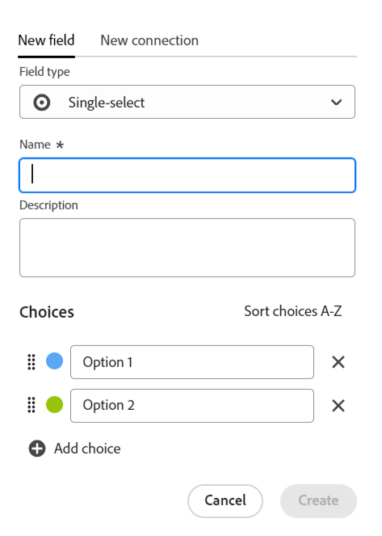
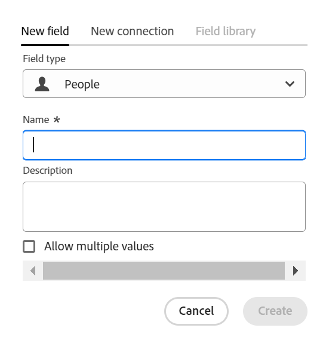

<!--udpate the metadata with real information when making this avilable in TOC and in the left nav-->

<!---
title: Create fields
description: In Adobe Maestro, you can create custom fields for each kind of operational record type or taxonomy. You can then associate the field with Maestro records.
hidefromtoc: yes
hide: yes
author: Alina
feature: (*******************WE NEED A NEW ONE*******************)
role: User, Administrator (************is this right???************)
recommendations: noDisplay, noCatalog
--->

<!--Should the structure of this article be like this one: https://experienceleague.adobe.com/docs/workfront/using/administration-and-setup/customize/custom-forms/custom-form-builder/use-the-custom-form-builder/add-a-custom-field-to-a-custom-form.html?lang=en ??-->

<!--will they add a way to create fields elsewhere than in a table?! - how will that change the structure of this article? -->

<!--Do we need this for FORMULAS: when we release permissions to RECORDS and we release referring lookup fields in a formula field, update considerations to say that lookup fields from linked records depends on the permissions to the record; if they have no permissions to view a linked record, they won't be able to use that records's lookup fields in a formula - not sure is needed??-->

# 建立欄位

>[!IMPORTANT]
>
>本文資訊是指Adobe Maestro，這是Adobe Workfront的新產品。
>
>目前，Adobe大師是測試版計畫的一部分，向有限數量的客戶開放。 您必須是Workfront客戶才能使用Maestro功能。
>
>如需加入Maestro測試版計畫的詳細資訊，請聯絡您的客戶代表。
>
>如需詳細資訊，請參閱 [Adobe大師概觀](../maestro-overview.md).

在「Adobe管理員」中，您可以建立作業記錄型別或分類的自訂欄位。 然後，您可以將欄位與Maestro記錄建立關聯，以增強記錄資訊。

您必須先建立記錄型別，然後才能建立欄位以與之關聯。 如需詳細資訊，請參閱 [建立記錄型別](../architecture/create-record-types.md).

您可以在Maestro中以下列方式建立欄位：

* 從頭開始
* 透過連線記錄型別
* 使用Excel和CSV檔案匯入記錄型別
* 藉由建立記錄型別
* 從範本建立工作區

如需有關Maestro欄位的詳細資訊，請參閱 [欄位概述](../fields/fields-overview.md)

## 存取需求

您必須具有下列存取權才能執行本文中的步驟：

<table style="table-layout:auto">
 <col>
 </col>
 <col>
 </col>
 <tbody>
    <tr>
<tr>
<td>
   
 產品
 </td>
   <td>
   
 Adobe Workfront
 </td>
  </tr>  
 <td role="rowheader">
Adobe Workfront合約
</td>
   <td>

貴組織必須註冊AdobeMaestro封閉測試版計畫。 請聯絡您的客戶代表以查詢此新產品/服務。 

   </td>
  </tr>
  <tr>
   <td role="rowheader">
Adobe Workfront計畫
</td>
   <td>

任何

   </td>
  </tr>
  <tr>
   <td role="rowheader">
Adobe Workfront授權
</td>
   <td>
   
任何
 
  </td>
  </tr>

<tr>
   <td role="rowheader">
存取層級設定
</td>
   <td> 
Maestro沒有存取層級控制
  
</td>
  </tr>

<tr>
   <td role="rowheader">
權限
</td>
   <td> 
管理工作區的許可權</a> 
  
   
系統管理員擁有所有工作區的許可權，包括他們未建立的工作區

</td>
  </tr>
<tr>
   <td role="rowheader">
版面配置範本
</td>
   <td> 
您的Workfront或群組管理員必須在您的版面配置範本中新增Maestro區域。 如需詳細資訊，請參閱 <a href="../access/access-overview.md">存取權總覽</a>. 
  
</td>
  </tr>

</tbody>
</table>

<!--Maybe enable this at GA - but Maestro is not supposed to have Access controls in the Workfront Access Level: 
>[!NOTE]
>
>If you don't have access, ask your Workfront administrator if they set additional restrictions in your access level. For information on how a Workfront administrator can change your access level, see [Create or modify custom access levels](../administration-and-setup/add-users/configure-and-grant-access/create-modify-access-levels.md). -->

<!-- Notes to add for the table: for the "Workfront plans" row: the above is only for closed beta; when going to GA - activate the following plans:    

Current plan: Prime and Ultimate

Legacy plan: Enterprise
-->

<!-- Notes for the table: for the "Workfront access" row: 
For more information, see <a href="../../administration-and-setup/add-users/access-levels-and-object-permissions/wf-licenses.md" class="MCXref xref">Adobe Workfront licenses overview</a>.
-->

## 從頭開始建立欄位 {#create-fields-from-scratch}

<!--in a table (not sure if this can be done elsewhere?!-->

{{step1-to-maestro}}

根據預設，上次存取的工作區應該會開啟。

1. （可選）展開現有工作區名稱右側的向下箭頭，並選取您要為其建立欄位之記錄型別的工作區，然後按一下記錄型別。

   與記錄型別關聯的所有現有記錄都會顯示在表格檢視的列中。

   >[!TIP]
   >
   >    如果沒有顯示記錄，表示您可能還沒有任何記錄，或者您可能套用了篩選器，以限制您在畫面上看到的內容。

   與記錄型別關聯的所有現有欄位都會顯示在表格檢視的欄中。 <!--caveat this for when we can hide the fields; mention that they can be hidden if they are not visible by default-->

1. 按一下 **+** 圖示以新增欄位。
1. 在 **新欄位** 標籤，搜尋中的欄位型別 **欄位型別** 方塊，或從下列欄位型別中選取：

   * [單行文字](#single-line-text)
   * [段落](#paragraph)
   * [多選](#multi-select)
   * [單選](#single-select)
   * [日期](#date)
   * [數字](#number)
   * [百分比](#percentage)
   * [貨幣](#currency)
   * [核取方塊](#checkbox)
   * [公式](#formula)
   * [人員](#people)
   * [建立者](#created-by)
   * [建立日期](#created-date)
   * [上次修改者](#last-modified-by)
   * [上次修改日期](#last-modified-date)

   >[!IMPORTANT]
   >
   >    儲存欄位後，您無法變更欄位的欄位型別。

1. 繼續新增每個欄位，如下節所述。

### 單行文字 {#single-line-text}

單行文字欄位會擷取有限的英數字元資訊。 例如，您可以在單行文字欄位中擷取「擁有者」、「利害關係人」、「團隊」或「組織」單位資訊。 單行文字欄位的內容最多可包含250個字元。 <!-- asked Lilit if we can change this to "Single-line" since this can have numbers and text.-->

1. 依照一節所述開始建立欄位 [從頭開始建立欄位](#create-fields-from-scratch) 在本文章中，然後選取 **單行文字** 欄位型別。

   

1. 將下列資訊新增至 **新欄位** 標籤：
   * **名稱**：欄位型別的名稱，它將顯示在表格或記錄的詳細資訊頁面中。 <!--ensure they updated this; and update the screen shot: it used to be "Label"-->
   * **說明**：欄位的其他相關資訊。 當您將滑鼠懸停在表格中的欄位欄標題上時，會顯示欄位說明。
1. 按一下「**建立**」。

   新的單行欄位會新增為記錄型別的欄，其值可與記錄相關聯。

### 段落 {#paragraph}

段落欄位會擷取有關記錄的其他英數字元資訊，類似於「說明」欄位。

>[!TIP]
>
>* 段落欄位的內容最多可包含1,000個字元。
>
>* 當段落欄位顯示在表格檢視或記錄的詳細資訊頁面時，您可以使用RTF格式來增強段落欄位的內容。

1. 依照一節所述開始建立欄位 [從頭開始建立欄位](#create-fields-from-scratch) 在本文章中，然後選取 **段落** 欄位型別。

   

1. 將下列資訊新增至 **新欄位** 標籤：
   * **名稱**：欄位型別的名稱，它將顯示在表格或記錄的詳細資訊頁面中。 <!--ensure they updated this; and update the screen shot: it used to be "Label"-->
   * **說明**：欄位的其他相關資訊。 當您將滑鼠游標停留在表格中的欄位欄位上時，會顯示欄位說明。
1. 按一下「**建立**」。

   新的段落欄位會新增為記錄型別的欄，其值可以與記錄相關聯。

### 多選 {#multi-select}

您可以從下拉式選單中選取多個選項，使用多選欄位來擷取任何格式的其他資訊。

1. 依照一節所述開始建立欄位 [從頭開始建立欄位](#create-fields-from-scratch) 在本文章中，然後選取 **多選** 欄位型別。

   

1. 將下列資訊新增至 **新欄位** 標籤：
   * **名稱**：欄位型別的名稱，它將顯示在表格或記錄的詳細資訊頁面中。 <!--ensure they updated this; and update the screen shot: it used to be "Label"-->
   * **說明**：欄位的其他相關資訊。 當您將滑鼠游標停留在表格中的欄位欄位上時，會顯示欄位說明。
   * **選擇**：儲存欄位後，可從下拉式選單選取的選項。 每個選擇的名稱可以同時使用數字和字母。
1. 按一下 **新增選擇** 以視需要新增更多選擇。 您可以在多重選取欄位中新增多少選擇，沒有限制。
1. （選用）以所需順序手動拖放每個選項，或選取
   **將選項按A-Z排序** 選項。 <!--Add this if they added this functionality: You cannot edit this option after you save the field.-->
1. 按一下 **x** 圖示加以移除。
1. 按一下選項左側的色票，即可展開顏色選取器並自訂每個選項的顏色。
1. 按一下「**建立**」。

   新的多重選取欄位會新增為記錄型別的欄，其值可與記錄相關聯。

### 單選 {#single-select}

從下拉式功能表中選取一個選項，單選欄位即可擷取任何格式的其他資訊。

1. 依照一節所述開始建立欄位 [從頭開始建立欄位](#create-fields-from-scratch) 在本文章中，然後選取 **單選** 欄位型別。

   

1. 將下列資訊新增至 **新欄位** 標籤：
   * **名稱**：欄位型別的名稱，它將顯示在表格或記錄的詳細資訊頁面中。 <!--ensure they updated this; and update the screen shot: it used to be "Label"-->
   * **說明**：欄位的其他相關資訊。 當您將滑鼠游標停留在表格中的欄位欄位上時，會顯示欄位說明。
   * **選擇**：儲存欄位後，可從下拉式選單選取的選項。 每個選擇的名稱可以同時使用數字和字母。

1. 按一下 **新增選擇** 以視需要新增更多選擇。 您可以新增多少選項至單一選取欄位，沒有限制。
1. （選用）以所需順序手動拖放每個選項，或選取 **將選項按A-Z排序** 選項。 <!--Add this if they added this functionality: You cannot edit this option after you save the field.-->
1. 按一下 **x** 圖示加以移除。
1. 按一下選項左側的色票，即可展開顏色選取器並自訂每個選項的顏色。
1. 按一下「**建立**」。

   新的單選欄位會新增為記錄型別的欄，其值可與記錄相關聯。

### 日期 {#date}

您可以使用日期欄位來擷取日期和時間格式的其他資訊。

1. 依照一節所述開始建立欄位 [從頭開始建立欄位](#create-fields-from-scratch) 在本文章中，然後選取 **日期** 欄位型別。

   

1. 將下列資訊新增至 **新欄位** 標籤：
   * **名稱**：欄位型別的名稱，它將顯示在表格或記錄的詳細資訊頁面中。 <!--ensure they updated this; and update the screen shot: it used to be "Label"-->
   * **說明**：欄位的其他相關資訊。 當您將滑鼠游標停留在表格中的欄位欄位上時，會顯示欄位說明。
   * **日期格式**：您要在此欄位中顯示的日期格式型別。 <!--update this casing - submitted bug for it-->

     從下列格式中選取：
      * **地區設定**：符合瀏覽器的地區設定。
      * **標準**：2023年5月16日
      * **長**：2023年5月16日
      * **歐洲**：2023年16月5日
      * **ISO**：2023-05-16
   * **包含時間欄位**：如果您想要包含時間戳記，請選取此選項。 預設會取消選取此選項。 <!--update this setting name - submitted bug for it to be changed-->

     從下列選項中選取：

      * **24小時**：例如： 18:00
      * **12小時**：例如：PM 6:00

1. 按一下「**建立**」。

   新的日期欄位會新增為記錄型別的欄，其值可與記錄相關聯。

### 數字 {#number}

數字欄位型別會以數字格式擷取資訊。

1. 依照一節所述開始建立欄位 [從頭開始建立欄位](#create-fields-from-scratch) 在本文章中，然後選取 **數字** 欄位型別。

   
1. 將下列資訊新增至 **新欄位** 標籤：

   * **名稱**：欄位型別的名稱，它將顯示在表格或記錄的詳細資訊頁面中。
   * **說明**：欄位的其他相關資訊。 當您將滑鼠游標停留在表格中的欄位欄位上時，會顯示欄位說明。
   * **精確度**：您要為欄位記錄的小數位數。 您最多可以顯示6個小數。
   * **允許負數**：如果您要允許此欄位中出現負數，請選取此選項。 預設會取消選取此選項。

   >[!NOTE]
   >
   >    如果您選取「允許負數」，且負值儲存在附加欄位的記錄上，則以後無法再取消選取設定。

1. 按一下「**建立**」。

   新數字欄位會新增為記錄型別的欄，其值可與記錄相關聯。

### 百分比 {#percentage}

百分比欄位型別會以數字格式擷取資訊，後面接著百分比符號。

1. 依照一節所述開始建立欄位 [從頭開始建立欄位](#create-fields-from-scratch) 在本文章中，然後選取 **百分比** 欄位型別。

   

1. 將下列資訊新增至 **新欄位** 標籤：
   * **名稱**：欄位型別的名稱，它將顯示在表格或記錄的詳細資訊頁面中。
   * **說明**：欄位的其他相關資訊。 當您將滑鼠游標停留在表格中的欄位欄位上時，會顯示欄位說明。
   * **精確度**：您要為欄位記錄的小數位數。 您最多可以顯示6個小數。
   * **允許負數**：如果您要允許此欄位中出現負百分比值，請選取此選項。 預設會取消選取此選項。

   >[!NOTE]
   >
   >    如果您選取「允許負數」，且負值儲存在附加欄位的記錄上，則以後無法再取消選取設定。

1. 按一下「**建立**」。

   新的百分比欄位會新增為記錄型別的欄，其值可與記錄相關聯。

### 貨幣 {#currency}

貨幣欄位型別會以數字格式擷取資訊，前面加貨幣符號。

1. 依照一節所述開始建立欄位 [從頭開始建立欄位](#create-fields-from-scratch) 在本文章中，然後選取 **貨幣** 欄位型別。

   

1. 將下列資訊新增至 **新欄位** 標籤：
   * **名稱**：欄位型別的名稱，它將顯示在表格或記錄的詳細資訊頁面中。 <!--ensure they updated this; and update the screen shot: it used to be "Label"-->
   * **說明**：欄位的其他相關資訊。 當您將滑鼠游標停留在表格中的欄位欄位上時，會顯示欄位說明。
   * **貨幣**：您要在此欄位中顯示的貨幣型別。 這是一份國際標準化組織(ISO)的貨幣清單。
   * **精確度**：您要為欄位記錄的小數位數。 您最多可以顯示6個小數。
   * **允許負數**：如果您要允許此欄位中出現負貨幣值，請選取此選項。 預設會取消選取此選項。

   >[!NOTE]
   >
   >    如果您選取「允許負數」，且負值儲存在附加欄位的記錄上，則以後無法再取消選取設定。

1. 按一下「**建立**」。

   新貨幣欄位會新增為記錄型別的欄，其值可與記錄相關聯。

### 核取方塊

您可以使用核取方塊欄位型別，將單一核取方塊選項新增至記錄。 您可以使用此欄位來指示該特定記錄的特定屬性或狀態。 例如，您可以將其用作追蹤完成、核准或每個記錄的任何其他二進位屬性的標幟。

1. 依照一節所述開始建立欄位 [從頭開始建立欄位](#create-fields-from-scratch) 在本文章中，然後選取 **核取方塊** 欄位型別。

   

1. 將下列資訊新增至 **新欄位** 標籤：
   * **名稱**：欄位型別的名稱，它將顯示在表格或記錄的詳細資訊頁面中。 <!--ensure they updated this; and update the screen shot: it used to be "Label"-->
   * **說明**：欄位的其他相關資訊。 當您將滑鼠游標停留在表格中的欄位欄位上時，會顯示欄位說明。
1. 按一下「**建立**」。

   新的核取方塊欄位會新增為記錄型別的欄，其值可與記錄相關聯。

### 公式

公式欄位會使用記錄型別中其他欄位的現有值，以及指示應如何計算現有值的函式，來產生新值。

如需詳細資訊，請參閱 [公式欄位概觀](/help/quicksilver/maestro/fields/formula-fields.md).

1. 依照一節所述開始建立欄位 [從頭開始建立欄位](#create-fields-from-scratch) 在本文章中，然後選取 **公式** 欄位型別。

   

1. 將下列資訊新增至 **新欄位** 標籤：

   * **名稱**：輸入新欄位的名稱。
   * **說明**：新增新欄位的相關資訊。
   * **公式**：開始輸入至少一個字元以存取運算式，然後在運算式顯示在清單中時選取它。

1. 按一下選取的運算式以顯示定義並檢視其格式。

   

   如需支援哪些運算式的詳細資訊，請參閱 [公式欄位概觀](/help/quicksilver/maestro/fields/formula-fields.md)

1. 在Maestro介面中新增欄位名稱，以在公式中參照它們。

1. 按一下「**建立**」。

   新的公式欄位會新增為記錄型別的欄，其值可與記錄相關聯。

### 人員

您可以使用「人員」欄位型別來新增使用者 <!--, job role, or team--> 至記錄。 這是預先輸入欄位，您只能新增使用者<!--, roles, or teams--> 已存在於Workfront中的屬性。

1. 依照一節所述開始建立欄位 [從頭開始建立欄位](#create-fields-from-scratch) 在本文章中，然後選取 **人員** 欄位型別。

   

1. 將下列資訊新增至 **新欄位** 標籤：
   * **名稱**：欄位型別的名稱，它將顯示在表格或記錄的詳細資訊頁面中。
   * **說明**：欄位的其他相關資訊。 當您將滑鼠游標停留在表格中的欄位欄位上時，會顯示欄位說明。
   * **允許多個值**：如果您想要允許使用者在此欄位中新增多個使用者，請選取此選項。 預設會取消選取此選項。

   >[!NOTE]
   >
   >    如果您選取「允許多個值」，且有多個使用者儲存在附加欄位的記錄中，則以後編輯此欄位時，無法再取消選取設定。

1. 按一下「**建立**」。

   新的「人員型別」欄位會新增為記錄型別的欄，其值可與記錄相關聯。

### 建立者

您可以使用「建立者」欄位型別，將建立記錄的使用者新增至記錄。 這是唯讀欄位，會自動填入建立記錄時登入的使用者名稱。

1. 依照一節所述開始建立欄位 [從頭開始建立欄位](#create-fields-from-scratch) 在本文章中，然後選取 **建立者** 欄位型別。

   

1. 將下列資訊新增至 **新欄位** 標籤：

   * **名稱**：欄位型別的名稱，它將顯示在表格或記錄的詳細資訊頁面中。 <!--this might change and they might prepopulate it with "Created by"-->
   * **說明**：欄位的其他相關資訊。 當您將滑鼠游標停留在表格中的欄位欄位上時，會顯示欄位說明。

1. 按一下「**建立**」。

   新的「建立者型別」欄位會新增為記錄型別的欄，其值會預先填入建立每個記錄的使用者名稱。

### 建立日期

您可以使用「建立日期」欄位型別，將記錄的建立日期新增至記錄。 這是唯讀欄位，會自動填入建立記錄的日期（以及可選的時間）。

1. 依照一節所述開始建立欄位 [從頭開始建立欄位](#create-fields-from-scratch) 在本文章中，然後選取 **建立日期** 欄位型別。

   

   <!--check the image above - added bug fix for UI text changes-->

1. 將下列資訊新增至 **新欄位** 標籤：

   * **名稱**：欄位型別的名稱，它將顯示在表格或記錄的詳細資訊頁面中。 <!--this might change and they might prepopulate it with "Created date"-->
   * **說明**：欄位的其他相關資訊。 當您將滑鼠游標停留在表格中的欄位欄位上時，會顯示欄位說明。
   * **日期格式**：從下列格式中選取：

      * **地區設定**：符合瀏覽器的地區設定。
      * **標準**：2023年5月16日
      * **長**：2023年5月16日
      * **歐洲**：2023年16月5日
      * **ISO**：2023-05-16
   * **包含時間欄位**：如果您想要包含時間戳記，請選取此選項。 預設會取消選取此選項。 <!--submitted a UI text change for this - check the UI-->

     從下列選項中選取：

      * **24小時**：例如： 18:00
      * **12小時**：例如：PM 6:00

1. 按一下「**建立**」。

   新的「建立日期 — 型別」欄位會新增為記錄型別的欄，其值會預先填入建立記錄的日期（或日期和時間）。

### 上次修改者

您可以使用「上次修改者」欄位型別，將上次修改紀錄的使用者新增至記錄。 這是唯讀欄位，會自動填入上次更新記錄時登入的使用者名稱。

1. 依照一節所述開始建立欄位 [從頭開始建立欄位](#create-fields-from-scratch) 在本文章中，然後選取 **上次修改者：** 欄位型別。

   

1. 將下列資訊新增至 **新欄位** 標籤：

   * **名稱**：欄位型別的名稱，它將顯示在表格或記錄的詳細資訊頁面中。 <!--this might change and they might prepopulate it with "Created by"-->
   * **說明**：欄位的其他相關資訊。 當您將滑鼠游標停留在表格中的欄位欄位上時，會顯示欄位說明。

1. 按一下「**建立**」。

   新的「上次修改者」型別欄位會新增為記錄型別的欄，其值會預先填入上次修改每筆記錄的使用者名稱。

### 上次修改日期

您可以使用「上次修改日期」欄位型別來新增上次將記錄修改至記錄的日期。 這是唯讀欄位，會自動填入上次修改記錄的日期（以及可選的時間）。

1. 依照一節所述開始建立欄位 [從頭開始建立欄位](#create-fields-from-scratch) 在本文章中，然後選取 **建立日期** 欄位型別。

   

   <!--check the image above - added bug fix for UI text changes-->

1. 將下列資訊新增至 **新欄位** 標籤：

   * **名稱**：欄位型別的名稱，它將顯示在表格或記錄的詳細資訊頁面中。 <!--this might change and they might prepopulate it with "Created date"-->
   * **說明**：欄位的其他相關資訊。 當您將滑鼠游標停留在表格中的欄位欄位上時，會顯示欄位說明。
   * **日期格式**：從下列格式中選取：

      * **地區設定**：符合瀏覽器的地區設定。
      * **標準**：2023年5月16日
      * **長**：2023年5月16日
      * **歐洲**：2023年16月5日
      * **ISO**：2023-05-16
   * **包含時間欄位**：如果您想要包含時間戳記，請選取此選項。 預設會取消選取此選項。 <!--submitted a UI text change for this - check the UI-->

     從下列選項中選取：

      * **24小時**：例如： 18:00
      * **12小時**：例如：PM 6:00

1. 按一下「**建立**」。

   新的上次修改日期型別欄位會新增為記錄型別的欄，其值會預先填入上次修改記錄的日期（或日期和時間）。

## 透過連線記錄型別建立欄位

當您在兩個Maestro記錄型別，或記錄型別與其他應用程式的物件型別之間新增連線時，可以建立連結的記錄欄位。

如需有關連線Maestro記錄型別的資訊，請參閱 [連線記錄型別](../architecture/connect-record-types.md)

## 使用Excel和CSV檔案匯入記錄型別來建立欄位

如需詳細資訊，請參閱 [建立記錄型別](../architecture/create-record-types.md).

## 建立記錄型別以建立欄位

建立記錄型別時，依預設也會建立與新記錄型別相關聯的多個欄位。 如需詳細資訊，請參閱 [建立作業記錄型別](../architecture/create-record-types.md).

## 從範本建立工作區以建立欄位

當您從範本建立工作區時，Maestro會為作業記錄型別和分類建立欄位。

如需詳細資訊，請參閱 [建立作業工作區](../architecture/create-workspaces.md).