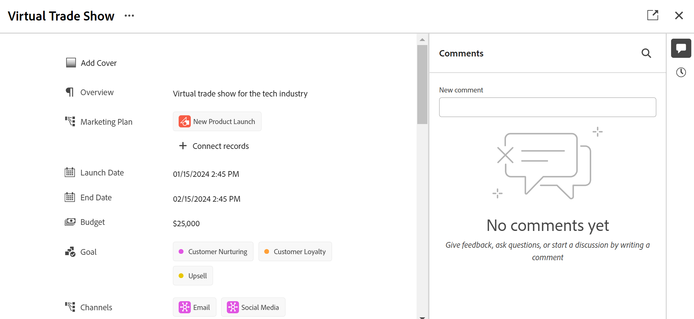

<!--update the metadata with real information when making this avilable in TOC and in the left nav-->

# 編輯記錄

{{maestro-important-intro}}

您可以在Adobe Workfront Planning中編輯記錄資訊，方法是編輯與記錄關聯的欄位值。

您必須先建立記錄型別，才能開始建立和編輯記錄。

如需詳細資訊，請參閱 [建立記錄型別](../architecture/create-record-types.md).

如需建立記錄的相關資訊，請參閱 [建立記錄](/help/quicksilver/maestro/records/create-records.md).

&lt;! — 在此提及，詳細資訊檢視中的欄位與表格檢視中的欄位相同 — 本文從「管理記錄」檢視連結，其中一個參考此資訊 — >

## 存取需求

您必須具有下列存取權才能執行本文中的步驟：

<table style="table-layout:auto">
 <col>
 </col>
 <col>
 </col>
 <tbody>
    <tr>
<tr>
<td>
   
 產品
 </td>
   <td>
   
 Adobe Workfront
 </td>
  </tr>  
 <td role="rowheader">
Adobe Workfront合約
</td>
   <td>

貴組織必須註冊Adobe Workfront Planning測試版計畫。 請聯絡您的客戶代表以查詢此新產品/服務。 

   </td>
  </tr>
  <tr>
   <td role="rowheader">
Adobe Workfront計畫
</td>
   <td>

任何

   </td>
  </tr>
  <tr>
   <td role="rowheader">
Adobe Workfront授權*
</td>
   <td>
   
新增：淺色或更高

   或
   
目前：工作或以上
 
  </td>
  </tr>

<tr>
   <td role="rowheader">
存取層級設定
</td>
   <td> 
Adobe Workfront Planning沒有存取控制
  
</td>
  </tr>
<tr>
   <td role="rowheader">
權限
</td>
   <td> 
貢獻或更高的工作區許可權</a> 
  
   
系統管理員擁有所有工作區的許可權，包括他們未建立的工作區

</td>
  </tr>
<tr>
   <td role="rowheader">
版面配置範本
</td>
   <td> 
您的Workfront或群組管理員必須在版面配置範本中新增Planning區域。 如需詳細資訊，請參閱 <a href="../access/access-overview.md">存取權總覽</a>. 
  
</td>
  </tr>

</tbody>
</table>

*如需詳細資訊，請參閱 [Workfront檔案中的存取需求](/help/quicksilver/administration-and-setup/add-users/access-levels-and-object-permissions/access-level-requirements-in-documentation.md).

## 編輯記錄的相關考量事項

* 如果您擁有工作區的許可權，您可以編輯您建立的記錄或其他人建立的記錄。
* 您可以從下列區域編輯記錄欄位：

   * 記錄檢視中的記錄方塊
   * 紀錄的頁面
   * 內嵌，在表格檢視中。

* 下列型別的欄位會自動更新，您無法手動編輯其值：
   * 從其他記錄連結的欄位
   * 公式型別欄位
   * 系統欄位（「建立者」、「建立日期」、「上次修改者」、「上次修改日期」）
* 如果顯示的記錄連結到其他記錄，則您正在編輯的記錄的新資訊會反映在連結的記錄上。
* 您無法大量編輯記錄。 <!--this will probably change-->
* URL只有以下列專案開頭時，才會被識別為單行文字欄位型別中的連結： http://、https://、ftp://或www。.
* 您可以編輯記錄頁面中的欄位順序，並為記錄新增封面影像。 如需詳細資訊，請參閱 [管理記錄頁面](/help/quicksilver/maestro/records/manage-the-record-page.md).

## 編輯記錄

您可以從下列區域編輯記錄：

* [從記錄型別的表格檢視](#edit-a-record-from-the-table-view-of-a-record-type)
* [從檢視中的記錄方塊](#edit-a-record-from-the-records-box-in-a-view)
* [從紀錄的頁面](#edit-a-record-from-the-records-page)

### 在記錄型別的表格檢視中編輯內嵌記錄

{#step1-to-maestro}

您上次存取的工作區會開啟。

1. （可選）按一下工作區名稱右側的向下箭頭，以選取您要更新其記錄的工作區。
1. 按一下記錄型別卡。

   記錄型別頁面隨即開啟。
1. （視條件而定）按一下表格檢視的標籤，或按一下 **+檢視** 以建立表格檢視。 表格檢視應該是預設檢視，除非您上次存取記錄型別時，已在其他型別的檢視中檢視該記錄型別。

   與所選記錄型別相關聯的記錄會顯示在表格檢視中。
1. 在記錄列內按一下，開始編輯有關內嵌記錄的資訊。

   

   >[!NOTE]
   >
   >  您無法編輯下列欄位的資訊，因為這些欄位是唯讀欄位，且Workfront會自動更新它們：
   >  
   >  * 透過連線記錄型別建立的連結欄位。 如需詳細資訊，請參閱 [連線記錄型別](../architecture/connect-record-types.md).
   >  * 下列型別的欄位：「建立者」、「建立日期」、「上次修改者」、「上次修改日期」、「公式」欄位。

1. （選擇性和條件性）編輯「段落」型別欄位時，請使用下列專案 **RTF文字** 格式化選項：

   * 粗體
   * 斜體
   * 底線
   * 新增連結
   * 新增專案符號清單
   * 新增編號清單

   

1. （選擇性）連按兩下連線的記錄欄位，以將連線的記錄或物件新增至其他記錄。 如需詳細資訊，請參閱 [連線記錄](/help/quicksilver/maestro/records/connect-records.md).
1. 按下 **輸入** 使用鍵盤或按一下資料列外部以儲存變更。 變更會自動儲存。 A **已儲存** 指標會短暫顯示在表格檢視的右上角，顯示變更已儲存。

1. （選擇性）若要將某個欄位的資訊複製並貼到另一個欄位，請執行下列任一項作業：

   * 複製一個欄位的一或多個現有值，然後將它們貼到另一個記錄上相同型別的欄位中
   * 按一下欄的欄標題以選取並複製它，然後按一下其他欄的欄標題並貼上複製欄的內容。 欄必須包含類似的欄位型別。
   * 按住Shift鍵，按一下選取表格中的數列，複製選取列中的資訊，然後按一下其他列，然後將選取的資訊貼到新列中，接著再貼上後續的列。
   * 複製一個儲存格的資訊，然後選取多個儲存格並在多個儲存格中貼上相同的資訊。 您可以選取多個儲存格，並在相鄰列和欄的多個儲存格中貼上相同的資訊。

   >[!NOTE]
   >
   >請考量下列事項：
   >
   >* 使用下列鍵盤快速鍵來複製和貼上資訊：
   >   * 複製： CTRL + C (Mac為⌘ + C)
   >   * 貼上：CTRL + V (Mac為⌘ + V)
   >* 除了與貼上資訊的欄位型別相同的記錄欄位外，您無法從其他來源複製資訊。
   >
   >* 您無法複製和貼上記錄頁面中的欄位值。 只有在記錄型別的表格檢視中才支援此功能。
   >* 您無法複製和貼上下列欄位型別的欄位值：
   >
   >
   >    * 透過連線記錄型別建立的連結欄位（或查詢欄位）。 您可以複製並貼上連結的記錄欄位。 如需詳細資訊，請參閱 [連線記錄型別](../architecture/connect-record-types.md).
   >    * 下列型別的欄位：建立者、建立日期、上次修改者、上次修改日期

1. （可選）使用下列鍵盤快速鍵來復原或重做編輯或複製和貼上記錄資訊：

   * CTRL + Z (Mac為⌘ + Z)可復原變更
   * CTRL + Shift + Z (Mac為⌘ + Shift + Z)以重做變更

   >[!TIP]
   >
   >    您可以在一列中多次使用鍵盤快速鍵來復原多項變更。

1. （選用）新增縮圖至記錄。 如需詳細資訊，請參閱 [新增縮圖至記錄](/help/quicksilver/maestro/records/add-thumbnails-to-records.md).

### 在檢視中編輯記錄方塊中的記錄

{{step1-to-maestro}}

您上次存取的工作區會開啟。

1. （可選）按一下工作區名稱右側的向下箭頭，以選取您要更新其記錄的工作區。

1. 按一下記錄型別卡。

   記錄型別頁面隨即開啟。

1. 從任何型別的檢視中，按一下記錄的名稱

   或

   從表格檢視中，按一下 **開啟詳細資料** 圖示  記錄名稱的左側。 記錄的方塊會在檢視中開啟。

   

   >[!TIP]
   >
   >您可以檢視 **開啟詳細資料** 圖示至表格檢視中記錄之「名稱」欄位左邊的圖示（僅當「名稱」欄位為主要欄位時）。

1. 開始編輯記錄方塊中的欄位資訊。 Workfront會自動儲存您的變更。

1. （可選）按一下 **在新標籤中開啟** 圖示  <!--check the icon; they are changing it--> 在記錄方塊的右上角，在新索引標籤中開啟記錄頁面。 繼續編輯記錄，如所述 [從記錄的頁面編輯記錄](#edit-a-record-from-the-records-page) 一節。

### 從記錄的頁面編輯記錄

{{step1-to-maestro}}

您上次存取的工作區會開啟。

1. （可選）按一下工作區名稱右側的向下箭頭，以選取您要更新其記錄的工作區。

1. 按一下記錄型別卡。

   記錄型別頁面隨即開啟。

1. 執行下列其中一項：

   * 從任何檢視中存取記錄的方塊，如 [在檢視中編輯記錄方塊中的記錄](#edit-a-record-from-the-records-box-in-a-view) 一節。 然後，按一下 **在新標籤中開啟** 圖示  <!--check the icon; they are changing it--> 在記錄方塊的右上角，以在新索引標籤中開啟記錄頁面。

   * 從 **表格** 檢視，將游標停留在記錄名稱上，然後按一下 **更多** 功能表 ，然後按一下 **檢視**

     

     記錄頁面隨即開啟。

     

1. 按一下 **更多** 功能表  在記錄名稱的右側，然後按一下 **編輯**

   或

   在記錄頁面上的任何可編輯欄位中按一下以編輯資訊。

    <!--ensure the options have not changed or been renamed-->

1. 按一下 **儲存變更**.