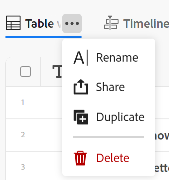

# 管理記錄檢視

<!--update the metadata with real information when making this available in TOC and in the left nav-->

{{maestro-important-intro}}

在Adobe Workfront規劃區域中選取記錄型別後，您可以在下列檢視中顯示該型別的所有記錄：

* 表格

  如需詳細資訊，請參閱 [管理表格檢視](../views/manage-the-table-view.md).

* 時間表

  如需詳細資訊，請參閱 [管理時間表檢視](../views/manage-the-timeline-view.md).

* 行事曆

  如需詳細資訊，請參閱 [管理行事曆檢視](/help/quicksilver/maestro/views/manage-the-calendar-view.md).

## 存取需求

您必須具有下列存取權才能執行本文中的步驟：

<table style="table-layout:auto">
 <col>
 </col>
 <col>
 </col>
 <tbody>
    <tr>
<tr>
<td>
   
 產品
 </td>
   <td>
   
 Adobe Workfront
 </td>
  </tr>  
 <td role="rowheader">
Adobe Workfront合約
</td>
   <td>

貴組織必須註冊Adobe Workfront計畫封閉測試版計畫。 請聯絡您的客戶代表以查詢此新產品/服務。 

   </td>
  </tr>
  <tr>
   <td role="rowheader">
Adobe Workfront計畫
</td>
   <td>

任何

   </td>
  </tr>
  <tr>
   <td role="rowheader">
Adobe Workfront授權
</td>
   <td>
   
任何
 
  </td>
  </tr>

<tr>
   <td role="rowheader">存取層級設定</td>
   <td> 
Workfront計畫沒有存取層級控制項
  
</td>
  </tr>

<tr>
   <td role="rowheader">
權限
</td>
   <td> 
管理檢視的許可權
  
</td>
  </tr>

<tr>
   <td role="rowheader">版面配置範本</td>
   <td> 
您的系統管理員必須在版面配置範本中新增Planning區域。 如需詳細資訊，請參閱 <a href="../access/access-overview.md">存取權總覽</a>. 
  
</td>
  </tr>
 </tbody>
</table>

## 使用記錄檢視時的注意事項

* Workfront Planning中的檢視是記錄型別專屬檢視。 您不能將相同的檢視套用至兩種不同的記錄型別。
* 您建立的檢視只對您和共用檢視的使用者可見。
* 當您修改或刪除檢視時，該檢視會被修改並刪除，以供擁有該檢視許可權的所有使用者使用。
* 以下元素是每個記錄檢視所獨有的：

   * 篩選器
   * 分組
   * 排序

  <!-- some of these are not available in all of the views - edit above-->

  例如，在表格檢視中建立篩選時，篩選結果只會在選取的檢視中顯示，而不會在與記錄型別相關的所有檢視中顯示。

  >[!NOTE]
  >
  > 由於Adobe Workfront規劃目前處於測試版狀態，因此某些檢視元素可能無法用於所有檢視。

本文說明有關記錄檢視的下列資訊：

* [建立及編輯檢視](#create-or-edit-record-views)
* [刪除檢視](#delete-views)
* [複製檢視](#duplicate-views)
* [共用檢視](#share-a-view)
  <!--* [Add a view as a favorite](#add-a-view-as-a-favorite) - not possible yet-->

## 記錄檢視之間的相似之處和差異

下表顯示表格、時間表與行事曆檢視之間的異同：

<!--some of these are NOT available right now; if you make this public, comment out the ones not there-->

| 功能 | 表格檢視 | 時間表檢視 | 行事曆檢視 |
|-----------------------------------------------------------------------|------------|---------------|--------------|
| 在清單或表格中顯示記錄 | ✓ (A) |              | |
| 預設將所有欄位顯示為表格中的欄 | ✓ (A) |              |    |
| 隱藏或顯示欄位 | ✓ (A) |               |    |
| 編輯每個記錄的欄位值 | ✓ (A) |               |             |
| 在檢視中將記錄新增為新列 | ✓ (A) |               |        |
| 在檢視中新增欄位作為新欄 | ✓ (A) |               |         |
| 從外部清單複製列並將它們貼到表格中 | ✓ (A) |               |          |
| 在時間軸中顯示記錄 |            | ✓ (A) |             |
| 篩選記錄 | ✓ (A) | ✓ (A) | ✓ (A) |
| 顯示行事曆上的記錄 |           |              | ✓ (A) |
| 群組記錄 | ✓ (A) | ✓ (A) |
| 排序記錄 | ✓ (A) |              |
| 色彩代碼記錄 |           | ✓ (A) | ✓ (A) |
| Color-code分組 |           | ✓ (A) |
| 搜尋特定記錄 | ✓ (A) | ✓ (A) |
| 共用檢視 | ✓ (A) | ✓ (A) | ✓ (A) |
| 從檢視開啟記錄的「詳細資訊」頁面 | ✓ (A) | ✓ (A) |    |

## 建立或編輯檢視 {#create-or-edit-views}

{{step1-to-maestro}}

您上次存取的工作區預設會開啟。 如需有關建立工作區的資訊，請參閱 [建立工作區](../architecture/create-workspaces.md).

1. 按一下記錄型別卡。 如需有關建立記錄型別的資訊，請參閱 [建立記錄型別](../architecture/create-record-types.md).

   依預設，選取型別的所有記錄都會顯示在表格檢視中。

1. 按一下 **+檢視** 以新增檢視。
1. 從下列檢視型別中選取：

   * 表格
   * 時間表
   * 行事曆

   會以選取的檢視建立新標籤。

   根據熒幕的寬度，其他檢視可能會顯示在 **更多** 功能表 .

>[!TIP]
>
>建立記錄型別時，預設也會建立表格檢視。
>
>若要建立時間表或行事曆檢視，您為其建立檢視的記錄型別必須至少有兩個日期欄位。 否則，「時間軸」和「行事曆」選項會變暗。
>

>[!NOTE]
>
>    若要建立時間表或行事曆檢視，您為其建立檢視的記錄型別必須至少有兩個日期欄位。 否則，「時間軸」或「行事曆」選項會變暗。

1. （視條件而定）按一下 **下一個**，在建立時間表或行事曆檢視時。

   依預設，Workfront會提供下列其中一個檢視名稱：

   * `Table < number >`
   * `Timeline < number >`
   * `Calendar < number >`

   數字是自動產生的增量。

1. （視條件而定）選取 **開始** 和 **結束日期** 適用於將在時間軸或行事曆檢視中顯示的記錄。
1. 按一下「**建立**」。

   檢視會顯示為新標籤。 檢視會以建立或與您共用的時間順序顯示。
1. （可選）按一下 **更多** 功能表  在最後一個檢視旁邊，顯示所選記錄型別的所有檢視。

   其他檢視顯示在 **更多** 「最後檢視」標籤之後的功能表。 旁的數字 **更多** 功能表會顯示其他檢視的數目。
1. （選擇性）若要在建立檢視後重新命名，請按一下檢視下拉式功能表，然後按一下 **更多** 功能表  > **重新命名** 更新檢視名稱

   或

   連按兩下檢視名稱，然後開始輸入新名稱。  <!--ensure there is not another saving step here?!-->

1. （可選）若要管理特定型別的檢視，請參閱下列文章：

   * [管理表格檢視](../views/manage-the-table-view.md)
   * [管理時間表檢視](../views/manage-the-timeline-view.md)
   * [管理行事曆檢視](/help/quicksilver/maestro/views/manage-the-calendar-view.md)

## 刪除檢視

{{step1-to-maestro}}

您上次存取的工作區預設會開啟。 如需有關建立工作區的資訊，請參閱 [建立工作區](../architecture/create-workspaces.md).

1. 按一下記錄型別卡。

   如需有關建立記錄型別的資訊，請參閱 [建立記錄型別](../architecture/create-record-types.md).

   依預設，選取型別的所有記錄都會顯示在表格檢視中。

1. 將滑鼠懸停在檢視標籤中其中一個檢視名稱上，然後按一下 **更多**  ，然後按一下「 」 **刪除**.
首先，您可能需要按一下 **更多** ，以尋找您要刪除的檢視。

1. 按一下 **刪除** 以確認。 <!--ensure there is not another saving step here?!-->

   所有可存取記錄區域的使用者檢視都會刪除，且無法復原。

## 共用檢視

如需關於共用檢視的資訊，請參閱 [共用檢視](/help/quicksilver/maestro/access/share-views.md).

<!--## Add a view as a favorite - this is not possible yet-->

<!--not possible yet - August 30, 2023: -->

## 複製檢視

如果您想要保留一個檢視的多個版本，並在這些版本之間做些微變更，您可以複製一個檢視。

複製檢視會建立現有檢視的相同副本。

原始檢視的共用許可權不會轉移到複製的檢視。

{{step1-to-maestro}}

您上次存取的工作區預設會開啟。

如需有關建立工作區的資訊，請參閱 [建立工作區](../architecture/create-workspaces.md).

1. 按一下記錄型別卡。 如需有關建立記錄型別的資訊，請參閱 [建立記錄型別](../architecture/create-record-types.md).

   依預設，所選型別的所有記錄都會顯示在表格檢視中。

1. 將游標停留在要複製之檢視的標籤上，然後按一下 **更多** 功能表  檢視名稱右側，然後按一下 **複製**.

   

   檢視會重複，而新檢視的名稱會遵循以下模式： `Original view's name (Copy)`. 新的檢視標籤會顯示在所有檢視標籤的末尾。

