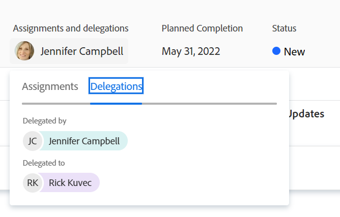

# 管理任務和問題委派

<!--
<NOTE: 
<you might need to change the tile to Delegate PTI, etc, when that functionality is added. Named it this so it will not conflict with the TOC article for Delegate section which was also "Delegate work"
I wrote thhis as a "Manage..." article and I did not add three separate articles, to match what we have for delegating approval requests)
-->

您可以在外出時暫時委派指派給的工作。

您可以委派任務和發放分配，也可以委派批准。 本文說明如何委派任務和問題分配。

有關委派工作的一般資訊，請參見 [委派工作概述](../../manage-work/delegate-work/delegate-work-overview.md).

## 存取需求

>[!IMPORTANT]
>
>* 您選擇作為委派的使用者會獲得與您所委派任務和問題的權限相同的權限。
>* 權限必須在其存取層級內運作，且有時其存取層級可能低於您的。

   >
   >   
   >   例如，如果用戶在其訪問級別中只有對任務的「查看」訪問權限，而您對您委派給他們的任務具有「管理」權限，則他們將獲得您委派給他們的任務的「管理」權限。 但是，他們將無法執行與您在委派任務上相同的動作。 他們必須向系統管理員請求「編輯」對「任務」的訪問權，才能在您不在時更新任務。
   >
   >   
   >   有關如何修改訪問級別的資訊，請參見 [建立或修改自訂存取層級](../../administration-and-setup/add-users/configure-and-grant-access/create-modify-access-levels.md).
>
>* 對於在委派已開始之後指派的項目，最多可能需要在將項目指派給 [!DNL Workfront] 與委派共用新指派的項目。

您必須具備下列存取權，才能執行本文中的步驟：

<table style="table-layout:auto"> 
 <col> 
 <col> 
 <tbody> 
  <tr> 
   <td role="rowheader">[!DNL Adobe Workfront] 計劃*</td> 
   <td> 
任何
 </td> 
  </tr> 
  <tr> 
   <td role="rowheader">[!DNL Adobe Workfront] 授權*</td> 
   <td> 
審核或更高版本

>[!NOTE]
>
>雖然您在擁有「請求」授權時可被指派工作，但您無法將您的工作委派給其他人。 [!DNL Workfront] 不建議將工作指派給「檢閱」或「要求」使用者。

</tr> 
  <tr> 
   <td role="rowheader">訪問級別配置*</td> 
   <td> 
編輯對任務和問題的訪問如果您仍然沒有訪問權限，請詢問 [!DNL Workfront] 管理員。 若要了解 [!DNL Workfront] 管理員可修改您的存取層級，請參閱 <a href="../../administration-and-setup/add-users/configure-and-grant-access/create-modify-access-levels.md" class="MCXref xref"> 建立或修改自訂存取層級</a>.
 </td> 
  </tr> 
  <tr> 
   <td role="rowheader">物件權限</td> 
   <td> 
查看或更高權限，了解您被分配的任務或問題
 
    
有關請求其他訪問的資訊，請參閱 <a href="../../workfront-basics/grant-and-request-access-to-objects/request-access.md" class="MCXref xref">請求對對象的訪問 </a>.
 </td> 
  </tr> 
 </tbody> 
</table>

*若要了解您擁有的計畫、授權類型或存取權，請聯絡您的 [!DNL Workfront] 管理員。

<!--note from the table for Object permissions:
     
Contribute or higher permissions to the projects where you are designated as the Project&nbsp;Owner (NOTE:&nbsp;you cannot delegate projects yet)

    -->

## 必要條件

您必須先確定下列事項，才能執行本文所述的活動：

* 您的 [!DNL Workfront] 或組管理員已啟用 [!UICONTROL 允許使用者刪除記錄小時的工作和問題] 設定 [!UICONTROL 設定] 區域 [!DNL Workfront] 例項。

   如需詳細資訊，請參閱 [配置全系統任務和問題首選項](../../administration-and-setup/set-up-workfront/configure-system-defaults/set-task-issue-preferences.md).

## 將任務和問題委派給其他用戶

在將工作委託給他人之前，我們建議您與他們聯繫，並通知他們將在您的工作項目上指定他們為代表。 在下班前要求他們口頭批准，以確保他們有時間在你外出時完成工作。

有關委派任務和問題的一般資訊，請參見 [委派任務和問題概觀](delegate-work.md).

要將任務和問題委派給其他人：

1. 前往 [!UICONTROL **首頁**] ，然後按一下 [!UICONTROL **委派**] 在 [!UICONTROL **工作清單**].

   

1. 在 [!UICONTROL **委派任務和問題**] 頁簽，更新以下內容：

   * [!UICONTROL **將任務和問題委派至**]:開始鍵入希望將任務和問題委派給的用戶的名稱，然後在清單中顯示時選擇它。 只能選擇一個用戶。\

      您選取作為委派的使用者，會獲得與您所委派之工作和問題的權限相同的權限。 如需詳細資訊，請參閱 [委派任務和問題概觀](delegate-work-overview.md).

   * [!UICONTROL **開始日期**]:從日曆中選擇應開始委派工作項目的日期。

      >[!TIP]
      >
      >開始日期不能為過去。

   * [!UICONTROL **無結束日期**]:如果您不想指定委派的結束日期，請選取此選項。

   * [!UICONTROL **結束日期**]:從日曆中選擇應停止委派的日期。

      >[!TIP]
      >
      >不選擇「結束日期」，則僅啟用當天的委派。

      

1. 按一下&#x200B;[!UICONTROL **儲存**]。

   發生下列情況：

   * 您的工作已委派給指定的使用者。 將委派在所選時間範圍內（包括啟用委派後新指派的任務）的任何未完成的任務或問題。
   >[!TIP]
   >
   >   未委派在委派時間範圍內具有日期的已完成工作項目。

   * 您會在畫面右上角收到訊息，確認您已啟用將工作委派給其他使用者。 委派使用者的名稱會顯示在確認訊息中。

   * 您的任務和問題已委派給其他使用者的指示，會顯示在您可以在 [!DNL Workfront]. 有關哪些區域不包括代表名稱的詳細資訊，請參見 [委派任務和問題概觀](delegate-work-overview.md).

   * 此 [!UICONTROL **委派**] 按鈕 [!UICONTROL 首頁] 區域變更 [!UICONTROL **編輯委派**] 表明已有一個代表團。

   <!--
   <MadCap:conditionalText data-mc-conditions="QuicksilverOrClassic.Draft mode">
   (NOTE: is this shot correct?&nbsp;See UI - this is a mock)
   </MadCap:conditionalText>
   -->

   

   * 如果您的事件通知和個人通知已啟用，您也會收到委派的電子郵件確認。

   * 如果已啟用其事件通知，您選取作為委派的使用者會收到有關委派的電子郵件。

      如需啟用個人電子郵件通知的相關資訊，請參閱 [啟用或停用您自己的事件通知](../../workfront-basics/using-notifications/activate-or-deactivate-your-own-event-notifications.md).

## 編輯或停止委派

如果選擇了「結束日期」，則可以讓委派過期，或者手動停止。 如果委派的日期已變更，您也可以修改委派的時間範圍。

1. 前往 [!UICONTROL 首頁] ，然後按一下 [!UICONTROL 編輯委派] 在「工作清單」的右上角。
1. 在 [!UICONTROL 委派任務和問題] 頁簽，執行下列任一操作：
   * 修改 [!UICONTROL **開始日期**] 或 [!UICONTROL **結束日期**]
   * 按一下 [!UICONTROL **停止委派**]

   >[!TIP]
   >
   >    如果委託已開始，則只能編輯委託的「結束」日期。

   

1. （有條件）按一下 [!UICONTROL **儲存**] 保存新委託日期

   或

   按一下 [!UICONTROL **停止委派**] 確認方塊以確認停止委派。

   委派會更新日期或停止日期，且委派的使用者已從您的工作和問題中移除。 他們對任務和問題的權限仍然有效。

## 查找委託工作和委託資訊

<!--(if this was released, make sure that viewing delegated approvals has not changed, as documented here: /Content/Review and approve work/Manage Approvals/delegate-approval-requests.html) 
-->

在委派任務和問題時， [!DNL Workfront] 您可以在其中查看委派的工作或委派的人員。

* [在「工作總攬」(Assignments)框中查找委派](#locate-delegates-in-the-assignments-box)
* [在中查找委託工作 [!UICONTROL 首頁]](#locate-delegated-work-in-home)

### 在 [!UICONTROL 分配] box

當系統或組管理員在系統中啟用工作委派時， [!UICONTROL 分配] 框顯示下列頁簽，您可以訪問這些頁簽的任何位置：

* [!UICONTROL **分配**]:指派給任務或問題的使用者會顯示在此處。
* [!UICONTROL **代表團**]:任務或問題上的受分配者指定為委派的用戶將顯示在此處。

您可以存取 [!UICONTROL 分配] 框（位於以下區域）中):

* 任務或問題標題

   

   此 [!UICONTROL 分配] 欄位，或將題頭變更為 [!UICONTROL 任務和委託].

* 此 [!DNL Workload Balancer] 手動指派工作或問題時

   

>[!NOTE]
>
> 您無法在 [!UICONTROL 分配] 或期刊編輯框的部分。

如果已委派任務或問題，且 [!UICONTROL 代表團] 子標籤空白，可能會存在下列其中一個情況：

* 您未被指派給任務或問題。
* 任務或問題日期不在委派時間範圍內。

>[!TIP]
>
>委派任務和問題的計畫小時數或實際小時數在資源管理工具(如 [!DNL Workload Balancer] 或 [!DNL Resource Planner] （針對委派的使用者）。 小時仍僅與指派的使用者相關聯。

### 在中查找委託工作 [!UICONTROL 首頁]

1. 前往 [!UICONTROL **首頁**] ，然後按一下「篩選」下拉式功能表，並選取下列一或多個選項：
   * [!UICONTROL **委派**]:查看您或您委派的任務和問題。
   * [!UICONTROL **委派給我**]:查看其他用戶委派給您的任務和問題。
   * [!UICONTROL **由我委派**]:查看您委派給其他用戶的任務和問題。

   

1. 按一下 [!UICONTROL 排序] 下拉式功能表，依下列條件來排序清單：
   * [!UICONTROL 已計劃完成]. 這是預設的排序選項。
   * [!UICONTROL 規劃開始日期]
   * [!UICONTROL 認可日期]
   * [!UICONTROL 專案]
   * [!UICONTROL 我的優先順序]
1. 展開 [!UICONTROL **工作清單**] 查看委託工作項。 存在下列情況：
   * 對於您委派給其他人的項目，委派的名稱會顯示在 [!UICONTROL **工作清單**] 以及 [!UICONTROL **任務和委託**] 欄位。

   * 對於委派給您的項目，受託人的名稱會顯示在 [!UICONTROL **工作清單**] 以及 **[!UICONTROL 任務和委託]** 欄位。
   >[!TIP]
   >
   >    如果委派設定為在今天日期之後的日期開始，則委派的開始日期也會顯示在 [!UICONTROL 工作清單]. 委派的項目會顯示在您為 [!UICONTROL 工作清單]，根據分組的類型。 例如，如果您依 [!UICONTROL 計畫完成日期]，則委派的項目會顯示在符合其計畫完成日期的分組中。
