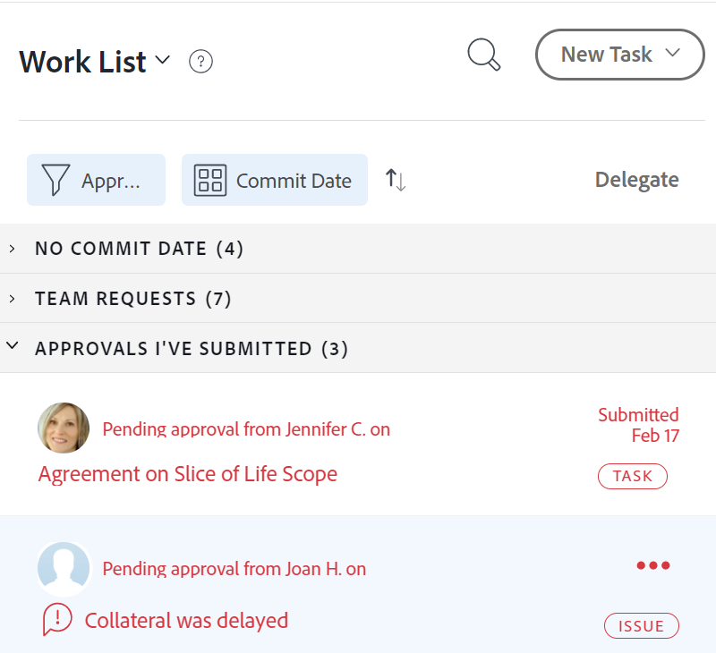
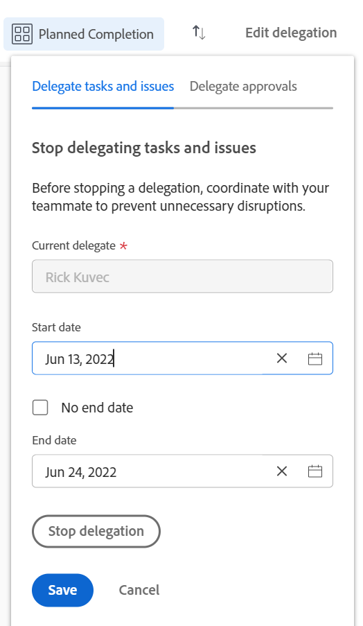

# 管理任務和問題

<!-- Audited: 1/2024 -->

<!--
<NOTE: 
<you might need to change the tile to Delegate PTI, etc, when that functionality is added. Named it this so it will not conflict with the TOC article for Delegate section which was also "Delegate work"
I wrote this as a "Manage..." article and I did not add three separate articles, to match what we have for delegating approval requests)
-->

您不在辦公室時，可以暫時委派指派給您的工作。

您可以委派任務和問題指派，也可以委派核准。 本文介紹如何委派任務和問題指派。

如需委派工作的一般資訊，請參閱 [委派工作概覽](../../manage-work/delegate-work/delegate-work-overview.md).

## 存取需求

+++ 展開以檢視本文中功能的存取需求。

>[!IMPORTANT]
>
>* 您選取為委派的使用者會獲得與您委派給他們的任務和問題之許可權相同的許可權。
>* 這些許可權必須在其存取層級內運作，有時其存取層級可能低於您的存取層級。
>
>   
>   例如，如果使用者對其存取層級中的任務只有「檢視」存取權，而您對您委派給他們的任務具有「管理」許可權，則他們可獲得您委派給他們的任務的「管理」許可權。 但是，他們將無法對委派的任務執行與您相同的動作。 若要在缺勤時更新任務，他們必須向系統管理員請求任務的編輯存取權。
>
>   
>   有關系統管理員如何修改您的存取層級的資訊，請參閱 [建立或修改自訂存取層級](../../administration-and-setup/add-users/configure-and-grant-access/create-modify-access-levels.md).
>
>* 對於在委派開始之後指派的專案，最多可能需要一小時的時間（在指派專案之後） [!DNL Workfront] 與委派共用新指派的專案。

您必須具有下列存取權才能執行本文中的步驟：

<table style="table-layout:auto"> 
 <col> 
 <col> 
 <tbody> 
  <tr> 
   <td role="rowheader">[!DNL Adobe Workfront] 計劃</td> 
   <td> 
任何
 </td> 
  </tr> 
  <tr> 
   <td role="rowheader">[!DNL Adobe Workfront] 授權</td> 
   <td> 
新增：投稿人或更高版本

或

目前：檢閱或以上

>[!NOTE]
>
>雖然您可以在擁有Request授權時獲得工作指派，但您無法將工作委派給其他人。 [!DNL Workfront] 不建議將工作指派給檢閱、請求或貢獻者使用者。

</tr> 
  <tr> 
   <td role="rowheader">存取層級設定</td> 
   <td> 
編輯任務和問題的存取權 
     
 </td> 
  </tr> 
  <tr> 
   <td role="rowheader">物件許可權</td> 
   <td> 
檢視或更高的許可權給您指派的任務或問題
 
    </td> 
  </tr> 
 </tbody> 
</table>

如需有關此表格的詳細資訊，請參閱 [Workfront檔案中的存取需求](/help/quicksilver/administration-and-setup/add-users/access-levels-and-object-permissions/access-level-requirements-in-documentation.md).

+++

<!--note from the table for Object permissions:
     
Contribute or higher permissions to the projects where you are designated as the Project&nbsp;Owner (NOTE:&nbsp;you cannot delegate projects yet)

    -->

## 先決條件

您必須先確定下列事項，才能執行本文所述的活動：

* 您的 [!DNL Workfront] 或群組管理員已啟用 [!UICONTROL 允許使用者刪除具有記錄時數的任務和問題] 在中設定 [!UICONTROL 設定] 區域 [!DNL Workfront] 執行個體。

  如需詳細資訊，請參閱 [設定系統範圍的任務和問題偏好設定](../../administration-and-setup/set-up-workfront/configure-system-defaults/set-task-issue-preferences.md).

## 將任務和問題委派給其他使用者

將工作委派給他人之前，建議您聯絡他們並通知他們他們將被指定為您工作專案的代理人。 在委派工作前要求他們口頭核准，以確保他們有必要的時間，在您外出時完成工作。

如需委派任務和問題的一般資訊，請參閱 [委派任務和問題總覽](/help/quicksilver/manage-work/delegate-work/delegate-work-overview.md).

若要將您的任務和問題委派給其他人：

1. 前往 [!UICONTROL **首頁**] 區域，然後按一下 [!UICONTROL **委派**] 在頂端 [!UICONTROL **工作清單**].

   

1. 在 [!UICONTROL **委派任務和問題**] 索引標籤中，更新下列專案：

   * [!UICONTROL **將您的任務和問題委派給**]：開始輸入您希望將您的任務和問題委派給的使用者名稱，然後在其顯示在清單中時選取它。 您只能選取一個使用者。

     您選取作為委派的使用者會收到與您委派給他們的任務和問題之許可權相同的許可權。

   * [!UICONTROL **開始日期**]：從行事曆選取開始委派工作專案的日期。

     >[!TIP]
     >
     >開始日期不能是過去。

   * [!UICONTROL **無結束日期**]：如果您不想指定委派的結束日期，請選取此選項。

   * [!UICONTROL **結束日期**]：從行事曆選取委派應停止的日期。

     >[!TIP]
     >
     >如果您將「結束日期」欄位保留空白，而未選取「無結束日期」選項，則委派僅會針對當天設定。

     

1. 按一下「[!UICONTROL **儲存**]」。

   會發生下列情況：

   * 您的工作已委派給指定的使用者。 任何日期在您選取的時間範圍內（包括啟用委派後新指派的任務）的未完成任務或問題都會被委派。

     >[!TIP]
     >
     >   日期在委派時間範圍內的已完成工作專案不會委派。

   * 您會在畫面的右上角收到一則訊息，確認您已啟用將您的工作委派給其他使用者。 委派使用者的名稱會顯示在確認訊息中。

   * 在大多數您可以看到指派的區域中，會顯示您的任務和問題已委派給其他使用者的指示。 [!DNL Workfront]. 如需關於哪些區域不包含代理人名稱的詳細資訊，請參閱 [委派工作概覽](delegate-work-overview.md).

   * 此 [!UICONTROL **委派**] 中的按鈕 [!UICONTROL 首頁] 區域變更為 [!UICONTROL **編輯委派**] 表示已有委派。
   <!--
   <MadCap:conditionalText data-mc-conditions="QuicksilverOrClassic.Draft mode">
   (NOTE: is this shot correct?&nbsp;See UI - this is a mock)
   </MadCap:conditionalText>
   -->

   

   * 如果已啟用事件通知和個人通知，您也會收到委派電子郵件確認。

   * 如果您選取作為委派的使用者已啟用其事件通知，則該使用者會收到有關委派的電子郵件。

     如需啟用個人電子郵件通知的相關資訊，請參閱 [修改您自己的電子郵件通知](../../workfront-basics/using-notifications/activate-or-deactivate-your-own-event-notifications.md).

## 編輯或停止委派

如果您選取了「結束日期」，您可以讓委派過期，也可以手動停止委派。 如果委派日期已變更，您也可以修改委派的時間範圍。

1. 前往 [!UICONTROL 首頁] 區域，然後按一下 [!UICONTROL 編輯委派] 工作清單的右上角。
1. 在 [!UICONTROL 委派任務和問題] 標籤，執行下列任一項作業：
   * 修改 [!UICONTROL **開始日期**] 或 [!UICONTROL **結束日期**]
   * 按一下 [!UICONTROL **停止委派**]

   >[!TIP]
   >
   >    如果委派已開始，則只能編輯委派的「結束」日期。

   

1. （視條件而定）按一下 [!UICONTROL **儲存**] 儲存新的委派日期

   或

   按一下 [!UICONTROL **停止委派**] ，以確認停止委派。

   委派已更新日期或已停止，並且委派的使用者已從您的任務和問題中移除。 他們對任務和問題的許可權維持不變。

## 找出委派的工作和委派資訊

<!--(if this was released, make sure that viewing delegated approvals has not changed, as documented here: /Content/Review and approve work/Manage Approvals/delegate-approval-requests.html) 
-->

委派任務和問題時， [!DNL Workfront] 您可在何處檢視委派的工作或委派者。

* [在「工作總攬」方塊中找出委派](#locate-delegates-in-the-assignments-box)
* [在中尋找委派的工作 [!UICONTROL 首頁]](#locate-delegated-work-in-home)

### 在中找出代理人 [!UICONTROL 指定任務] 方塊

當您的系統或群組管理員在您的系統中啟用工作委派時， [!UICONTROL 指定任務] 方塊會隨處顯示下列標籤，供您存取：

* [!UICONTROL **指定任務**]：指派給任務或問題的使用者顯示在這裡。
* [!UICONTROL **委派**]：由任務或問題受指派人指定為委派的使用者會顯示在這裡。

您可以存取 [!UICONTROL 指定任務] 方塊中指定字元：

* 任務或問題標題

  此 [!UICONTROL 指定任務] 任務或問題標題中的欄位變更為 [!UICONTROL 指派與委派].

  

* 此 [!UICONTROL 工作負載平衡器] 手動指派任務或問題時

  

>[!NOTE]
>
> 您無法在中檢視委派 [!UICONTROL 指定任務] 任務或問題編輯方塊的區段。

如果委派任務或問題，並且 [!UICONTROL 委派] 子標籤空白，則可能存在下列其中一種情況：

* 您未指派給任務或問題。
* 任務或問題日期不在委派時間範圍內。

>[!TIP]
>
>委派任務和問題的計畫或實際時數在資源管理工具中未被考慮，例如 [!UICONTROL 工作負載平衡器] 或 [!DNL Resource Planner] 適用於委派的使用者。 時數僅與指派的使用者相關聯。

### 在中尋找委派的工作 [!UICONTROL 首頁]

1. 前往 [!UICONTROL **首頁**] 區域，然後按一下篩選器下拉式功能表，並選取下列一或多個選項：
   * [!UICONTROL **已委派**]：檢視委派給您或您的任務和問題。
   * [!UICONTROL **已委派給我**]：檢視其他使用者委派給您的任務和問題。
   * [!UICONTROL **由我委派**]：檢視您委派給其他使用者的任務和問題。

   

1. 按一下 [!UICONTROL 排序] 下拉式功能表，依下列條件排序清單：
   * [!UICONTROL 計畫完成]. 這是預設的排序選項。
   * [!UICONTROL 計劃開始]
   * [!UICONTROL 認可日期]
   * [!UICONTROL 專案]
   * [!UICONTROL 我的優先順序]
1. 展開中的群組 [!UICONTROL **工作清單**] 以檢視委派的工作專案。 存在下列情況：
   * 對於您委派給其他人的專案，委派者的名稱會顯示在 [!UICONTROL **工作清單**] 以及 [!UICONTROL **指派與委派**] 欄位。

   * 對於委派給您的專案，受指派人的名稱會顯示在 [!UICONTROL **工作清單**] 以及 **[!UICONTROL 指派與委派]** 欄位。

   >[!TIP]
   >
   >    如果委派設為從今天之後的某個日期開始，則委派的開始日期也會顯示在 [!UICONTROL 工作清單]. 委派的專案會顯示在您為選取的分組中 [!UICONTROL 工作清單]，根據分組的型別。 例如，如果您依以下條件分組： [!UICONTROL 計畫完成日期]，委派的專案會顯示在符合其計畫完成日期的分組中。
