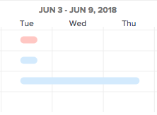

# 設定資訊在 [!UICONTROL 甘特圖]

您可以配置在兩個任務清單中顯示的資訊 [!UICONTROL 甘特圖] 和項目清單 [!UICONTROL 甘特圖].

## 存取需求

您必須具備下列條件，才能遵循本文所述步驟：

<table style="table-layout:auto"> 
 <col> 
 <col> 
 <tbody> 
  <tr> 
   <td role="rowheader">[!DNL Adobe Workfront] 計劃*</td> 
   <td> 
任何 
 </td> 
  </tr> 
  <tr> 
   <td role="rowheader">[!DNL Adobe Workfront] 授權*</td> 
   <td> 
[!UICONTROL Review]或更高版本
 </td> 
  </tr> 
  <tr> 
   <td role="rowheader">訪問級別配置*</td> 
   <td> 
[!UICONTROL視圖]或更高的項目和任務訪問權限
 
注意：如果您仍無法存取，請詢問您的 [!DNL Workfront] 管理員。 若要了解 [!DNL Workfront] 管理員可修改您的存取層級，請參閱 <a href="../../../administration-and-setup/add-users/configure-and-grant-access/create-modify-access-levels.md" class="MCXref xref">建立或修改自訂存取層級</a>.
 </td> 
  </tr> 
  <tr> 
   <td role="rowheader">物件權限</td> 
   <td> 
[!UICONTROL視圖]或更高版本對項目的訪問
 
有關請求其他訪問的資訊，請參閱 <a href="../../../workfront-basics/grant-and-request-access-to-objects/request-access.md" class="MCXref xref">請求對對象的訪問 </a>.
 </td> 
  </tr> 
 </tbody> 
</table>

&#42;若要了解您擁有的計畫、授權類型或存取權，請聯絡您的 [!DNL Workfront] 管理員。

## 了解顯示選項

下表詳細說明 [!UICONTROL 甘特圖]:

<table style="table-layout:auto"> 
 <col> 
 <col> 
 <col> 
 <tbody> 
  <tr> 
   <td role="rowheader">[!UICONTROL實際日期]</td> 
   <td>  </td> 
   <td> 
[!UICONTROL實際開始日期]和[!UICONTROL實際完成日期]以三角形表徵圖顯示。 如果[!UICONTROL實際完成日期]為null，則只顯示[!UICONTROL實際開始日期]。
 
如需開始和完成日期的詳細資訊，請參閱 <a href="../../../manage-work/projects/planning-a-project/project-actual-completion-date.md" class="MCXref xref">項目[!UICONTROL實際完成日期]概覽 </a> 和 <a href="../../../manage-work/projects/planning-a-project/project-actual-start-date.md" class="MCXref xref">專案[!UICONTROL實際開始日期]概觀 </a>.
 </td> 
  </tr> 
  <tr> 
   <td role="rowheader">[!UICONTROL分配]</td> 
   <td>  </td> 
   <td> 
顯示任務分配者。 將滑鼠移至 <strong>[!UICONTROL詳細資訊]</strong> 連結至受託人名稱旁，以查看有關受託人的更多詳細資訊，包括其分配給任務的百分比。
 
將[!UICONTROL甘特圖]導出為PDF時，在[!UICONTROL甘特圖]上不顯示分配者。 將[!UICONTROL甘特圖]導出為PDF時，受分配者僅顯示在任務清單中。
 </td> 
  </tr> 
  <tr> 
   <td role="rowheader">[!UICONTROL基線]</td> 
   <td>  </td> 
   <td> 
代表初始項目計畫中包含的項目相關關鍵資料的項目快照。 在項目的整個生命週期中都可以採用基線。 啟用在[!UICONTROL甘特圖]中顯示基線時，請選擇要顯示的基線。 一次只能在[!UICONTROL甘特圖]上查看一個基線，它將以灰色條的形式顯示。
 
如需基線的詳細資訊，請參閱 <a href="../../../manage-work/projects/create-projects/create-baselines.md" class="MCXref xref">建立專案基線</a>.
 </td> 
  </tr> 
  <tr> 
   <td role="rowheader">[!UICONTROL提交日期]</td> 
   <td>  </td> 
   <td> 
受託人承諾完成任務的日期在[!UICONTROL甘特圖]中顯示，且帶有標籤。 
 
有關提交日期的詳細資訊，請參閱 <a href="../../../manage-work/projects/updating-work-in-a-project/overview-of-commit-dates.md" class="MCXref xref">[!UICONTROL提交日期]概述</a>.
 </td> 
  </tr> 
  <tr> 
   <td role="rowheader">[!UICONTROL %完成]</td> 
   <td>  </td> 
   <td>  完成的任務的百分比顯示在任務行中。  </td> 
  </tr> 
  <tr> 
   <td role="rowheader">[!UICONTROL關鍵路徑]</td> 
   <td>  </td> 
   <td>可能影響項目時間軸的任務被視為關鍵路徑的一部分，並以紅色顯示。 </td> 
  </tr> 
  <tr> 
   <td role="rowheader">[!UICONTROL里程碑]鑽石</td> 
   <td>  </td> 
   <td> 
在與里程碑關聯的任務之後會顯示一個菱形表徵圖。 將滑鼠移至里程碑以檢視里程碑的名稱和日期。 此 [!DNL Workfront] 管理員確定每個里程碑鑽石的顏色。
 
如需里程碑的詳細資訊，請參閱 <a href="../../../administration-and-setup/customize-workfront/configure-approval-milestone-processes/create-milestone-path.md" class="MCXref xref">建立里程碑路徑</a>.
 </td> 
  </tr> 
  <tr> 
   <td role="rowheader">[!UICONTROL里程碑]行</td> 
   <td>  </td> 
   <td> 
在與里程碑關聯的任務之後會顯示一行。 將滑鼠移至里程碑以檢視里程碑的名稱和日期。 此 [!DNL Workfront] 管理員確定每個里程碑行的顏色。
 
 如需里程碑的詳細資訊，請參閱  <a href="../../../administration-and-setup/customize-workfront/configure-approval-milestone-processes/create-milestone-path.md" class="MCXref xref">建立里程碑路徑</a>
 </td> 
  </tr> 
  <tr> 
   <td role="rowheader">[!UICONTROL前置任務]</td> 
   <td>  </td> 
   <td> 
從一個任務到另一個任務的行，顯示兩個任務之間的前置關係。 要突出顯示單個前置行，請將滑鼠移到其上。 按一下它以保持醒目提示。 一次只能突出顯示一個前置行。
 
A <strong>[!UICONTROL前身]</strong> 表徵圖顯示在「甘特圖」(Gantt chart)上具有前置關係且跨越多個頁的任何任務旁邊，或顯示在具有跨項目前置項的任何任務上。
 
按一下 <strong>[!UICONTROL前身]</strong> 表徵圖，查看所有前置任務和後繼任務，以及有關每個任務的詳細資訊，如任務名稱、前置任務關係類型和關鍵日期。
 
注意：項目清單中的[!UICONTROL甘特圖]顯示有關跨項目前置項的資訊。 有關如何在不同項目之間建立前置關係的詳細資訊，請參閱 <a href="../../../manage-work/tasks/use-prdcssrs/cross-project-predecessors.md" class="MCXref xref">建立跨專案的前置項目</a>
 
有關前置任務的詳細資訊，請參閱 <a href="../../../manage-work/tasks/use-prdcssrs/enforced-predecessors.md" class="MCXref xref">強制前置作業</a>.
 </td> 
  </tr> 
  <tr> 
   <td role="rowheader">[!UICONTROL進度狀態]</td> 
   <td> 
[!UICONTROL準時] 
 
[!UICONTROL後面]    
 
[!UICONTROL面臨風險]    
 
延遲        
 </td> 
   <td> 
 
 
給定任務的當前進度的狀態。 
 
有關每種[!UICONTROL進度狀態]類型的更多詳細資訊，請參見 <a href="../../../manage-work/tasks/task-information/task-progress-status.md" class="MCXref xref">任務[!UICONTROL進度狀態]概述</a>.
 </td> 
  </tr> 
  <tr> 
   <td role="rowheader">[!UICONTROL預計日期]</td> 
   <td>  </td> 
   <td> 
根據當前已完成的工作加上剩餘的工作，標籤[!UICONTROL預計開始]和[!UICONTROL完成日期]的預期預計時間軸。 
 
有關預計完成日期的詳細資訊，請參閱 <a href="../../../manage-work/projects/planning-a-project/project-projected-completion-date.md" class="MCXref xref">項目、任務和問題的[!UICONTROL預計完成日期]概覽</a>.
 </td> 
  </tr> 
 </tbody> 
</table>

## 配置顯示選項

1. 轉到任務清單 [!UICONTROL 甘特圖] 或項目清單 [!UICONTROL 甘特圖].\
   如需其中一個 [!UICONTROL 甘特圖] 位於，請參閱 [開始使用 [!UICONTROL 甘特圖]](../../../manage-work/gantt-chart/use-the-gantt-chart/get-started-with-gantt.md).

1. （選用）選取 **[!UICONTROL 切換至預計日期]** 設定以依其 [!UICONTROL 預計日期]. 依預設，任務會依其 [!UICONTROL 計畫日期] 在 [!UICONTROL 甘特圖].
1. 按一下選項圖示以顯示 **[!UICONTROL 選項]** 對話框。\
   

1. 選取您要顯示在 [!UICONTROL 甘特圖].

   >[!NOTE]
   > 並非所有配置選項都可在「項目清單」中使用 [!UICONTROL 甘特圖].

1. 按一下 [!UICONTROL 甘特圖] 關閉 **[!UICONTROL 選項]** 對話框。
