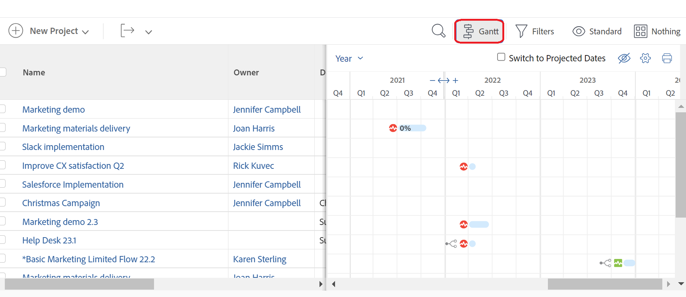

# 開始使用[!UICONTROL 甘特圖]

<!-- Audited: 01/2024 -->

Adobe Workfront中的甘特圖提供任務或專案清單時間表的視覺化表示。

在[!DNL Adobe Workfront]中，有兩個具有類似功能的[!UICONTROL 甘特圖]：

* **工作清單[!UICONTROL 甘特圖]**：顯示專案層級的工作及其時間表相關資訊。 類似的[!UICONTROL 甘特圖]顯示範本層級範本工作的相關資訊。
* **專案清單[!UICONTROL 甘特圖]**：顯示專案及其時間表的相關資訊。

雖然兩者外觀及感覺類似，但功能各異。

## 關於甘特圖的考量事項

* 您可以編輯下列[!UICONTROL 甘特圖]中的資訊：
   * 工作清單
* 您無法編輯下列[!UICONTROL 甘特圖]中的資訊：
   * 範本任務清單
   * 專案清單
* 範本清單沒有[!UICONTROL 甘特圖]選項。
* 您可以設定在任務清單[!UICONTROL 甘特圖]和專案清單[!UICONTROL 甘特圖]上顯示哪些資訊。
* 您無法設定[!UICONTROL 甘特圖]資訊顯示的顏色或字型。
* 當從任務更新資訊時，它會自動反映在工作清單[!UICONTROL 甘特圖]和專案清單[!UICONTROL 甘特圖]中。
* 從範本任務更新資訊時，資訊會自動反映在範本任務清單[!UICONTROL 甘特圖]中。

## 存取[!UICONTROL 甘特圖]

[!DNL Workfront]中的[!UICONTROL 甘特圖]提供任務或專案清單的視覺化表示法。

您可以直接從專案上的工作清單或工作報告，檢視工作清單[!UICONTROL 甘特圖]。

您可以在專案清單或專案報告中檢視專案清單[!UICONTROL 甘特圖]。

### 工作清單[!UICONTROL 甘特圖] {#task-list-gantt-chart}

<!--The task list [!UICONTROL Gantt Chart] is accessible in the following areas:

* In a Project

   * [!UICONTROL Tasks] section
   * [!UICONTROL Subtasks] section of a task

* In a [!UICONTROL Template]

* In a [!UICONTROL Task] report-->

若要存取專案或範本的工作清單[!UICONTROL 甘特圖]：

1. 移至下列任一區域：

   * 專案，然後按一下左側面板中的&#x200B;[!UICONTROL **任務**]。
   * 範本，然後按一下左側面板中的&#x200B;[!UICONTROL **範本任務**]
   * 任務或範本任務，然後按一下左側面板中的&#x200B;[!UICONTROL **子任務**]。
   * 任務報告

1. 按一下工作清單頂端的&#x200B;[!UICONTROL **甘特圖**]&#x200B;圖示。

   

   工作清單[!UICONTROL 甘特圖]會在工作清單右側開啟。

1. 若要設定要在工作[!UICONTROL 甘特圖]圖表中顯示的資訊，請按一下&#x200B;[!UICONTROL **設定**]&#x200B;圖示，然後啟用下列任一選項：

   * [!UICONTROL 實際日期]
   * [!UICONTROL 指派]
   * [!UICONTROL 基準線]
   * [!UICONTROL 認可日期]
   * 完成[!UICONTROL %]
   * [!UICONTROL 關鍵路徑]
   * [!UICONTROL 里程碑菱形]
   * [!UICONTROL 里程碑線]
   * [!UICONTROL 前置任務]
   * [!UICONTROL 進度狀態]
   * [!UICONTROL 預計日期]

1. 開始編輯工作，如下列文章所述：

   * [設定資訊在甘特圖上的顯示方式](../use-the-gantt-chart/configure-info-on-gantt-chart.md)
   * [更新工作清單甘特圖中的資訊](../use-the-gantt-chart/update-info-task-list-gantt.md)

### 專案清單[!UICONTROL 甘特圖] {#project-list-gantt-chart}

<!--The project list [!UICONTROL Gantt Chart] is accessible in the following areas:

* In the [!UICONTROL Projects] area
* In the [!UICONTROL Projects] section of a [!UICONTROL Portfolio]
* In the [!UICONTROL Projects] section of a [!UICONTROL Program]
* In a [!UICONTROL Project] report-->

若要存取專案清單[!UICONTROL 甘特圖]：

1. 移至下列任一區域：

   * [!UICONTROL **專案**]&#x200B;區域
   * [!UICONTROL Portfolio]的&#x200B;[!UICONTROL **專案**]&#x200B;區段
   * [!UICONTROL 方案]的&#x200B;[!UICONTROL **專案**]&#x200B;區段
   * [!UICONTROL **專案**]&#x200B;報告

1. 按一下專案清單頂端的&#x200B;[!UICONTROL **甘特圖**]&#x200B;圖示。

   

   專案清單[!UICONTROL 甘特圖]開啟。

1. 若要設定您要在專案[!UICONTROL 甘特圖]中顯示的資訊，請按一下&#x200B;[!UICONTROL **設定**]&#x200B;圖示，然後啟用下列任一選項：

   * [!UICONTROL 實際日期]
   * 完成[!UICONTROL %]
   * [!UICONTROL 里程碑菱形]
   * [!UICONTROL 里程碑線]
   * [!UICONTROL 前置任務]
   * [!UICONTROL 進度狀態]
   * [!UICONTROL 預計日期]
