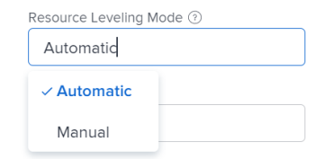

# 在[!UICONTROL 甘特圖]中平準資源

平準專案的資源有兩個用途：

* 若要自動調整受指派者的時間過度配置。
* 自動為專案建立逼真的任務排程。

## 存取需求

您必須具有下列存取權才能執行本文中的步驟：

<table style="table-layout:auto"> 
 <col> 
 <col> 
 <tbody> 
  <tr> 
   <td role="rowheader">[!DNL Adobe Workfront] 計畫*</td> 
   <td> 
任何 
 </td> 
  </tr> 
  <tr> 
   <td role="rowheader">[!DNL Workfront] 授權*</td> 
   <td> 
[！UICONTROL計畫] 
 </td> 
  </tr> 
  <tr> 
   <td role="rowheader">存取層級設定*</td> 
   <td> 
[！UICONTROL Edit]專案的存取權
 
<b>附註</b>

如果您仍然沒有存取權，請詢問您的[!DNL Workfront]管理員是否已在您的存取層級中設定其他限制。 如需[!DNL Workfront]管理員如何修改存取層級的詳細資訊，請參閱<a href="../../../administration-and-setup/add-users/configure-and-grant-access/create-modify-access-levels.md" class="MCXref xref">建立或修改自訂存取層級</a>。
 </td>
</tr> 
  <tr> 
   <td role="rowheader">物件許可權</td> 
   <td> 
[！UICONTROL Manage]專案的存取權
 
如需請求其他存取權的資訊，請參閱<a href="../../../workfront-basics/grant-and-request-access-to-objects/request-access.md" class="MCXref xref">請求物件</a>的存取權。
 </td> 
  </tr> 
 </tbody> 
</table>

&#42;若要瞭解您擁有的計畫、授權型別或存取權，請連絡您的[!DNL Workfront]管理員。

## 資源平準概要

如果將相同的資源指派給兩個不同的任務，則可以使用資源平準來調整任務的時間表，使它們不會同時發生。

平準專案上的資源時，請考量下列事項：

* 資源平準僅適用於一個專案，因此[!DNL Adobe Workfront]不會一次平準多個專案的資源。
* 如果選取&#x200B;**[!UICONTROL 投入比導向]**&#x200B;作為&#x200B;**[!UICONTROL 期間型別]**，則[!DNL Workfront]不會平準資源。
* 將多位使用者指派給同一個任務時，將會取消平準。
* **[!UICONTROL 任務限制]**&#x200B;型別的條件優先於資源平準。 例如，如果選取&#x200B;**[!UICONTROL 固定日期]**&#x200B;作為[!UICONTROL 任務限制]，資源撫平將不會變更任務日期。
* 前置任務關係將優先於資源平準。
* 專案的&#x200B;**[!UICONTROL 資源平準]**&#x200B;必須設定為&#x200B;**[!UICONTROL 手動]**，才能在[!UICONTROL 甘特圖]中調整平準。 如果您擁有專案的管理許可權，可以調整專案的這個設定，並在&#x200B;**[!UICONTROL 編輯專案]**&#x200B;方塊中選取&#x200B;**[!UICONTROL 自動]**&#x200B;而非&#x200B;**[!UICONTROL 手動]**，讓系統自動分級資源。

  

* 作為專案所有者或任務受指派人，您可以為任務引入平準延遲，以表示任務極有可能需要額外的時間。 如需將平準延遲新增至任務的詳細資訊，請參閱[更新任務平準延遲](../../../manage-work/tasks/task-information/task-leveling-delay.md)。

## 在[!UICONTROL 甘特圖]中套用資源平準

您可以使用工作清單[!UICONTROL 甘特圖]來平準您的資源。

1. 移至您要平準的專案。
1. 在&#x200B;**[!UICONTROL 任務]**&#x200B;區域中，按一下&#x200B;**[!UICONTROL 甘特圖]**&#x200B;圖示。

   啟用&#x200B;**[!UICONTROL 自動儲存]**&#x200B;選項時，所有變更都會自動儲存。 預設為啟用。

1. （選擇性）按一下&#x200B;**[!UICONTROL 計畫]模式**&#x200B;圖示，然後選取&#x200B;**[!UICONTROL 手動儲存標準]**&#x200B;或&#x200B;**[!UICONTROL 時間表計畫]**，以手動儲存您的變更。

   >[!TIP]
   >
   >啟用[!UICONTROL 自動儲存]選項時，您無法平準[!UICONTROL 甘特圖]中的資源。

   

1. 按一下&#x200B;**[!UICONTROL 層級資源]**&#x200B;下拉式功能表。

   

1. 選取下列其中一個選項：

   * **[!UICONTROL 立即層級]**：將資源平準套用至選取的任務。
   * **[!UICONTROL 清除資源撫平]**：從選取的任務移除所有資源撫平。

   >[!NOTE]
   >
   >如果將資源指派給在相同時間範圍內發生的多個任務，則資源可能會過度配置。

1. （選擇性和條件性）如果您已停用「自動儲存」選項，如果要取消或複製任何變更，請按一下&#x200B;**[!UICONTROL 復原]**&#x200B;或&#x200B;**[!UICONTROL 重做]**&#x200B;圖示。

   >[!TIP]
   >
   >您可以使用下列鍵盤快速鍵來復原或重做[!UICONTROL 甘特圖]上的變更：
   >
   >* [!DNL Mac]：使用[!UICONTROL Command + Z]來還原，並使用[!UICONTROL Command + Shift + Z]來重做。
   >* Windows：使用[!UICONTROL Ctrl + Z]來還原，使用[!UICONTROL Ctrl + Y]來重做。

1. 按一下[!UICONTROL 甘特圖]右上角的&#x200B;**[!UICONTROL 儲存]**。

<!--

<h2>Overview of Leveling Delay</h2>

(NOTE: moved to its own article: /Content/Manage work/Tasks/Task information/task-leveling-delay.htm) 

At times, there might be conflicts between task schedules on a project. You can level resources or address resource conflicts by rescheduling resources and tasks so that all tasks can be completed within a realistic schedule. 

As the project manager, or the task assignee, you can also add a Leveling Delay on individual tasks to account for any resource or scheduling conflicts. In other words, a task might be scheduled with a delay to ensure that when Adobe Workfront levels the tasks a more realistic schedule overcomes resource conflicts.

To manually add a Leveling Delay to a task:

<ol>
<li value="1">Navigate to a task for which you want to add a Leveling Delay.</li>
<li value="2"> 
 Click the <strong>More icon</strong> to the right of the task name, then click <strong>Edit</strong>. 
  </li>
<li value="3">Click <strong>Settings</strong>. </li>
<li value="4">Specify the <strong>Leveling Delay</strong>, in hours. This is the time that the resource will be delayed starting the task due to resource conflicts.</li>
<li value="5">Click <strong>Save Changes</strong>. </li>
</ol>

-->
