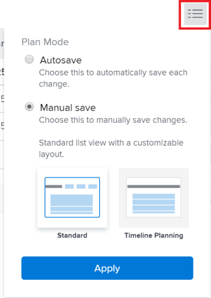

# 更新工作清單[!UICONTROL 甘特圖]中的資訊

<!--Audited: 08/2025-->

Adobe Workfront任務清單的[!UICONTROL 甘特圖]顯示專案或範本上任務的詳細資訊。

在範本中，工作清單[!UICONTROL 甘特圖]反映範本工作清單在範本工作層級所做的更新。 您無法編輯與範本關聯的[!UICONTROL 甘特圖]。

在專案中，您可以直接在任務清單[!UICONTROL 甘特圖]中更新任務資訊。

本文說明可直接在工作清單[!UICONTROL 甘特圖]中執行的下列動作：

* 修改任務工期
* 建立或移除前置任務關係
* 變更任務的開始和結束日期
* 更新完成百分比
* 平準專案資源

## 存取需求

+++ 展開以檢視本文中功能的存取需求。 

<table style="table-layout:auto"> 
 <col> 
 <col> 
 <tbody> 
  <tr> 
   <td role="rowheader">[!DNL Adobe Workfront] 封裝</td> 
   <td> 
任何
 </td> 
  </tr> 
  <tr> 
   <td role="rowheader">[!DNL Adobe Workfront] 授權</td> 
   <td> 
[！UICONTROL標準]

   
[！UICONTROL計畫]
 </td> 
  </tr> 
  <tr> 
   <td role="rowheader">存取層級設定</td> 
   <td> 
[！UICONTROL Edit]對專案和任務的存取權
 </td> 
  </tr> 
  <tr> 
   <td role="rowheader">物件許可權</td> 
   <td> 
[！UICONTROL Manage]專案和任務的存取權
 </td> 
  </tr> 
 </tbody> 
</table>

如需有關此表格的詳細資訊，請參閱Workfront檔案中的[存取需求](/help/quicksilver/administration-and-setup/add-users/access-levels-and-object-permissions/access-level-requirements-in-documentation.md)。

+++ 

<!--Old:

<table style="table-layout:auto"> 
 <col> 
 <col> 
 <tbody> 
  <tr> 
   <td role="rowheader">[!DNL Adobe Workfront] plan*</td> 
   <td> 
Any 
 </td> 
  </tr> 
  <tr> 
   <td role="rowheader">[!DNL Adobe Workfront] license*</td> 
   <td> 
[!UICONTROL Plan] 
 </td> 
  </tr> 
  <tr> 
   <td role="rowheader">Access level configurations*</td> 
   <td> 
[!UICONTROL Edit] access to Projects and Tasks
 
Note: If you still don't have access, ask your [!DNL Workfront] administrator if they set additional restrictions in your access level. For information on how a [!DNL Workfront] administrator can modify your access level, see <a href="../../../administration-and-setup/add-users/configure-and-grant-access/create-modify-access-levels.md" class="MCXref xref">Create or modify custom access levels</a>.
 </td> 
  </tr> 
  <tr> 
   <td role="rowheader">Object permissions</td> 
   <td> 
[!UICONTROL Manage] access to the project and tasks 
 
For information on requesting additional access, see <a href="../../../workfront-basics/grant-and-request-access-to-objects/request-access.md" class="MCXref xref">Request access to objects </a>.
 </td> 
  </tr> 
 </tbody> 
</table>-->

## 修改任務工期

1. 前往您要修改的專案。
1. 按一下左側面板中的&#x200B;**[!UICONTROL 工作]**。

   

1. 按一下&#x200B;**[!UICONTROL 甘特圖]**&#x200B;圖示。

   

   啟用&#x200B;**[!UICONTROL 自動儲存]**&#x200B;選項時，所有變更都會自動儲存。 這項設定預設為啟用。

1. （選擇性）按一下&#x200B;**[!UICONTROL 計畫模式]**&#x200B;圖示並選取&#x200B;**[!UICONTROL 手動儲存標準]**&#x200B;或&#x200B;**[!UICONTROL 時間表計畫]**，以手動儲存您的變更。

   

1. 暫留在任務的時間表上，並將時間線指標拖曳到不同日期。
1. 到達任務正確的新「完成日期」後，放置指示器。
1. （選擇性和條件性）如果您已選取手動儲存變更，如果要取消或複製任何變更，請按一下&#x200B;**[!UICONTROL 還原]**&#x200B;或&#x200B;**[!UICONTROL 重做]**&#x200B;圖示。

   >[!TIP]
   >
   >您可以使用下列鍵盤快速鍵來復原或重做甘特圖上的變更：
   >
   >   
   >   
   >   * [!DNL Mac]：使用[!UICONTROL Command + Z]來還原，並使用[!UICONTROL Command + Shift + Z]來重做。
   >   * [!DNL Windows]：使用[!UICONTROL Ctrl + Z]來還原，使用[!UICONTROL Ctrl + Y]來重做。
   >   
   >

1. 按一下&#x200B;**[!UICONTROL 甘特圖]**&#x200B;右上角的[!UICONTROL 儲存]。

## 建立或移除前置任務關係

1. 前往您要修改的專案。
1. 在&#x200B;**[!UICONTROL 任務]**&#x200B;區域中，按一下&#x200B;**[!UICONTROL 甘特圖]**&#x200B;圖示。

   預設會選取&#x200B;**[!UICONTROL 自動儲存]**&#x200B;選項，在此情況下，所有變更都會自動儲存。

   

1. （選擇性）按一下&#x200B;**[!UICONTROL 計畫模式]**&#x200B;圖示並選取&#x200B;**[!UICONTROL 手動儲存標準]**&#x200B;或&#x200B;**[!UICONTROL 時間表計畫]**，以手動儲存您的變更。

   

1. 若要建立前置任務關係，請按一下任務的起點，然後將其拖曳到任務的終點。
1. 若要刪除前置任務關係，請按一下連線兩個任務的前置任務行以選取它，然後按鍵盤上的&#x200B;**[!UICONTROL 刪除]**。\
   

1. （選擇性和條件性）如果您選取手動儲存變更，如果要取消或複製任何變更，請按一下&#x200B;**[!UICONTROL 還原]**&#x200B;或&#x200B;**[!UICONTROL 重做]**&#x200B;圖示。

   >[!TIP]
   >
   >您可以使用下列鍵盤快速鍵來復原或重做甘特圖上的變更：
   >
   >   
   >   
   >   * [!DNL Mac]：使用[!UICONTROL Command + Z]來還原，並使用[!UICONTROL Command + Shift + Z]來重做。
   >   * [!DNL Windows]： [!UICONTROL 使用Ctrl + Z]來還原，並使用[!UICONTROL Ctrl + Y]來重做。
   >   
   >

1. 按一下「**[!UICONTROL 儲存]**」。

## 變更任務的開始和結束日期

1. 前往您要修改的專案。
1. 在&#x200B;**[!UICONTROL 任務]**&#x200B;區域中，按一下&#x200B;**[!UICONTROL 甘特圖]**&#x200B;圖示。

   啟用&#x200B;**[!UICONTROL 自動儲存]**&#x200B;選項時，所有變更都會自動儲存。 這項設定預設為啟用。

   

1. （選擇性）按一下&#x200B;**[!UICONTROL 計畫模式]**&#x200B;圖示並選取&#x200B;**[!UICONTROL 手動儲存標準]**&#x200B;或&#x200B;**[!UICONTROL 時間表計畫]**，以手動儲存您的變更。

   

1. 將滑鼠懸停在工作的中心上，並找出多方向箭頭。
1. 按一下並將任務拖曳到所需的日期。

   

1. 如果您以影響任務限制的方式變更任務日期，請按一下[接受] ****&#x200B;認可任務限制變更。

   >[!NOTE]
   >
   >如果任務有下列其中一個限制，則系統會將任務限制[!UICONTROL 更新為]開始時間不早於[!UICONTROL  （如果專案是從]開始日期[!UICONTROL 排程）或是]完成時間不晚於[!UICONTROL  （如果專案是從]完成日期[!UICONTROL 排程）：]
   >
   >   
   >   
   >   * [!UICONTROL 儘快]
   >   * 儘可能遲
   >   * [!UICONTROL 最早可用時間]
   >   * [!UICONTROL 最新可用時間]
   >   
   >   
   >在某些情況下，前置任務關係可能會阻止任務提早開始，並且不允許任務移動。

1. （選擇性和條件性）如果您已選取手動儲存變更，如果要取消或複製任何變更，請按一下&#x200B;**[!UICONTROL 還原]**&#x200B;或&#x200B;**[!UICONTROL 重做]**&#x200B;圖示。

   >[!TIP]
   >
   >您可以使用下列鍵盤快速鍵來復原或重做[!UICONTROL 甘特圖]上的變更：
   >
   >   
   >   
   >   * [!DNL Mac]：使用[!UICONTROL Command + Z]來還原，並使用[!UICONTROL Command + Shift + Z]來重做。
   >   * [!DNL Windows]：使用[!UICONTROL Ctrl + Z]來還原，使用[!UICONTROL Ctrl + Y]來重做。
   >   
   >

1. 按一下「**[!UICONTROL 儲存]**」。

## 更新完成百分比

1. 前往您要修改的專案。
1. 在&#x200B;**[!UICONTROL 任務]**&#x200B;區域中，按一下&#x200B;**[!UICONTROL 甘特圖]**&#x200B;圖示。

   

   啟用&#x200B;**[!UICONTROL 自動儲存]**&#x200B;選項時，所有變更都會自動儲存。 這項設定預設為啟用。

1. （選擇性）按一下&#x200B;**[!UICONTROL 計畫模式]**&#x200B;圖示並選取&#x200B;**[!UICONTROL 手動儲存標準]**&#x200B;或&#x200B;**[!UICONTROL 時間表計畫]**，以手動儲存您的變更。
1. 連按兩下任務內部的百分比數字，然後輸入數字。

   >[!IMPORTANT]
   >
   >您必須在[!UICONTROL 選項]對話方塊中選取[!UICONTROL %完成]，才能更新完成百分比。 若要這麼做，請按一下&#x200B;**[!UICONTROL 選項]**&#x200B;圖示，然後選取&#x200B;**[!UICONTROL %完成]**。
   >
   >
   >   >
   >

1. （選擇性和條件性）如果您選取手動儲存變更，如果要取消或複製任何變更，請按一下&#x200B;**[!UICONTROL 還原]**&#x200B;或&#x200B;**[!UICONTROL 重做]**&#x200B;圖示。

   >[!TIP]
   >
   >您可以使用下列鍵盤快速鍵來復原或重做[!UICONTROL 甘特圖]上的變更：
   >
   >   
   >   
   >   * [!DNL Mac]：使用[!UICONTROL Command + Z]來還原，並使用[!UICONTROL Command + Shift + Z]來重做。
   >   * [!DNL Windows]：使用[!UICONTROL Ctrl + Z]來還原，使用[!UICONTROL Ctrl + Y]來重做。
   >   
   >

1. 按一下&#x200B;**[!UICONTROL 甘特圖]**&#x200B;右上角的[!UICONTROL 儲存]。

## 平準專案資源

您可以使用工作清單[!UICONTROL 甘特圖]來平準您的資源。

如需[!UICONTROL 甘特圖]中資源平準的相關資訊，請參閱[甘特圖[!UICONTROL 中的]](../../../manage-work/gantt-chart/use-the-gantt-chart/level-resources-in-gantt.md)平準資源。

<!--

(NOTE:&nbsp;this is drafted because I moved the whole content to the article linked above)

<ol>
<li value="1">Go to the project you want to level.</li>
<li value="2"> 
 In the <strong>Tasks</strong> area, click the <strong>Gantt chart</strong> icon.
 
All changes are saved automatically when the <strong>Autosave</strong> option is enabled. It is enabled by default. 
 </li>
<li value="3">

(Optional) Click the <strong>Plan mode</strong> icon and select <strong>Manual save Standard</strong> or <strong>Timeline Planning</strong> to save your changes manually.
 <note type="tip">
You cannot level resources in the Gantt chart when the Autosave option is enabled.
</note>

  

 </li>
<li value="4"> 
Click the <strong>Level Resources</strong> drop-down menu.
 
  
 </li>
<li value="5">Select one of following options:
<ul>
<li><strong>Level Now</strong>: Applies resource leveling to the selected task.</li>
<li>
<strong>Clear Leveling</strong>: Removes all resource leveling from the selected task.
</li>
</ul><note type="note">
Your resources might be overallocated if they are assigned to multiple tasks which occur during the same time frame.
</note></li>
<li value="6"> 
(Optional and conditional) If you have disabled the Autosave option, click the <strong>Undo</strong> or<strong>Redo</strong> icons if you want to cancel or duplicate any of the changes. 
 <note type="tip">

You can use the following keyboard shortcuts to undo or redo changes on the Gantt chart:

<ul>
<li>Mac: Use Command + Z to undo and Command + Shift + Z to redo.</li>
<li>Windows: Use Ctrl + Z to undo and Ctrl + Y to redo.</li>
</ul>
</note> </li>
<li value="7">Click <strong>Save</strong> in the upper-right corner of the Gantt chart.</li>
</ol>

-->

<!--
<h2 data-mc-conditions="QuicksilverOrClassic.Draft mode"> </h2>
-->
