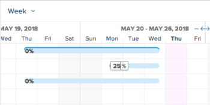

# 更新工作清單中的資訊 [!UICONTROL 甘特圖]

工作清單 [!UICONTROL 甘特圖] 顯示有關專案或範本上任務的詳細資訊。

在範本中，任務清單 [!UICONTROL 甘特圖] 會在任務層級反映範本任務清單中所做的更新。 您無法編輯 [!UICONTROL 甘特圖] 與範本相關聯。

在專案中，您可以直接在任務清單中更新任務資訊 [!UICONTROL 甘特圖].

本文說明可直接在「工作清單」中執行的下列動作 [!UICONTROL 甘特圖]：

* 修改任務工期
* 建立或移除前置任務關係
* 變更任務開始和結束日期
* 更新完成百分比
* 平準專案資源

## 存取需求

您必須具備下列專案才能依照本文所述步驟操作：

<table style="table-layout:auto"> 
 <col> 
 <col> 
 <tbody> 
  <tr> 
   <td role="rowheader">[!DNL Adobe Workfront] 計劃*</td> 
   <td> 
任何 
 </td> 
  </tr> 
  <tr> 
   <td role="rowheader">[!DNL Adobe Workfront] 授權*</td> 
   <td> 
[！UICONTROL計畫] 
 </td> 
  </tr> 
  <tr> 
   <td role="rowheader">存取層級設定*</td> 
   <td> 
[！UICONTROL編輯]專案和任務的存取權
 
注意：如果您仍然沒有存取權，請詢問您的 [!DNL Workfront] 管理員是否對您的存取層級設定其他限制。 如需如何進行 [!DNL Workfront] 管理員可以修改您的存取層級，請參閱 <a href="../../../administration-and-setup/add-users/configure-and-grant-access/create-modify-access-levels.md" class="MCXref xref">建立或修改自訂存取層級</a>.
 </td> 
  </tr> 
  <tr> 
   <td role="rowheader">物件許可權</td> 
   <td> 
[！UICONTROL管理]專案和任務的存取權 
 
如需請求其他存取許可權的詳細資訊，請參閱 <a href="../../../workfront-basics/grant-and-request-access-to-objects/request-access.md" class="MCXref xref">要求物件的存取權 </a>.
 </td> 
  </tr> 
 </tbody> 
</table>

&#42;若要瞭解您擁有哪些計畫、授權型別或存取權，請聯絡您的 [!DNL Workfront] 管理員。

## 修改任務工期

1. 前往您要修改的專案。
1. 按一下 **[!UICONTROL 任務]** 在左側面板中。

   

1. 按一下 **[!UICONTROL 甘特圖]** 圖示。

   

   所有變更會在 **[!UICONTROL 自動儲存]** 選項已啟用。 預設為啟用。

1. （可選）按一下 **[!UICONTROL 計畫模式]** 圖示並選取 **[!UICONTROL 手動儲存標準]** 或 **[!UICONTROL 時間表規劃]** 以手動儲存變更。

   

1. 暫留在任務的時間軸上，並將時間軸指示器拖曳到不同的日期。
1. 當您達到任務正確的新「完成日期」時，拖放指標。
1. （選擇性和條件性）如果您已選取手動儲存變更，請按一下 **[!UICONTROL 還原]** 或&#x200B;**[!UICONTROL 取消復原]** 圖示。

   >[!TIP]
   >
   >您可以使用下列鍵盤快速鍵來還原或重做甘特圖上的變更：
   >
   >   
   >   
   >   * [!DNL Mac]：使用 [!UICONTROL Command + Z] 還原和 [!UICONTROL Command + Shift + Z] 以取消復原。
   >   * [!DNL Windows]：使用 [!UICONTROL Ctrl + Z] 還原和 [!UICONTROL Ctrl + Y] 以取消復原。
   >   
   >

1. 按一下 **[!UICONTROL 儲存]** 右上角的 [!UICONTROL 甘特圖].

## 建立或移除前置任務關係

1. 前往您要修改的專案。
1. 在 **[!UICONTROL 任務]** 區域，按一下 **[!UICONTROL 甘特圖]** 圖示。

   此 **[!UICONTROL 自動儲存]** 選項預設為選取，在此情況下，所有變更都會自動儲存。

   

1. （可選）按一下 **[!UICONTROL 計畫模式]** 圖示並選取 **[!UICONTROL 手動儲存標準]** 或 **[!UICONTROL 時間表規劃]** 以手動儲存變更。

   

1. 若要建立前置任務關係，請按一下任務的起點，然後將其拖曳至任務的終點。
1. 若要刪除前置任務關係，請按一下連線兩個任務的前置任務行以選取它，然後按 **[!UICONTROL 刪除]** 在鍵盤上。\
   

1. （選擇性和條件性）如果您選取手動儲存變更，請按一下 **[!UICONTROL 還原]** 或&#x200B;**[!UICONTROL 取消復原]** 圖示。

   >[!TIP]
   >
   >您可以使用下列鍵盤快速鍵來還原或重做甘特圖上的變更：
   >
   >   
   >   
   >   * [!DNL Mac]：使用 [!UICONTROL Command + Z] 還原和 [!UICONTROL Command + Shift + Z] 以取消復原。
   >   * [!DNL Windows]： [!UICONTROL 使用Ctrl + Z] 還原和 [!UICONTROL Ctrl + Y] 以取消復原。
   >   
   >

1. 按一下&#x200B;**[!UICONTROL 儲存]**。

## 變更任務開始和結束日期

1. 前往您要修改的專案。
1. 在 **[!UICONTROL 任務]** 區域，按一下 **[!UICONTROL 甘特圖]** 圖示。

   所有變更會在 **[!UICONTROL 自動儲存]** 選項已啟用。 預設為啟用。

   

1. （可選）按一下 **[!UICONTROL 計畫模式]** 圖示並選取 **[!UICONTROL 手動儲存標準]** 或 **[!UICONTROL 時間表規劃]** 以手動儲存變更。

   

1. 將滑鼠懸停在工作的中心上，並找出多方向箭頭。
1. 按一下並將任務拖曳至所需的日期。

   

1. 如果您以影響任務限制的方式變更任務日期，請按一下 **[!UICONTROL Accept]** 認可作業限制變更。

   >[!NOTE]
   >
   >如果任務有下列其中一個限制，系統會更新 [!UICONTROL 任務限制] 至 [!UICONTROL 開始時間不早於] 比專案是從 [!UICONTROL 開始日期] 或 [!UICONTROL 完成時間不晚於] 如果專案排程自 [!UICONTROL 完成日期]：
   >
   >   
   >   
   >   * [!UICONTROL 盡可能早]
   >   * [!UICONTROL 盡可能遲]
   >   * [!UICONTROL 最早可用時間]
   >   * [!UICONTROL 最晚可用時間]
   >   
   >   
   >在某些情況下，前置任務關係可能會阻止任務提早開始，並且不允許任務移動。

1. （選擇性和條件性）如果您已選取手動儲存變更，請按一下 **[!UICONTROL 還原]** 或&#x200B;**[!UICONTROL 取消復原]** 圖示。

   >[!TIP]
   >
   >您可以使用下列鍵盤快速鍵來還原或重做對 [!UICONTROL 甘特圖]：
   >
   >   
   >   
   >   * [!DNL Mac]：使用 [!UICONTROL Command + Z] 還原和 [!UICONTROL Command + Shift + Z] 以取消復原。
   >   * [!DNL Windows]：使用 [!UICONTROL Ctrl + Z] 還原和 [!UICONTROL Ctrl + Y] 以取消復原。
   >   
   >

1. 按一下&#x200B;**[!UICONTROL 儲存]**。

## 更新完成百分比

1. 前往您要修改的專案。
1. 在 **[!UICONTROL 任務]** 區域，按一下 **[!UICONTROL 甘特圖]** 圖示。

   

   所有變更會在 **[!UICONTROL 自動儲存]** 選項已啟用。 預設為啟用。

1. （可選）按一下 **[!UICONTROL 計畫模式]** 圖示並選取 **[!UICONTROL 手動儲存標準]** 或 **[!UICONTROL 時間表規劃]** 以手動儲存變更。
1. 連按兩下任務內部的百分比數字，然後輸入數字。

   >[!IMPORTANT]
   >
   >您必須擁有 [!UICONTROL 完成%] 已選取於 [!UICONTROL 選項] 對話方塊，以更新完成百分比。 若要這麼做，請按一下 **[!UICONTROL 選項]** 圖示並選取 **[!UICONTROL 完成%]**.
   >
   >
   >   >
   >

1. （選擇性和條件性）如果您選取手動儲存變更，請按一下 **[!UICONTROL 還原]** 或&#x200B;**[!UICONTROL 取消復原]** 圖示。

   >[!TIP]
   >
   >您可以使用下列鍵盤快速鍵來還原或重做對 [!UICONTROL 甘特圖]：
   >
   >   
   >   
   >   * [!DNL Mac]：使用 [!UICONTROL Command + Z] 還原和 [!UICONTROL Command + Shift + Z] 以取消復原。
   >   * [!DNL Windows]：使用 [!UICONTROL Ctrl + Z] 還原和 [!UICONTROL Ctrl + Y] 以取消復原。
   >   
   >

1. 按一下 **[!UICONTROL 儲存]** 右上角的 [!UICONTROL 甘特圖].

## 平準專案資源

您可以使用工作清單 [!UICONTROL 甘特圖] 以平準您的資源。

有關平準資源的資訊，請參閱 [!UICONTROL 甘特圖]，請參閱 [資源平準 [!UICONTROL 甘特圖]](../../../manage-work/gantt-chart/use-the-gantt-chart/level-resources-in-gantt.md).

<!--

(NOTE:&nbsp;this is drafted because I moved the whole content to the article linked above)

<ol>
<li value="1">Go to the project you want to level.</li>
<li value="2"> 
 In the <strong>Tasks</strong> area, click the <strong>Gantt chart</strong> icon.
 
All changes are saved automatically when the <strong>Autosave</strong> option is enabled. It is enabled by default. 
 </li>
<li value="3">

(Optional) Click the <strong>Plan mode</strong> icon and select <strong>Manual save Standard</strong> or <strong>Timeline Planning</strong> to save your changes manually.
 <note type="tip">
You cannot level resources in the Gantt chart when the Autosave option is enabled.
</note>

  

 </li>
<li value="4"> 
Click the <strong>Level Resources</strong> drop-down menu.
 
  
 </li>
<li value="5">Select one of following options:
<ul>
<li><strong>Level Now</strong>: Applies resource leveling to the selected task.</li>
<li>
<strong>Clear Leveling</strong>: Removes all resource leveling from the selected task.
</li>
</ul><note type="note">
Your resources might be overallocated if they are assigned to multiple tasks which occur during the same time frame.
</note></li>
<li value="6"> 
(Optional and conditional) If you have disabled the Autosave option, click the <strong>Undo</strong> or<strong>Redo</strong> icons if you want to cancel or duplicate any of the changes. 
 <note type="tip">

You can use the following keyboard shortcuts to undo or redo changes on the Gantt chart:

<ul>
<li>Mac: Use Command + Z to undo and Command + Shift + Z to redo.</li>
<li>Windows: Use Ctrl + Z to undo and Ctrl + Y to redo.</li>
</ul>
</note> </li>
<li value="7">Click <strong>Save</strong> in the upper-right corner of the Gantt chart.</li>
</ol>

-->

<!--
<h2 data-mc-conditions="QuicksilverOrClassic.Draft mode"> </h2>
-->
