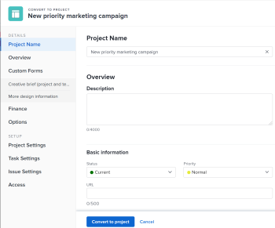

# 在Adobe Workfront中將問題轉換為專案

<!--Audited: 01/2024-->

如果在提交問題後需要完成更多工作，您可以將問題轉換為專案。

您可以將問題轉換為新專案，也可以使用範本將其轉換為專案。 本文介紹將問題轉換為專案的兩種方式。

>[!IMPORTANT]
>
>如需轉換問題的一般資訊，建議您也閱讀本文 [在Adobe Workfront中轉換問題的概觀](../../../manage-work/issues/convert-issues/convert-issues.md).

從問題建立專案時，專案上的一些欄位會從其他物件填入。 如需詳細資訊，請參閱文章中的「新專案預設設定」一節 [建立專案](../../../manage-work/projects/create-projects/create-project.md).

## 存取需求

您必須具有下列存取權才能執行本文中的步驟：

<table style="table-layout:auto"> 
 <col> 
 <col> 
 <tbody> 
  <tr> 
   <td role="rowheader">Adobe Workfront計畫</td> 
   <td> 
任何
 </td> 
  </tr> 
  <tr> 
   <td role="rowheader">Adobe Workfront授權</td> 
   <td>
   
新增：標準 
 
    
目前：計畫 
 </td> 
  </tr> 
  <tr> 
   <td role="rowheader">存取層級設定*</td> 
   <td> 
編輯問題、任務和專案的存取權
 
編輯財務資料的存取權，以更新專案從問題轉換的財務資訊
 </td> 
  </tr> 
  <tr> 
   <td role="rowheader">物件許可權</td> 
   <td> 
檢視問題的許可權
 
您可在問題轉換後取得專案的管理許可權
 </td> 
  </tr> 
 </tbody> 
</table>

如需有關此表格的詳細資訊，請參閱 [Workfront檔案中的存取需求](/help/quicksilver/administration-and-setup/add-users/access-levels-and-object-permissions/access-level-requirements-in-documentation.md).

## 將問題轉換為專案

您可以將問題轉換為空白專案。

1. 前往專案並按一下 **[!UICONTROL 問題]** 在左側面板中。
1. 在顯示的問題清單中，執行下列任一項作業：

   * 若要將問題轉換為空白專案，請按一下問題名稱，然後按一下 **[!UICONTROL 更多]** 功能表  問題名稱右側，然後按一下 **[!UICONTROL 轉換為空白專案]**.

     或

     選取問題清單中的問題，按一下 **[!UICONTROL 更多]** 功能表  在清單頂端，然後按一下 **[!UICONTROL 轉換為空白專案]**.

     >[!IMPORTANT]
     >
     >「轉換為空白專案」選項僅在您的系統或群組管理員啟用 [!UICONTROL 允許使用者在不使用範本的情況下建立專案] 中的偏好設定 [!UICONTROL 設定] 區域。 如需詳細資訊，請參閱 [設定全系統專案偏好設定](../../../administration-and-setup/set-up-workfront/configure-system-defaults/set-project-preferences.md).

     轉換問題後，您必須手動將任務新增到專案或附加範本到專案。

     >[!TIP]
     >   
     >* 如果使用請求佇列建立問題，新專案會繼承請求佇列的群組。
     >* 如果問題是以新增至專案的問題區段的方式建立，則新專案會繼承問題專案的群組。

     >[!TIP]
     >
     >如果問題與核准流程相關，或已經與解決物件相關，Workfront會在「轉換為專案」方塊頂端顯示警告，通知您核准將被移除或在轉換期間解決物件將被覆寫。 如需詳細資訊，請參閱 [在Adobe Workfront中轉換問題的概觀](../../../manage-work/issues/convert-issues/convert-issues.md).

1. （選擇性和條件性）按一下 [!UICONTROL **選項**] 在左側面板中，然後從可用的選項中選取：

   * [!UICONTROL **保留原始問題並將其解決方案連結至此專案**]

     取消選取時，會刪除原始問題。

     >[!NOTE]
     >
     >無論此設定的狀態為何，沒有存取許可權或刪除問題的使用者在轉換問題時都將無法刪除問題。 如需問題的存取和許可權資訊，請參閱：
     >
     >* [授予問題的存取許可權](../../../administration-and-setup/add-users/configure-and-grant-access/grant-access-issues.md)
     > 
     >* [共用問題](../../../workfront-basics/grant-and-request-access-to-objects/share-an-issue.md)

   * [!UICONTROL **允許（使用者名稱）存取此專案**]

     如果取消選取，則問題為 [!UICONTROL 主要連絡人] 沒有新任務的存取權。

     >[!NOTE]
     >
     >此處提供的選項取決於Workfront管理員如何為系統中的每個人或您的群組設定這些選項。 如需詳細資訊，請參閱 [設定系統範圍的任務和問題偏好設定](../../../administration-and-setup/set-up-workfront/configure-system-defaults/set-task-issue-preferences.md).
     >
     >
     >或者，如果您組織中的最上層群組已個別設定這些群組，此處可用的選項取決於您在步驟6為新專案選取的群組。 如需詳細資訊，請參閱 [設定群組的任務和問題偏好設定](../../../administration-and-setup/manage-groups/create-and-manage-groups/configure-task-issue-preferences-group.md).

1. 按一下 [!UICONTROL **自訂Forms**] 並執行下列任一項作業：

   * 檢閱附加到問題的自訂表單。 如果他們也是專案自訂表單，則將轉移到新專案。
   * 新增更多自訂表格
   * 請確定所有必要欄位都有有效的資訊。
   * 拖曳自訂表單以重新排列它們  隨身攜帶。
   * 按一下 **x** 圖示加以儲存，並顯示在您不想傳送至專案的任何表單右側。 這會從專案移除表單。
   * 如有必要，請將問題中的自訂表單資訊傳輸至專案。

     >[!TIP]
     >
     >* 如果附加到問題的多物件自訂表單已設定為同時用於問題和專案，則當您進行轉換時，如果問題和專案的自訂表單上同時存在欄位，則保留表單中儲存的所有資訊。
     >* 如果將具有計算欄位的多物件自訂表單附加到問題和專案，問題和專案必須與表單的計算自訂欄位中參照的所有欄位相容。 如果發生不相容的情況，訊息會警告您進行調整。 如需詳細資訊，請參閱 [使用舊版表單產生器將計算資料新增至自訂表單](../../../administration-and-setup/customize-workfront/create-manage-custom-forms/add-calculated-data-to-custom-form.md).

1. 按一下 [!UICONTROL **轉換為專案**].

   >[!TIP]
   >
   >如果您決定刪除原始問題，則問題現在為專案。
   >   
   >或
   >  
   >如果您決定保留原始問題，則問題現在會連結至新專案，並會在專案完成時完成。
   >
   >某些問題欄位中的資訊會傳輸到專案（如果您在轉換期間未變更這些資訊）。

1. （選擇性）視需要設定任何其他專案詳細資訊&#x200B;（專案所有者、專案日期）和任務。
1. 按一下 [!UICONTROL **轉換為專案**].

   問題現在已轉換為專案。 專案頁面隨即顯示。

## 使用範本將問題轉換為專案

您可以使用範本將問題轉換為專案。

1. 前往專案並按一下 **[!UICONTROL 問題]** 在左側面板中。
1. 在顯示的問題清單中，按一下問題名稱，然後按一下 **[!UICONTROL 更多]** 功能表  問題名稱右側，然後按一下 **從範本轉換為專案** 並開始在 **搜尋範本** 方塊，然後按一下範本在清單中顯示時的名稱。 繼續進行步驟3。

   >[!TIP]
   >
   >如果您已將範本新增至「我的最愛」清單，您可以將滑鼠移至 [!UICONTROL **我的最愛範本**] 功能表，然後按一下您要使用的範本。

   「從範本新建專案」方塊隨即顯示。

   

   >[!TIP]
   >
   >* 如果問題與核准流程相關，或已經與解決物件相關，Workfront會在「轉換為專案」方塊頂端顯示警告，通知您核准將被移除或在轉換期間解決物件將被覆寫。 如需詳細資訊，請參閱 [在Adobe Workfront中轉換問題的概觀](../../../manage-work/issues/convert-issues/convert-issues.md).
   >   
   >* 如果使用請求佇列建立問題，新專案會繼承請求佇列的群組。
   >* 如果問題是以新增至專案的問題區段的方式建立，則新專案會繼承問題專案的群組。

1. 檢視右側的範本詳細資訊。

   範本詳細資料包括：

   * 範本持續時間
   * 範本所有者
   * 包括前三個任務之名稱的最上層任務數目
   * 範本中所有任務的數量
   * 範本自訂表單的名稱

1. （可選）將滑鼠移到範本名稱上，然後按一下 **我的最愛** 圖示  以標示為未來使用的最愛。

   >[!TIP]
   >
   >您最多可以有40個Workfront專案標示為我的最愛。 這包括範本和其他專案。

1. 按一下 [!UICONTROL **使用範本**] 以選取範本。

   此 [!UICONTROL 轉換為專案] 方塊開啟。

   

1. 如果欄位已填入範本中，則該欄位會預先填入 [!UICONTROL 轉換為專案] 方塊。 您可以編輯預先填入的值，以更符合您的專案。 如需詳細資訊，請參閱 [編輯專案](../../../manage-work/projects/manage-projects/edit-projects.md).

   >[!TIP]
   >
   >* 您的系統或群組管理員可以新增或移除 [!UICONTROL 轉換至專案方塊] 更新您網站上的專案詳細資訊 [!UICONTROL 版面配置範本].
   >
   >* 若要更新中的欄位 [!UICONTROL 財務] 中的區段 [!UICONTROL 轉換為專案] 方塊您必須擁有 [!UICONTROL 編輯] 存取目標 [!UICONTROL 財務資料] 在存取層級中。 如果您有 [!UICONTROL 檢視] 存取目標 [!UICONTROL 財務資料] 在存取層級中，範本中的所有財務資訊都會轉移到新專案，當您轉換問題時，無法編輯它。 如需詳細資訊，請參閱 [授予財務資料的存取權](../../../administration-and-setup/add-users/configure-and-grant-access/grant-access-financial.md) 和 [共用範本](../../../workfront-basics/grant-and-request-access-to-objects/share-a-template.md).

1. （選擇性和條件性）按一下 [!UICONTROL **選項**] 在左側面板中，然後從可用的選項中選取：

   * [!UICONTROL **保留原始問題並將其解決方案連結至此專案**]

     取消選取時，會刪除原始問題。

     >[!NOTE]
     >
     >無論此設定的狀態為何，沒有存取許可權或刪除問題的使用者在轉換問題時都將無法刪除問題。 如需問題的存取和許可權資訊，請參閱：
     >
     >* [授予問題的存取許可權](../../../administration-and-setup/add-users/configure-and-grant-access/grant-access-issues.md)
     > 
     >* [共用問題](../../../workfront-basics/grant-and-request-access-to-objects/share-an-issue.md)

   * [!UICONTROL **允許（使用者名稱）存取此專案**]

     如果取消選取，則問題為 [!UICONTROL 主要連絡人] 沒有新任務的存取權。

     >[!NOTE]
     >
     >此處提供的選項取決於Workfront管理員如何為系統中的每個人或您的群組設定這些選項。 如需詳細資訊，請參閱 [設定系統範圍的任務和問題偏好設定](../../../administration-and-setup/set-up-workfront/configure-system-defaults/set-task-issue-preferences.md).
     >
     >
     >或者，如果您組織中的最上層群組已個別設定這些群組，此處可用的選項取決於您在步驟6為新專案選取的群組。 如需詳細資訊，請參閱 [設定群組的任務和問題偏好設定](../../../administration-and-setup/manage-groups/create-and-manage-groups/configure-task-issue-preferences-group.md).

   1. 按一下 [!UICONTROL **自訂Forms**] 並執行下列任一項作業：

      * 檢閱附加到範本的自訂表單。 他們將會轉移到新專案。
      * 檢閱附加到問題的自訂表單。 如果他們也是專案表單，則會傳輸到專案。
      * 請確定所有必要欄位都有有效的資訊。
      * 拖曳自訂表單以重新排列它們  隨身攜帶。
      * 按一下 **x** 圖示加以儲存，並顯示在您不想傳送至專案的任何表單右側。
      * 如有必要，請將問題中的自訂表單資訊傳輸至專案。

        >[!TIP]
        >
        >* 如果附加到問題的多物件自訂表單已設定為同時用於問題和專案，則當您進行轉換時，如果問題和專案的自訂表單上同時存在欄位，則保留表單中儲存的所有資訊。
        >* 如果將具有計算欄位的多物件自訂表單附加到問題和專案，問題和專案必須與表單的計算自訂欄位中參照的所有欄位相容。 如果發生不相容的情況，訊息會警告您進行調整。 如需詳細資訊，請參閱 [使用舊版表單產生器將計算資料新增至自訂表單](../../../administration-and-setup/customize-workfront/create-manage-custom-forms/add-calculated-data-to-custom-form.md).
        >* 如果附加到範本的自訂表單包含自訂欄位，也在附加到問題的自訂表單中找到，則問題的欄位值將用於新專案。 但是，如果問題的自訂欄位為空白，則會使用範本的值。

1. （選擇性）視需要設定任何其他專案詳細資訊&#x200B;（專案所有者、專案日期）和任務。

   1. 按一下 [!UICONTROL **轉換為專案**].

      >[!TIP]
      >
      >如果您決定刪除原始問題，則問題現在為專案。
      >   
      >或
      >  
      >如果您決定保留原始問題，則問題現在會連結至新專案，並會在專案完成時完成。
      >
      >有些問題欄位會轉移至專案。 如果您未在先前的步驟中變更範本中定義的大部分欄位，則會自動轉移至新建立的專案。 如需詳細資訊，請參閱 [在Adobe Workfront中轉換問題的概觀](../../../manage-work/issues/convert-issues/convert-issues.md).

   問題現在已轉換為專案。 專案頁面隨即顯示。