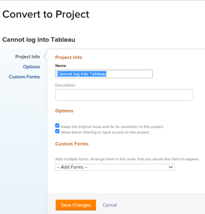
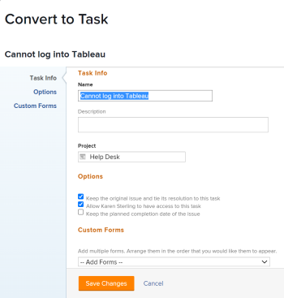

# 在Adobe Workfront中轉換問題的概觀

如果在提交問題後需要完成更多工作，您可以將問題轉換為專案或任務。

如需將問題轉換為任務的詳細資訊，請參閱 [在Adobe Workfront中將問題轉換為任務](../../../manage-work/issues/convert-issues/convert-issue-to-task.md).

如需將問題轉換為專案的詳細資訊，請參閱 [在Adobe Workfront中將問題轉換為專案](../../../manage-work/issues/convert-issues/convert-issue-to-project.md).

## 轉換問題時的注意事項

* 您的Workfront管理員或群組管理員已設定問題、其解決方法發生之情形的偏好設定，以及主要連絡人在將其轉換為專案或任務時的存取權，如中所述 [設定系統範圍的任務和問題偏好設定](../../../administration-and-setup/set-up-workfront/configure-system-defaults/set-task-issue-preferences.md).
* Workfront會移除轉換期間與問題相關聯的任何核准。
* 當您將其轉換為任務或專案時，Workfront會覆寫問題的解決物件。 新任務或問題在轉換後會成為問題的新解決物件。
* 請考量下列事項：

   * 在轉換期間，系統可能會詢問您是否要保持問題及其解決方案與您正在建立的專案或任務繫結。
   * 如果您保留問題，專案、任務或問題發生任何變更或Workfront重新計算時間表時，專案或任務的狀態和完成百分比會自動更新問題的狀態和完成百分比。

* 將問題轉換為任務或專案時，問題會從指派給問題的使用者的首頁區域移除。

* 轉換問題時，原始問題的許可權未傳輸到轉換的物件（任務或專案）。

* 使用範本將問題轉換為專案時，範本中的大部分資訊會傳輸到新專案。 不過，問題中的某些資訊也可傳輸到新專案。 如需詳細資訊，請參閱 [使用範本將問題轉換為專案時的專案欄位概觀](#overview-of-project-fields-when-converting-an-issue-to-a-project-using-a-template) 一節。
* 轉換問題時，並非所有檔案或其資訊都會移至問題轉換為的新物件。 當您轉換附加了檔案或檔案連結的問題時，會包含下列專案：

   * 文件
   * 檔案連結至協力廠商服務，例如Google Drive或SharePoint。
   * 版本
   * 只有當選項時才會包含校樣 **保持初始問題並將其解決方案連結至此任務** 已取消選取。
   * 當您轉換附加了檔案和檔案連結的問題時，不包含檔案核准。

* 如果您決定將問題保留在轉換中並且附加了檔案，則檔案及其版本會複製到專案或任務中。 校訂和檔案核准不會複製到專案或任務。
* 如果您決定不將問題保留在轉換中，而其中包含附加的檔案、檔案、其版本和校樣會傳輸到專案或任務。 檔案核准將不會傳輸到專案或任務。
* 如果您有來自協力廠商服務(例如Google Drive)的檔案和資料夾連結至原始問題，則無論您是否於轉換期間保留問題，這些連結都會複製到新物件。
* 問題註解也會複製到從問題轉換的任務或專案，但標籤的使用者不會轉移。
* 如果您想要將自訂表單資訊從問題中傳輸至您要將其轉換為的專案或任務，請確保您有專案或任務自訂表單，其中包含您要從問題中傳輸的相同欄位。 如需詳細資訊，請參閱 [轉換物件時傳輸自訂表單資料](../../../administration-and-setup/customize-workfront/create-manage-custom-forms/transfer-custom-form-data-larger-item.md).

## 使用範本將問題轉換為專案時的專案欄位概觀 {#overview-of-project-fields-when-converting-an-issue-to-a-project-using-a-template}

將問題轉換為專案時，您可以將其轉換為空白專案或使用範本。

如需詳細資訊，請參閱 [在Adobe Workfront中將問題轉換為專案](../../../manage-work/issues/convert-issues/convert-issue-to-project.md).

使用範本時，範本上填入的某些欄位會傳輸到從轉換的問題建立的專案。 其他欄位會從轉換的問題轉移到專案。

下表列出專案資訊，以及專案資訊是從範本還是從問題中轉移：

<table style="table-layout:auto"> 
 <col> 
 <col> 
 <tbody> 
  <tr> 
   <td>說明</td> 
   <td> 
問題的描述已轉移到新專案。 
 
 如果問題沒有描述，則範本中的描述會轉移到專案。 
 
如果問題和範本的描述欄位為空，專案上的欄位為空白。 
 </td> 
  </tr> 
  <tr> 
   <td>狀態</td> 
   <td>為範本上的群組選取的預設狀態。 如果範本未與群組相關聯，則專案狀態會設為Workfront管理員在設定的專案偏好設定區域中設定的預設狀態。 如需詳細資訊，請參閱 <a href="../../../administration-and-setup/set-up-workfront/configure-system-defaults/set-project-preferences.md" class="MCXref xref">設定全系統專案偏好設定</a>.</td> 
  </tr> 
  <tr> 
   <td>優先順序</td> 
   <td>從範本傳輸。 </td> 
  </tr> 
  <tr> 
   <td>URL</td> 
   <td> 
來自問題的URL會轉移至新專案。 
 
 如果問題中未指定URL，則範本中的URL會轉移至專案。 
 
如果問題和範本的URL欄位都為空，則專案上的欄位為空白。 
 </td> 
  </tr> 
  <tr> 
   <td>專案狀態型別</td> 
   <td>從範本傳輸。</td> 
  </tr> 
  <tr> 
   <td>專案狀態</td> 
   <td>符合由Workfront管理員在設定區域中決定的系統層級預設偏好設定。 如需詳細資訊，請參閱 <a href="../../../administration-and-setup/customize-workfront/create-manage-custom-conditions/set-custom-condition-default-projects.md" class="MCXref xref">將自訂條件設定為專案的預設值</a></td> 
  </tr> 
  <tr> 
   <td>排程開始時間</td> 
   <td>從範本傳輸。</td> 
  </tr> 
  <tr> 
   <td>專案日期</td> 
   <td> 
    <ul> 
     <li> 
<b>計劃開始日期</b>：應根據範本排程的時區，預先選取根據範本排程工作時間最接近的工作時間。 如果「排程開始日期」欄位設為「完成日期」，則會停用此欄位。 
 </li> 
     <li> 
<b>計畫完成日期</b>：應根據範本排程的時區，預先選取根據範本排程工作時間最接近的工作時間。 如果[排程開始日期]欄位設為[開始日期]，則會停用此欄位。 
 </li> 
    </ul> </td> 
  </tr> 
  <tr> 
   <td>專案組合</td> 
   <td>從範本傳輸。 否則，此欄位為空白。</td> 
  </tr> 
  <tr> 
   <td>方案</td> 
   <td>從範本傳輸。 否則，此欄位為空白。</td> 
  </tr> 
  <tr> 
   <td>群組</td> 
   <td>
 存在下列情況：

     <ul><li>如果在轉換期間指定了群組，則該群組會成為專案的群組</li>
     <li>如果您使用範本轉換為專案，且範本上有一個群組，且在轉換過程中您未指定群組，則範本群組會變成新專案的群組</li>
      <li> 如果範本上沒有群組，且您在轉換期間未指定群組，則原始問題專案的群組將變成新專案的群組</li> </ul>
      </td> 
  </tr> 
  <tr> 
   <td>公司</td>    
   <td>  從範本傳輸。 否則，此欄位為空白。</td>

</tr> 
  <tr> 
   <td>專案所有者</td> 
   <td>從範本的「範本所有者」欄位轉移。 否則，會設定為執行轉換的登入使用者。 </td> 
  </tr> 
  <tr> 
   <td>專案贊助者</td> 
   <td>從範本上的範本贊助者欄位轉移。 否則，此欄位為空白。</td> 
  </tr> 
  <tr> 
   <td>資源管理員</td> 
   <td>從範本傳輸。 否則，此欄位為空白。</td> 
  </tr> 
  <tr> 
   <td>任務設定</td> 
   <td>從範本轉移。</td> 
  </tr> 
  <tr> 
   <td>問題設定</td> 
   <td>從範本轉移。 </td> 
  </tr> 
  <tr> 
   <td>存取</td> 
   <td> 
從範本的「存取」區段轉移。 
 </td> 
  </tr> 
  <tr> 
   <td>核准</td> 
   <td>從範本轉移。 與問題相關的核准在轉換期間被移除。 </td> 
  </tr> 
 </tbody> 
</table>

<!--WRITER

<h2>Convert an issue to a project</h2> 

(NOTE:&nbsp;moved to its own article)

-->
<!--
<ol>
<li value="1"> Click the <strong>Issues</strong> icon on a project. </li>
<li value="2"> 
Click the issue to be converted to access the issue.
 </li>
<li value="3"> 
 Click the <strong>More</strong> menu, then click <strong>Convert to Project</strong>. 
  </li>
<li value="4"> 
In the submenu that displays, do one of the following:

<ul>
<li>Click <strong>New Project</strong></li>
<li>Under <strong>New from Template</strong>, click the name of a project template you want to use</li>
</ul> </li>
<li value="5"> 
Specify a name for the project.
 
The default name is the name of the issue you are converting.
 </li>
<li value="6">(Optional and conditional) If you are creating this project from a template, update the available fields in the Convert to Project box. For more information about editing fields on projects, see <a href="../../../manage-work/projects/manage-projects/edit-projects.md" class="MCXref xref">Edit projects</a>.</li>
<li value="7"> 
(Optional and conditional) Under <strong>Options</strong>, select any of the available options:

<ul>
<li> 
<strong>Keep the original issue and tie its resolution to the this project</strong>When deselected, the original issue is deleted.
 <note type="note">

Users without access or permissions to delete issues will not be able to delete the issue as they are converting it, regardless of the status of this setting. For information about access and permissions to issues, see:

<ul>
<li> 
<a href="../../../administration-and-setup/add-users/configure-and-grant-access/grant-access-issues.md" class="MCXref xref">Grant access to issues</a> 
 </li>
<li> 
<a href="../../../workfront-basics/grant-and-request-access-to-objects/share-an-issue.md" class="MCXref xref">Share an issue </a> 
 </li>
</ul>
</note> </li>
<li><strong>Allow <User Name> to have access to this project</strong>If unselected, the user who entered the issue has no access to the new task.</li>
</ul> <note type="note">

The options that are available here depend on how the Workfront administrator has configured them for everyone in the system or for your group. For more information, see <a href="../../../administration-and-setup/set-up-workfront/configure-system-defaults/set-task-issue-preferences.md" class="MCXref xref">Configure system-wide task and issue preferences</a>.

Or, if the top-level groups in your organization configured them separately, the options available here depend on which group you selected for the new project in step 6. For more information, see <a href="../../../administration-and-setup/manage-groups/create-and-manage-groups/configure-task-issue-preferences-group.md" class="MCXref xref">Configure task and issue preferences for a group</a>.

</note> </li>
<li value="8">(Optional) In the <strong>Custom Forms</strong> section, attach any custom forms. For more information about transferring information from the custom form of the issue to that of the new project, see <a href="../../../administration-and-setup/customize-workfront/create-manage-custom-forms/transfer-custom-form-data-larger-item.md" class="MCXref xref">Transfer custom form data when converting an object</a>.</li>
<li value="9"> 
Click <strong>Save Changes.</strong>
 
  
 
The issue is now a project, if you decided to delete the original issue. Or The issue is now linked to the new project and it will complete when the project completes, if you decided to keep the original issue. 
 
Some issue fields transfer to the project. For information, see the <a href="#view-original-issue-information-on-projects-and-tasks" class="MCXref xref">View original issue information on projects and tasks</a> section in this article. 
 </li>
<li value="10"> 
(Optional) Set any further project details ​(project owner, project dates) and tasks as necessary.
 </li>
</ol>

-->

<!--

<h2>Convert an issue to a task</h2> 
(NOTE: moved to its own article)

-->
<!--
<ol>
<li value="1"> Click the Issues icon on a project.  </li>
<li value="2"> 
Click the issue you want to convert to go to the issue's landing page. 
 </li>
<li value="3"> 
 Click the <strong>More</strong> menu on the issue, then <strong>Convert to Task</strong>.  
  </li>
<li value="4"> 
Name the task.
 </li>
<li value="5"> 
Identify the project where the task will reside. 
 
You can select a different project from the project that the issue is on.
 </li>
<li value="6"> 
In the <strong>Project</strong> box, start typing the name of the project where you want to put the new task, then press <strong>Enter</strong> when it appears.
 
By default, this box the name of the project containing the issue that you are converting.
 </li>
<li value="7"> 
(Optional and conditional) Under <strong>Options</strong>, select any of the following options. 
 
The Workfront administrator or group administrator must enable these preferences before they are visible during the conversion of issues: 

<ul>
<li> 
<strong>Keep the original issue and tie its resolution to the this task</strong> 
 
If unselected, the original issue is deleted.
 <note type="note">

Users without access or permissions to delete issues will not be able to delete the issue as they are converting it, regardless of the status of this setting. For information about access and permissions to issues, see:

<ul>
<li> 
<a href="../../../administration-and-setup/add-users/configure-and-grant-access/grant-access-issues.md" class="MCXref xref">Grant access to issues</a> 
 </li>
<li> 
<a href="../../../workfront-basics/grant-and-request-access-to-objects/share-an-issue.md" class="MCXref xref">Share an issue </a> 
 </li>
</ul>
</note> </li>
<li> 
<strong>Allow <User Name> to have access to this task</strong> 
 
If unselected, the user who entered the issue has no access to the new task.
 </li>
<li> 
<strong>Keep the planned completion date of the issue</strong> 
 
If unselected, the Planned Completion Date of the new task is calculated from the Planned Start Date of the task. The Planned Start Date of the new task is set according to the system preferences for new tasks.
 </li>
</ul> <note type="note">

The options that display here depend on how the Workfront administrator configured them for everyone in the system. For more information, see <a href="../../../administration-and-setup/set-up-workfront/configure-system-defaults/set-task-issue-preferences.md" class="MCXref xref">Configure system-wide task and issue preferences</a>.

Or, if the top-level groups in your organization configured them separately, the options that display here depend on which group is associated with the project you selected in step 6. For more information, see <a href="../../../administration-and-setup/manage-groups/create-and-manage-groups/configure-task-issue-preferences-group.md" class="MCXref xref">Configure task and issue preferences for a group</a>.

</note> </li>
<li value="8">(Optional) Attach custom forms. For more information about transferring information from the custom form of the issue to that of the new task, see <a href="../../../administration-and-setup/customize-workfront/create-manage-custom-forms/transfer-custom-form-data-larger-item.md" class="MCXref xref">Transfer custom form data when converting an object</a>. 

</li>
<li value="9"> 
Click <strong>Save Changes</strong> when all task settings are set.
 
The issue is now a task on the designated project, if you decided to delete the original issue.
 
Or
 
The issue is now linked to the new task on the project you chose, and it will complete once the task completes, if you decided to keep the original issue.
 
Some issue fields transfer to the task. For information, see the <a href="#view-original-issue-information-on-projects-and-tasks" class="MCXref xref">View original issue information on projects and tasks</a> section in this article.  
 </li>
<li value="10"> 
(Optional) Continue editing the task (assignments, dates) as necessary. 
 </li>
</ol>

-->

## 檢視專案和任務的原始問題資訊 {#view-original-issue-information-on-projects-and-tasks}

您可以在專案和工作清單及報告中或在「專案詳細資訊」區域中，檢視原始問題資訊。 如需有關建立報表的資訊，請參閱 [建立自訂報表](../../../reports-and-dashboards/reports/creating-and-managing-reports/create-custom-report.md).

下表說明哪些問題欄位可從轉換的專案和任務中看到。

| 問題欄位 | 專案或工作列位 | 專案清單或報告 | 專案詳細資訊區域 | 任務清單或報告 | 任務詳細資訊區域 |
|---|---|---|---|---|---|
| 問題名稱 | 已轉換問題的名稱 | ✔ | ✔ | ✔ | ✔ |
| 主要連絡人 | 轉換的問題建立者名稱 | ✔ | `✔` | ✔ |   |
| 輸入日期 | 轉換的問題輸入日期 | ✔ |   | ✔ |   |

>[!CAUTION]
>
>如果問題的主要聯絡人變更，或在問題轉換後問題從專案或任務中解除連結，則轉換的問題建立者名稱不會更新，並在問題轉換時顯示問題的原始主要聯絡人。
