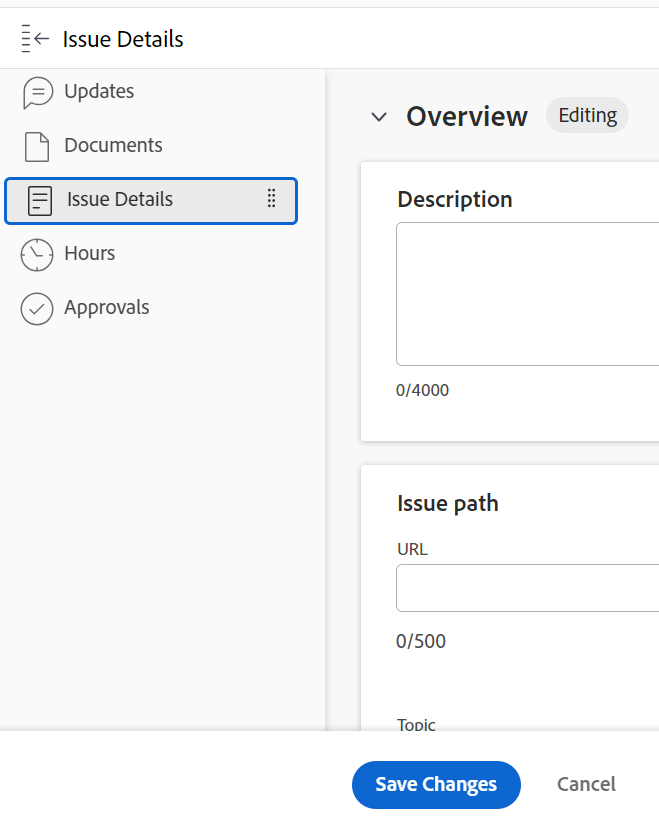

# 手動將問題的解決連結至其他問題、任務或專案

您可以手動將問題的解決連結至專案、任務或問題的解決，而不轉換問題。 問題會成為您選取之專案、任務或問題的可解析物件之一。 當您這樣做時，專案、任務或問題狀態的變更會觸發原始問題狀態的變更。

>[!TIP]
>
>當您將問題的解決繫結到另一個物件的解決時，您無法再手動編輯原始問題的狀態。

如需有關解析和可解析物件的詳細資訊，請參閱[解析和可解析物件概觀](../../../manage-work/issues/convert-issues/resolving-and-resolvable-objects.md)。

## 存取需求

您必須具備下列條件：

<table style="table-layout:auto"> 
 <col> 
 <col> 
 <tbody> 
  <tr> 
   <td role="rowheader">Adobe Workfront計畫*</td> 
   <td> 
任何 
 </td> 
  </tr> 
  <tr> 
   <td role="rowheader">Adobe Workfront授權*</td> 
   <td> 
要求或更高版本
 </td> 
  </tr> 
  <tr> 
   <td role="rowheader">存取層級設定*</td> 
   <td> 
編輯問題、任務、專案的存取權
 
注意：如果您還是沒有存取權，請詢問您的Workfront管理員，他們是否在您的存取層級中設定其他限制。 如需Workfront管理員如何修改存取層級的詳細資訊，請參閱<a href="../../../administration-and-setup/add-users/configure-and-grant-access/create-modify-access-levels.md" class="MCXref xref">建立或修改自訂存取層級</a>。
 </td> 
  </tr> 
  <tr> 
   <td role="rowheader">物件許可權</td> 
   <td> 
管理您連結至其他問題、任務或專案之問題的許可權
 
檢視或授予您新增至現有問題的問題、任務或專案的更高許可權
 
如需請求其他存取權的資訊，請參閱<a href="../../../workfront-basics/grant-and-request-access-to-objects/request-access.md" class="MCXref xref">請求物件</a>的存取權。
 </td> 
  </tr> 
 </tbody> 
</table>

&#42;若要瞭解您擁有的計畫、授權型別或存取權，請連絡您的Workfront管理員。

## 先決條件

開始之前，您必須：

* 有您想要將其解決方案連結至其他問題、任務或專案解決方案的問題

* 有其他問題、任務或專案

## 將問題的解決連結至另一個問題、任務或專案的解決

1. 瀏覽至您想要將其解決方案連結至另一個問題的解決方案，或是任務或專案的解決方案的問題。
1. 按一下左側面板中的&#x200B;**問題詳細資訊**，然後展開&#x200B;**概觀**&#x200B;區域。

   

1. 按一下&#x200B;**解析者**&#x200B;欄位，然後從下列解析物件型別中選取：

   * **專案**
   * **任務**
   * **問題**

   根據您選取的物件，會顯示下列欄位：

   * **解析專案**
   * **解析任務**
   * **正在解決問題**

1. 在&#x200B;**解決專案**、**任務**&#x200B;或&#x200B;**問題**&#x200B;欄位中開始輸入特定專案、任務或問題的名稱，然後當它出現在清單中時按一下它。

   >[!NOTE]
   >
   >您無法將問題的解決連結至問題所在的任務或專案。 問題的任務或專案未顯示在解決任務或解決工作列位中。

1. 按一下「**儲存變更**」。

   原始問題會變成您在步驟4和步驟5中選取的專案、任務或問題的可解析物件。 這表示解析物件（您連結至的專案、任務或問題）完成時，原始問題就會完成。

   >[!NOTE]
   >
   >一個專案、任務或問題可能具有多個問題作為可解析物件。
