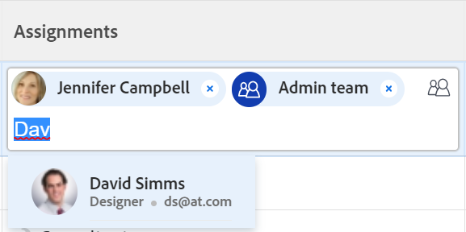

# 指派問題

您可以將問題指派給使用者、角色和團隊，以指出負責完成問題的人員。 如需指派問題的一般資訊，請參閱 [修改問題指派總覽](../../../manage-work/issues/manage-issues/modify-issue-assignments-overview.md).

>[!TIP]
>
>您可以指派多個使用者、工作角色或團隊。 您只能指派作用中的使用者、工作角色和團隊。
>
>如果在停用使用者、工作角色或團隊之前就已將他們指派，則他們仍會指派給工作專案。 在此情況下，我們建議採取下列步驟：
>
>* 將工作專案重新指派給使用中資源。
>* 將已停用團隊中的使用者與作用中團隊建立關聯，並將工作專案重新指派給作用中團隊。

除了本文章之外，我們建議您閱讀下列文章，以取得指派問題的詳細資訊：

* [修改問題指派總覽](../../../manage-work/issues/manage-issues/modify-issue-assignments-overview.md)
* [編輯問題](../../../manage-work/issues/manage-issues/edit-issues.md)
* [修改清單中多個問題的使用者指派](../../../manage-work/issues/manage-issues/edit-assignments-for-multiple-issues.md)
* [建立進階任務指派](../../../manage-work/tasks/assign-tasks/create-advanced-assignments.md)
* [進行智慧型指派](../../../manage-work/tasks/assign-tasks/make-smart-assignments.md)
* [智慧指派總覽](../../../manage-work/tasks/assign-tasks/smart-assignments.md)
* [在工作負載平衡器中指派工作的總覽](../../../resource-mgmt/workload-balancer/assign-work-in-workload-balancer.md)

您可以在個別問題層級將問題指派給一個或多個資源，也可以一次將多個資源指派給多個問題。

指派問題和任務在Adobe Workfront中類似。 如需指派工作的一般資訊，請參閱 [修改任務指派的概要](../../../manage-work/tasks/assign-tasks/modify-task-assignments-overview.md).

## 存取需求

您必須具有下列存取權才能執行本文中的步驟：

<table style="table-layout:auto"> 
 <col> 
 </col> 
 <col> 
 </col> 
 <tbody> 
  <tr> 
   <td role="rowheader">Adobe Workfront計畫*</td> 
   <td> 
任何 
 </td> 
  </tr> 
  <tr> 
   <td role="rowheader">Adobe Workfront授權*</td> 
   <td> 
評論或以上
 </td> 
  </tr> 
  <tr> 
   <td role="rowheader">存取層級*</td> 
   <td> 
編輯問題的存取權
 
檢視或更高的專案和任務存取權
 
如果您仍然沒有存取權，請詢問您的Workfront管理員是否對您的存取層級設定了其他限制。 如需存取存取存取層級中問題的相關資訊，請參閱 <a href="../../../administration-and-setup/add-users/configure-and-grant-access/grant-access-issues.md" class="MCXref xref">授予問題的存取許可權</a>. 如需Workfront管理員如何變更存取層級的詳細資訊，請參閱 <a href="../../../administration-and-setup/add-users/configure-and-grant-access/create-modify-access-levels.md" class="MCXref xref">建立或修改自訂存取層級</a>. 
 </td> 
  </tr> 
  <tr> 
   <td role="rowheader">物件許可權</td> 
   <td> 
管理問題的許可權
 
為您複製問題的專案貢獻許可權，並具有「新增問題」功能。
 
 如需授予問題許可權的相關資訊，請參閱 <a href="../../../workfront-basics/grant-and-request-access-to-objects/share-an-issue.md" class="MCXref xref">共用問題 </a>
 
如需請求其他許可權的相關資訊，請參閱 <a href="../../../administration-and-setup/add-users/configure-and-grant-access/grant-access-other-users.md">授予使用者存取許可權</a>.
 </td> 
  </tr> 
 </tbody> 
</table>

*若要瞭解您擁有的計畫、授權型別或存取權，請聯絡Workfront管理員。

## 對工作角色、團隊和使用者的多個指派的考量事項

將多個資源指派給工作專案時，請考量下列事項：

* 使用者可以有多個與其設定檔相關聯的工作角色。 如需將使用者與工作角色建立關聯的資訊，請參閱 [編輯使用者的設定檔](../../../administration-and-setup/add-users/create-and-manage-users/edit-a-users-profile.md).

* 任務或問題通常會先指派給一個或多個職位角色或團隊。 當專案準備開始時，可能需要將它們也指派給使用者。

  如果將任務或問題指派給一個或多個角色，然後您也指派了使用者，Adobe Workfront會根據以下規則決定要將哪個工作角色與其他使用者（如果有）相關聯：

   * 如果僅指派了一個工作角色，並且該工作角色與使用者的主要角色相符，則任務或問題僅指派給實現其主要角色的使用者。
   * 如果有多個角色已指派，且至少有一個角色符合使用者的次要角色，則會將任務或問題指派給履行其中一個其他角色(如果有多個符合專案，則Workfront會隨機選取)的使用者，以及任何已指派的其他角色。
   * 如果有指派的一或多個工作角色，但沒有符合的使用者角色，則任務或問題會同時指派給角色或角色以及使用者。

* 如果將任務或問題指派給團隊且您也指派了使用者，則任務或問題仍會指派給團隊和使用者。

<!--

<h2> </h2>
<h2>Considerations about removing assignments from issues</h2> 

(NOTE: drafted and moved to Modify issue assignments overview article)

You can remove assignments from one issue at a time, or you can remove assignments from multiple issues in bulk.

For more information about removing assignments from issues in bulk, see <a href="../../../manage-work/issues/manage-issues/edit-assignments-for-multiple-issues.md" class="MCXref xref">Modify user assignments for multiple issues in a list</a>. 

Consider the following when removing assignments from issues: 

<ul>
<li>When you unassign a user from an issue, the issue remains assigned to the job role that the user fulfilled on the issue.</li>
<li>When you unassign a job role or a team from an issue, the issue remains unassigned if it is not assigned to any other resources. </li>
</ul>

-->

## 指派單一問題

1. 前往您要指派的問題。
1. 按一下 **指派給** 問題標題右上角的 **指定任務** 區域

   或

   如果問題已指派，按一下目前指派的名稱。

   

1. 執行下列任一項作業：

   * 開始輸入您要指派的使用者、角色或團隊名稱，然後當名稱出現在清單中時按一下它。

     

   * （視條件而定）按一下 **建議的指派** 清單
   * 按一下&#x200B;**指派給我** 以將其指派給您自己
   * 按一下 **進階**

     建立進階指派與任務和問題類似。 如需如何進行進階指派的詳細資訊，請參閱 [建立進階任務指派](../../../manage-work/tasks/assign-tasks/create-advanced-assignments.md).

     >[!TIP]
     >
     >新增使用者指派時，請注意頭像、使用者的主要角色或其電子郵件地址，以區分具有相同名稱的使用者。
     >
     >使用者必須至少與一個工作角色相關聯，才能在您新增時檢視該角色。
     >
     >您必須在存取層級中啟用「檢視連絡人資訊」設定，使用者才能檢視使用者的電子郵件。 如需詳細資訊，請參閱 [授予使用者存取許可權](../../../administration-and-setup/add-users/configure-and-grant-access/grant-access-other-users.md)

1. 按一下 **儲存** 以完成問題的指派。
1. （可選）按一下 **X圖示** 位於問題標題上任務區域任務名稱的旁邊，以移除任務指派。

## 指派清單中的問題

當清單的檢視中出現任何指派欄位時，您可以在清單或報告中指派問題。 這是指派問題的更快方式。

根據檢視中顯示的欄位，您可以將以下實體指派給問題：

| 選項 | 已指派的實體 |
|---|---|
| **指派給** | 指派一位使用者 |
| **已指派** | 指派一位使用者 |
| **指派** | 指派使用者、工作角色或團隊。 |

若要指派清單中的問題：

1. 前往檢視中具有指派至、指派或指派欄位的問題清單。
1. 若要指派問題，請執行下列任一項作業：

   * 按一下 **指派給** 或 **已指派** 欄位並開始輸入您要指派給問題的活躍使用者名稱，然後當它顯示在清單中時按一下它。

     

   * 按一下 **指定任務** 欄位並開始輸入您想要指派給問題的活躍使用者、工作角色或活躍團隊的名稱，然後當它顯示在清單中時按一下它。

     

   >[!TIP]
   >
   >新增使用者指派時，請注意頭像、使用者的主要角色或其電子郵件地址，以區分具有相同名稱的使用者。
   >
   >使用者必須至少與一個工作角色相關聯，才能在您新增時檢視該角色。
   >
   >您必須在存取層級中啟用「檢視連絡人資訊」設定，使用者才能檢視使用者的電子郵件。 如需詳細資訊，請參閱 [授予使用者存取許可權](../../../administration-and-setup/add-users/configure-and-grant-access/grant-access-other-users.md).

1. （視條件而定）在「工作總攬」欄位中可見時，按一下 **人員圖示**  在「工作總攬」方塊的右上角，開啟「進階工作總攬」方塊並建立進階工作總攬。 如需詳細資訊，請參閱 [建立進階任務指派](../../../manage-work/tasks/assign-tasks/create-advanced-assignments.md).

   >[!TIP]
   >
   >您無法從「指派對象」或「已指派」欄位進行進階指派。

1. 將您的受指派人新增至問題後，按下Enter或按一下頁面上的任意位置以儲存您的變更。

## 大量指派問題

1. 前往您要大量指派的問題清單。
1. 在清單中選取幾個問題。
1. 按一下 **編輯圖示** .

   此 **編輯問題** 對話方塊開啟。

1. 在 **指定任務** 區域，選取 **被指定者** 方塊，然後開始輸入您要指派給所有問題的使用者、工作角色或團隊的名稱。

   >[!IMPORTANT]
   >
   >如果已經指派任何問題，您在此處指示的資源會新增到問題中，而不是取代問題上的現有資源。

1. （選擇性）選取 **問題所有者** 欄，指明當您指派多個資源給問題時，哪個資源是問題的主要受指派人或擁有者。 這不適用於團隊。
1. （可選）從以下專案中選擇使用者應在問題上履行的角色： **選擇角色** 中的下拉式功能表 **受指派人的角色** 欄中指派問題使用者。 如果您未選取角色，Workfront會自動選取使用者的主要角色。

1. （選擇性）如果要從所有問題中移除現有的受指派人，請執行下列任一項作業：

   1. 開始輸入您想從問題中移除的使用者、角色或團隊名稱，然後當它出現在清單上時選取它，然後按一下 **移除被指定者** 以新增要移除的其他受指派人。
   1. 按一下 **移除所有現有的被指定者** 以移除所有已選取問題中的所有受指派人。

1. 按一下 **儲存變更**.
1. （選擇性和條件性）當指派至或指派欄位顯示在您的問題清單中時，按一下這些欄中的其中一個以解決問題，然後按一下 **X圖示** ，即可將其從問題中移除。
