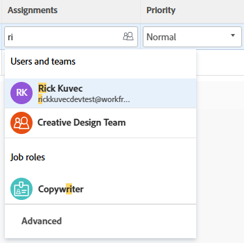

# 指派問題

<!--Audited: 10/2024-->

<!--
 

The highlighted information on this page refers to functionality not yet generally available. It is available only in the Preview environment for all customers. The same features will also be available in the Production environment for all customers starting with  a week from the Preview release.      

For more information, see [Interface modernization](/help/quicksilver/product-announcements/product-releases/interface-modernization/interface-modernization.md).  

 -->

您可以將問題指派給使用者、角色和團隊，以指出誰負責完成問題。 如需指派問題的一般資訊，請參閱[修改問題指派的概觀](../../../manage-work/issues/manage-issues/modify-issue-assignments-overview.md)。

>[!TIP]
>
>您可以指派多個使用者、工作角色或團隊。 您只能指派作用中的使用者、工作角色和團隊。
>
>如果使用者、工作角色或團隊在停用之前已被指派，則他們仍被指派給工作專案。 在此情況下，我們建議採取下列步驟：
>
>* 將工作專案重新指派給作用中的資源。
>* 將已停用團隊中的使用者與作用中團隊建立關聯，並將工作專案重新指派給作用中團隊。

除了本文章之外，我們建議您閱讀下列文章，以取得指派問題的詳細資訊：

* [修改問題指派的總覽](../../../manage-work/issues/manage-issues/modify-issue-assignments-overview.md)
* [編輯問題](../../../manage-work/issues/manage-issues/edit-issues.md)
* [修改清單中多個問題的使用者指派](../../../manage-work/issues/manage-issues/edit-assignments-for-multiple-issues.md)
* [建立進階工作分派](../../../manage-work/tasks/assign-tasks/create-advanced-assignments.md)
* [進行智慧指派](../../../manage-work/tasks/assign-tasks/make-smart-assignments.md)
* [智慧指派總覽](../../../manage-work/tasks/assign-tasks/smart-assignments.md)
* [在工作負載平衡器中指派工作的總覽](../../../resource-mgmt/workload-balancer/assign-work-in-workload-balancer.md)

您可以在個別問題層級將問題指派給一或多個資源，也可以一次將多個資源指派給多個問題。

指派問題和任務在Adobe Workfront中類似。 如需指派任務的一般資訊，請參閱[修改任務指派的概觀](../../../manage-work/tasks/assign-tasks/modify-task-assignments-overview.md)。

## 存取需求

+++ 展開以檢視本文中功能的存取需求。 

<table style="table-layout:auto"> 
 <col> 
 </col>
 <tbody> 
  <tr> 
   <td>Adobe Workfront套件</td> 
   <td> 
任何 
 </td> 
  </tr> 
  <tr> 
   <td>Adobe Workfront授權</td> 
   <td> 
投稿人或以上

   
評論或以上
 </td> 
  </tr> 
  <tr> 
   <td>存取層級設定</td> 
   <td> 
編輯問題的存取權
 
檢視專案和任務的或更高存取權以指派一個問題
 </td> 
  </tr> 
  <tr> 
   <td>物件許可權</td> 
   <td> 
管理問題的許可權
 
 指派一個問題時，檢視問題所在專案或任務的許可權或更高

指派多個問題時，為問題所在的專案或任務貢獻許可權或以上。
 </td> 
  </tr> 
 </tbody> 
</table>

如需詳細資訊，請參閱Workfront檔案中的[存取需求](/help/quicksilver/administration-and-setup/add-users/access-levels-and-object-permissions/access-level-requirements-in-documentation.md)。

+++

## 對工作角色、團隊和使用者的多個指派的考量事項

將多個資源指派給工作專案時，請考量下列事項：

* 使用者可以有多個與其設定檔相關聯的工作角色。 如需將使用者與工作角色建立關聯的資訊，請參閱[編輯使用者的設定檔](../../../administration-and-setup/add-users/create-and-manage-users/edit-a-users-profile.md)。

* 任務或問題通常首先指派給一個或多個職位角色或團隊。 當專案準備開始時，也需要將其指派給使用者。

  如果將任務或問題指派給一個或多個角色，然後您也指派了使用者，Adobe Workfront會根據以下規則決定要將哪個工作角色與其他使用者（如果有）相關聯：

   * 如果僅指派了一個工作角色，並且該工作角色與使用者的主要角色匹配，則任務或問題僅指派給履行其主要角色的使用者。
   * 如果有指派的多個角色，且至少有一個角色符合使用者的次要角色，則會將任務或問題指派給履行其中一個其他角色(如果有多個符合專案，則Workfront會隨機選取該角色)的使用者，以及任何已指派的其他角色。
   * 如果有指派的一或多個工作角色，但沒有匹配的使用者角色，則會將任務或問題指派給該角色或角色以及使用者。

* 如果將任務或問題指派給團隊且您也指派了使用者，則該任務或問題仍會同時指派給團隊和使用者。

<!--

<h2> </h2>
<h2>Considerations about removing assignments from issues</h2> 

(NOTE: drafted and moved to Modify issue assignments overview article)

You can remove assignments from one issue at a time, or you can remove assignments from multiple issues in bulk.

For more information about removing assignments from issues in bulk, see <a href="../../../manage-work/issues/manage-issues/edit-assignments-for-multiple-issues.md" class="MCXref xref">Modify user assignments for multiple issues in a list</a>. 

Consider the following when removing assignments from issues: 

<ul>
<li>When you unassign a user from an issue, the issue remains assigned to the job role that the user fulfilled on the issue.</li>
<li>When you unassign a job role or a team from an issue, the issue remains unassigned if it is not assigned to any other resources. </li>
</ul>

-->

## 在問題標題中指派單一問題

1. 移至您要指派的問題。
1. 按一下問題標題右上角的&#x200B;**指派給** （在&#x200B;**指派**&#x200B;區域中）

   或

   如果問題已指派，按一下目前指派的名稱。

   

1. 執行下列其中一項：

   * 開始輸入您要指派的使用者、角色或團隊名稱，然後當名稱出現在清單中時按一下它。

     

   * （視條件而定）按一下可用清單中的名稱、角色或專案團隊之一
   * 按一下&#x200B;**指派給我**&#x200B;以指派給您自己
   * 按一下&#x200B;**進階**。

     建立進階指派與任務和問題類似。 如需如何進行進階指派的詳細資訊，請參閱[建立進階指派](../../../manage-work/tasks/assign-tasks/create-advanced-assignments.md)。

     >[!TIP]
     >
     >新增使用者指派時，請注意頭像、使用者的主要角色或其電子郵件地址，以區分具有相同名稱的使用者。
     >
     >使用者必須至少與一個工作角色相關聯，才能在您新增時檢視該角色。
     >
     >您必須在存取層級中啟用檢視聯絡資訊設定，使用者才能檢視使用者的電子郵件。 如需詳細資訊，請參閱[授予使用者存取權](../../../administration-and-setup/add-users/configure-and-grant-access/grant-access-other-users.md)
     >

     <!-- this doesn't apply to issues; if it does, add this to the TIP above: 
      >When adding a job role assignment, you can search for the job role or location. Select a role from the Job roles list to use the default billing rate for the assignment, or select a Rate card job role to use the billing rate from the rate card. For more information on rate cards, see [Manage rate cards](/help/quicksilver/administration-and-setup/set-up-workfront/configure-system-defaults/manage-rate-cards.md).-->

1. 按一下&#x200B;**儲存**&#x200B;以完成指派問題。
1. （選擇性）按一下問題標題上工作分派區域名稱旁的&#x200B;**X圖示**&#x200B;以移除工作分派。

## 透過在清單中內聯編輯來指派問題

當清單的檢視中顯示任何指派欄位時，您可以在清單或報告中指派問題。 這是指派問題的更快方式。

根據檢視中顯示的欄位，您可以將以下實體指派給問題：

| 選項 | 已指派的實體 |
|---|---|
| **指派給** | 指派一位使用者 |
| **已指派** | 指派一位使用者 |
| **指派** | 指派使用者、工作角色或團隊。 |

若要指派清單中的問題：

1. 前往檢視中具有指派給、指派或指派欄位的問題清單。
1. 若要指派問題，請執行下列任一項作業：

   * 在&#x200B;**指派給**&#x200B;或&#x200B;**已指派**&#x200B;欄位內按一下，並開始輸入您要指派給問題的作用中使用者名稱，然後當它顯示在清單中時按一下它。

     

   * 按一下&#x200B;**指派**&#x200B;欄位並開始輸入您想要指派給問題的作用中使用者、工作角色或作用中團隊的名稱，然後當它顯示在清單中時按一下它。

     

   >[!TIP]
   >
   >新增使用者指派時，請注意頭像、使用者的主要角色或其電子郵件地址，以區分具有相同名稱的使用者。
   >
   >使用者必須至少與一個工作角色相關聯，才能在您新增時檢視該角色。
   >
   >您必須在存取層級中啟用檢視聯絡資訊設定，使用者才能檢視使用者的電子郵件。 如需詳細資訊，請參閱[授予使用者存取權](../../../administration-and-setup/add-users/configure-and-grant-access/grant-access-other-users.md)。

1. （條件式）在[工作總攬]欄位中，按一下清單底部的&#x200B;**進階**，或工作總攬方塊右上角的&#x200B;**人員圖示** ，以開啟[進階工作總攬]方塊並建立進階工作總攬。 如需詳細資訊，請參閱[建立進階工作分派](../../../manage-work/tasks/assign-tasks/create-advanced-assignments.md)。

   >[!TIP]
   >
   >您無法從「指派至」或「已指派」欄位進行進階指派。

1. 將您的受指派人新增至問題後，按下Enter或按一下頁面上的任何位置以儲存變更。

## 在編輯問題方塊中指派問題

您可以在「編輯問題」方塊中編輯問題時指派問題。

如需相關資訊，請參閱文章[編輯問題](/help/quicksilver/manage-work/issues/manage-issues/edit-issues.md)中的「工作總攬」一節。

## 大量指派問題

<!--
Assigning issues in bulk is different depending on what environment you choose to do this. 

### Assign issues in bulk in the Production environment 

1. Go to a list of issues that you want to assign in bulk. 
1. Select several issues in the list. 
1. Click the **Edit icon** .

   The **Edit Issues** dialog box opens.

1. In the **Assignments** area, select the **Assignee** box, then start typing the name of a user, job role, or team that you want to assign to all the issues.

   >[!IMPORTANT]
   >
   >If any of the issues is already assigned, the resources you indicate here are added to the issues instead of replacing the existing resources on the issues. 
   
1. (Optional) Select the radio button in the **Issue Owner** column to indicate which resource is the primary assignee or the Owner of the issue, when you assign more than one resource to the issue. This is not available for teams. 
1. (Optional) Select a role that the user should fulfill on the issue from the **Pick a role** drop-down menu in the **Assignee's Role** column when you assign users to issues. If you do not select a role, Workfront automatically selects the user's Primary Role. 

1. (Optional) If you want to remove existing assignees from all issues do one of the following:

   1. Start typing the name of a user, role, or team you want to remove from the issue, then select it when it appears on the list and click **Remove Assignee** to add additional assignees to remove. 
   1. Click **Remove All Existing Assignees** to remove all assignees from all selected issues.

1. Click **Save Changes**.
1. (Optional and conditional) When the Assigned to or the Assignments fields display in your list of issues, click inside one of these columns for an issue, then click the **X icon** next to the name of an assignee to remove it from the issue.

### Assign issues in bulk in the Preview environment

-->

1. 前往您要大量指派的問題清單。
1. 在清單中選取數個問題。
1. 按一下&#x200B;**編輯圖示** 。

   **編輯問題**&#x200B;對話方塊開啟。

1. 按一下左側面板中的&#x200B;**工作總攬**，然後在&#x200B;**工作總攬**&#x200B;區域中，開始在&#x200B;**搜尋人員、角色或團隊**&#x200B;欄位中輸入使用者、角色或團隊的名稱，然後當它顯示在清單中時按一下它

   或

   按一下「**指派給我**」以指派問題給您自己。

   >[!IMPORTANT]
   >
   >如果已經指派任何問題，您在此處指示的資源會新增到問題中，而不是取代問題上的現有資源。

1. （選擇性）如果您想要從所有問題中移除現有的受指派人，請按一下其名稱旁的&#x200B;**x**。

1. （選用）更新P **規劃時數**&#x200B;欄位。 如需詳細資訊，請參閱[編輯問題](/help/quicksilver/manage-work/issues/manage-issues/edit-issues.md)。

1. 按一下「**儲存**」。
1. （選擇性和條件性）當問題清單中顯示&#x200B;**指派給**&#x200B;或&#x200B;**工作總攬**&#x200B;欄位時，按一下其中一欄以取得問題，然後按一下受指派人名稱旁的&#x200B;**X圖示**，即可將其從問題中移除。

