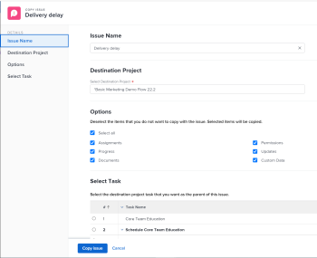

# 複製問題

您可以複製問題或請求，並儲存在相同或其他專案中。 您也可以將問題從任務複製到另一個專案。

您可以從下列物件複製問題：

* 從專案到相同專案（複製到相同專案）
* 從任務到同一任務（如果在同一任務上重複）
* 從專案到其他專案
* 從任務到項目

>[!TIP]
>
>「Issues」和「requests」在Workfront中可互換使用。 您可以記錄項目和任務中的問題，以指明需要解決的未預見的工作。 您也可以提交記錄為問題的請求，此問題會列在指定為「請求佇列」的專案上。

## 存取需求

您必須具備下列存取權，才能執行本文中的步驟：

<table style="table-layout:auto"> 
 <col> 
 <col> 
 <tbody> 
  <tr> 
   <td role="rowheader">Adobe Workfront計畫*</td> 
   <td> 
任何
 </td> 
  </tr> 
  <tr> 
   <td role="rowheader">Adobe Workfront授權*</td> 
   <td> 
要求或更高版本
 
檢閱或更高授權，以複製專案「問題」區段中的問題。
 </td> 
  </tr> 
  <tr> 
   <td role="rowheader">存取層級*</td> 
   <td> 
編輯問題的存取權
 
查看或更高程度地訪問項目和任務
 
注意：如果您仍無權存取，請洽詢您的Workfront管理員，他們是否在您的存取層級設定其他限制。 如需存取層級問題的相關資訊，請參閱 <a href="../../../administration-and-setup/add-users/configure-and-grant-access/grant-access-issues.md" class="MCXref xref">授予問題的存取權</a>. 如需Workfront管理員如何變更您的存取層級的詳細資訊，請參閱 <a href="../../../administration-and-setup/add-users/configure-and-grant-access/create-modify-access-levels.md" class="MCXref xref">建立或修改自訂存取層級</a>. 
 </td> 
  </tr> 
  <tr> 
   <td role="rowheader">物件權限</td> 
   <td> 
管理問題的權限
 
將問題複製到的項目，並提供「新增問題」功能。
 
 如需授予問題權限的相關資訊，請參閱 <a href="../../../workfront-basics/grant-and-request-access-to-objects/share-an-issue.md" class="MCXref xref">共用問題 </a>
 
如需要求其他權限的詳細資訊，請參閱 <a href="../../../workfront-basics/grant-and-request-access-to-objects/request-access.md" class="MCXref xref">請求對對象的訪問 </a>.
 </td> 
  </tr> 
 </tbody> 
</table>

&#42;若要了解您擁有的計畫、授權類型或存取權，請聯絡您的Workfront管理員。

## 與文檔或請求隊列相關的問題的注意事項

複製包含檔案或與請求佇列相關聯的問題時，請考量下列事項：

* **當問題與請求佇列相關聯時：** 將問題複製到另一個對象時，如果問題與請求隊列關聯，則複製的問題不再與第一個問題源自的原始隊列關聯。
* **將文檔附加到問題時：** 將問題複製到另一個對象時，如果問題已附加文檔，則文檔及其版本也將移至新問題。 與文檔關聯的任何校樣或批准都不會移動。
* **將問題連結到文檔或資料夾時：** 當您複製有檔案或資料夾連結至第三方服務(如Google Drive)的期刊時，檔案的連結會傳輸至複製的期刊。 

## 複製清單中的問題

您可以從問題清單或問題報表複製一或多個問題。

1. 前往包含您要複製之問題或問題的專案。

   或

   前往問題報告。

1. 如果您選取前往專案，請按一下 **問題** 中。
1. 選取您要複製的問題，然後按一下 **更多功能表** 在問題清單頂端，按一下 **複製到**.

   

1. 如一節所述，繼續複製問題 [複製單一問題](#copy-a-single-issue) 從步驟2開始。

   <!--
   <MadCap:conditionalText data-mc-conditions="QuicksilverOrClassic.Draft mode">
   (NOTE:&nbsp;ensure step number stays accurate)
   </MadCap:conditionalText>
   -->

## 複製單一問題 {#copy-a-single-issue}

您可以在檢視問題時複製一個問題。

1. 前往您要複製的問題，然後按一下 **更多** 功能表  在問題名稱的右側，然後 **複製** 到。

   

   此 **複製問題** 框。

   

1. 在 **選擇目標項目** 區段，指定您要複製問題的專案名稱。 預設會顯示目前專案的名稱。

   >[!TIP]
   >
   >清單中只會顯示100個專案。

1. （有條件）按一下 **請求存取** 如果您無權將問題複製到專案。
1. （條件性）如果您有權將問題新增至目標專案的其中一項工作，請繼續將問題複製至選取的目標專案，而不要求存取權。

   

   >[!TIP]
   >
   >如果所選專案處於待核准、已完成或已結束狀態，當Workfront管理員防止為這些專案新增問題時，則會顯示類似的訊息。 如需詳細資訊，請參閱 [配置系統範圍的項目首選項](../../../administration-and-setup/set-up-workfront/configure-system-defaults/set-project-preferences.md).

1. （選用）在 **選項** 部分，取消選擇下表中列出的任何項，以從新問題中刪除這些項。 預設會選取所有選項。

   >[!NOTE]
   這只會影響複製的問題，而非原始問題。

   <table style="table-layout:auto"> 
    <col> 
    <col> 
    <tbody> 
     <tr> 
      <td role="rowheader">指派</td> 
      <td>移除指派給問題的使用者、工作角色或團隊。</td> 
     </tr> 
     <tr> 
      <td role="rowheader">進度</td> 
      <td>移除問題的完成百分比（如果有）。 </td> 
     </tr> 
     <tr> 
      <td role="rowheader">文件</td> 
      <td>刪除文檔頁簽中的所有內容，包括文檔版本、連結的文檔和資料夾。  預設情況下，文檔校樣和批准不能複製到另一個問題。</td> 
     </tr> 
     <tr> 
      <td role="rowheader">權限</td> 
      <td>刪除與問題共用的實體。 </td> 
     </tr> 
     <tr> 
      <td role="rowheader">更新</td> 
      <td>從問題的「更新」部分刪除注釋。</td> 
     </tr> 
     <tr> 
      <td role="rowheader">自訂資料</td> 
      <td>從問題的自定義表單中刪除有關問題的資訊，以及與問題附加的文檔關聯的自定義表單的資訊（如果這些資訊也隨問題複製）。 自訂表單仍會附於問題和檔案中，但表單的資訊不會保留在新問題中。 </td> 
     </tr> 
    </tbody> 
   </table>

1. （選用）在 **選擇任務** 部分，選擇要移動問題的任務。
1. 按一下 **複製問題** 或 **複製問題** 如果您在清單中選取了多個問題。

   複製的問題會新增至指定的專案。

 
