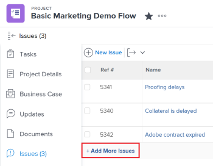

# 建立問題

<!--Audited: 03/2025-->

<!--

The highlighted information on this page refers to functionality not yet generally available. It is available only in the Preview environment for all customers. After the monthly releases to Production, the same features are also available in the Production environment for customers who enabled fast releases. 

For information about fast releases, see [Enable or disable fast releases for your organization](../../../administration-and-setup/set-up-workfront/configure-system-defaults/enable-fast-release-process.md).  

For information about the current release, see [Fourth Quarter 2023 release overview](../../../product-announcements/product-releases/23-q4-release-activity/23-q4-release-overview.md).  

-->

處理專案時，您可能會發現發生未預期的事件。 您可以將這些非預期事件記錄為特定專案或任務的問題。 具有適當存取許可權的使用者可隨著專案或任務進行到完成來檢視和監控問題的狀態，無需冗長的電子郵件鏈結或狀態會議。 與為計畫事件的任務不同，問題代表Adobe Workfront中的計畫外工作專案。

您也可以請求將問題新增至專案。 如需詳細資訊，請參閱[建立和提交Adobe Workfront要求](../../../manage-work/requests/create-requests/create-submit-requests.md)。

>[!TIP]
>
>在Workfront中，問題和請求可互換使用。 您可以同時記錄專案和任務的問題，以指出需要解決的無法預見的工作。 您也可以在指定為「請求佇列」的專案上提交記錄為問題的請求。

## 存取需求

+++ 展開以檢視本文中功能的存取需求。

您必須具有下列存取權才能執行本文中的步驟：

<table style="table-layout:auto"> 
 <col> 
 <col> 
 <tbody> 
  <tr> 
   <td role="rowheader">Adobe Workfront計畫</td> 
   <td> 
任何
 </td> 
  </tr> 
  <tr> 
   <td role="rowheader">Adobe Workfront授權*</td> 
   <td> 
新授權：

   <ul><li>投稿人或以上</li>
   <li>輕度或以上以編輯任務或專案的問題區段中的問題</li></ul>
   
目前的授權：

  <ul><li>要求或更高版本</li> <li>檢閱或更高版本以編輯任務或專案的問題區段中的問題</li></ul> </td> 
  </tr> 
  <tr> 
   <td role="rowheader">存取層級設定</td> 
   <td> 
編輯問題的存取權
 
檢視專案和任務的或更高存取權
 </td> 
  </tr> 
  <tr> 
   <td role="rowheader">物件許可權</td> 
   <td> 
投稿或更高的許可權，能夠新增問題至您建立問題的任務或專案
 </td> 
  </tr> 
 </tbody> 
</table>

*如需詳細資訊，請參閱Workfront檔案中的[存取需求](/help/quicksilver/administration-and-setup/add-users/access-levels-and-object-permissions/access-level-requirements-in-documentation.md)。

+++

<!--
(NOTE: in NWE Requestors CAN see the Issues tab on a project but in classic they cannot! However, even when they DO see it, they cannot enter the issues - logged this issue for it but they might decide not to fix it: https://hub.workfront.com/issue/60181e28000058980cce29597185b2d6/updates?email-source=comm)

-->

## 建立問題的限制

當您擁有正確的存取權和許可權時，您就能在專案或任務上建立問題。 但是，在下列情況下，您可能無法建立問題：

* 您的Workfront管理員或群組管理員必須啟用新增問題到專案偏好設定區域中處於完成或無法使用狀態的專案。 如需有關設定專案偏好設定的資訊，請參閱[設定全系統的專案偏好設定](../../../administration-and-setup/set-up-workfront/configure-system-defaults/set-project-preferences.md)。
* 您無法將問題新增至擱置核准中的專案。

## 準備新問題表單

您的組織應已具備定義良好的流程，以便記錄問題的時間與方式。 設定此程式時，第一步是建立提交問題所需的表單。

使用者可透過下列方式將問題新增至專案：

* 直接新增至任務和專案。
* 將它們提交至請求佇列。

新問題表單可包含重要資訊，有助於快速解決問題。

您可以將新問題表單設定為當使用者將問題新增至專案或其任務時，包含下列資訊：

* 自訂欄位
* 核准
* 指定（路由規則）

新問題或請求的欄位會在將記錄問題的專案的佇列詳細資料區段中定義。

如需有關設定專案「佇列詳細資料」區段的資訊，請參閱[建立請求佇列](../../../manage-work/requests/create-and-manage-request-queues/create-request-queue.md)。

如需透過將問題提交至請求佇列來建立問題的相關資訊，請參閱本文中的[透過輸入新請求來建立問題](#create-issues-by-entering-a-new-request)區段。

## 使用新問題按鈕建立任務或專案上的問題

在專案中定義新問題表單的欄位後，您可以開始建立問題。

若要在任務或專案上建立問題：

1. 前往您要建立問題的專案。
1. （選擇性）如果要記錄任務的問題，請移至&#x200B;**任務**&#x200B;區域，然後按一下任務名稱。
1. 按一下&#x200B;**問題**&#x200B;區段。

   專案問題清單隨即顯示

1. 按一下問題清單頂端的&#x200B;**新問題**。
新問題方塊隨即顯示。

   

1. （視條件而定）如果專案建立者在專案上建立了佇列主題或主題群組，則會將其新增至新問題表單。 指定您新問題的&#x200B;**主題群組**&#x200B;或&#x200B;**佇列主題**。 主題群組和佇列主題已根據您的環境自訂名稱。\
   如需有關建立主題群組的詳細資訊，請參閱[建立主題群組](../../../manage-work/requests/create-and-manage-request-queues/create-topic-groups.md)。 如需建立佇列主題的詳細資訊，請參閱[建立佇列主題](../../../manage-work/requests/create-and-manage-request-queues/create-queue-topics.md)。

   * 如果專案上只設定了一個佇列主題，則會自動顯示主題。
   * 如果「主題群組」下方沒有任何「佇列主題」或「主題群組」，「主題群組」下拉式清單中就沒有可用的專案。

1. 在&#x200B;**主旨**&#x200B;欄位中新增問題名稱，然後新增&#x200B;**描述**。

1. （視條件而定）如果專案建立者允許&#x200B;**請求型別**&#x200B;欄位顯示在新問題表單上，請從下列選項中選取您的問題型別：

   * 錯誤報告
   * 變更順序
   * 問題
   * 請求\
     根據您的Workfront管理員如何設定您的專案偏好設定，您的問題型別名稱可能不同。

   >[!TIP]
   >
   >請求型別必須在佇列詳細資訊中啟用，並在建立佇列主題時啟用，以便在「新問題」表單中顯示為選項。 如需詳細資訊，請參閱下列文章：
   >* [建立請求佇列](../../requests/create-and-manage-request-queues/create-request-queue.md)
   >  * [建立佇列主題](../../requests/create-and-manage-request-queues/create-queue-topics.md)

1. 繼續指定&#x200B;**新問題**&#x200B;表單中可用的欄位。 如需輸入新問題時可用欄位的詳細資訊，請參閱[編輯問題](../../../manage-work/issues/manage-issues/edit-issues.md)。

   >[!IMPORTANT]
   >
   >新問題表單中並非所有與問題相關的欄位都可用。 專案建立者在建立問題時啟用定義專案的佇列詳細資料區域時可用的欄位。 如需詳細資訊，請參閱[建立要求佇列](../../requests/create-and-manage-request-queues/create-request-queue.md)。

1. （視條件而定）如果佇列主題與自訂表單相關聯，則該自訂表單將顯示在&#x200B;**新問題**&#x200B;表單中。\
   或\
   如果專案透過[佇列詳細資料]區域與問題自訂表單相關聯，則表單會顯示在預設Workfront欄位之後的&#x200B;**新增問題**&#x200B;表單中。

   如需詳細資訊，請參閱[建立要求佇列](../../../manage-work/requests/create-and-manage-request-queues/create-request-queue.md)。

1. 按一下&#x200B;**提交**。

   問題可指派給多個使用者、工作角色或團隊。 如需指派和管理要求的詳細資訊，請參閱[管理工作和團隊要求](../../../people-teams-and-groups/work-with-team-requests/manage-work-and-team-requests.md)。

## 在任務或專案上建立內嵌問題

>[!IMPORTANT]
>
>專案所有者必須啟用&#x200B;**允許使用者在定義專案的問題設定時新增內嵌問題**，然後才能將內嵌問題新增到專案或任務。 如需有關在專案上設定問題設定的資訊，請參閱[編輯專案](../../../manage-work/projects/manage-projects/edit-projects.md)。
>

想要快速新增數個問題時，您可以為任務或專案建立問題，方法是將問題新增至問題清單。

>[!NOTE]
>
>當您內嵌新增問題時，Workfront不會將新問題表單套用至新問題。 如果您希望使用者在輸入問題時提供特定資訊，我們不建議新增內嵌問題。 這可能會對問題報告，以及稍後對指派給問題的使用者擁有解決問題所需的所有資訊的能力產生負面影響。

若要建立內嵌問題：

1. 前往您要建立問題的專案。
1. （選擇性）如果要記錄任務的問題，請移至&#x200B;**任務**&#x200B;區段，然後按一下任務名稱。
1. 按一下左側面板中的&#x200B;**問題**&#x200B;區段。
1. 按一下問題清單底部的&#x200B;**新增更多問題**。

   在「問題」區段的問題清單中會建立新行。

   >[!TIP]
   >
   >如果在「編輯專案」方塊中取消選取「允許使用者新增問題」內嵌設定，則此選項會變暗。 如需詳細資訊，請參閱[編輯專案](../../../manage-work/projects/manage-projects/edit-projects.md)。

   

1. 開始在「名稱」欄位中輸入問題的名稱，然後繼續內嵌新增問題的詳細資訊。

   >[!TIP]
   >
   >您套用至問題清單的檢視畫面會提供可內嵌編輯的欄位。 您可能無法內嵌編輯下列欄位型別：
   >   
   >* 屬於其他物件的欄位
   >* 您無權編輯的欄位
   >* 作為計算且由Workfront自動更新的欄位

1. 按一下Enter以完成內嵌編輯，並將問題新增至專案或任務。

## 輸入新請求以建立問題 {#create-issues-by-entering-a-new-request}

您可以將專案指定為接收問題的接收器。 這類專案在Workfront中稱為請求佇列。 您可以從主功能表的請求區域存取請求佇列。

>[!TIP]
>
>術語「問題」和「請求」在Workfront中可互換。

有關如何將專案設定為請求佇列以接收問題的詳細資訊，請參閱[建立請求佇列](../../../manage-work/requests/create-and-manage-request-queues/create-request-queue.md)。 如需有關提交請求的資訊，請參閱[建立並提交Adobe Workfront請求](../../../manage-work/requests/create-requests/create-submit-requests.md)。
