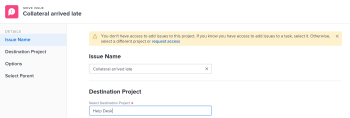

# 移動問題

<!--Audited: 12/2024-->

<!--
The highlighted information on this page refers to functionality not yet generally available. It is available only in the Preview environment for all customers. After the monthly releases to Production, the same features are also available in the Production environment for customers who enabled fast releases.    

For information about fast releases, see [Enable or disable fast releases for your organization](/help/quicksilver/administration-and-setup/set-up-workfront/configure-system-defaults/enable-fast-release-process.md). 
-->

您可以在下列物件之間移動問題：

* 從專案到另一個專案
* 從任務到相同專案或其他專案中的另一個任務
* 從任務到專案或到另一個專案
* 從專案到相同專案中的任務或其他專案中的任務

## 存取權要求

+++ 展開以檢視這篇文章中所述功能的存取權要求。 

<table style="table-layout:auto"> 
 <col> 
 <col> 
 <tbody> 
  <tr> 
   <td role="rowheader">Adobe Workfront 封裝</td> 
   <td> 
任何
 </td> 
  </tr> 
  <tr> 
   <td role="rowheader">Adobe Workfront授權</td> 
   <td> 
   <ul><li>投稿人或以上</li>
   <li>將專案問題區段中的問題移動為淺色或更高</li></ul>
   或:
   <ul>   <li>
要求或更高版本
</li>
   <li>
檢閱或更高授權以移動專案問題區段中的問題。
</li></ul>   
     </td> 
  </tr> 
  <tr> 
   <td role="rowheader">存取層級設定</td> 
   <td> 
編輯問題的存取權
 
檢視專案和任務的或更高存取權
 </td> 
  </tr> 
  <tr> 
   <td role="rowheader">物件許可權</td> 
   <td> 
管理問題的許可權
 
貢獻許可權給您要移動問題的專案，並具有「新增問題」的功能。</td> 
  </tr> 
 </tbody> 
</table>

*如需詳細資訊，請參閱Workfront檔案中的[存取需求](/help/quicksilver/administration-and-setup/add-users/access-levels-and-object-permissions/access-level-requirements-in-documentation.md)。

+++

<!--
Old:

<table style="table-layout:auto"> 
 <col> 
 <col> 
 <tbody> 
  <tr> 
   <td role="rowheader">Adobe Workfront plan</td> 
   <td> 
Any
 </td> 
  </tr> 
  <tr> 
   <td role="rowheader">Adobe Workfront license*</td> 
   <td> 
New:
 
   <ul><li>Contributor or higher</li>
   <li>Light or higher to move issues in the Issues section of a project</li></ul>
   
Current:

   <ul>
   <li>
Request or higher
</li>
   <li>
Review or higher license to move issues in the Issues section of a project.
</li></ul>   
     </td> 
  </tr> 
  <tr> 
   <td role="rowheader">Access level configurations</td> 
   <td> 
Edit access to Issues
 
View or higher access to Projects and Tasks
 </td> 
  </tr> 
  <tr> 
   <td role="rowheader">Object permissions</td> 
   <td> 
Manage permissions to the issue
 
Contribute permissions to the item where you are moving the issue with the ability to Add Issues.</td> 
  </tr> 
 </tbody> 
</table>
-->

## 移動問題的考量事項

移動包含檔案或與請求佇列關聯的問題時，請考量下列事項：

* 您的系統或群組管理員可能會阻止您移動記錄時數的問題，具體取決於他們如何在「設定」區域中設定「允許使用者移動記錄時數任務和問題」偏好設定。 如需詳細資訊，請參閱[設定全系統的任務和問題偏好設定](/help/quicksilver/administration-and-setup/set-up-workfront/configure-system-defaults/set-task-issue-preferences.md)。

* **當問題與請求佇列關聯時：**&#x200B;當您將問題移動到另一個物件且問題與請求佇列關聯時，移動的問題不再與原始佇列關聯，第一個問題源自此。
* **當檔案附加到問題時：**&#x200B;當您將問題移動到另一個物件並且問題具有附加的檔案時，檔案、其版本和校樣也移動到新問題。 與檔案關聯的任何核准都不會移動。
* **當問題連結至檔案或資料夾時：**&#x200B;當您移動具有連結至第三方服務（例如Google Drive）之檔案或資料夾的問題時，檔案的連結會隨著問題移動。
* **當您在不同儲存體型別的專案之間移動問題時**：您無法將問題從舊版Workfront儲存體專案複製到Adobe雲端儲存體專案。 反之亦然。 您的Workfront執行個體可能沒有這兩種型別的檔案儲存。

  如需詳細資訊，請參閱[專案和相關物件的檔案管理概觀](/help/quicksilver/manage-work/projects/manage-projects/manage-documents-on-projects.md)。

## 移動清單中的問題

您可以從問題清單或問題報告中移動一個或多個問題。

1. 移至包含您要移動之問題的專案。

   或

   前往問題報告。

1. 如果您選擇前往專案，請按一下左側面板中的&#x200B;**問題**。
1. 選取您要移動的一個或多個問題，並按一下問題清單頂端的&#x200B;**更多功能表**，然後按一下&#x200B;**移至**。

   

1. 繼續移動問題，如從步驟2開始的[移動單一問題](#move-a-single-issue)一節中所述。

## 移動單一問題 {#move-a-single-issue}

您可以在檢視時移動一個問題。

### 移動單一問題

1. 移至您要移動的問題，按一下問題名稱右側的&#x200B;**更多**&#x200B;功能表，然後按一下&#x200B;**移至**。

   

   顯示&#x200B;**移動問題**&#x200B;方塊。

   

1. 在&#x200B;**選取目的地專案**&#x200B;區段中，指定您要移動問題的專案名稱。 預設會顯示目前專案的名稱。

   >[!TIP]
   >
   >清單中只會顯示100個專案。

1. （視條件而定）如果您沒有將問題移至專案的存取權，請按一下&#x200B;**要求存取權**。
1. （視條件而定）如果您有權將問題新增至目的地專案上的任務之一，請繼續移動所選目的地專案上的問題而不要求存取權。

   

   >[!TIP]
   >
   >如果Workfront管理員防止將問題新增到這些專案中，所選專案處於未決核准、已完成或已終止狀態，則會顯示類似訊息。 如需詳細資訊，請參閱[設定全系統的專案偏好設定](../../../administration-and-setup/set-up-workfront/configure-system-defaults/set-project-preferences.md)。

1. （選擇性）在&#x200B;**選項**&#x200B;區段中，取消選取下表所列的任何專案，以將其從移動的問題中移除。 依預設會選取所有選項。

   >[!IMPORTANT]
   >
   >取消選取「選項」清單中的專案會導致資料遺失。 現有問題的資訊將被移除且無法復原。

   <table style="table-layout:auto"> 
    <col> 
    <col> 
    <tbody> 
     <tr> 
      <td role="rowheader">全選</td> 
      <td>取消選取此選項，可在將問題移動到新位置時，從問題中移除所有資訊。 </td> 
     </tr> 
     <tr> 
      <td role="rowheader">指派</td> 
      <td>移除指派給問題的使用者、工作角色或團隊。</td> 
     </tr> 
     <tr> 
      <td role="rowheader">進度</td> 
      <td>移除問題的完成百分比（如有）。 </td> 
     </tr> 
     <tr> 
      <td role="rowheader">
文件
</td> 
      <td> 
移除檔案標籤中的所有專案，包括檔案版本、連結的檔案和資料夾。

   <b>注意</b>

   如果您選擇不移動與問題相關的檔案，檔案將會刪除並放入資源回收筒30天。 管理員可以還原這些檔案，且這些檔案將會在移動的問題上還原。

   如果問題在移動後刪除，則恢復的檔案將放置在恢復檔案的管理員使用者頁面的「檔案」區域中。
     
 </td>
   </tr> 
     <tr> 
      <td role="rowheader">權限</td> 
      <td>移除與問題共用的實體。 </td> 
     </tr> 
     <tr> 
      <td role="rowheader">更新</td> 
      <td>從問題的更新區段移除評論。</td> 
     </tr> 
    </tbody> 
   </table>

1. （選擇性）在&#x200B;**選取任務**&#x200B;區段中，選取您要移動問題的任務。
1. 若您在清單中選取多個問題，請按一下&#x200B;**移動問題**&#x200B;或&#x200B;**移動問題**。

   移動的問題會新增至指定的專案。

