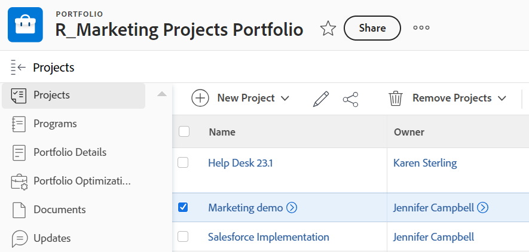

# 從投資組合中移除專案

您可以從投資組合中移除專案，並將其與不同的投資組合建立關聯，或者您可以完全移除專案與投資組合之間的關聯。

您也可以從投資組合中刪除專案，專案也會從[!DNL Adobe Workfront]中移除。

## 存取需求

您必須具有下列存取權才能執行本文中的步驟：

<table style="table-layout:auto"> 
 <col> 
 <col> 
 <tbody> 
  <tr> 
   <td role="rowheader">[!DNL Adobe Workfront] 計畫*</td> 
   <td> 
[！UICONTROL Business]或更高版本
 </td> 
  </tr> 
  <tr> 
   <td role="rowheader">[!DNL Adobe Workfront] 授權*</td> 
   <td> 
[！UICONTROL計畫] 
 </td> 
  </tr> 
  <tr> 
   <td role="rowheader">存取層級設定*</td> 
   <td> 
[！UICONTROL Edit]專案的存取權
 
[！UICONTROL View]對Portfolio或更高版本的存取權
 
注意：如果您還是沒有存取權，請詢問您的[!DNL Workfront]管理員是否對您的存取層級設定了其他限制。 如需[!DNL Workfront]管理員如何變更您的存取層級的詳細資訊，請參閱<a href="../../../administration-and-setup/add-users/configure-and-grant-access/create-modify-access-levels.md" class="MCXref xref">建立或修改自訂存取層級</a>。
 </td> 
  </tr> 
  <tr> 
   <td role="rowheader">物件許可權</td> 
   <td> 
Portfolio上的[！UICONTROL Manage]許可權可移除具有專案[！UICONTROL Delete]存取權的專案 [！UICONTROL Manage]許可權，以從投資組合中刪除專案
 
如需請求其他存取權的資訊，請參閱<a href="../../../workfront-basics/grant-and-request-access-to-objects/request-access.md" class="MCXref xref">請求物件</a>的存取權。
 </td> 
  </tr> 
 </tbody> 
</table>

&#42;若要瞭解您擁有的計畫、授權型別或存取權，請連絡您的[!DNL Workfront]管理員。

## 從投資組合中移除專案

1. 移至Portfolio，然後按一下左側面板中的&#x200B;**[!UICONTROL 專案]**。
1. 選取要移除的專案。 

   

1. 按一下&#x200B;**[!UICONTROL 移除專案]**。
1. 按一下&#x200B;**[!UICONTROL 刪除]**&#x200B;從[!DNL Workfront]刪除專案，或按一下&#x200B;**[!UICONTROL 移除]** **[!UICONTROL 從Portfolio]**&#x200B;移除專案，從選取的Portfolio移除專案。

1. （選擇性和條件性）尋找您從投資組合中移除的專案，並將其與其他投資組合建立關聯。 如需將專案與投資組合建立關聯的資訊，請參閱[將專案新增至投資組合](../../../manage-work/portfolios/create-and-manage-portfolios/add-projects-to-portfolios.md)。
