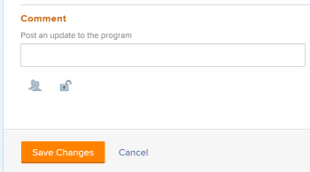

# 編輯程式

您可以編輯已建立的程式，或其他用戶已建立的與您共用的程式的資訊。

您可以在程式頁中編輯程式，也可以在清單中編輯程式。

## 存取需求

您必須具備下列存取權，才能執行本文中的步驟：

<table style="table-layout:auto"> 
 <col> 
 <col> 
 <tbody> 
  <tr> 
   <td role="rowheader">[!DNL Adobe Workfront] 計劃*</td> 
   <td> 
任何
 </td> 
  </tr> 
  <tr> 
   <td role="rowheader">[!DNL Adobe Workfront] 授權*</td> 
   <td> 
[!UICONTROL計畫] 
 </td> 
  </tr> 
  <tr> 
   <td role="rowheader">存取層級*</td> 
   <td> 
[!UICONTROL編輯]對程式的訪問
 
注意：如果您仍無法存取，請詢問您的 [!DNL Workfront] 管理員。 有關訪問級別中程式的資訊，請參見 <a href="../../../administration-and-setup/add-users/configure-and-grant-access/grant-access-programs.md" class="MCXref xref">授予方案的存取權</a>. 若要了解 [!DNL Workfront] 管理員可以更改您的訪問級別，請參閱 <a href="../../../administration-and-setup/add-users/configure-and-grant-access/create-modify-access-levels.md" class="MCXref xref">建立或修改自訂存取層級</a>. 
 </td> 
  </tr> 
  <tr> 
   <td role="rowheader">物件權限</td> 
   <td> 
程式的[!UICONTROL管理]權限
 
 有關授予程式權限的資訊，請參閱 <a href="../../../workfront-basics/grant-and-request-access-to-objects/share-a-program.md" class="MCXref xref">共用方案 </a>. 
 
如需要求其他權限的詳細資訊，請參閱 <a href="../../../workfront-basics/grant-and-request-access-to-objects/request-access.md" class="MCXref xref">請求對對象的訪問 </a>.
 </td> 
  </tr> 
 </tbody> 
</table>

&#42;若要了解您擁有的計畫、授權類型或存取權，請聯絡您的 [!DNL Workfront] 管理員。

## 編輯程式

1. 前往 **[!UICONTROL 主菜單]**.
1. 按一下 **[!UICONTROL 方案]**，然後按一下程式的名稱以開啟它。

   >[!TIP]
   >
   >您可以先前往產品組合，然後按一下，從與其相關聯的產品組合中存取方案 **[!UICONTROL 方案]** 中。 如需詳細資訊，請參閱 [建立方案](../../../manage-work/portfolios/create-and-manage-programs/create-program.md).

1. （可選）要編輯有關程式的有限資訊，請按一下 **[!UICONTROL 方案詳細資訊]** 中。

   >[!TIP]
   >
   >如果要編輯有關程式的所有資訊，請轉至步驟4。

   

   >[!NOTE]
   >
   >視您的 [!DNL Workfront] 管理員或群組管理員已修改您的配置範本， [!UICONTROL 方案詳細資訊] 區域可能會重新排列或未顯示。 如需詳細資訊，請參閱 [自訂 [!UICONTROL 詳細資料] 使用版面範本檢視](../../../administration-and-setup/customize-workfront/use-layout-templates/customize-details-view-layout-template.md).

   <!--
   
(NOTE: the above note will also come to the Edit Program box)

   -->

   若要編輯 [!UICONTROL 詳細資料] 部分，請執行以下操作：

   1. （選用）按一下 **[!UICONTROL 全部折疊]** 圖示來折疊所有區域。
   1. （選用和條件性）收合區域時，按一下 **右箭頭**  展開要編輯的區域。
   1. 如需 [!UICONTROL 方案詳細資訊] 部分，繼續編輯 [!UICONTROL 編輯方案] 框（如下所示）。
   1. （可選）如果程式沒有附加自訂表單，請開始在 **[!UICONTROL 新增自訂表單]** 欄位，在清單中顯示時加以選取，然後按一下 **[!UICONTROL 儲存變更]**.
   1. （選用）按一下 **[!UICONTROL 匯出]** 圖示  要導出 [!UICONTROL 概述] 和自訂表單資訊至PDF檔案，然後按一下 **[!UICONTROL 匯出]**. 從以下項目中選取：

      * 全選（僅在至少附加一個自訂表單時顯示）
      * [!UICONTROL 總覽]
      * 一或多個自訂表單的名稱

      PDF檔案下載至您的電腦。

      

      如需詳細資訊，請參閱 [匯出自訂表單和物件詳細資訊](../../../workfront-basics/work-with-custom-forms/export-custom-forms-details.md).

1. 要編輯有關一個或多個程式的所有資訊，請執行以下操作之一：

   * 按一下 **[!UICONTROL 更多]** 功能表  在方案名稱旁邊，然&#x200B;後&#x200B;**[!UICONTROL 編輯].**
   * 轉到程式清單，選擇要編輯的一個或多個程式，然後按一下 **[!UICONTROL 編輯]** 圖示  清單頂端。

   此 **[!UICONTROL 編輯方案]** 對話框。

   

   所有方案欄位皆可在 [!UICONTROL 編輯方案] 框中，並按左側面板中列出的區域分組。

1. 請考慮在下列任何章節中指定資訊：

   * [[!UICONTROL 總覽]](#overview)
   * [[!UICONTROL 自訂表單]](#Custom%C2%A0F)
   * [[!UICONTROL 評論]](#comment)

### [!UICONTROL 總覽] {#overview}

1. 按上述方式開始編輯程式。
1. 按一下 **[!UICONTROL 概述]** 和指定下列欄位：

   <!--
   
(NOTE:&nbsp;note below drafted for now)

   -->

   <!--
   <note type="note">
   Depending on how your Workfront administrator or Group administrator sets up our Layout Template, the fields in the Edit Program box might be rearranged or not display. For information, see
   <a href="../../../administration-and-setup/customize-workfront/use-layout-templates/customize-details-view-layout-template.md" class="MCXref xref">Customize the Details view using a layout template</a>.
   </note>
   -->

   <table style="table-layout:auto"> 
    <col> 
    <col> 
    <tbody> 
     <tr> 
      <td role="rowheader">[!UICONTROL名稱]</td> 
      <td> 
更新程式的名稱。 
 
提示：如果您選取了多個方案，則無法使用此功能。 
 </td> 
     </tr> 
     <tr> 
      <td role="rowheader">[!UICONTROL描述]</td> 
      <td> 
輸入Portfolio的說明，以指出其獨特之處。 
 </td> 
     </tr> 
     <tr> 
      <td role="rowheader">[!UICONTROL程式管理器]</td> 
      <td> 
開始鍵入要作為程式管理器指明的用戶的名稱，然後在該名稱出現在清單中時將其選中。 這是可以監督方案項目中定義工作的人員。 
 
重要：當您指定某個人作為方案管理員時，他們將自動獲得方案和方案中項目的[!UICONTROL管理]權限。 
 
提示：您可以快速更新方案標題中的方案管理員。 
 </td> 
     </tr> 
     <tr> 
      <td role="rowheader">[!UICONTROL組]</td> 
      <td> 
如果組與方案關聯或有責任完成該方案，則添加單個組的名稱。 
 
提示：  
從[!UICONTROL程式詳細資訊]頁訪問[!UICONTROL組]欄位時，請執行以下操作： 
 
您可以將游標移至群組上並按一下[!UICONTROL資訊]圖示，以確定您選取的是正確的群組  顯示於其旁。 此工具提示會列出群組的相關資訊，例如上方的群組階層及其管理員。
 
  
 
[!UICONTROL編輯程式]框中不提供此選項。 
 
 </td> 
     </tr> 
     <tr> 
      <td role="rowheader">[!UICONTROL處於活動狀態]</td> 
      <td> 
 如果希望程式處於活動狀態，請選中此複選框。 其他使用者可以找到作用中的方案，並將其附加至專案，或將其新增至產品組合。 不活動的方案不能附加到項目或產品組合。 預設會啟用。
 </td> 
     </tr> 
    </tbody> 
   </table>

1. 按一下 **[!UICONTROL 儲存變更]** 或繼續編輯以下部分。

### [!UICONTROL 自訂表單]

1. 按上述方式開始編輯程式。
1. 按一下 **[!UICONTROL 新增Forms]** 下拉式功能表選取自訂表單，並將其新增至程式。

   您必須先建立程式自訂表單，才可供新增。

   >[!NOTE]
   >
   >視您的 [!DNL Workfront] 管理員為自訂表單中的區段設定權限，不是每個人都可以在指定的自訂表單上檢視或編輯相同欄位。 編輯自訂表單區段內欄位的權限，取決於您對程式本身擁有的權限。 如需在自訂表單的區段上設定權限的相關資訊，請參閱 [建立或編輯自訂表單](../../../administration-and-setup/customize-workfront/create-manage-custom-forms/create-or-edit-a-custom-form.md).

1. 更新自訂表單中的任何欄位，然後按一下 **[!UICONTROL 儲存變更]** 或繼續下列章節。

### [!UICONTROL 評論] {#comment}

1. 按上述方式開始編輯程式。
1. 按一下 **[!UICONTROL 註解]**.

   

1. 在 **[!UICONTROL 將更新發佈到程式]** 欄位。
1. （選用）按一下 **[!UICONTROL 人員]** 圖示來新增使用者或團隊至留言。
1. （選用）按一下 **[!UICONTROL 鎖定]** 圖示來鎖定留言，並將留言設為僅供公司中的使用者使用。

   儲存變更後，您新增的註解會顯示在方案的 [!UICONTROL 更新] 標籤，並傳送電子郵件給包含在其中的使用者。
