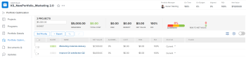

# 找到[!UICONTROL Portfolio最佳化工具]

存取投資組合時，可以找到[!UICONTROL Portfolio Optimizer]。

## 存取權要求

+++ 展開以檢視這篇文章中所述功能的存取權要求。 

<table style="table-layout:auto"> 
 <col> 
 <col> 
 <tbody> 
  <tr> 
   <td role="rowheader">[!DNL Adobe Workfront] 封裝</td> 
   <td> 
Workfront Prime或更高版本

      
工作流程Prime或更高版本

    </td> 
  </tr> 
  <tr> 
   <td role="rowheader">[!DNL Adobe Workfront] 授權</td> 
   <td> 
[!UICONTROL 標準]

   
[!UICONTROL 計畫]
 </td> 
  </tr> 
  <tr> 
   <td role="rowheader">存取層級設定</td> 
   <td> 
[!UICONTROL Edit]對[!UICONTROL Portfolios]和[!UICONTROL Projects]的存取權
  </td>
</tr> 
  <tr> 
   <td role="rowheader">物件許可權</td> 
   <td> 
投資組合的[!UICONTROL Manage]許可權
  </td> 
  </tr> 
 </tbody> 
</table>

*如需詳細資訊，請參閱Workfront檔案中的[存取需求](/help/quicksilver/administration-and-setup/add-users/access-levels-and-object-permissions/access-level-requirements-in-documentation.md)。

+++

<!--
Old:
<table style="table-layout:auto"> 
 <col> 
 <col> 
 <tbody> 
  <tr> 
   <td role="rowheader">[!DNL Adobe Workfront] plan</td> 
   <td> 
Any
 </td> 
  </tr> 
  <tr> 
   <td role="rowheader">[!DNL Adobe Workfront] license*</td> 
   <td> 
New: Standard

   
Current: [!UICONTROL Plan] 
 </td> 
  </tr> 
  <tr> 
   <td role="rowheader">Access level configurations*</td> 
   <td> 
[!UICONTROL Edit] access to Portfolios and Projects
  </td>
</tr> 
  <tr> 
   <td role="rowheader">Object permissions</td> 
   <td> 
[!UICONTROL Manage] permissions to the portfolio
  </td> 
  </tr> 
 </tbody> 
</table>
-->

## 找到[!UICONTROL Portfolio最佳化工具]

1. 從&#x200B;**[!UICONTROL 主功能表]**，按一下&#x200B;**[!UICONTROL 投資組合]**。

   依預設會顯示您擁有的投資組合。

1. （選擇性）從&#x200B;**[!UICONTROL 篩選器]**&#x200B;下拉式功能表中，選取以檢視不同的投資組合組合。
1. 按一下投資組合的名稱以存取它。
1. 按一下左側面板中的&#x200B;**[!UICONTROL Portfolio最佳化]**。

   顯示[!UICONTROL Portfolio Optimizer]。

   
