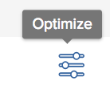

# 在 [!UICONTROL Portfolio優化程式]

您可以使用 [!UICONTROL Portfolio優化程式] 根據專案的分數和其他值排定專案的優先順序。 此 [!UICONTROL Optimizer] 會考慮重要的項目資訊，如成本、協調、風險和ROI，以根據對您來說更重要的內容確定項目的優先順序。

## 存取需求

您必須具備下列存取權，才能執行本文中的步驟：

<table style="table-layout:auto"> 
 <col> 
 <col> 
 <tbody> 
  <tr> 
   <td role="rowheader">[!DNL Adobe Workfront] 計劃*</td> 
   <td> 
[!UICONTROL Business]或更高版本
 </td> 
  </tr> 
  <tr> 
   <td role="rowheader">Adobe Workfront授權*</td> 
   <td> 
[!UICONTROL計畫] 
 </td> 
  </tr> 
  <tr> 
   <td role="rowheader">訪問級別配置*</td> 
   <td> 
[!UICONTROL編輯]對項目和Portfolio的訪問
 
注意：如果您仍無法存取，請詢問您的 [!DNL Workfront] 管理員。 若要了解 [!DNL Workfront] 管理員可修改您的存取層級，請參閱 <a href="../../../administration-and-setup/add-users/configure-and-grant-access/create-modify-access-levels.md" class="MCXref xref">建立或修改自訂存取層級</a>.
 </td> 
  </tr> 
  <tr> 
   <td role="rowheader">物件權限</td> 
   <td> 
產品組合的[!UICONTROL管理]權限
 
為專案貢獻或更高權限
 
有關請求其他訪問的資訊，請參閱 <a href="../../../workfront-basics/grant-and-request-access-to-objects/request-access.md" class="MCXref xref">請求對對象的訪問 </a>.
 </td> 
  </tr> 
 </tbody> 
</table>

&#42;若要了解您擁有的計畫、授權類型或存取權，請聯絡您的 [!DNL Workfront] 管理員。

## 在Portfolio優化程式中最佳化專案

1. 開啟Portfolio，然後按一下 **[!UICONTROL Portfolio最佳化]** 中。

   此 [!UICONTROL Portfolio優化程式] 顯示。

1. 按一下 **[!UICONTROL 最佳化]** 圖示。

   \
   對專案評分的類別會顯示在 [!UICONTROL 最佳化] 表徵圖。

1. 使用滑動圓，修改以下任一類別的最佳化：

   * **[!UICONTROL 低成本]**:將滑桿移至右側，以檢視最下方的專案 [!UICONTROL 計畫成本].
   * **[!UICONTROL 高對齊度]**:將滑桿移至右側，以根據 [!UICONTROL 計分卡].
   * **[!UICONTROL 高價值]**:將滑桿移至右側，以檢視具有較高的專案 [!UICONTROL 淨值] 分數。
   * **[!UICONTROL 低收益風險]**:將滑桿移至右側，即可檢視風險與效益比率最低的專案。
   * **[!UICONTROL 高投資報酬率]**:將滑桿移至右側，即可檢視投資報酬率(ROI)較高的專案。

1. 按一下 **x圖示** 來關閉最佳化類別。

   這會更新 [!UICONTROL 分數] 值 **[!UICONTROL 分數]** 欄。

   如需 [!UICONTROL Portfolio優化程式] 分數，請參閱 [概觀 [!UICONTROL Portfolio優化程式] 分數](../../../manage-work/portfolios/portfolio-optimizer/portfolio-optimizer-score.md).

1. 為 **[!UICONTROL 分數]** 欄，按一下 **[!UICONTROL 分數]** 欄來排序。 分數最高的專案會顯示在清單頂端。

1. （選用）依優先順序拖放專案。\
   這會變更 [!UICONTROL Portfolio優化程式].
1. （選用）按一下 **[!UICONTROL 設定優先順序]** 以儲存專案的新優先順序。\
   如需排定專案優先順序的詳細資訊，請參閱 [!UICONTROL Portfolio優化程式]，請參閱文章 [排定中專案的優先順序 [!UICONTROL Portfolio優化程式]](../../../manage-work/portfolios/portfolio-optimizer/prioritize-projects-in-portfolio-optimizer.md).

1. 按一下 **[!UICONTROL 儲存]** 儲存 [!UICONTROL Portfolio優化程式].
