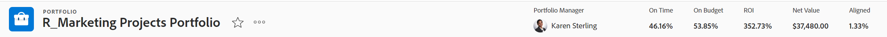

# [!UICONTROL Portfolio最佳化工具]總覽

<!-- Audited: 01/2024 -->

[!UICONTROL Portfolio最佳化工具]是用於專案評估與比較的工具。 針對指派給投資組合的專案複查及比較[!UICONTROL 業務案例]值的程式，就是投資組合經理如何排定專案的優先順序，並為組織產生最大價值的程式。

[!UICONTROL 專案組合最佳化工具]的目的是提供專案組合經理、指導委員會或產品管理辦公室可以透過介面檢視有關每個專案業務案例的摘要資訊。 然後可以根據策略價值和目標，或根據其整體分數，來排定專案的優先順序。

[!UICONTROL Portfolio最佳化工具]只有在您已完成下列先決條件時，才能提供協助：

* 專案上的[!UICONTROL 業務案例]已完成。 如需詳細資訊，請參閱[定義業務案例：文章索引](../../projects/define-a-business-case/define-business-case.md)中的文章。
* 投資組合是在專案詳細資訊區段的專案總覽區域中為您要檢閱的專案定義的。
* 您已針對要複查的專案指明專案預算和計畫收益。 固定成本和固定收入為選用，但可新增額外價值。 如需詳細資訊，請參閱[專案財務欄位](../../projects/project-finances/project-finances-overview-1.md)。

如需有關找到[!UICONTROL Portfolio最佳化工具]的資訊，請參閱[找到[!UICONTROL Portfolio最佳化工具]](../../../manage-work/portfolios/portfolio-optimizer/locate-portfolio-optimizer.md)。

## [!UICONTROL Portfolio最佳化工具]中的財務

使用[!UICONTROL Portfolio最佳化工具]時，您可以在專案期限內隨時檢視投資組合的財務狀態。

在[!UICONTROL Portfolio最佳化工具]中處理財務時，請考量下列事項：

* 當專案的[!UICONTROL 業務案例]根據它們在[!UICONTROL Portfolio最佳化工具]中符合的條件完成時，每個專案都會獲得分數。 例如，低成本或高一致性專案會獲得較高的分數。

  如需有關計算專案的投資組合最佳化工具分數的詳細資訊，請參閱[Portfolio最佳化工具]分數](../../../manage-work/portfolios/portfolio-optimizer/portfolio-optimizer-score.md)的概觀。[!UICONTROL 

* [!UICONTROL Portfolio最佳化工具]的財務計算使用專案[!UICONTROL 業務案例]中的[!UICONTROL 預算成本]。
* 您可以在[!UICONTROL Portfolio最佳化工具]中手動排定專案的優先順序，並考量所有關於專案的資訊。 這包括財務資料、與計分卡的比對方式，以及ROI等。

### [!UICONTROL Portfolio最佳化工具]中的財務區域 {#the-financial-areas-in-the-portfolio-optimizer}

您可以在[!UICONTROL Portfolio最佳化工具]的下列區域中檢視財務資訊：

* **[!UICONTROL Portfolio標題]**：此區域顯示從投資組合中的所有專案收集的財務資訊。 它會顯示在Portfolio物件的每個標籤上。
* **[!UICONTROL 選定專案的Portfolio財務]**：此區域顯示從[!UICONTROL Portfolio最佳化工具]中選取的專案收集的財務資訊。 您可以新增或移除專案，並檢視此區域中的資訊，瞭解這將如何影響投資組合的財務。
* **[!UICONTROL 專案財務]**：此區域顯示[!UICONTROL Portfolio最佳化工具]中列出的每個專案的財務資訊。

### [!UICONTROL Portfolio最佳化工具]中的財務欄位 {#the-financial-fields-in-the-portfolio-optimizer}

下列財務欄位會顯示在[!UICONTROL Portfolio最佳化工具]中：

* [Portfolio標頭](#portfolio-header)
* [Portfolio所選專案的財務](#portfolio-finances-for-selected-projects)

#### Portfolio標頭 {#portfolio-header}

[!DNL Adobe Workfront]使用來自狀態僅等於[!UICONTROL 已核准]或[!UICONTROL 目前]之專案的資訊，計算投資組合標題中的財務欄位。

<table style="table-layout:auto"> 
 <col> 
 <col> 
 <thead> 
  <tr> 
   <th><strong>欄位</strong>的名稱 </th> 
   <th><strong>說明</strong> </th> 
  </tr> 
 </thead> 
 <tbody> 
  <tr> 
   <td>[！UICONTROL開啟時間]</td> 
   <td> 
投資組合中被認為是[！UICONTROL準時]的專案百分比。 投資組合內的任何索引標籤中皆可看見此專案。
 
當專案<strong>[！UICONTROL Condition]</strong>是<strong>[！UICONTROL On Target]</strong>時，會將專案視為[！UICONTROL On Time]。  如需有關[！UICONTROL專案條件的詳細資訊，請參閱文章<a href="../../../manage-work/projects/manage-projects/project-condition-and-condition-type.md" class="MCXref xref">專案條件和條件型別概觀</a>。
 
<strong>[！UICONTROL On Time]</strong>百分比的計算公式如下：
 
<em>[！UICONTROL On TimePortfolio百分比] =處於[！UICONTROL Current]或[！UICONTROL Approved]狀態的[！UICONTROL On Time]專案數目/專案總數</em> 
 </td> 
  </tr> 
  <tr> 
   <td>[！UICONTROL預算]</td> 
   <td> 
投資組合中被認為是[！UICONTROL符合預算]的專案百分比。 這可從[！UICONTROL產品組合]內的任何索引標籤看到。
 
專案未超過其預先定義的預算時，則為<strong>[！UICONTROL On Budget]</strong>。  如需有關專案預算的詳細資訊，請參閱專案財務區域</a>中的文章<a href="../../../manage-work/projects/project-finances/manage-project-finance-area.md" class="MCXref xref">[！UICONTROL Manage]資訊。
 
使用下列公式計算[！UICONTROL On Budget]百分比：
 
<em>[！UICONTROL On BudgetPortfolio百分比] =預算上的[！UICONTROL]專案數目/專案總數</em><em>處於[！UICONTROL目前]或[！UICONTROL已核准]狀態</em> 
 </td> 
  </tr> 
  <tr> 
   <td>ROI （適用於投資組合）</td> 
   <td> 
投資組合的[！UICONTROL投資報酬率] (ROI)的計算方式，是考量[！UICONTROLPortfolio]的[！UICONTROL收益]總計和專案的[！UICONTROL預算成本]總計。 投資組合內的任何索引標籤中皆可看見此專案。
 
PortfolioROI值使用下列公式計算：
 
<em>PortfolioROI = （[！UICONTROL總收益] - [！UICONTROL總預算成本]）/[！UICONTROL總成本] * 100</em> 
 
如需如何計算專案投資報酬率的詳細資訊，請參閱文章<a href="../../../manage-work/projects/project-finances/calculate-roi.md" class="MCXref xref">計算投資報酬率(ROI)</a>。
 </td> 
  </tr> 
  <tr> 
   <td>[！UICONTROL Aligned]或[！UICONTROL Alignment Score] </td> 
   <td> 
所有[！UICONTROL專案一致性分數]值的平均值，計算方式為完成專案之[！UICONTROL Business Case]中的[！UICONTROL Scorecard]之後。 每個專案的對齊分數列在[！UICONTROLPortfolio最佳化程式]的[！UICONTROL對齊]欄。 投資組合內的任何索引標籤中皆可看見此專案。
 
如需有關產生專案對齊分數的詳細資訊，請參閱文章<a href="../../../manage-work/projects/define-a-business-case/apply-scorecard-to-project-to-generate-alignment-score.md" class="MCXref xref">將計分卡套用至專案並產生對齊分數</a>。
 </td> 
  </tr> 
  <tr> 
   <td>[！UICONTROL淨值]</td> 
   <td> 
投資組合中所有專案的所有[！UICONTROL淨值]的總和。 投資組合內的任何索引標籤中皆可看見此專案。
 
如需有關如何為專案計算[！UICONTROL淨值]的詳細資訊，請參閱文章<a href="../../../manage-work/projects/project-finances/calculate-net-value.md" class="MCXref xref">計算淨值</a>。
 </td> 
  </tr> 
 </tbody> 
</table>

#### Portfolio所選專案的財務 {#portfolio-finances-for-selected-projects}

<table style="table-layout:auto"> 
 <col> 
 <col> 
 <thead> 
  <tr> 
   <th><strong>欄位</strong>的名稱 </th> 
   <th><strong>說明</strong></th> 
  </tr> 
 </thead> 
 <tbody> 
  <tr> 
   <td>[！UICONTROL專案數目]</td> 
   <td> 
投資組合中作用中專案的總數。 在投資組合中被視為有效的專案可以處於以下任何狀態：
 
    <ul> 
     <li>[！UICONTROL目前]</li> 
     <li>[！UICONTROL規劃]</li> 
     <li>[！UICONTROL已核准]</li> 
    </ul> </td> 
  </tr> 
  <tr> 
   <td>[！UICONTROL預算]</td> 
   <td>您可以手動更新此欄位，以指出整個投資組合的總預算。 此預算用於投資組合內的所有專案。 </td> 
  </tr> 
  <tr> 
   <td>[！UICONTROL剩餘]</td> 
   <td> 
產品組合內所有專案的所有[！UICONTROL預算成本]之後的剩餘預算，已從產品組合的預算中扣除。
 
使用以下公式計算[！UICONTROL剩餘Portfolio預算]：
 
<em>[！UICONTROL剩餘Portfolio預算] = [！UICONTROLPortfolio預算總計] — 所有Portfolio專案的[！UICONTROL預算成本]總計</em> 
 
投資組合中所有專案的整體[！UICONTROL預算成本]會顯示在「預算」欄位下的指標列中。 
 
如需有關追蹤專案成本的詳細資訊，請參閱<a href="../../../manage-work/projects/project-finances/track-costs.md" class="MCXref xref">追蹤成本</a>。
 </td> 
  </tr> 
  <tr> 
   <td>[！UICONTROL總成本]</td> 
   <td> 
在[！UICONTROLPortfolio最佳化工具]中顯示的所有專案成本總和。 每個專案的成本與專案的[！UICONTROL預算成本]相同，因為它顯示在[！UICONTROL業務案例摘要]中。 
 
如需有關[！UICONTROL業務案例中專案之財務欄位的詳細資訊，請參閱<a href="../../../manage-work/projects/define-a-business-case/create-business-case.md" class="MCXref xref">建立專案的業務案例</a>一文中的「瞭解業務案例中的財務欄位」一節。
 </td> 
  </tr> 
  <tr> 
   <td>[！UICONTROL風險] </td> 
   <td> 
投資組合中所有專案的所有[！UICONTROL潛在風險成本]總和。 每個專案的[！UICONTROL潛在風險成本]列於[！UICONTROLPortfolio最佳化工具]的[！UICONTROL風險]欄。 
 
如需有關計算專案風險的詳細資訊，請參閱文章<a href="../../../manage-work/projects/project-finances/potential-risk-cost.md" class="MCXref xref">計算潛在風險成本</a>。
 </td> 
  </tr> 
  <tr> 
   <td>[！UICONTROL優點]</td> 
   <td> 
投資組合中所有專案的所有[！UICONTROL計畫收益]值的總和。 每個專案的計畫收益值都列在[！UICONTROLPortfolio最佳化工具]的[！UICONTROL收益]欄中。 
 
如需有關專案[！UICONTROL計畫收益]的詳細資訊，請參閱文章<a href="../../../manage-work/projects/project-finances/project-planned-benefit.md" class="MCXref xref">專案計畫收益概觀</a>。
 </td> 
  </tr> 
  <tr> 
   <td>[！UICONTROL淨值風險]指標</td> 
   <td> 
測量由[！UICONTROL潛在風險]值，考量投資組合中所有專案提供的[！UICONTROL淨值]。 為了在產品組合內達到最佳效率，您想要瞭解[！UICONTROL風險]指標低而[！UICONTROL淨值]指標高。 
 
如需有關計算[！UICONTROL淨值的風險的詳細資訊，請參閱文章<a href="../../../manage-work/portfolios/portfolio-optimizer/calculate-risk-to-net-value-in-portfolio.md" class="MCXref xref">計算投資組合中淨值的風險</a>。
 </td> 
  </tr> 
 </tbody> 
</table>

## 自訂[!UICONTROL Portfolio最佳化工具]

您只能使用設定來變更清單中的資訊，以自訂[!UICONTROL Portfolio最佳化工具]的專案清單區域。

下列圖示和選項適用於[!UICONTROL Portfolio最佳化工具]：

<table style="table-layout:auto"> 
 <col> 
 <col> 
 <col> 
 <tbody> 
  <tr> 
   <td><strong>Portfolio最佳化工具中的圖示</strong></td> 
   <td><strong>姓名</strong></td> 
   <td><strong>函數</strong></td> 
  </tr> 
  <tr> 
   <td>  </td> 
   <td>[！UICONTROL設定專案優先順序]</td> 
   <td>當您想要根據優先順序儲存專案順序時，請使用此圖示。 </td> 
  </tr> 
  <tr> 
   <td>  </td> 
   <td>[！UICONTROL最佳化產品組合]</td> 
   <td>使用此圖示可根據專案的下列財務值最佳化投資組合：
    <ul>
     <li>[！UICONTROL成本]</li>
     <li>[！UICONTROL對齊]</li>
     <li>[！UICONTROL值]</li>
     <li>[！UICONTROL收益風險]</li>
     <li>[！UICONTROL ROI]</li>
    </ul>
如需最佳化投資組合的詳細資訊，請參閱文章<a href="../../../manage-work/portfolios/portfolio-optimizer/optimize-projects-in-portfolio-optimizer.md" class="MCXref xref">在[！UICONTROLPortfolio最佳化工具]</a>中最佳化專案。
</td> 
  </tr> 
  <tr> 
   <td>  </td> 
   <td>[！UICONTROL還原]/ [！UICONTROL重做]圖示</td> 
   <td>使用這些圖示可在儲存前取消或重做您對[！UICONTROLPortfolio最佳化工具]所做的變更。</td> 
  </tr> 
  <tr> 
   <td>  </td> 
   <td>[！UICONTROL Show]/[！UICONTROL Hide]未勾選的專案</td> 
   <td>使用這些圖示可顯示或隱藏您取消核取之投資組合中的專案。</td> 
  </tr> 
  <tr> 
   <td>  </td> 
   <td>[！UICONTROL Export] </td> 
   <td> 
使用此圖示可匯出[！UICONTROLPortfolio最佳化工具]的[！UICONTROL專案優先順序]區域中的資料。 您可以將其匯出為下列格式：
 
    <ul> 
     <li>PDF</li> 
     <li>[!DNL Excel]</li> 
     <li>[！UICONTROL Tab]分隔</li> 
    </ul> </td> 
  </tr> 
  <tr> 
   <td>  </td> 
   <td>[！UICONTROL喜好設定]</td> 
   <td> 
使用此圖示可修改[！UICONTROLPortfolio最佳化工具]欄中顯示的專案欄位，或根據專案狀態修改您在[！UICONTROL最佳化工具]中顯示的專案。 
 
秘訣：  
     <ul> 
      <li> 
並非所有[!DNL Workfront]標準欄位都可在欄中新增。 
 </li> 
     </ul> 
     <ul> 
      <li> 
您只能在投資組合的任何專案中新增具有非零值的自訂欄位。
 </li> 
     </ul> 
 </td> 
  </tr> 
 </tbody> 
</table>
