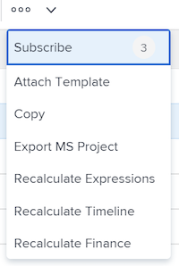

# 將範本附加至專案

<!-- Audited: 10/2025 -->

您可以在專案的初始建立階段或建立專案後，將範本附加至專案。

如需使用範本建立專案的詳細資訊，請參閱[使用範本建立專案](../../../manage-work/projects/create-projects/create-project-from-template.md)。

## 存取權要求

+++ 展開以檢視這篇文章中所述功能的存取權要求。

<table style="table-layout:auto"> 
 <col> 
 <col> 
 <tbody> 
  <tr> 
   <td role="rowheader">Adobe Workfront 封裝</td> 
   <td> 
任何
 </td> 
  </tr> 
  <tr> 
   <td role="rowheader">Adobe Workfront授權</td> 
   <td> 
標準

    
規劃

    
 </td> 
  </tr> 
  <tr> 
   <td role="rowheader">存取層級設定</td> 
   <td> 
編輯專案的存取權 
 
檢視範本的存取權
</td> 
  </tr> 
  <tr> 
   <td role="rowheader">物件許可權</td> 
   <td> 
管理專案的許可權
 
檢視範本的許可權或更高版本
 </td> 
  </tr> 
 </tbody> 
</table>

如需有關此表格的詳細資訊，請參閱Workfront檔案中的[存取需求](/help/quicksilver/administration-and-setup/add-users/access-levels-and-object-permissions/access-level-requirements-in-documentation.md)。

+++

<!--Old:
 
 <table style="table-layout:auto"> 
 <col> 
 <col> 
 <tbody> 
  <tr> 
   <td role="rowheader">Adobe Workfront plan</td> 
   <td> 
Any 
 </td> 
  </tr> 
  <tr> 
   <td role="rowheader">Adobe Workfront license</td> 
   <td> 
New: Standard

   
Or

   
Current: Plan

    
 </td> 
  </tr> 
  <tr> 
   <td role="rowheader">Access level configurations</td> 
   <td> 
Edit access to Projects 
 
For information about project access, see <a href="../../../administration-and-setup/add-users/configure-and-grant-access/grant-access-projects.md" class="MCXref xref">Grant access to projects</a>.
 
View access to&nbsp;Templates
 
For information about template permissions, see <a href="../../../workfront-basics/grant-and-request-access-to-objects/share-a-template.md" class="MCXref xref">Share a template</a>. 
 
For information about template access, see <a href="../../../administration-and-setup/add-users/configure-and-grant-access/grant-access-templates.md" class="MCXref xref">Grant access to templates</a>.
 
Note: If you still don't have access, ask your Workfront administrator if they set additional restrictions in your access level. For information on how a Workfront administrator can modify your access level, see <a href="../../../administration-and-setup/add-users/configure-and-grant-access/create-modify-access-levels.md" class="MCXref xref">Create and modify custom access levels</a>.
 </td> 
  </tr> 
  <tr> 
   <td role="rowheader">Object permissions</td> 
   <td> 
Manage permissions to the project
 
For information about project permissions, see <a href="../../../workfront-basics/grant-and-request-access-to-objects/share-a-project.md" class="MCXref xref">Share a project in Adobe Workfront</a>. 
 
View permissions or higher to the template
 
For information on requesting additional access, see <a href="../../../workfront-basics/grant-and-request-access-to-objects/request-access.md" class="MCXref xref">Request access to objects </a>.
 </td> 
  </tr> 
 </tbody> 
</table>-->

<!--

<h2>Considerations when adding templates to projects</h2>

(NOTE: moved this to an Overview article of its own) 

Consider the following when adding templates to projects:

<ul>
<li> 
You can attach only active templates to projects. 
 </li>
<li> 
You can attach a template to a project when the project is in a status of Complete, Dead, or in Pending Approval, only when your Adobe Workfront administrator or a group administrator has enabled this functionality in the Project&nbsp;Preferences area. For information about setting project preferences, see <a href="../../../administration-and-setup/set-up-workfront/configure-system-defaults/set-project-preferences.md" class="MCXref xref">Configure system-wide project preferences</a>. 
 </li>
<li> 
Unless you exclude specific template tasks from being added in the attachment process, all template tasks are added to the existing project. 
 </li>
<li> 
Most template settings are added to the project. 
 </li>
<li> 
Some settings from the template automatically transfer to the project, unless you specifically mark them to be excluded. 

Example: </b>">
<b>Example: </b>

For example, these settings are added to the project:

<ul>
<li>Start&nbsp;From field</li>
<li>Custom forms and the information on them</li>
<li>Queue Details </li>
<li>Financial settings </li>
</ul>

 </li>
</ul>

-->

## 將範本附加至現有專案 {#attach-a-template-to-an-existing-project}

您可以從專案頁面、專案清單或報表將範本附加至專案。

{{step1-to-projects}}

1. 在&#x200B;**專案**&#x200B;頁面上，選取您要附加範本的專案。

1. 按一下專案名稱右側的&#x200B;**更多**&#x200B;圖示。

   

   或

   前往專案清單或報告並選取專案，然後按一下清單頂端的&#x200B;**更多**&#x200B;圖示下拉式清單。

   

1. 按一下&#x200B;**附加範本**。 顯示&#x200B;**附加範本**&#x200B;方塊。

1. 開始在&#x200B;**搜尋範本**&#x200B;欄位中輸入您要附加的範本名稱，然後當它顯示在清單中時按一下它。

   或

   按一下&#x200B;**其他範本**&#x200B;區域中的範本名稱。

   範本的預覽顯示在右側，其中包含下列範本的相關資訊：

   * 期間
   * 所有者
   * 最上層作業的數目（包括前3個最上層作業的清單）
   * 任務總數
   * 附加自訂表單的名稱

   

1. （選擇性）按一下範本名稱右側的&#x200B;**我的最愛**&#x200B;圖示，將其標示為我的最愛，並將其移至&#x200B;**我的最愛**&#x200B;清單。

1. （選擇性）再次按一下&#x200B;**我的最愛**&#x200B;圖示以從&#x200B;**我的最愛**&#x200B;清單中移除它。
1. 按一下&#x200B;**自訂並附加**。 **附加範本**&#x200B;側面板開啟。

1. （可選）更新下列區段中的資訊：

   <table style="table-layout:auto"> 
    <col> 
    <col> 
    <tbody> 
     <tr> 
      <td role="rowheader" colspan="2"> 
任務區段
 
  
 </td> 
     </tr> 
     <tr> 
      <td role="rowheader">以下選取的範本任務已匯入至專案。 取消選取您要排除的專案。 </td> 
      <td>
在將範本附加到專案之前，取消選取您要從範本排除的任何任務。

      
<b>秘訣</b>

      
您只能選擇一個任務。

      </td> 
     </tr> 
     <tr> 
      <td role="rowheader">選取您想要作為此範本中任務的前置任務的專案任務。</td> 
      <td> 
按一下欄位方塊以顯示專案任務清單，然後選取在範本任務可以開始之前必須完成的任務。 或者，您可以略過此步驟，並在附加範本後在專案中設定關係。 
 
 選取<strong>相依性型別</strong>、<strong>延遲時間</strong>資訊，如果您要透過勾選<strong>強制執行前置任務</strong>核取方塊來強制執行前置任務，請選取。 
 </td> 
     </tr> 
     <tr> 
      <td role="rowheader">選取您想要當作此範本中任務之父系的專案任務。</td> 
      <td> 
選取您想要指定為所有範本任務之父系任務的專案任務。 如果您未進行選取，所有範本任務都會顯示在目前專案任務的結尾。 您可以略過此步驟，並在附加範本後移動專案中的任務。

      
<b>附註</b>

      
如果您選取了具有其他子系的父項範本任務，則只有父項會在將專案任務新增至專案後，顯示為其前置任務。 子範本任務不會顯示前置任務。

      
如果您只選取了子範本任務，則專案任務新增至專案後，將顯示為其前置任務。 

   </td> 
     </tr> 
     <tr> 
      <td role="rowheader" colspan="2"> 
選項區段
 
  
 </td> 
     </tr> 
     <tr> 
      <td role="rowheader">以下選取的專案會傳輸到專案。 取消選取您要排除的專案。</td> 
      <td> 
取消選取您想要從範本中排除的任何資訊核取方塊，然後再將其附加至專案。 如需每個欄位的詳細資訊，請參閱<a href="../../../manage-work/projects/create-and-manage-templates/attach-template-to-project-overview.md" class="MCXref xref">將範本附加到專案的概觀</a>。 
 
重要：如果您勾選<strong>佇列屬性和問題設定</strong>方塊，範本的佇列詳細資料會覆寫專案的佇列詳細資訊。 在這種情況下，範本的路由規則、佇列主題和主題群組會新增至專案的路由規則、佇列主題和主題群組。  如果專案設定為請求佇列，而您附加至專案的範本未設定為請求佇列，則若您保留<strong>佇列屬性和問題設定</strong>核取方塊，專案的佇列資訊將會移除。  如果您取消選取<strong>佇列屬性和問題設定</strong>方塊，則會保留專案的所有佇列設定設定，且不會附加範本中的佇列設定設定。 
 </td> 
     </tr> 
     <tr> 
      <td role="rowheader" colspan="2"> 
自訂Forms區段
 
  
 </td> 
     </tr> 
     <tr> 
      <td role="rowheader">自訂Forms</td> 
      <td> 
當自訂表單附加到範本時，其名稱會顯示在左側面板中。 
 </td> 
     </tr> 
    </tbody> 
   </table>

1. （選用）更新自訂表單中的資訊。 此資訊會傳輸到專案。

   >[!TIP]
   >
   >* 當範本上的自訂表單包含空白的必填欄位時，此步驟為必要步驟。
   >* 如果範本自訂表單中的欄位已存在於專案中並包含資訊，則這些欄位會保留專案中已存在的資訊。 附加範本時無法編輯它們。

1. 按一下&#x200B;**附加範本。**
1. 按一下&#x200B;**取消附件**&#x200B;以停止附加範本。

   或

   允許附件完成以將範本新增至專案。

   附加範本後，您可以編輯專案並視需要調整任何任務、資訊或設定。

1. （選擇性）在左側面板中，按一下&#x200B;**專案詳細資料**，然後按一下&#x200B;**總覽**，以檢視您在&#x200B;**專案關係**&#x200B;區域中附加的範本名稱。

   >[!TIP]
   >
   >如果您將多個範本附加至專案，則只有您先附加的範本才會顯示在此欄位中。 如需相關資訊，請參閱本文中的[將多個範本附加至現有專案並檢視範本資訊](#attach-multiple-templates-to-an-existing-project-and-view-template-information)一節。

1. （可選）從您附加範本的專案中移除範本資訊。 如需詳細資訊，請參閱[從專案移除範本資訊](../../../manage-work/projects/create-and-manage-templates/remove-template-from-project.md)。

## 將多個範本附加至現有專案並檢視範本資訊 {#attach-multiple-templates-to-an-existing-project-and-view-template-information}

您可以依照本文[將範本附加到現有專案](#attach-a-template-to-an-existing-project)一節中所述的步驟，將多個範本（一次一個）附加到相同專案。 這會將每個範本的任務和其他資訊新增至專案。

>[!TIP]
>
>當您將多個範本附加到專案時，只有您先附加的範本才會顯示在專案詳細資訊區域中。

若要檢視套用至專案的範本，請執行下列動作：

{{step1-to-projects}}

1. 在&#x200B;**專案**&#x200B;頁面上，選取具有附加範本的專案。

1. 按一下左側面板中的&#x200B;**專案詳細資料**。

1. 在&#x200B;**專案關係**&#x200B;底下的&#x200B;**總覽**&#x200B;區段底部的&#x200B;**範本**&#x200B;欄位中，找出附加至專案的範本名稱。

   

