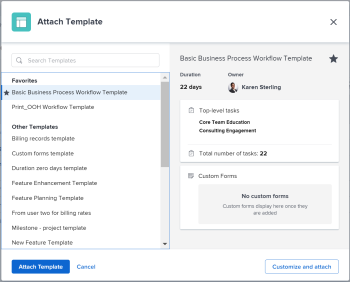
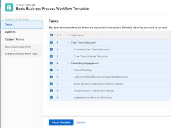
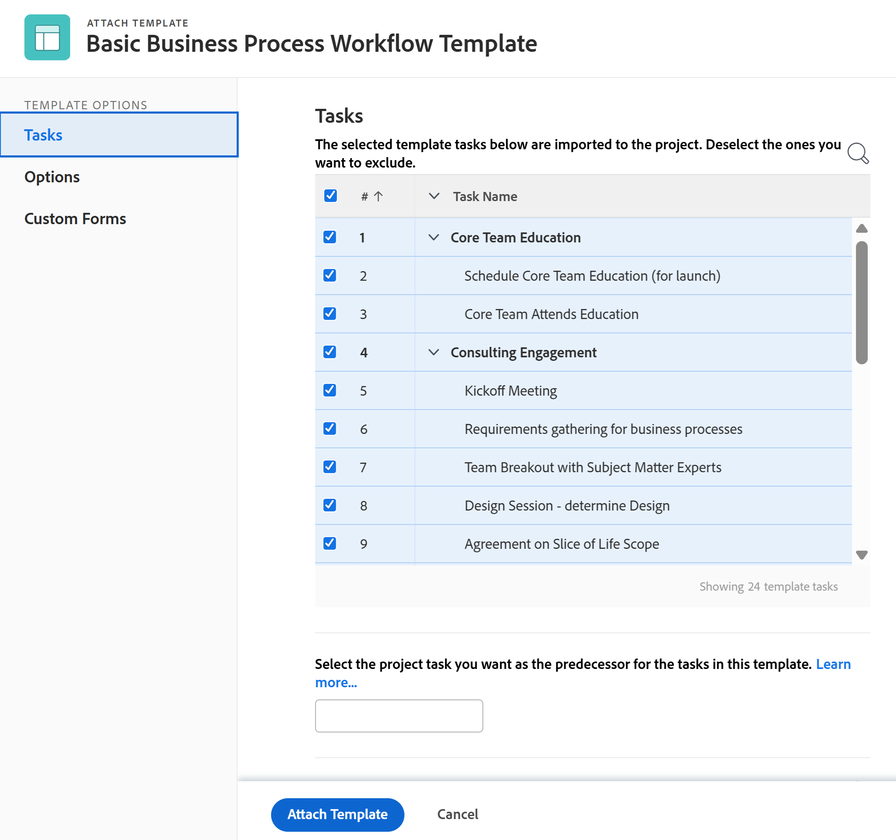
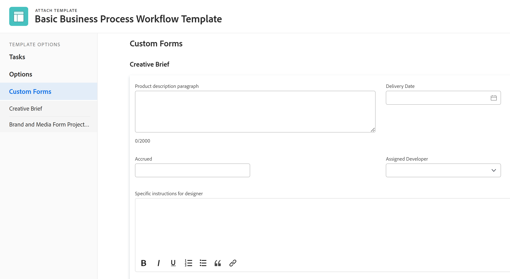

# 將範本附加至專案

您可以在專案的初始建立階段期間或建立專案後，將範本附加至專案。

如需使用範本建立專案的詳細資訊，請參閱 [使用範本建立專案](../../../manage-work/projects/create-projects/create-project-from-template.md).

## 存取需求

您必須具備下列專案才能執行本文所述的步驟：

<table style="table-layout:auto"> 
 <col> 
 <col> 
 <tbody> 
  <tr> 
   <td role="rowheader">Adobe Workfront計畫*</td> 
   <td> 
任何 
 </td> 
  </tr> 
  <tr> 
   <td role="rowheader">Adobe Workfront授權*</td> 
   <td> 
計劃 
 </td> 
  </tr> 
  <tr> 
   <td role="rowheader">存取層級設定*</td> 
   <td> 
編輯專案的存取權 
 
如需有關專案存取許可權的資訊，請參閱 <a href="../../../administration-and-setup/add-users/configure-and-grant-access/grant-access-projects.md" class="MCXref xref">授予專案存取權</a>.
 
檢視範本的存取權
 
如需範本許可權的相關資訊，請參閱 <a href="../../../workfront-basics/grant-and-request-access-to-objects/share-a-template.md" class="MCXref xref">共用範本</a>. 
 
如需關於範本存取許可權的資訊，請參閱 <a href="../../../administration-and-setup/add-users/configure-and-grant-access/grant-access-templates.md" class="MCXref xref">授予範本存取權</a>.
 
注意：如果您還是沒有存取權，請詢問您的Workfront管理員，他們是否在您的存取層級中設定其他限制。 如需有關Workfront管理員如何修改您的存取層級的資訊，請參閱 <a href="../../../administration-and-setup/add-users/configure-and-grant-access/create-modify-access-levels.md" class="MCXref xref">建立或修改自訂存取層級</a>.
 </td> 
  </tr> 
  <tr> 
   <td role="rowheader">物件許可權</td> 
   <td> 
管理專案的許可權
 
如需有關專案許可權的資訊，請參閱 <a href="../../../workfront-basics/grant-and-request-access-to-objects/share-a-project.md" class="MCXref xref">在Adobe Workfront中共用專案</a>. 
 
檢視範本的許可權或更高版本
 
如需請求其他存取許可權的詳細資訊，請參閱 <a href="../../../workfront-basics/grant-and-request-access-to-objects/request-access.md" class="MCXref xref">要求物件的存取權 </a>.
 </td> 
  </tr> 
 </tbody> 
</table>

&#42;若要瞭解您擁有的計畫、授權型別或存取權，請聯絡您的Workfront管理員。

<!--

<h2>Considerations when adding templates to projects</h2>

(NOTE: moved this to an Overview article of its own) 

Consider the following when adding templates to projects:

<ul>
<li> 
You can attach only active templates to projects. 
 </li>
<li> 
You can attach a template to a project when the project is in a status of Complete, Dead, or in Pending Approval, only when your Adobe Workfront administrator or a group administrator has enabled this functionality in the Project&nbsp;Preferences area. For information about setting project preferences, see <a href="../../../administration-and-setup/set-up-workfront/configure-system-defaults/set-project-preferences.md" class="MCXref xref">Configure system-wide project preferences</a>. 
 </li>
<li> 
Unless you exclude specific template tasks from being added in the attachment process, all template tasks are added to the existing project. 
 </li>
<li> 
Most template settings are added to the project. 
 </li>
<li> 
Some settings from the template automatically transfer to the project, unless you specifically mark them to be excluded. 

Example: </b>">
<b>Example: </b>

For example, these settings are added to the project:

<ul>
<li>Start&nbsp;From field</li>
<li>Custom forms and the information on them</li>
<li>Queue Details </li>
<li>Financial settings </li>
</ul>

 </li>
</ul>

-->

## 將範本附加至現有專案 {#attach-a-template-to-an-existing-project}

您可以從專案頁面或專案清單或報表，將範本附加至Workfront中的專案。

1. 前往您要附加範本的專案，然後按一下 **更多** 圖示  專案名稱右側

   

   或

   前往專案清單或報告，然後選取專案並按一下 **更多** 圖示  在清單頂端。

   

1. 按一下 **附加範本**.

   「附加範本」方塊隨即顯示。

1. 開始輸入您想要附加到的範本名稱 **搜尋範本** 欄位，然後在清單中顯示時按一下它。

   或

   按一下中範本的名稱 **其他範本** 區域。

   範本的預覽顯示在右側，其中包含下列範本的相關資訊：

   * 期間
   * 所有者
   * 最上層作業的數目（包含前三個最上層作業的清單）
   * 任務總數
   * 附加自訂表單的名稱

   

1. （可選）按一下 **我的最愛** 圖示  範本名稱的左側，將其標示為我的最愛。 這會將範本移到「我的最愛」清單中。

   

1. （可選）按一下 **我的最愛** 圖示  再次將它從「我的最愛」清單中移除。
1. 按一下 **自訂並附加**.

   

1. 在附加範本之前，更新以下區段中的資訊(或者，按一下 **附加範本** 隨時)：

   <table style="table-layout:auto"> 
    <col> 
    <col> 
    <tbody> 
     <tr> 
      <td role="rowheader" colspan="2"> 
任務區段
 
  
 </td> 
     </tr> 
     <tr> 
      <td role="rowheader">以下選取的範本任務已匯入至專案。 取消選取您要排除的專案。 </td> 
      <td>在將範本附加到專案之前，取消選取您要從範本排除的任何任務。</td> 
     </tr> 
     <tr> 
      <td role="rowheader">選取您想要作為此範本中任務的前置任務的專案任務。</td> 
      <td> 
按一下欄位以顯示專案任務清單。 選取您要在範本任務開始前完成的專案任務。 或者，您可以略過此步驟，並在附加範本後在專案中設定關係。 
 
 選取 <strong>相依性型別</strong>， <strong>延遲</strong> 資訊，以及您是否希望前置任務成為 <strong>強制</strong> 也可能不會。 
 </td> 
     </tr> 
     <tr> 
      <td role="rowheader">選取您想要當作此範本中任務之父系的專案任務。</td> 
      <td> 選取您想要指定為所有範本任務之父系任務的專案任務。 如果您未進行選取，則所有範本任務都會顯示在目前專案任務的結尾。 您可以略過此步驟，並在附加範本後移動專案中的任務。</td> 
     </tr> 
     <tr> 
      <td role="rowheader" colspan="2"> 
選項區段
 
  
 </td> 
     </tr> 
     <tr> 
      <td role="rowheader">以下選取的專案會傳輸到專案。 取消選取您要排除的專案。</td> 
      <td> 
取消選取您想要從範本中清除的任何資訊旁的核取方塊，然後再將其附加至專案。 此資訊不會從範本傳輸到專案。 如需每個欄位的詳細資訊，請參閱 <a href="../../../manage-work/projects/create-and-manage-templates/attach-template-to-project-overview.md" class="MCXref xref">將範本附加至專案的概觀</a>. 
 
重要：如果您檢查 <strong>佇列屬性和問題設定</strong> 方塊中，範本的佇列詳細資料會覆寫專案的佇列詳細資訊。 在這種情況下，範本的路由規則、佇列主題和主題群組會新增至專案的路由規則、佇列主題和主題群組。  如果專案設定為請求佇列，而您附加至專案的範本未設定為請求佇列，則當您離開 <strong>佇列屬性和問題設定</strong> 方塊已核取。  如果您取消選取 <strong>佇列屬性和問題設定</strong> 方塊中，會保留專案的所有佇列設定設定，而不會附加範本中的佇列設定設定。 
 </td> 
     </tr> 
     <tr> 
      <td role="rowheader" colspan="2"> 
自訂Forms區段
 
  
 </td> 
     </tr> 
     <tr> 
      <td role="rowheader">自訂Forms</td> 
      <td> 
當自訂表單附加到範本時，其名稱會顯示在左側面板中。 
 </td> 
     </tr> 
    </tbody> 
   </table>

1. （選用）更新自訂表單中的資訊。 此資訊會傳輸到專案。

   >[!TIP]
   >
   >* 當範本上的自訂表單包含空白的必填欄位時，此步驟為必要步驟。
   >* 如果範本自訂表單中的欄位已存在於專案中並包含資訊，則這些欄位會保留專案中已存在的資訊。 您無法在附加範本期間編輯它們。

1. 按一下 **附加範本。**
1. 按一下 **取消附件** 以停止附加範本。

   或

   允許附件完成以將範本新增至專案。

   附加範本後，您可以編輯專案並視需要調整任何任務、資訊或設定。

1. （選用）按一下 **專案詳細資訊**，然後 **概觀** 若要檢視您附加在中的範本名稱， **專案關係** 區域。

   >[!TIP]
   >
   >如果您將多個範本附加至專案，則此欄位只會顯示您先附加的範本。 如需詳細資訊，請參閱 [將多個範本附加至現有專案並檢視範本資訊](#attach-multiple-templates-to-an-existing-project-and-view-template-information) 一節。

1. （可選）從您附加範本的專案中移除範本資訊。 如需詳細資訊，請參閱 [從專案移除範本資訊](../../../manage-work/projects/create-and-manage-templates/remove-template-from-project.md).

## 將多個範本附加至現有專案並檢視範本資訊 {#attach-multiple-templates-to-an-existing-project-and-view-template-information}

您可以依照一節中所述的步驟，將多個範本（一次一個）附加至相同專案 [將範本附加至現有專案](#attach-a-template-to-an-existing-project) 本文章內容。 這會將每個範本的任務和其他資訊新增至專案。

>[!TIP]
>
>當您將多個範本附加到專案時，只有您首先附加的範本會顯示在「專案詳細資訊」區域中。

若要瞭解將哪些範本套用至專案：

1. 導覽至附加了範本的專案。
1. 按一下 **專案詳細資訊** 在左側面板中。
1. 在中尋找附加至專案的範本名稱 **範本** 底部欄位 **概觀** 區段在 **專案關係** .

   

