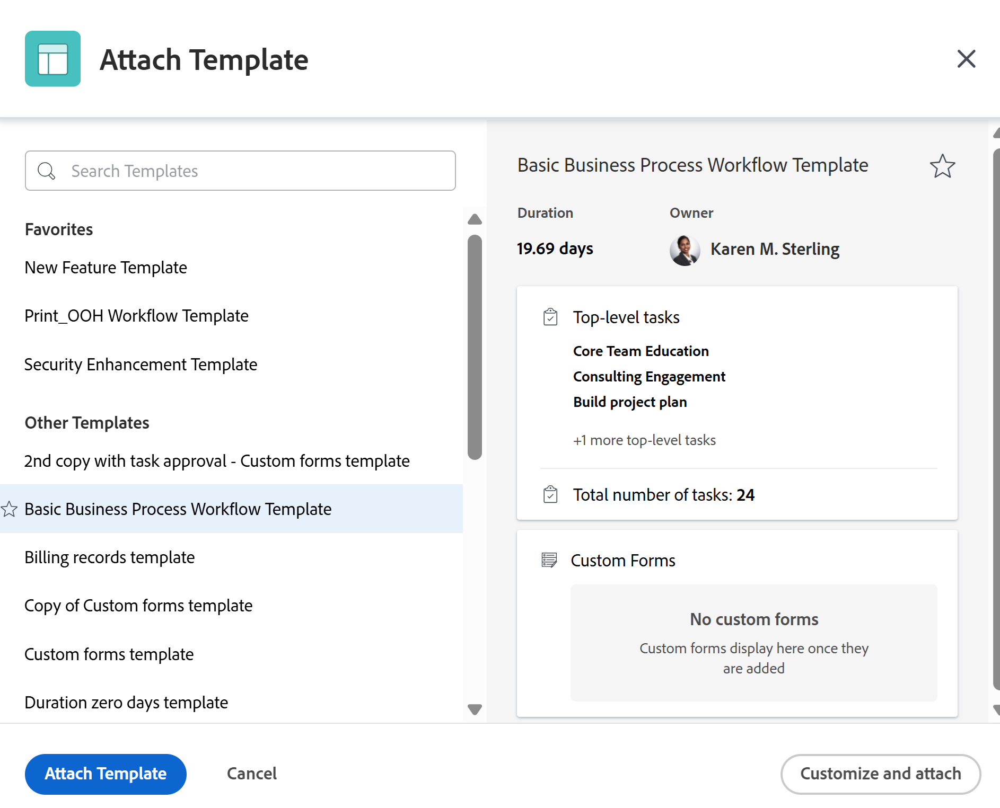

# 將範本附加至專案

您可以在項目的初始建立階段或項目建立後將模板附加到項目。

如需使用範本建立專案的詳細資訊，請參閱 [使用範本建立專案](../../../manage-work/projects/create-projects/create-project-from-template.md).

## 存取需求

您必須具備下列條件才能執行本文所述步驟：

<table style="table-layout:auto"> 
 <col> 
 <col> 
 <tbody> 
  <tr> 
   <td role="rowheader">Adobe Workfront計畫*</td> 
   <td> 
任何 
 </td> 
  </tr> 
  <tr> 
   <td role="rowheader">Adobe Workfront授權*</td> 
   <td> 
計劃 
 </td> 
  </tr> 
  <tr> 
   <td role="rowheader">訪問級別配置*</td> 
   <td> 
編輯專案的存取權 
 
如需專案存取的相關資訊，請參閱 <a href="../../../administration-and-setup/add-users/configure-and-grant-access/grant-access-projects.md" class="MCXref xref">授予專案的存取權</a>.
 
檢視範本的存取權
 
如需範本權限的相關資訊，請參閱 <a href="../../../workfront-basics/grant-and-request-access-to-objects/share-a-template.md" class="MCXref xref">共用範本</a>. 
 
如需範本存取的相關資訊，請參閱 <a href="../../../administration-and-setup/add-users/configure-and-grant-access/grant-access-templates.md" class="MCXref xref">授予範本的存取權</a>.
 
注意：如果您仍無權存取，請洽詢您的Workfront管理員，他們是否在您的存取層級設定其他限制。 如需Workfront管理員如何修改您的存取層級的詳細資訊，請參閱 <a href="../../../administration-and-setup/add-users/configure-and-grant-access/create-modify-access-levels.md" class="MCXref xref">建立或修改自訂存取層級</a>.
 </td> 
  </tr> 
  <tr> 
   <td role="rowheader">物件權限</td> 
   <td> 
管理專案的權限
 
如需專案權限的相關資訊，請參閱 <a href="../../../workfront-basics/grant-and-request-access-to-objects/share-a-project.md" class="MCXref xref">在Adobe Workfront中共用專案</a>. 
 
檢視範本的權限或更高權限
 
有關請求其他訪問的資訊，請參閱 <a href="../../../workfront-basics/grant-and-request-access-to-objects/request-access.md" class="MCXref xref">請求對對象的訪問 </a>.
 </td> 
  </tr> 
 </tbody> 
</table>

&#42;若要了解您擁有的計畫、授權類型或存取權，請聯絡您的Workfront管理員。

<!--

<h2>Considerations when adding templates to projects</h2>

(NOTE: moved this to an Overview article of its own) 

Consider the following when adding templates to projects:

<ul>
<li> 
You can attach only active templates to projects. 
 </li>
<li> 
You can attach a template to a project when the project is in a status of Complete, Dead, or in Pending Approval, only when your Adobe Workfront administrator or a group administrator has enabled this functionality in the Project&nbsp;Preferences area. For information about setting project preferences, see <a href="../../../administration-and-setup/set-up-workfront/configure-system-defaults/set-project-preferences.md" class="MCXref xref">Configure system-wide project preferences</a>. 
 </li>
<li> 
Unless you exclude specific template tasks from being added in the attachment process, all template tasks are added to the existing project. 
 </li>
<li> 
Most template settings are added to the project. 
 </li>
<li> 
Some settings from the template automatically transfer to the project, unless you specifically mark them to be excluded. 

Example: </b>">
<b>Example: </b>

For example, these settings are added to the project:

<ul>
<li>Start&nbsp;From field</li>
<li>Custom forms and the information on them</li>
<li>Queue Details </li>
<li>Financial settings </li>
</ul>

 </li>
</ul>

-->

## 將範本附加至現有專案 {#attach-a-template-to-an-existing-project}

您可以從專案頁面或專案清單或報表，將範本附加至Workfront中的專案。

1. 前往您要附加範本的專案，然後按一下 **更多** 圖示  項目名稱的右側

   

   或

   前往專案清單或報表，然後選取專案，然後按一下 **更多** 圖示  清單頂端。

   

1. 按一下 **附加模板**.

   「附加模板」(Attach Template)框隨即顯示。

1. 開始鍵入要附加到 **搜尋範本** 欄位中，然後在其顯示時按一下它。

   或

   在 **其他範本** 的上界。

   範本的預覽會顯示在右側，其中包含有關範本的下列資訊：

   * 期間
   * 所有者
   * 頂層任務的數量（包括前三個頂層任務的清單）
   * 任務總數
   * 附加自訂表單的名稱

   

1. （選用）按一下 **我的最愛** 圖示  ，將其標示為我的最愛。 這會移動「收藏夾」清單中的模板。

   

1. （選用）按一下 **我的最愛** 圖示  從「收藏夾」清單中刪除。
1. 按一下 **自訂和附加**.

   

1. 在附加範本(或按一下 **附加模板** 隨時：):

   <table style="table-layout:auto"> 
    <col> 
    <col> 
    <tbody> 
     <tr> 
      <td role="rowheader" colspan="2"> 
「任務」部分
 
  
 </td> 
     </tr> 
     <tr> 
      <td role="rowheader">以下所選模板任務將導入到項目。 取消選取您要排除的項目。 </td> 
      <td>在將範本附加至專案之前，請取消選取您要從範本排除的任何工作。</td> 
     </tr> 
     <tr> 
      <td role="rowheader">為此模板中的任務選擇要作為前身的項目任務。</td> 
      <td> 
按一下欄位以顯示專案任務清單。 在啟動模板任務之前，選擇要完成的項目任務。 或者，您也可以跳過此步驟，在附加模板後在項目內設定關係。 
 
 選取 <strong>相依類型</strong>, <strong>延遲</strong> 資訊，以及是否希望前身 <strong>強制</strong> 或否。 
 </td> 
     </tr> 
     <tr> 
      <td role="rowheader">選擇要作為此模板中任務父項的項目任務。</td> 
      <td> 為所有模板任務選擇要指定為父任務的項目任務。 如果您未進行選擇，則所有模板任務都將顯示在當前項目任務的末尾。 您可以略過此步驟，在附加範本後，在專案中移動工作。</td> 
     </tr> 
     <tr> 
      <td role="rowheader" colspan="2"> 
選項區段
 
  
 </td> 
     </tr> 
     <tr> 
      <td role="rowheader">以下選定項目將轉移到項目。 取消選取您要排除的項目。</td> 
      <td> 
取消選取您要在範本中清除的任何資訊旁的核取方塊，再將其附加至專案。 此資訊不會從模板傳輸到項目。 如需每個欄位的詳細資訊，請參閱 <a href="../../../manage-work/projects/create-and-manage-templates/attach-template-to-project-overview.md" class="MCXref xref">將範本附加至專案的概觀</a>. 
 
重要：如果您檢查 <strong>隊列屬性和問題設定</strong> 框中，模板的「隊列詳細資訊」將覆蓋項目的隊列詳細資訊。 在這種情況下，模板的「路由規則」、「隊列主題」和「主題組」將添加到項目的「路由規則」、「隊列主題」和「主題組」。  如果將項目設定為請求隊列，而您附加到項目的模板未設定為請求隊列，則如果您離開 <strong>隊列屬性和問題設定</strong> 框。  如果您取消選取 <strong>隊列屬性和問題設定</strong> 框中，將保留項目的所有「隊列設定」設定，並且不附加模板中的「隊列設定」設定。 
 </td> 
     </tr> 
     <tr> 
      <td role="rowheader" colspan="2"> 
自訂Forms區段
 
  
 </td> 
     </tr> 
     <tr> 
      <td role="rowheader">自訂Forms</td> 
      <td> 
將自訂表單附加至範本時，其名稱會顯示在左側面板。 
 </td> 
     </tr> 
    </tbody> 
   </table>

1. （選用）更新自訂表單中的資訊。 此資訊會傳輸至專案。

   >[!TIP]
   >
   >* 當範本上的自訂表單包含空白的必要欄位時，此步驟為必要。
   >* 如果範本自訂表單中的欄位已存在於專案中，且包含資訊，則會保留專案中已有的資訊。 您無法在附加範本期間編輯它們。

1. 按一下 **附加模板。**
1. 按一下 **取消附件** 以停止附加範本。

   或

   允許附件完成將模板添加到項目。

   附加範本後，您可以編輯專案並視需要調整任何工作、資訊或設定。

1. （選用）按一下 **專案詳細資料**，然後 **概述** 查看您在 **專案關係** 的上界。

   >[!TIP]
   >
   >如果您將多個範本附加至專案，此欄位中只會顯示您先附加的範本。 如需詳細資訊，請參閱 [將多個模板附加到現有項目並查看模板資訊](#attach-multiple-templates-to-an-existing-project-and-view-template-information) 一節。

1. （可選）從您附加範本的專案中移除範本資訊。 如需詳細資訊，請參閱 [從項目中刪除模板資訊](../../../manage-work/projects/create-and-manage-templates/remove-template-from-project.md).

## 將多個模板附加到現有項目並查看模板資訊 {#attach-multiple-templates-to-an-existing-project-and-view-template-information}

您可以依照區段中所述的步驟，將多個範本（一次附加一個範本）附加至相同專案 [將範本附加至現有專案](#attach-a-template-to-an-existing-project) 這篇文章。 這會將每個範本的任務和其他資訊新增至專案。

>[!TIP]
>
>將多個模板附加到項目時，「項目詳細資訊」區域中只會顯示您首先附加的模板。

若要了解套用至專案的範本：

1. 導覽至已附加範本的專案。
1. 按一下 **專案詳細資料** 中。
1. 在 **範本** 欄位 **概述** 一節 **專案關係** .

   

 

 
