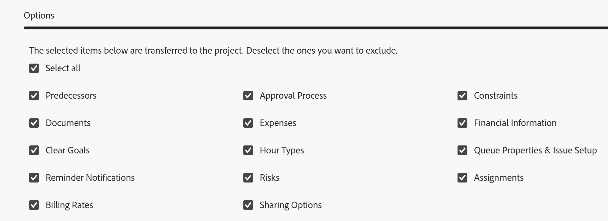

# 從專案建立範本

<!--Audited: 10/2025-->

<!--

(Note: Keep this article in the Creating and Managing Templates area with the detailed information that this contains. Since this is an article about creating TEMPLATES, this needs to be detailed under Templates; there is a similar article with almost the same title in Managing projects that points to this one - since this functionality is in the UI under Projects, this article must have a presence in that areas as well. Keep both, but make this one the only editable one (iterative))

-->

將現有專案另存為範本時，可以建立範本。

將現有專案另存為範本後，您可以使用新範本建立新專案。 這簡化並加速了專案的建立流程。

>[!NOTE]
>
>將專案另存為範本時，未儲存範本的任務和專案的實際日期。
>
>範本及其任務沒有實際日期，而是指出任務可能從哪一天（從未來專案可能開始的時間）開始，以及任務可能需要在哪一天完成。 使用範本來建立未來專案時，專案將收到實際日期。 如需詳細資訊，請參閱[建立專案](../create-projects/create-project.md)。

## 存取需求

+++ 展開以檢視本文中功能的存取需求。

<table style="table-layout:auto"> 
 <col> 
 <col> 
 <tbody> 
  <tr> 
   <td role="rowheader">Adobe Workfront套件</td> 
   <td> 
任何
 </td> 
  </tr> 
  <tr> 
   <td role="rowheader">Adobe Workfront授權</td> 
   <td>
標準
 
   
規劃
 </td> 
  </tr> 
  <tr> 
   <td role="rowheader">存取層級設定</td> 
   <td> 
編輯範本的存取權
</td> 
  </tr> 
  <tr> 
   <td role="rowheader">物件許可權</td> 
   <td> 
檢視專案或更高的許可權 
 
您在建立範本後取得範本的管理許可權
</td> 
  </tr> 
 </tbody> 
</table>

如需有關此表格的詳細資訊，請參閱Workfront檔案中的[存取需求](/help/quicksilver/administration-and-setup/add-users/access-levels-and-object-permissions/access-level-requirements-in-documentation.md)。

+++

<!--Old:
<table style="table-layout:auto"> 
 <col> 
 <col> 
 <tbody> 
  <tr> 
   <td role="rowheader">Adobe Workfront plan*</td> 
   <td> 
Any 
 </td> 
  </tr> 
  <tr> 
   <td role="rowheader">Adobe Workfront license*</td> 
   <td> 
Plan 
 </td> 
  </tr> 
  <tr> 
   <td role="rowheader">Access level configurations*</td> 
   <td> 
Edit access to Templates
 
Note: If you still don't have access, ask your Workfront administrator if they set additional restrictions in your access level. For information on how a Workfront administrator can modify your access level, see <a href="../../../administration-and-setup/add-users/configure-and-grant-access/create-modify-access-levels.md" class="MCXref xref">Create or modify custom access levels</a>.
 </td> 
  </tr> 
  <tr> 
   <td role="rowheader">Object permissions</td> 
   <td> 
View or higher permissions to a project 
 
You obtain Manage permissions to the template after you create it
 
For information on requesting additional access, see <a href="../../../workfront-basics/grant-and-request-access-to-objects/request-access.md" class="MCXref xref">Request access to objects </a>.
 </td> 
  </tr> 
 </tbody> 
</table>-->

## 從專案建立範本

1. 前往您要另存為範本的專案。
1. 按一下&#x200B;**更多**&#x200B;功能表，然後&#x200B;**另存為範本**。
1. 指定範本的下列資訊：

   <table style="table-layout:auto"> 
    <col> 
    <col> 
    <tbody> 
     <tr> 
      <td role="rowheader">範本名稱</td> 
      <td>指定範本的名稱。</td> 
     </tr> 
     <tr> 
      <td role="rowheader">說明</td> 
      <td>提供範本的說明。</td> 
     </tr> 
     <tr> 
      <td role="rowheader">為作用中</td> 
      <td> 
從下列選項中選取：
 
       <ul> 
        <li> 
<strong>是</strong>：其他使用者可以找到範本並將其附加至專案。
 </li> 
        <li><strong>否</strong>：其他使用者找不到範本，也無法將其附加至專案。</li> 
       </ul> </td> 
     </tr> 
    </tbody> 
   </table>

1. 按一下左側面板中的&#x200B;**自訂Forms**。
1. 按一下&#x200B;**新增自訂表單**&#x200B;欄位，然後開始輸入自訂專案的名稱，或從清單中選取名稱。

   如果有任何自訂表單已經與專案相關聯，則這些自訂表單中現有欄位中的所有資訊都會顯示在表單上。

   您可以在單一範本中包含最多10個自訂表單。

1. 暫留在表單名稱上，然後按一下以將其拖放到新位置。

   

1. 按一下左側面板中的&#x200B;**選項**，然後選取您要傳送至範本的欄位或專案。

   預設會勾選所有專案。 取消選取的專案不會轉移到範本。

   

1. 按一下左側面板中的「排除&#x200B;****」，然後選取您要從專案排除的任何工作。

   

1. 按一下&#x200B;**完成並儲存範本。**

   您的範本現在會出現在可用範本清單中。 使用者可以將新範本附加至現有專案，或使用它來建立專案。

