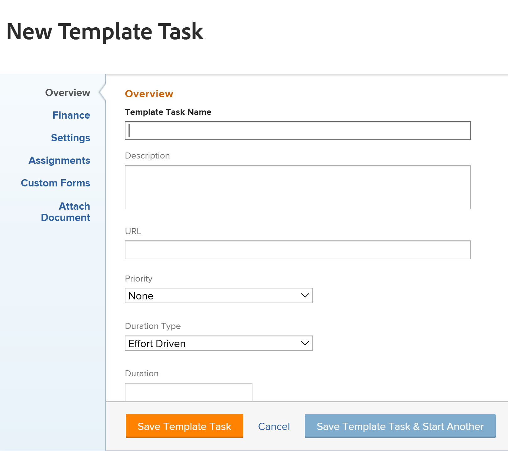

# 建立專案範本

<!-- Audited: 10/2025 -->

本頁醒目提示的資訊指出尚未普遍可用的功能。 它僅在預覽環境中可供所有客戶使用。 從預覽版開始的一週起，生產環境中也將提供相同功能給所有客戶。

如需詳細資訊，請參閱[介面現代化](/help/quicksilver/product-announcements/product-releases/interface-modernization/interface-modernization.md)。

您可以從「範本」區域建立及刪除範本。 建立新範本時，您可以為所有任務和未來專案設定輸入資訊。 然後，此資訊將傳輸至您從範本建立的任何專案。

>[!NOTE]
>
>範本及其任務沒有實際日期，而是指出任務可能從哪一天（從未來專案可能開始的時間）開始，以及任務可能需要在哪一天完成。 使用範本來建立未來專案時，專案將收到實際日期。 如需詳細資訊，請參閱[建立專案](../create-projects/create-project.md)。

您可以透過下列方式建立新範本：

* 從頭開始，如本文所述。
* 從現有專案，透過將專案另存為範本。

  如需從現有專案建立範本的詳細資訊，請參閱[將專案另存為範本](../../../manage-work/projects/manage-projects/save-project-as-template.md)。

* 透過從另一個範本複製它。

  如需有關複製現有範本的詳細資訊，請參閱[複製專案範本](../../../manage-work/projects/create-and-manage-templates/copy-template.md)。

* 透過匯入Blueprint。 您必須是Workfront管理員才能匯入Blueprint。 如需詳細資訊，請參閱[設定Blueprint](../../../administration-and-setup/blueprints/configure-template-package.md)。

## 存取需求

+++ 展開以檢視本文中功能的存取需求。

<table style="table-layout:auto"> 
 <col> 
 <col> 
 <tbody> 
  <tr> 
   <td role="rowheader">Adobe Workfront套件</td> 
   <td> 
任何
 </td> 
  </tr> 
  <tr> 
   <td role="rowheader">Adobe Workfront授權</td> 
   <td> 
標準 

規劃
 
您必須是系統管理員才能從Blueprint匯入範本
 </td> 
  </tr> 
  <tr> 
   <td role="rowheader">存取層級設定</td> 
   <td> 
編輯範本的存取權
 </td> 
  </tr> 
  <tr> 
   <td role="rowheader">物件許可權</td> 
   <td> 
依預設，您擁有您所建立範本的管理許可權
  </td> 
  </tr> 
 </tbody> 
</table>

如需有關此表格的詳細資訊，請參閱Workfront檔案中的[存取需求](/help/quicksilver/administration-and-setup/add-users/access-levels-and-object-permissions/access-level-requirements-in-documentation.md)。

+++

<!--Old:
<table style="table-layout:auto"> 
 <col> 
 <col> 
 <tbody> 
  <tr> 
   <td role="rowheader">Adobe Workfront plan</td> 
   <td> 
Any
 </td> 
  </tr> 
  <tr> 
   <td role="rowheader">Adobe Workfront license</td> 
   <td> 
New: Standard 

Or 

Current: Plan 
 
You must be a system administrator to import templates from Blueprints
 </td> 
  </tr> 
  <tr> 
   <td role="rowheader">Access level configurations*</td> 
   <td> 
Edit access to Templates
 </td> 
  </tr> 
  <tr> 
   <td role="rowheader">Object permissions</td> 
   <td> 
You have Manage permissions to the templates you create, by default
  </td> 
  </tr> 
 </tbody> 
</table>-->

## 建立範本

{{step1-to-templates}}

1. 按一下&#x200B;**新增範本**。

   範本未命名。

   

1. 在範本標題中指定新範本的名稱，然後按&#x200B;**Enter。**
1. 按一下左側面板中的&#x200B;**範本任務**&#x200B;區段。
1. 按一下&#x200B;**開始新增範本任務**&#x200B;以新增內嵌任務

   或

   按一下&#x200B;**新增範本任務**，開始在&#x200B;**新增範本任務**&#x200B;方塊中將任務新增至範本。

   

   在新體驗中開啟&#x200B;**建立範本任務**&#x200B;方塊。

1. （條件式）使用新體驗，更新&#x200B;**建立範本任務**&#x200B;方塊中下列區域的資訊：

   

   * 範本任務名稱
   * 概觀
   * 指派
   * 財務
   * 自訂表單
   * 文件
   * 設定

   

1. 按一下&#x200B;**建立範本任務**

   或

   按一下&#x200B;**建立範本工作**&#x200B;方塊底部的&#x200B;**切換回舊體驗**。
   在舊體驗中開啟&#x200B;**新範本任務**。

   >[!TIP]
   >
   >在生產環境中，預設會開啟舊體驗。

1. 更新&#x200B;**新增範本任務**&#x200B;方塊中下列區域的資訊：

   * 概觀
   * 財務
   * 設定
   * 指派
   * 自訂表單
   * 附加文件

     更新範本任務的資訊類似於編輯專案上的任務。 如需詳細資訊，請參閱[編輯任務](/help/quicksilver/manage-work/tasks/manage-tasks/edit-tasks.md)。<!--should this be relinked at preview/ prod release to say it's the same as Edit template tasks??-->

   >[!NOTE]
   >
   >您無法將週期性任務新增到範本。

1. 按一下下列其中一項：

   * **儲存範本任務**&#x200B;以儲存目前的範本任務並關閉[新增範本任務]方塊。
   * **儲存範本任務並啟動另一個範本任務**&#x200B;以儲存目前的範本任務，並開啟另一個&#x200B;**新增範本任務**&#x200B;方塊以新增另一個任務。
   * **取消**&#x200B;以關閉此方塊而不儲存範本工作。
1. （選擇性）新增範本任務後，在範本任務區段中，按一下任務清單右上角的&#x200B;**甘特圖**&#x200B;圖示，以檢視範本任務清單的視覺化表示法。

   >[!TIP]
   >
   >您無法直接從此甘特圖編輯任務。

1. 若要新增資訊到您的新範本，請按一下標題中範本名稱左側的&#x200B;**更多**&#x200B;功能表，然後按一下&#x200B;**編輯**。

   如需有關編輯範本的資訊，請參閱[編輯專案範本](../../../manage-work/projects/create-and-manage-templates/edit-templates.md)。

   >[!NOTE]
   >
   >   專案範本與群組（或缺少群組）的關聯會影響專案、任務和問題偏好設定如何決定範本中的某些設定。
   >
   >如需詳細資訊，請參閱文章[建立和修改群組的專案範本](../../../administration-and-setup/manage-groups/work-with-group-objects/create-and-modify-a-groups-templates.md)中的「偏好設定如何套用至範本和範本任務」一節。

1. 按一下「**儲存**」。
1. （可選）將下列專案新增至範本

   * 文件
   * 風險
   * 核准流程
   * 計費費率
   * 費用
   * 佇列詳細資訊
   * 主題群組與佇列主題

1. （可選）將下列專案新增至範本中的工作：

   * 文件
   * 費用
   * 核准

   如需詳細資訊，請參閱文章[編輯專案範本](../../../manage-work/projects/create-and-manage-templates/edit-templates.md)中的「新增更多專案至範本」一節。

