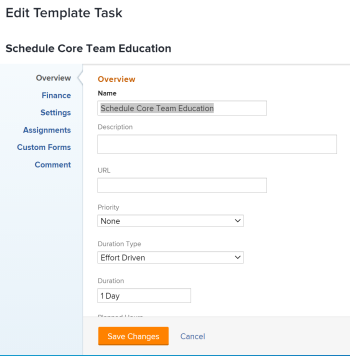
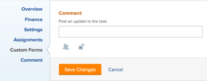

# 編輯模板任務

建立範本後，您可以編輯範本工作的相關資訊。 使用模板建立項目或將模板附加到項目後，您更新的模板任務資訊將與項目任務關聯。

如需建立範本的詳細資訊，請參閱 [建立專案範本](../../../manage-work/projects/create-and-manage-templates/create-template.md).

## 存取需求

您必須具備下列存取權，才能執行本文中的步驟：

<table style="table-layout:auto"> 
 <col> 
 <col> 
 <tbody> 
  <tr> 
   <td role="rowheader">Adobe Workfront計畫*</td> 
   <td> 
任何
 </td> 
  </tr> 
  <tr> 
   <td role="rowheader">AdobeWorkfrontlicense*</td> 
   <td> 
計劃 
 </td> 
  </tr> 
  <tr> 
   <td role="rowheader">存取層級*</td> 
   <td> 
編輯範本的存取權
 
注意：如果您有正確的存取權，但仍無法編輯範本任務，請洽詢您的Workfront管理員，他們是否在您的存取層級設定了其他限制。 如需Workfront管理員如何變更您的存取層級的詳細資訊，請參閱 <a href="../../../administration-and-setup/add-users/configure-and-grant-access/create-modify-access-levels.md" class="MCXref xref">建立或修改自訂存取層級</a>.
 </td> 
  </tr> 
  <tr> 
   <td role="rowheader"><strong>物件權限</strong> </td> 
   <td> 
管理範本的權限。 
 
為模板任務貢獻或更高權限。
 
有關請求訪問對象的資訊，請參見 <a href="../../../workfront-basics/grant-and-request-access-to-objects/request-access.md" class="MCXref xref">請求對對象的訪問 </a>.
 </td> 
  </tr> 
 </tbody> 
</table>

&#42;若要了解您擁有的計畫、授權類型或存取層級，請聯絡您的Workfront管理員。

## 必要條件

開始之前，您必須

* 建立範本。

   如需建立範本的詳細資訊，請參閱 [建立專案範本](../../../manage-work/projects/create-and-manage-templates/create-template.md).

## 編輯模板任務

您可以使用「編輯模板任務」或「模板任務詳細資訊」區域編輯模板任務。 以下步驟介紹在「編輯模板任務」框中編輯任務。

1. 按一下 **主菜單** 圖示  在Adobe Workfront的右上角。

1. 按一下 **範本**.
1. 按一下範本的名稱以開啟。
1. 按一下 **模板任務** 中。
1. 按一下清單中模板任務的名稱以開啟模板任務。
1. （條件性）若要編輯有關模板任務的有限資訊，請按一下 **模板任務詳細資訊** 在左側面板中，轉至「詳細資訊」區段的區域，以編輯每個區域的資訊。
1. （選用）按一下 **全部折疊** 圖示  折疊所有區域。
1. 若要編輯「詳細資訊」區段中的資訊，請按一下 **編輯** 圖示 ，然後從下面的任何區域中選取，或按一下 **全部編輯** 要編輯所有區域的資訊，請執行以下操作：

   * 總覽
   * 自訂表單

      只有在物件附加自訂表單時，海關表單的名稱才會顯示。

   * 財務
   >[!TIP]
   >
   >有關「詳細資訊」區域中顯示的所有欄位的資訊，請繼續使用下面的「編輯模板任務」框編輯所有欄位。

1. （條件性）若要編輯範本工作的所有資訊，請按一下 **更多** 功能表  在模板任務名稱旁，按一下 **編輯**.

   此 **編輯模板任務** 框。

   >[!TIP]
   >
   >您也可以在清單中選擇模板任務，然後按一下「編輯」以開啟「編輯模板任務」框。

   

1. 請考慮在下列任何章節中指定資訊：

   * [總覽](#overview)
   * [財務](#finance)
   * [設定](#settings)
   * [指派](#assignments)
   * [自訂表單](#custom-forms)
   * [評論](#comment)

### 總覽 {#overview}

1. 按上述方式開始編輯模板任務。
1. 按一下 **概述**.

   

1. 更新下列任一項：

   <table style="table-layout:auto"> 
    <col> 
    <col> 
    <tbody> 
     <tr> 
      <td role="rowheader"><strong>名稱</strong> </td> 
      <td>指定模板任務的名稱。</td> 
     </tr> 
     <tr> 
      <td role="rowheader"><strong>說明</strong> </td> 
      <td>添加有關模板任務的其他資訊。</td> 
     </tr> 
     <tr> 
      <td role="rowheader"><strong>URL</strong> </td> 
      <td>指定與模板任務相關資訊的Web連結。</td> 
     </tr> 
     <tr> 
      <td role="rowheader"><strong>優先順序</strong> </td> 
      <td> 
這是視覺標幟，可讓您為範本工作排定優先順序。 
 
從下列選項中選取：
 
       <ul> 
        <li> 
<strong>無</strong> 
 </li> 
        <li> 
<strong>低</strong> 
 </li> 
        <li> 
標準 
 </li> 
        <li> 
高 
 </li> 
        <li> 
緊急 
 </li> 
       </ul> 
視您的Workfront管理員選取的「專案偏好設定」而定，優先順序的名稱可能會有所不同。 如需有關編輯優先順序的詳細資訊，請參閱 <a href="../../../administration-and-setup/customize-workfront/creating-custom-status-and-priority-labels/create-customize-priorities.md" class="MCXref xref">建立和自訂優先順序</a>.
 </td> 
     </tr> 
     <tr> 
      <td role="rowheader"><strong>期間類型</strong> </td> 
      <td> 
將來從此模板建立的任務將具有此持續時間類型。  持續時間類型標識以下兩者之間的關係：
 
 — 分配給任務的資源數
 
 — 完成任務所需的總工作量
 
 — 任務的總持續時間。 
 
持續時間類型使您能夠根據任務的需要設定一致的資源分配。 有關任務的「持續時間類型」的詳細資訊，請參閱 <a href="../../../manage-work/tasks/taskdurtn/task-duration-and-duration-type.md" class="MCXref xref">任務持續時間和持續時間類型概覽</a>.
 
從下列選項中選取：
 
       <ul> 
        <li> 
已計算的任務指派 
 </li> 
        <li> 
已計算的工作 
 </li> 
        <li> 
投入比導向 
 </li> 
        <li> 
簡單   
 </li> 
       </ul> </td> 
     </tr> 
     <tr> 
      <td role="rowheader"><strong>期間</strong> </td> 
      <td> 
以分鐘、小時、天、周或月為單位指定未來任務的持續時間。 從此模板建立的將來任務將在此處指定持續時間。
 
依預設，Workfront會測量持續時間（以天為單位）。 這是您允許的任務在必須完成之前保持未完成的時間。 當 <strong>持續時間類型</strong> 任務是 <strong>簡單</strong>，或 <strong>任務約束</strong> is <strong>固定日期</strong>.
 
重要：持續時間通常是模板任務的「計劃開始」和「計畫完成日期」之間的時間量，因此，它會影響模板的時間軸。 這會決定從範本建立之未來專案的時間軸。 
 </td> 
     </tr> 
     <tr> 
      <td role="rowheader"><strong>計畫小時</strong> </td> 
      <td> 
指定使用此模板建立的項目的將來任務的計畫小時數。 這是任務的受分配者完成任務所需的實際時間。 您只能指定任務的計畫小時數，當<strong>持續時間類型</strong> 設為 <strong>計算分配</strong>. 
 </td> 
     </tr> 
     <tr data-mc-conditions=""> 
      <td role="rowheader">工作量 </td> 
      <td> 
完成任務所需的工作量。 您的項目經理可能會決定使用此欄位，而不是「計畫小時」來估計完成任務所需的工作量。 只有在符合下列條件時，此欄位才會顯示： 
 
       <ul> 
        <li> 
模板任務具有「簡單持續時間類型」。 
 
提示： 如果更新任務「持續時間類型」，則此欄位將變為隱藏。 
 </li> 
        <li>您的項目經理已啟用模板上的「使用工作量來計算計畫小時數」欄位。 </li> 
       </ul> 
       
 
        
 從下列選項中選取：
 
        <ul> 
         <li>小</li> 
         <li>中 （這是新任務的預設值）</li> 
         <li>大</li> 
        </ul> 
       
 
有關使用工作量（而非計畫小時）來估計任務工作量的資訊，請參閱 <a href="../../../manage-work/tasks/task-information/work-effort.md" class="MCXref xref">工作成果概觀</a>.
 </td> 
     </tr> 
     <tr> 
      <td role="rowheader"><strong>任務限制</strong> </td> 
      <td> 
從此模板建立的項目上的任務將具有此約束。 任務約束標識任務必須完成的時間。 
 
從下列選項中選取：
 
       <ul> 
        <li><strong>固定日期</strong>. 指定 <strong>計劃開始</strong> 和 <strong>計畫完成日期。</strong></li> 
        <li><strong>必須開始時間</strong>. 指定 <strong>計劃開始日期。</strong></li> 
        <li><strong>必須完成時間</strong>. 指定 <strong>計畫完成日期</strong>.</li> 
        <li><strong>盡快</strong> </li> 
        <li><strong>盡可能晚</strong> </li> 
        <li style="font-weight: bold;"><strong>最早可用時間</strong> </li> 
        <li style="font-weight: bold;"><strong>最晚可用時間</strong> </li> 
        <li>開始時間不晚於. 指定 <strong>計劃開始日期</strong>.</li> 
        <li><strong>開始時間不早於</strong>. 指定 <strong>計劃開始日期</strong>.</li> 
        <li><strong>完成時間不晚於</strong>. 指定 <strong>計畫完成日期</strong>.</li> 
        <li><strong>完成時間不早於</strong>. 指定 <strong>計畫完成日期</strong>.</li> 
       </ul> 
有關「任務約束」的詳細資訊，請參閱 <a href="../../../manage-work/tasks/task-constraints/task-constraint-overview.md" class="MCXref xref">任務約束概覽</a>.
 </td> 
     </tr> 
     <tr> 
      <td role="rowheader">開始日（可選和條件式） </td> 
      <td> 
 只有在任務約束為以下條件之一時，才可以指定模板任務的「開始日」：
 
       <ul> 
        <li>必須開始時間</li> 
        <li>開始時間不早於</li> 
        <li>開始時間不晚於</li> 
        <li>固定日期</li> 
       </ul> 
這將對應於任務開始時間內將來項目時間軸中的日期。 對於所有其他約束，Workfront會根據任務之間的前置相關性來計算起始日。 
 </td> 
     </tr> 
     <tr> 
      <td role="rowheader"><strong>完成日</strong> （可選和條件式） </td> 
      <td> 
 只有在任務約束為以下條件之一時，才可以指定模板任務的完成日：
 
       <ul style="list-style-type: circle;"> 
        <li>必須完成時間</li> 
        <li>完成時間不早於</li> 
        <li>完成時間不晚於</li> 
        <li>固定日期</li> 
       </ul> 
這將對應於任務將完成時間表內的日期。 對於所有其他約束，Workfront會根據「持續時間」和前置相依性來計算「完成日」。 
 </td> 
     </tr> 
    </tbody> 
   </table>

1. （選用）根據您要修改的資訊，繼續編輯下列章節。

   或

   按一下 **儲存變更**.

### 財務 {#finance}

1. 按上述方式開始編輯任務。
1. 按一下 **金融**.

   

1. 更新下列任一項：

   <table style="table-layout:auto"> 
    <col> 
    <col> 
    <tbody> 
     <tr> 
      <td role="rowheader"><strong>成本類型</strong> </td> 
      <td> 
指定將來任務的成本類型。 這將根據任務的小時數確定如何計算任務的成本。 
 
從下列選項中選取：
 
       <ul> 
        <li> 
無成本 
 </li> 
        <li> 
固定小時 
 </li> 
        <li> 
使用者小時 
 </li> 
        <li> 
角色小時 
 </li> 
       </ul> 
如需追蹤成本的詳細資訊，請參閱 <a href="../../../manage-work/projects/project-finances/track-costs.md" class="MCXref xref">追蹤成本</a>.
 </td> 
     </tr> 
     <tr> 
      <td role="rowheader"><strong>收入類型</strong> </td> 
      <td> 
指定將來任務的收入類型。 這將根據任務上的小時數，確定如何計算任務上的收入。
 
從下列選項中選取： 
 
       <ul> 
        <li> 
不可記帳
 </li> 
        <li> 
使用者小時
 </li> 
        <li> 
角色小時
 </li> 
        <li> 
固定小時
 </li> 
        <li> 
受限使用者小時
 </li> 
        <li> 
受限角色小時
 </li> 
        <li> 
使用者小時加固定
 </li> 
        <li> 
角色小時加固定
 </li> 
        <li> 
固定收入
 </li> 
       </ul> 
如需追蹤收入的詳細資訊，請參閱 <a href="../../../manage-work/projects/project-finances/billing-and-revenue-overview.md" class="MCXref xref">帳單和收入概觀</a>.
 </td> 
     </tr> 
    </tbody> 
   </table>

1. （選用）根據您要修改的資訊，繼續編輯下列章節。

   或

   按一下 **儲存變更**.

### 設定 {#settings}

1. 按上述方式開始編輯任務。
1. 按一下 **設定**.

   

1. 更新下列任一項：

   <table style="table-layout:auto"> 
    <col> 
    <col> 
    <tbody> 
   <tr> 
      <td role="rowheader"><strong>
里程碑
</strong> </td> 
      <td> 
選擇要與所選模板任務關聯的里程碑。

   
<b>重要</b>

   
必須將里程碑路徑與模板關聯，此欄位才會顯示。 如需詳細資訊，請參閱 <a href="../create-and-manage-templates/edit-templates.md">編輯專案範本</a>.
 
   </td> 
     </tr>
     <tr> 
      <td role="rowheader"><strong>追蹤模式</strong> </td> 
      <td> 
指定如何跟蹤將來任務的進度狀態。 
 
從下列選項中選取：
 
       <ul> 
        <li> 
<strong>使用者必須更新</strong> 
 </li> 
        <li> 
<strong>假設時間</strong> 
 </li> 
        <li> 
<strong>忽略遲到警告</strong> 
 </li> 
        <li> 
<strong>自動完成</strong> 
 </li> 
        <li> 
<strong>前置任務</strong> 
 </li> 
       </ul> 
如需有關工作的追蹤模式的詳細資訊，請參閱 <a href="../../../manage-work/tasks/task-information/task-tracking-mode.md" class="MCXref xref">任務追蹤模式概觀</a>.
 </td> 
     </tr> 
     <tr> 
      <td role="rowheader"><strong>核准流程</strong> </td> 
      <td> 
選擇要與模板任務關聯的審批流程。 您的Workfront管理員必須先定義系統級任務「審批流程」，然後才能將它們與模板任務關聯。 具有管理存取權的核准程式使用者也可以建立群組專屬的核准程式。 如需建立核准程式的詳細資訊，請參閱 <a href="../../../administration-and-setup/customize-workfront/configure-approval-milestone-processes/create-approval-processes.md" class="MCXref xref">建立工作項的審批流程</a>.
 
新增核准程式時，請考量下列事項： 
 
       <ul> 
       <li>清單中只會顯示作用中的核准程式。 </li> 
       <li> 
清單中顯示系統範圍和組特定的批准流程。 與範本以外的群組相關聯的核准程式不會顯示在清單中。
 
重要：如果與模板關聯的組發生更改，則特定於組的審批流程將變成一次性審批流程。 有關項目組的更改或審批流程中的更改如何影響審批設定的詳細資訊，請參閱 <a href="../../../administration-and-setup/customize-workfront/configure-approval-milestone-processes/how-changes-affect-group-approvals.md" class="MCXref xref">組和審批流程更改如何影響分配的審批流程</a>. 
 </li> 
       <li> 
如果您新增一次性使用的核准程式，則會顯示為「&lt;custom&gt;」。 如需詳細資訊，請參閱 <a href="../../../review-and-approve-work/manage-approvals/associate-approval-with-work.md" class="MCXref xref">將新審批流程或現有審批流程與工作關聯</a>. 
 <!--
(NOTE: this will be valid only for Classic when they edit the Edit Template box in NWE)
--> </li> 
       <li> 
批量編輯模板任務時，存在以下情況：
 
       <ul> 
       <li> 
從同一模板組中選擇模板任務時，系統級和組級審批流程都顯示在此欄位中。
 </li> 
       <li> 
從不同的模板組選擇模板任務時，此欄位中只顯示系統級別的批准進程。
 </li> 
       <li> 
當任何模板任務附加了一次性審批流程時，系統級別將替換它 或組級審批流程 選取。 
 </li> 
       </ul> </li> 
       </ul> </td> 
     </tr> 
     <tr> 
      <td role="rowheader"><strong>提醒通知</strong> </td> 
      <td> 
選擇要附加到模板任務的提醒通知。 它們將附加到從此模板建立的項目上的未來任務。 您的系統管理員必須配置提醒通知，然後才能在任務中選擇提醒通知。 有關配置提醒通知的詳細資訊，請參閱 <a href="../../../administration-and-setup/manage-workfront/emails/set-up-reminder-notifications.md" class="MCXref xref">設定提醒通知</a>.
 </td> 
     </tr> 
    </tbody> 
   </table>

1. （選用）根據您要修改的資訊，繼續編輯下列章節。

   或

   按一下 **儲存變更**.

### 指派 {#assignments}

1. 按上述方式開始編輯任務。
1. 按一下 **分配**.

   

1. 按一下 **新增受託人** 向模板任務添加新的受託人。 您可以為任務指派使用者、角色或團隊。 您可以在一個任務上有多個受分配者。 從此模板任務建立後，將為其分配相同的資源。
1. （可選）如果您有多個受分配者，請選取 **擁有者** 選項按鈕，指示將哪個用戶或角色視為任務責任人或主要受託人。 Workfront會將您指派給範本任務的第一個使用者或工作角色標示為「擁有者」或「主要受託人」。
1. （條件式和可選）如果「任務約束」是「計算工作」或「工作驅動」，請指定 **分配%** （分配百分比）。 這是受託人的計畫中，他們可以花在此任務上的時間。 更改受託人的分配百分比將更改任務的計畫小時數。
1. （條件式和可選）如果「任務約束」為「簡單」，請指定 **小時** 每個受讓人

   或

   指定 **計畫小時數** ，以執行模板任務。 這樣，所有受分配者之間平均分配總時數。

1. （條件式和可選）如果「任務約束」為「簡單」，請指定 **持續時間** 以天為單位的模板任務。 這將成為從此模板建立的任務的持續時間。
1. （可選）從 **受託人的角色** 下拉式功能表。 這是受讓人在今後的任務中可以承擔的角色。 只有與每個受託人在其設定檔中相關聯的工作角色才會出現在下拉式功能表中。
1. （選用）根據您要修改的資訊，繼續編輯下列章節。

   或

   按一下 **儲存變更**.

### 自訂表單 {#custom-forms}

您可以在將任務新增至專案時，定義要自動附加至任務的預設自訂表單。 有關將項目設定為包括預設任務自定義表單的資訊，請參閱文章中的「任務」部分 [編輯專案](../../../manage-work/projects/manage-projects/edit-projects.md).

1. 按上述方式開始編輯任務。 測試
1. 按一下 **自訂Forms**.

   

1. 選擇要與模板任務關聯的自定義表單。 您必須先建置自訂表單，才能在此欄位中供選取。 清單中只會顯示使用中的自訂表單。 如需建立自訂表單的詳細資訊，請參閱 [建立或編輯自訂表單](../../../administration-and-setup/customize-workfront/create-manage-custom-forms/create-or-edit-a-custom-form.md). 您最多可將10個自訂表單新增至範本工作。 表單會自動新增至從範本建立的工作。
1. （條件式和選用式）如果您將自訂表單附加至範本工作，請編輯表單上的任何欄位。 必須指定所有必填欄位，然後才能保存模板任務。

   >[!NOTE]
   >
   >根據您的Workfront管理員如何設定自訂表單中各區段的權限，不是每個人都可以在指定的自訂表單上檢視或編輯相同的欄位。 編輯自訂表單區段內欄位的權限，取決於您對範本工作或未來工作的權限。\
   >如需在自訂表單的區段上設定權限的相關資訊，請參閱 [共用自訂表單](../../../administration-and-setup/customize-workfront/create-manage-custom-forms/share-access-to-a-custom-form.md).\
   >有關設定任務權限的資訊，請參閱 [共用任務](../../../workfront-basics/grant-and-request-access-to-objects/share-a-task.md).\
   >如需設定範本權限的相關資訊，請參閱 [共用範本](../../../workfront-basics/grant-and-request-access-to-objects/share-a-template.md).

1. （可選）根據您要修改的資訊，繼續編輯以下部分。

   或

   按一下 **儲存變更**.

### 評論 {#comment}

1. 按上述方式開始編輯任務。
1. 按一下 **註解**.

   

1. 在可用欄位中，指定要在範本任務的更新流中顯示的注釋。 對於具有查看權限的模板和模板任務以及具有查看權限的每個人，此注釋都可見。
1. 按一下 **儲存變更**.

   將為此模板任務提交更改。

   當您或其他用戶從此模板建立項目時，應用於模板任務的所有設定都將成為項目任務的設定。
