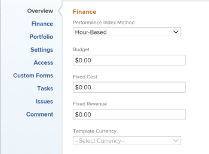
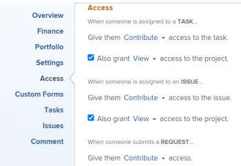
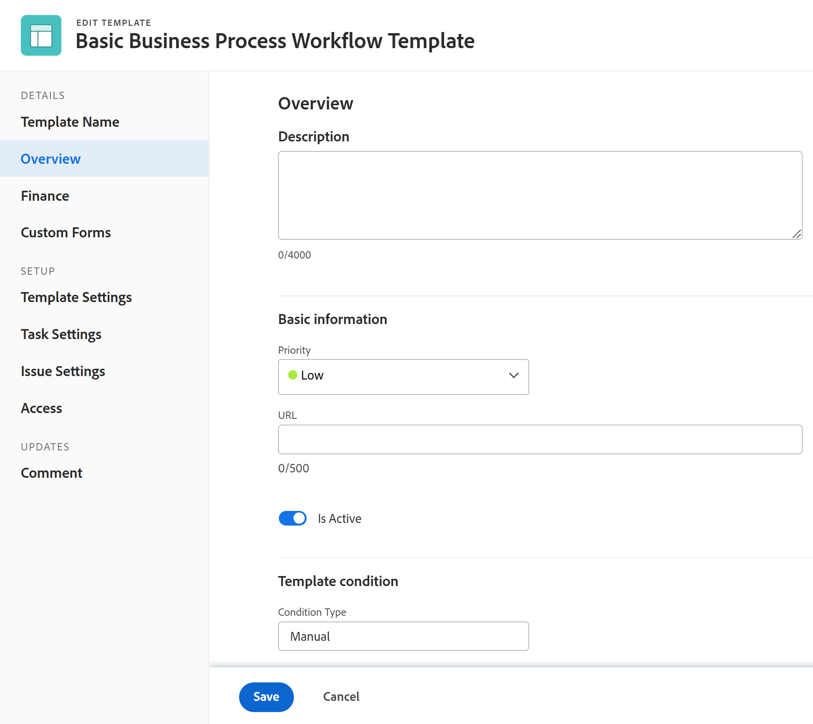
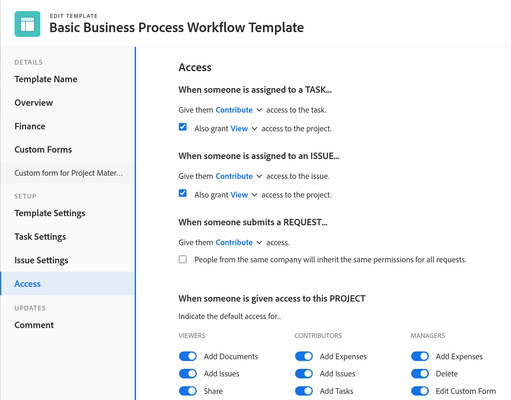

# 編輯專案範本

<!--drafted
The highlighted information on this page refers to functionality not yet generally available. It is available only in the Preview environment. 
-->

<!--
<The Resource Pools part also duplicates in the "Working with Resource Pools" article

-->

您可以編輯專案範本，以反映專案程式和設定中的變更。 使用範本建立專案時，在範本上更新並儲存變更後，新變更會顯示在新專案中。 您在範本上所做的變更，不會反映在目前使用該範本的專案上。

## 存取需求

您必須具備下列存取權，才能執行本文中的步驟：

<table style="table-layout:auto"> 
 <col> 
 <col> 
 <tbody> 
  <tr> 
   <td role="rowheader">Adobe Workfront計畫*</td> 
   <td> 
任何 
 </td> 
  </tr> 
  <tr> 
   <td role="rowheader">Adobe Workfront授權*</td> 
   <td> 
計劃 
 </td> 
  </tr> 
  <tr> 
   <td role="rowheader">存取層級*</td> 
   <td> 
編輯範本的存取權
 
如果您仍無權存取，請洽詢您的Workfront管理員，他們是否在您的存取層級設定其他限制。 如需存取範本的詳細資訊，請參閱 <a href="../../../administration-and-setup/add-users/configure-and-grant-access/grant-access-templates.md" class="MCXref xref">授予範本的存取權</a>. 如需Workfront管理員如何變更您的存取層級的詳細資訊，請參閱 <a href="../../../administration-and-setup/add-users/configure-and-grant-access/create-modify-access-levels.md" class="MCXref xref">建立或修改自訂存取層級</a>. 
 </td> 
  </tr> 
  <tr> 
   <td role="rowheader">物件權限</td> 
   <td> 
    <ul> 
     <li> 
將權限貢獻給範本，以便在範本詳細資訊索引標籤中編輯
 </li> 
     <li> 
管理範本的權限，以便在「編輯範本」方塊中編輯範本
 </li> 
    </ul> 
 如需範本權限的相關資訊，請參閱 <a href="../../../workfront-basics/grant-and-request-access-to-objects/share-a-template.md" class="MCXref xref">共用範本</a>. 
 
有關請求其他訪問的資訊，請參閱 <a href="../../../workfront-basics/grant-and-request-access-to-objects/request-access.md" class="MCXref xref">請求對對象的訪問 </a>.
 </td> 
  </tr> 
 </tbody> 
</table>

*若要了解您擁有的計畫、授權類型或存取權，請聯絡您的Workfront管理員。

## 編輯範本 {#edit-a-template}

<!--
Editing a template differs depending on what environment you choose. 

### Edit a template in the Production environment {#edit-a-template-in-the-production-environment} 

1. Go to the template you want to edit.
1. (Conditional) To edit limited information about the template,  click **Template Details** in the left panel, then go to the areas listed in the left panel to edit information for each area. 
1. To edit information in the Details section, click the **Edit** icon , then select from any of the areas below, or click **Edit all** to edit information in all areas:

   * Overview
   * Custom Forms

     Names of customs forms display only if there are custom forms attached to the object.
   
   * Finance

   >[!TIP]
   >
   >For information about all fields that display in the Details area, continue with editing all fields using the Edit Template box below.

1. (Conditional) To edit all information about the template, click the **More** menu  next to the name of the template, then click **Edit**.

   The **Edit Template** box opens. The sections in this box contain the same fields available in  the Template Details section .

1. Consider editing information in any of the following sections:

   * [Overview](#overview) 
   * [Finance](#finance) 
   * [Portfolio](#portfolio) 
   * [Settings](#settings) 
   * [Access](#access) 
   * [Custom Forms](#custom-forms) 
   * [Tasks](#tasks) 
   * [Issues](#issues) 
   * [Comment](#comment)

### Overview {#overview}

1. Begin editing your template as described above.
1. In the **Edit Template** box, click **Overview**.

   

1. Update the following fields:

   <table style="table-layout:auto"> 
    <col> 
    <col> 
    <tbody> 
     <tr> 
      <td role="rowheader"><strong>Name</strong></td> 
      <td>Specify a name for the template.</td> 
     </tr> 
     <tr> 
      <td role="rowheader"><strong>Description</strong></td> 
      <td>Add additional information about the template.</td> 
     </tr> 
     <tr> 
      <td role="rowheader"><strong>Is Active</strong></td> 
      <td>
Select this checkbox if you want the template to be active. Other users can find this template and attach it to projects when creating projects. Deselect this checkbox if you want to deactivate templates that are no longer used. Deactivated templates cannot be attached to projects. This is enabled by default. 

<b>TIP</b>
      
      You can deactivate a template from the template header as described in the [Activate or deactivate a template](#activate-or-deactivate-a-template) section in this article.
</td> 
     </tr> 
     <tr> 
      <td role="rowheader"><strong>URL</strong></td> 
      <td>Specify a web link that relates to information about this template.</td> 
     </tr> 
     <tr> 
      <td role="rowheader"><strong>Schedule From</strong></td> 
      <td>
Specify whether the project using this template is scheduled from the <strong>Start Date</strong>, or from the <strong>Completion Date</strong>. This selection determines the planned dates of the future tasks on the project using this template. 

Select from the following: 
 
       <ul> 
        <li>
<strong>Schedule From Start Date</strong>: The Start Date of the template is actually the Start Day. When you schedule a template from Start Date, Adobe Workfront calculates the Completion Day of the template based on the Duration of all the template tasks. The Start Day of the template becomes the Planned Start Date of the future project.
</li> 
        <li>
<strong>Schedule from Completion Date</strong>: The Completion Date of the template is actually the Completion Day. When you schedule a template from Completion Date, Workfront calculates the Start Day of the template based on the Duration of all the template tasks. The Completion Day of the template becomes the Planned Completion Date of the future project. 
</li> 
       </ul>
For more information about the Start and Completion Days of template tasks, see <a href="../../../manage-work/projects/create-and-manage-templates/overview-of-start-completion-day-on-template.md" class="MCXref xref">Overview of Start and Completion Days in a template</a>. 

The Schedule From setting for templates is similar to that of projects. Your Workfront administrator selects the default Schedule From setting for the projects in your system. For information about setting project defaults, see <a href="../../../administration-and-setup/set-up-workfront/configure-system-defaults/set-project-preferences.md" class="MCXref xref">Configure system-wide project preferences</a>.
</td> 
     </tr> 
     <tr> 
      <td role="rowheader"><strong>Condition Type</strong></td> 
      <td>
Select between the following Condition Types:
 
       <ul> 
        <li><strong>Manual:</strong> The project owner sets the Condition of the project on the project manually. <strong></strong></li> 
        <li><strong>Progress Status:</strong> Workfront automatically sets the Condition of the future project based on the Progress Status of tasks on the Critical Path. For more information about understanding Progress Status, see <a href="../../../manage-work/tasks/task-information/task-progress-status.md" class="MCXref xref">Task Progress Status overview</a>.</li> 
       </ul></td> 
     </tr> 
     <tr> 
      <td role="rowheader"><strong>Priority</strong></td> 
      <td>
This is just a visual flag for you which allows you to prioritize your future projects. Select from the following options:
 
       <ul> 
        <li>
<strong>None</strong>
</li> 
        <li>
<strong>Low</strong>
</li> 
        <li>
<strong>Normal</strong>
</li> 
        <li>
<strong>High</strong>
</li> 
        <li>
<strong>Urgent</strong>
</li> 
       </ul>

Depending on the Project Preferences selected by your Workfront administrator, the names of priorities might be different for you. For more information about editing priorities, see <a href="../../../administration-and-setup/customize-workfront/creating-custom-status-and-priority-labels/create-customize-priorities.md" class="MCXref xref">Create and customize priorities</a>.

</td> 
     </tr> 
     <tr> 
      <td role="rowheader"><strong>Template Owner</strong></td> 
      <td>
The user who is designated as the Template Owner must be a Workfront active user. 

Consider the following about the user designated as the Template Owner: 
 
       <ul> 
        <li>They are automatically given Manage permissions to the template. </li> 
        <li>They are added to the project team and are automatically given Manage permissions to the project created from the template. </li> 
        <li>They become the Project Owner, when the project is created from this template. </li> 
       </ul></td> 
     </tr> 
     <tr> 
      <td role="rowheader"><strong>Template Sponsor</strong></td> 
      <td>
The user specified in this field becomes the Project Sponsor, when the template is added to the project. This user is added to the project team and is automatically given view permissions to the project. The user who is designated as the Template Sponsor must be a Workfront active user. 
</td> 
     </tr> 
     <tr> 
      <td role="rowheader"><strong>Resource Manager</strong></td> 
      <td>
The specified users are automatically given manage permissions to the future projects and can assign resources to the tasks and issues of the projects. You can specify more than one Resource Manager. 
</td> 
     </tr> 
     <tr data-mc-conditions="QuicksilverOrClassic.Quicksilver"> 
      <td role="rowheader"><strong>Group</strong></td> 
      <td>
In the drop-down list, select the group that you want to be associated with projects created from the template. It can be a group of any level. 

You can make sure you are selecting the right group by hovering over it and clicking the information icon  that displays next to it. This displays a tooltip listing information about the group, such as the hierarchy of groups above it and its administrators.
 
<b>NOTES</b>
      
    <ul> 
    <li>
In the Projects area on a group's page, when someone creates a project using a template that doesn't have a group selected, the system associates the currently open group with the project.

This is different from other areas where the system associates a user's Home Group with the project when the user creates the project using a template that doesn't have a group selected.

    </li> 
      <li>
If a user selects a template that has a group selected while creating a project—or while converting a task or issue to a project—the user can choose a different group for the project.
</li> 
      <li>Though this field is available in templates only in the new Adobe Workfront experience, you can see it in lists and reports both there and in Adobe Workfront Classic. </li> 
      </ul> 
</td> 
     </tr> 
     <tr> 
      <td role="rowheader"><strong>Company</strong></td> 
      <td>
Specify the Company that you want to associate with the template. Only active companies display in the list.
</td> 
     </tr> 
    </tbody> 
   </table>

1. (Optional) Continue editing the following sections, depending on the information you want to modify.

   Or

   Click **Save Changes**.

### Finance {#finance}

1. Begin editing your template as described above.
1. In the **Edit Template** box, click **Finance**.

   

1. Update the following fields:

   <table style="table-layout:auto"> 
    <col> 
    <col> 
    <tbody> 
     <tr> 
      <td role="rowheader"><strong>Performance Index Method</strong></td> 
      <td>
Specify whether the Earned Value metrics of the future project are calculated using hours or costs. For more information about the Performance Index Method, see <a href="../../../manage-work/projects/project-finances/set-pim.md" class="MCXref xref">Set the Performance Index Method (PIM)</a>. 
</td> 
     </tr> 
     <tr> 
      <td role="rowheader"><strong>Budget</strong></td> 
      <td>
Specify a Budget for the projects that are created from this template.
</td> 
     </tr> 
     <tr> 
      <td role="rowheader"><strong>Fixed Cost</strong></td> 
      <td>
Specify the Fixed Cost for the projects that are created from this template. This is different than the Labor Cost which comes from the hours on the project and the Expense Cost which comes from the amount of expenses on the project. The Fixed Cost of a project is taken into account when calculating the Net Value of a project and it is part of the Budgeted Cost.
</td> 
     </tr> 
     <tr> 
      <td role="rowheader"><strong>Fixed Revenue</strong></td> 
      <td>
Specify the Fixed Revenue for the projects that are created from this template.
</td> 
     </tr> 
     <tr> 
      <td role="rowheader"><strong>Template Currency</strong></td> 
      <td>
Specify the currency for the future project, if it is different than the default currency of your system. This field is not visible if you have only the default currency in the system. For more information about currency, see <a href="../../../administration-and-setup/manage-workfront/exchange-rates/set-up-exchange-rates.md" class="MCXref xref">Set up exchange rates</a>.
</td> 
     </tr> 
     <tr> 
      <td role="rowheader"><strong>Require time to be approved for this project</strong></td> 
      <td>
Select this option to require the Project Owner of the future project created from this template to approve time logged on the project. If you are using Billing Records and you select this option, only the approved hours on the project appear as available billable hours for the Billing Records. Approving time on the project is independent of approving timesheets. For more information about requiring time to be approved on a project, see <a href="../../../manage-work/projects/manage-projects/require-time-approval-for-projects.md" class="MCXref xref">Require time to be approved for a project</a>.
</td> 
     </tr> 
    </tbody> 
   </table>

1. (Optional) Continue editing the following sections, depending on the information you want to modify.

   Or

   Click **Save Changes**.

### Portfolio {#portfolio}

1. Begin editing your template as described above.
1. In the **Edit Template** box, click **Portfolio**.

   

1. Update the following fields:

   <table style="table-layout:auto">
    <col> 
    <tbody> 
     <tr> 
      <td role="rowheader"><strong>Portfolio</strong></td> 
      <td>
Specify a Portfolio for the projects that are created from this template. You must create a Portfolio first, before it appears in the drop-down list. 

Only active portfolios display in the list. For more information about creating portfolios, see <a href="../../../manage-work/portfolios/create-and-manage-portfolios/create-portfolios.md" class="MCXref xref">Create a portfolio </a>.
</td> 
     </tr> 
     <tr> 
      <td role="rowheader"><strong>Program</strong></td> 
      <td>
If you selected a Portfolio for the template, specify a <strong>Program</strong> for the future project. Some Portfolios might not have Programs. You must create a Program first, before it appears in this drop-down list. Only active programs display in the list.

For more information about creating programs, see <a href="../../../manage-work/portfolios/create-and-manage-programs/create-program.md" class="MCXref xref">Create a program</a>.
</td> 
     </tr> 
     <tr> 
      <td role="rowheader"><strong>Planned Benefit</strong></td> 
      <td>
Specify the Planned Benefit of the projects that are created from this template. The Planned Benefit is used in the Business Case of the project and the Portfolio Optimizer. 

For more information about the Planned Benefit of a project, see <a href="../../../manage-work/projects/project-finances/project-planned-benefit.md" class="MCXref xref">Overview of project Planned Benefit</a>. The Planned Benefit of a project is taken into account when the Net Value of a project is calculated. 

For more information about using the Portfolio Optimizer, see <a href="../../../manage-work/portfolios/portfolio-optimizer/manage-projects-in-portfolio-optimizer.md" class="MCXref xref">Manage projects in the Portfolio Optimizer</a> 
</td> 
     </tr> 
    </tbody> 
   </table>

1. (Optional) Continue editing the following sections, depending on the information you want to modify.

   Or

   Click **Save Changes**.

### Settings {#settings}

1. Begin editing your template as described above.
1. In the **Edit Template** box, click **Settings**.

   

1. Update the following fields: 

   <table style="table-layout:auto"> 
    <col> 
    <col> 
    <tbody> 
     <tr> 
      <td role="rowheader"><strong>Milestone Path</strong> </td> 
      <td> 
Select a Milestone Path for the template. Only active milestone paths display in the list. For more information about Milestone Paths, see <a href="../../../administration-and-setup/customize-workfront/configure-approval-milestone-processes/create-milestone-path.md" class="MCXref xref">Create a milestone path</a>.
 </td> 
     </tr> 
     <tr> 
      <td role="rowheader"><strong>Completion Mode</strong> </td> 
      <td> 
Controls how the future project will be marked as Complete.  Select from the following options:
 
       <ul> 
        <li> 
<strong>Automatic</strong>: The project is marked Complete when all the tasks and issues are completed.
 </li> 
        <li> 
<strong>Manual</strong>: You have to manually select the Complete status for the project, when all the tasks and issues are completed. 
 </li> 
       </ul> </td> 
     </tr> 
     <tr> 
      <td role="rowheader"><strong>Summary Completion Mode</strong> </td> 
      <td> 
Controls how the parent tasks on the future project are marked as Complete.  Select from the following options:
 
       <ul> 
        <li> 
<strong>Automatic</strong>: The parent tasks are marked Complete and they update their percent complete automatically, as the children tasks are completed and the percent complete of the children is updated. 
 </li> 
        <li> 
<strong>Manual</strong>: You have to manually update the percent complete and the status of the parent tasks, independently of what changes are made to the children tasks. 
 </li> 
       </ul> </td> 
     </tr> 
     <tr> 
      <td role="rowheader"><strong>Update Type</strong> </td> 
      <td> 
Controls when the changes you make to the timeline of the future project are saved on the project. 
 
       <b>EXAMPLE </b> 
        
The following changes to the project trigger an update to the timeline of the project:
 
        <ul> 
         <li> 
update the dates of tasks
 </li> 
         <li> 
change predecessor relationships 
 </li> 
         <li> 
change parent-child relationships
 </li> 
         <li> 
add or remove assignments in addition to changing the task constraint or duration type.
 </li> 
        </ul> 
       
 
Select from the following options: 
 
       <ul> 
        <li> 
<strong>Automatic and On Change</strong> (Default setting): The future project timeline is updated each time a change occurs in the project or in another project that the timeline is dependent on (On Change). The project timeline is also updated each night (Automatic). This is the recommended setting for this field because it ensures that the project timeline is always up to date. When you perform an action on a task or project that triggers a timeline recalculation, all available dates are immediately displayed, allowing you to continue working. On projects with more than 100 tasks, dates that require longer recalculations display briefly as a question mark (between 1 and 5 seconds, or up to a minute for large projects). This indicates that the recalculation is not yet finished, and the dates are subject to change. 
 </li> 
       </ul> 
       <ul> 
        <li> 
<strong>Change Only</strong>: The project timeline is updated each time a change occurs in the project or in another project that the timeline is dependent on. You might want to select this option if changes rarely occur in the project or in other projects that the timeline is dependent on. 
 </li> 
       </ul> 
       <ul> 
        <li> 
<strong>Automatic Only</strong>: The project timeline is updated each night; it is not updated immediately after changes are made. You might want to select this option if many changes occur each day in the project or in other projects that the timeline is dependent on. However, be aware that you chose this setting, as the project will not update at the same time that the changes are made. 
 </li> 
       </ul> 
       <ul> 
        <li> 
<strong>Manual Only</strong>: The project timeline is updated only when you select the option to Recalculate Timelines, as described in <a href="../../../manage-work/projects/manage-projects/recalculate-project-timeline.md" class="MCXref xref">Recalculate project timelines</a>. 
 </li> 
       </ul> 
You might want to select this option if you are making many changes to the project at one time, and you want the timeline recalculation to occur after all of the changes have been made (rather than after each individual change).
 </td> 
     </tr> 
     <tr> 
      <td role="rowheader"><strong>Schedule</strong> </td> 
      <td> 
Select a schedule for your template. This will become the schedule of the project that is created from this template. This should be the same schedule assigned to most people that are working on the project. You must create a schedule before you can assign it to a template. For more information about creating schedules, see <a href="../../../administration-and-setup/set-up-workfront/configure-timesheets-schedules/create-schedules.md" class="MCXref xref">Create a schedule</a>.  If you have not created custom schedules in your system, the Default Schedule is selected. 
 </td> 
     </tr> 
     <tr> 
      <td role="rowheader"><strong>User Time Off</strong> </td> 
      <td> 
Determines whether the time off of the Primary Assignee of a task adjusts the task planned dates. When you attach the template to an existing project, and the template has a different setting for this field than the project, the setting on the project remains unchanged. The default option for this setting for a new template is the same as the system-level project preference. 
 
For information about the project preferences at the System level, see <a href="../../../administration-and-setup/set-up-workfront/configure-system-defaults/set-project-preferences.md" class="MCXref xref">Configure system-wide project preferences</a>. 
 
For information about how this setting affects the task dates on a project, see <a href="../../../manage-work/projects/manage-projects/edit-projects.md" class="MCXref xref">Edit projects</a>. Select from the following options: 
 
       <ul> 
        <li> 
<strong>Consider user time off in task durations</strong>: When selecting this option, the planned dates of the tasks on the project created from this template adjust according to the time off of the Primary Assignee of the task, if the time off occurs during the duration of the task. 
 </li> 
        <li> 
<strong>Ignore user time off in task durations</strong>: When selecting this option, the planned dates of the tasks on the project created from this template remain as originally planned, even if the Primary Assignee of the task has time off during the duration of the task. 
 </li> 
       </ul> </td> 
     </tr> 
     <tr> 
      <td role="rowheader"><strong>Resource Leveling Mode</strong> </td> 
      <td> 
Select from the following options: 
 
       <ul> 
        <li> 
<strong>Manual</strong>: you must manually level your resources on the project created from this template (this is the default setting)
 </li> 
        <li> 
<strong>Automatic:</strong> Workfront levels the resources on the future project.  For more information about Resource Leveling, see <a href="../../../manage-work/gantt-chart/use-the-gantt-chart/level-resources-in-gantt.md" class="MCXref xref">Level Resources in the Gantt Chart </a>. 
 </li> 
       </ul> </td> 
     </tr> 
     <tr> 
      <td role="rowheader"><strong>Risk</strong> </td> 
      <td> 
Define the level of risk of the projects created from this template. The risk is just an indicator of how risky a project can be. You can prioritize the execution of your projects based on the level of risk. Consider selecting from the following levels of risk: 
 
       <ul> 
        <li> 
<strong>Very Low</strong> 
 </li> 
        <li> 
<strong>Low</strong> 
 </li> 
        <li> 
<strong>Medium</strong> 
 </li> 
        <li> 
<strong>High</strong> 
 </li> 
        <li> 
<strong>Very High</strong> 
 </li> 
       </ul> </td> 
     </tr> 
     <tr> 
      <td role="rowheader"><strong>Resource Pools</strong> </td> 
      <td> 
Specify the resource pools associated with the template. Resource pools are collections of users that are needed at the same time for the completion of a project. For more information about resource pools, see <a href="../../../resource-mgmt/resource-planning/resource-pools/work-with-resource-pools.md" class="MCXref xref"> Resource pools overview </a>.
 
 
<b>NOTE</b> 
      
      When you edit templates in bulk, only the resource pools that are common to all the templates selected appear in this field. If the templates selected have no shared resource pools, this field will be empty. The resource pools you specify here will overwrite the templates' individual resource pools.
 
 </td> 
     </tr> 
     <tr> 
      <td role="rowheader"><strong>Approval Process</strong> </td> 
      <td> 
Select the approval process you want to associate with the template. Your Workfront administrator or a user with administrative access to Approval Processes must define system-level or group-level project approval processes before you can associate them with a template. For more information about creating approval processes, see <a href="../../../administration-and-setup/customize-workfront/configure-approval-milestone-processes/create-approval-processes.md" class="MCXref xref">Create an approval process for work items</a>.
 
Consider the following when adding approval processes: 
 
      <ul> 
      <li>Only active approval processes display in the list. </li> 
      <li> 
System-wide and group-specific approval processes display in the list. An approval process associated with a group other than that of the template does not display in the list.
 
<b>IMPORTANT</b> 
      
      If the group associated with the template changes, the group-specific approval process becomes a single-use approval process. For more information about how changes to the group of the project or changes in the approval process affect approval settings, see <a href="../../../administration-and-setup/customize-workfront/configure-approval-milestone-processes/how-changes-affect-group-approvals.md">How group and approval process changes affect assigned approval processes</a>. 
 </li> 
      <li> 
If you added a single-use approval process, it displays as "Custom" in this field. For information, see <a href="../../../review-and-approve-work/manage-approvals/associate-approval-with-work.md" class="MCXref xref">Associate a new or existing approval process with work</a>. 
 
      </li> 
      <li> 
When bulk-editing templates, the following scenarios exist:
 
      <ul> 
         <li> 
When you select templates from the same group, both system-level and group-level approval processes display in this field.
 </li> 
         <li> 
When you select templates from different groups, only system-level approval processes display in this field.
 </li> 
         <li> 
When any of the templates has a single-use approval process attached, it is replaced by the system-level you select. 
 </li> 
      </ul> </li> 
      </ul> </td> 
     </tr> 
     <tr> 
      <td role="rowheader"><strong>Filter Hour Types</strong> </td> 
      <td> 
Consider the following:
 
Select <strong>No</strong> to make all project-specific hour types available on the future project. (This is the default selection)
 
Or
 
Select <strong>Yes</strong> to make only a subset of the project-specific hour types available on the future project, then select the hour types you want to make available. (Hold the Shift key to select multiple hour types.)
 
If you select this option, only the hour types you select are made available to select when logging hours on the project (or on tasks and issues within the project). You must select at least one hour type; if you select this option and you do not select any hour types, all hour types are made available on the project.
 
The same hour type selections must be made at the individual user level in order for the user to see these hour type options on the project. 
 
For more information about defining hour types at the user level, see the section <a href="../../../timesheets/create-and-manage-timesheets/log-time.md#understa" class="MCXref xref">Log time</a> in <a href="../../../timesheets/create-and-manage-timesheets/log-time.md" class="MCXref xref">Log time</a>.
 </td> 
     </tr> 
     <tr> 
      <td role="rowheader"><strong>Reminder Notification</strong> </td> 
      <td>Select the Reminder Notification that should be associated with the future project. You must configure Reminder Notifications for projects for this field to appear during editing a template.  For more information about configuring Reminder Notifications, see <a href="../../../administration-and-setup/manage-workfront/emails/set-up-reminder-notifications.md" class="MCXref xref">Set up reminder notifications</a>.</td> 
     </tr> 
    </tbody> 
   </table>

1. (Optional) Continue editing the following sections, depending on the information you want to modify.  
   Or
1. Click **Save Changes**.

### Access {#access}

1. Begin editing your template as described above.
1. In the **Edit Template** box, click **Access**.

   

   The Access you specify for your template will become the Access of users associated with the project when the template is used to create a project.

   Specify the following **Access** information for the template:

   <table style="table-layout:auto"> 
    <col> 
    <col> 
    <tbody> 
     <tr> 
      <td role="rowheader"><strong>When someone is assigned to a task</strong> </td> 
      <td> 
Select from <strong>View</strong>, <strong>Contribute,</strong> or <strong>Manage</strong> access to a task. The user assigned to a task is automatically granted this access to the task. 
 </td> 
     </tr> 
     <tr> 
      <td role="rowheader"><strong>Also grant access to the project</strong> </td> 
      <td> 
 Select from <strong>View</strong>, <strong>Contribute</strong>, or <strong>Manage</strong> access to the project. The user assigned to a task is automatically granted this access to the project, as well. 
 </td> 
     </tr> 
     <tr> 
      <td role="rowheader"><strong>When someone is assigned to an issue</strong> </td> 
      <td> 
Select from <strong>View</strong>, <strong>Contribute,</strong> or <strong>Manage</strong> access to an issue. The user assigned to an issue is automatically granted this access to the issue. 
 </td> 
     </tr> 
     <tr> 
      <td role="rowheader"><strong>Also grant access to the project</strong> </td> 
      <td> 
 Select from <strong>View</strong>, <strong>Contribute</strong>, or <strong>Manage</strong> access to the project. The user assigned to an issue is automatically granted this access to the project, as well. 
 </td> 
     </tr> 
     <tr> 
      <td role="rowheader"><strong>When someone submits a request: Give them access</strong> </td> 
      <td> 
 Select from <strong>View</strong>, <strong>Contribute</strong>, or <strong>Manage</strong> access to the request. When they submit a request to the project, they are granted this access to the request they submitted. For more information, see <a href="../../../workfront-basics/grant-and-request-access-to-objects/share-an-issue.md" class="MCXref xref">Share an issue </a>.
 </td> 
     </tr> 
     <tr> 
      <td role="rowheader"><strong>People from the same company will inherit the same permissions for all requests</strong> </td> 
      <td> 
Select this field if you want people from the same company to have the same access to all the requests on the project, whether they submitted them or not.
 </td> 
     </tr> 
     <tr> 
      <td role="rowheader"><strong>When someone is given access to this project: Give them access to ...</strong> </td> 
      <td> 
Select the access options that you want users to have on the project, if the project is shared with them. Select the specific options for their access, if they are designated as <strong>Viewers</strong>, <strong>Contributors</strong>, or <strong>Managers</strong> when sharing the project with them. 
 </td> 
     </tr> 
    </tbody> 
   </table>

1. (Optional) Continue editing the following sections, depending on the information you want to modify.

   Or

   Click **Save Changes**.

### Custom Forms {#custom-forms}

1. Begin editing your template as described above.
1. In the **Edit Template** box, click **Custom Forms**.

   

1. Select the custom form or forms that you want to associate with the template. You must build the custom forms before they are available to select in this field.

   Only active custom forms display in the list. For more information about building custom forms, see [Create or edit a custom form](../../../administration-and-setup/customize-workfront/create-manage-custom-forms/create-or-edit-a-custom-form.md).

   You can add up to ten custom forms to a template.

   The forms will be added to the project that is created from this template. 

1. (Optional) Continue editing the following section, depending on the information you want to modify.

   Or

   Click **Save Changes**.

### Tasks {#tasks}

You can define the defaults that will be associated with all the new tasks when you add them to a project that is created from the template.

For information about how these settings affect creating new tasks, see [Create tasks overview](../../../manage-work/tasks/create-tasks/create-tasks-overview.md).

1. Begin editing your template as described above.
1. In the **Edit Template** box, click **Tasks**.

   

1. In the **Task Default Approval Process** box, select the Approval Process you want to associate with all new tasks when you add them to a project created from this template. You must create an Approval Process for tasks before you can associate it with tasks. Only active approval processes display in the list. For more information about creating Approval Processes, see [Creating Approval Processes](../../../administration-and-setup/customize-workfront/configure-approval-milestone-processes/create-approval-processes.md).
1. In the **Task Default Custom Forms** box, select the custom form or forms that you want to associate with all new tasks when you add them to a project created from this template. You must build the custom forms before they are available to select in this field. Only active custom forms display in the list. For more information about building custom forms, see [Creating Custom Forms](../../../administration-and-setup/customize-workfront/create-manage-custom-forms/create-or-edit-a-custom-form.md). You can associate up to ten custom forms with a task.
1. (Optional) **Select Use Work Effort to automatically calculate task Planned Hours** if you want to enable managing task effort by using&nbsp;Work Effort instead of Planned Hours in the project created from the template.
1. (Conditional and optional) If you selected Use Work Effort to automatically calculate task Planned Hours, click the drop-down menu to update the percentage for each level of Work Effort. The following percentage values are the defaults:
 
   | Work Effort level |Percentage value|
   |---|---|
   | Small |25% |
   | Medium |50% |
   | Large |75% |

  For information about using Work Effort to manage the effort on tasks on projects, see [Work Effort overview](../../../manage-work/tasks/task-information/work-effort.md).

1. (Optional) Continue editing the following section, depending on the information you want to modify.

   Or

   Click **Save Changes**.

### Issues {#issues}

By editing issue settings, you can prevent users from adding issues inline in the future project created from the template.

1. Begin editing your template as described above.
1. In the **Edit Template** box, click **Issues**.

   

1. (Optional) Deselect the **Allow users to add issues inline** option. It is enabled by default.

   When disabling this option users cannot add issues inline to the project or the tasks in the Issues section, when the project is created from the template.

   >[!TIP]
   >
   >Disable this option if you want to enforce users to complete the New Issue Fields or the custom forms associated with new issues.

   When disabling this option, users with permissions to add issues to the project created from the template can do so by using the New Issue button or a request queue associated with the project.

   For more information about configuring issue settings on projects, see the [Issue Settings](../../../manage-work/projects/manage-projects/edit-projects.md#issue) section in the article [Edit projects](../../../manage-work/projects/manage-projects/edit-projects.md).

   For information about creating issues on projects, see [Create issues](../../../manage-work/issues/manage-issues/create-issues.md). 

1. (Optional) Continue editing the following section, depending on the information you want to modify.

   Or

   Click **Save Changes**.

### Comment {#comment}

1. Begin editing your template as described above.
1. In the **Edit Template** box, click **Comment**.

   

1. Specify a comment that you want to display in the updates stream of the template in the available field.

   This comment is visible for everyone with View access to the template and with access to view Notes.

1. Click **Save Changes**.

   Your changes will be submitted for this template.

   Now, when you use this template to create a project all these settings will transfer to the new project.

   <!--drafted section below for the edit template story: 
   remove this tag and add the Preview blurb at the top of this article in yellow, if it's not already there. Keep the "div class" tags below until 23.1 production: 

### Edit a template in the Preview environment {#edit-a-template-in-the-preview-environment}
-->

1. 前往您要編輯的範本。
1. （條件性）若要編輯有關範本的有限資訊，請按一下 **範本詳細資料** 在左側面板中，轉至左側面板中列出的區域，以編輯每個區域的資訊。
1. 若要編輯「詳細資訊」區段中的資訊，請按一下 **編輯** 圖示 ，然後從下面的任何區域中選取，或按一下 **全部編輯** 要編輯所有區域的資訊，請執行以下操作：

   * 總覽
   * 自訂表單

   只有在物件附加自訂表單時，海關表單的名稱才會顯示。

   * 財務
   >[!TIP]
   >
   >有關「詳細資訊」區域中顯示的所有欄位的資訊，請繼續使用下面的「編輯模板」框編輯所有欄位。

1. （條件性）若要編輯範本的所有資訊，請按一下 **更多** 功能表  在範本名稱旁，按一下 **編輯**.

   此 **編輯範本** 框。 此方塊中的區段包含的欄位與範本詳細資料區段中提供的欄位相同。

1. 請考慮編輯下列任一節中的資訊：

   * [範本名稱](#template-name)
   * [總覽](#overview-preview)
   * [財務](#finance-preview)
   * [自訂表單](#custom-forms-preview)
   * [專案設定](#project-settings)
   * [任務設定](#task-settings)
   * [問題設定](#issue-settings)
   * [存取](#access-preview)

### 範本名稱{#template-name}

1. 按上述方式開始編輯範本。
1. 在 **編輯範本** 按一下 **範本名稱**.
1. （可選）根據您要修改的資訊，繼續編輯以下部分

   或

   按一下&#x200B;**儲存**。

### 總覽 {#overview-preview}

1. 按上述方式開始編輯範本。
1. 在 **編輯範本** 按一下 **概述**.

   

1. 更新下列欄位：

   <table style="table-layout:auto"> 
       <col> 
       <col> 
       <tbody> 
         <tr> 
         <td role="rowheader"><strong>說明</strong></td> 
         <td>新增其他有關範本的資訊。</td> 
       </tr> 
         <tr> 
         <td role="rowheader"><strong>優先順序</strong></td> 
         <td>
這只是視覺標幟，可讓您為未來的專案排定優先順序。 從下列選項中選取：
 
         <ul> 
         <li>
<strong>無</strong>
</li> 
         <li>
<strong>低</strong>
</li> 
         <li>
<strong>標準</strong>
</li> 
         <li>
<strong>高</strong>
</li> 
         <li>
<strong>緊急</strong>
</li> 
         </ul>

視您的Workfront管理員選取的「專案偏好設定」而定，優先順序的名稱可能會有所不同。 如需有關編輯優先順序的詳細資訊，請參閱 <a href="../../../administration-and-setup/customize-workfront/creating-custom-status-and-priority-labels/create-customize-priorities.md" class="MCXref xref">建立和自訂優先順序</a>.

</td> 
       </tr> 
       <tr> 
       <td role="rowheader"><strong>URL</strong></td> 
         <td>指定與此範本相關資訊的網頁連結。</td> 
       </tr>
       <tr> 
       <td role="rowheader"><strong>狀態類型</strong></td> 
       <td>
在下列條件類型之間選取：
 
         <ul> 
         <li><strong>手動：</strong> 專案擁有者會手動設定專案的條件。 <strong></strong></li> 
         <li><strong>進度狀態：</strong> Workfront會根據關鍵路徑上任務的進度狀態自動設定未來項目的條件。 有關了解進度狀態的詳細資訊，請參閱 <a href="../../../manage-work/tasks/task-information/task-progress-status.md" class="MCXref xref">任務進度狀態概述</a>.</li> 
       </ul>
         </td> 
         </tr> 
       <tr> 
         <td role="rowheader"><strong>時程表模式</strong></td> 
         <td>
指定是否從 <strong>開始日期</strong>，或 <strong>完成日期</strong>. 此選擇將確定使用此模板的項目上未來任務的計畫日期。 

從以下項目中選取： 
 
       <ul> 
       <li>
<strong>從開始日期開始排程</strong>:範本的開始日期實際上為開始日。 從開始日期開始排程範本時，Adobe Workfront會根據所有範本工作的持續時間，計算範本的完成日。 範本的「開始日」會變成未來專案的「計劃開始日期」。
</li> 
       <li>
<strong>從完成日期開始計畫</strong>:範本的完成日期實際為完成日。 從完成日期開始計畫模板時，Workfront會根據所有模板任務的持續時間計算模板的開始日。 模板的「完成日」(Completion Day)變為將來項目的「計畫完成日」(Planed Completion Date)。 
</li> 
       </ul>
有關模板任務的「開始」和「完成天數」的詳細資訊，請參閱 <a href="../../../manage-work/projects/create-and-manage-templates/overview-of-start-completion-day-on-template.md" class="MCXref xref">範本中的開始和完成天數概觀</a>. 

範本的「排程方式」設定與專案的設定類似。 您的Workfront管理員會為您系統中的專案選取預設的「排程來源」設定。 有關設定項目預設值的資訊，請參閱 <a href="../../../administration-and-setup/set-up-workfront/configure-system-defaults/set-project-preferences.md" class="MCXref xref">配置系統範圍的項目首選項</a>.
</td> 
       </tr>

   <tr> 
         <td role="rowheader"><strong>專案組合</strong></td> 
         <td>
指定從此範本建立之專案的Portfolio。 您必須先建立Portfolio，才會顯示在下拉式清單中。 

清單中只會顯示作用中的產品組合。 如需建立產品組合的詳細資訊，請參閱 <a href="../../../manage-work/portfolios/create-and-manage-portfolios/create-portfolios.md" class="MCXref xref">建立產品組合 </a>.
</td> 
       </tr> 
       <tr> 
         <td role="rowheader"><strong>方案</strong></td> 
         <td>
如果您選取範本的Portfolio，請指定 <strong>方案</strong> 為未來的項目。 某些Portfolio可能沒有方案。 您必須先建立程式，才會顯示在此下拉式清單中。 清單中只顯示活動程式。

如需建立方案的詳細資訊，請參閱 <a href="../../../manage-work/portfolios/create-and-manage-programs/create-program.md" class="MCXref xref">建立方案</a>.
</td> 
       </tr>  
       <tr data-mc-conditions="QuicksilverOrClassic.Quicksilver"> 
         <td role="rowheader"><strong>群組</strong></td> 
         <td>
在下拉式清單中，選取您要與範本中建立之專案相關聯的群組。 可以是任何層級的群組。 

您可以將游標移至群組上並按一下資訊圖示，以確定您正在選取正確的群組  顯示於其旁。 此工具提示會列出群組的相關資訊，例如上方的群組階層及其管理員。
 
<b>附註</b>

   <ul> 
       <li>
在組頁面上的「項目」區域中，當某人使用未選擇組的模板建立項目時，系統會將當前開啟的組與項目關聯。

這與使用者使用未選取群組的範本建立專案時，系統將使用者的首頁群組與專案建立關聯的其他區域不同。
</li> 
       <li>
如果用戶在建立項目時（或將任務或問題轉換為項目時）選擇了選定組的模板，則用戶可以為項目選擇不同的組。
</li> 
       <li>雖然此欄位僅可在新Adobe Workfront體驗的範本中使用，但您可在Adobe Workfront Classic的清單和報表中看到它。 </li> 
         </ul> 
</td> 
       </tr> 
       <tr> 
         <td role="rowheader"><strong>公司</strong></td> 
         <td>
指定要與範本關聯的公司。 清單中只會顯示作用中的公司。
</td> 
       </tr> 
       <tr> 
         <td role="rowheader"><strong>範本所有者</strong></td> 
         <td>
指定為範本擁有者的使用者必須是Workfront作用中使用者。 

請考慮以下指定為模板所有者的用戶： 
 
         <ul> 
         <li>系統會自動為範本授予「管理」權限。 </li> 
         <li>它們會新增至專案團隊，並自動為從範本建立的專案授予「管理」權限。 </li> 
         <li>從此範本建立專案時，他們就會成為專案擁有者。 </li> 
         </ul></td> 
       </tr> 
       <tr> 
         <td role="rowheader"><strong>範本贊助者</strong></td> 
         <td>
將模板添加到項目時，此欄位中指定的用戶將成為項目贊助商。 此使用者會新增至專案團隊，並自動獲得專案的檢視權限。 指定為範本贊助商的使用者必須是Workfront作用中使用者。 
</td> 
       </tr> 
       <tr> 
         <td role="rowheader"><strong>資源管理員</strong></td> 
         <td>
系統會自動為指定的使用者授予未來專案的管理權限，並可為專案的任務和問題指派資源。 您可以指定多個資源管理器。 
</td> 
       </tr> 
      </table>

1. （選用）根據您要修改的資訊，繼續編輯下列章節。

   或

   按一下&#x200B;**儲存**。

### 財務 {#finance-preview}

1. 按上述方式開始編輯範本。
1. 在 **編輯範本** 按一下 **金融**.

   

1. 更新下列欄位：

   <table style="table-layout:auto"> 
       <col> 
       <col> 
       <tbody>
       <tr> 
         <td role="rowheader"><strong> 貨幣</strong></td> 
         <td>
如果未來專案的貨幣與系統的預設貨幣不同，請指定該貨幣。 如果系統中只有預設貨幣，則此欄位不會顯示。 如需貨幣的詳細資訊，請參閱 <a href="../../../administration-and-setup/manage-workfront/exchange-rates/set-up-exchange-rates.md" class="MCXref xref">設定匯率</a>.
</td> 
       </tr>
       <tr> 
       <td role="rowheader"><strong>預算</strong></td> 
       <td>
指定從此模板建立的項目的預算。
</td> 
       </tr>  
       <tr> 
         <td role="rowheader"><strong>績效指數方法</strong></td> 
         <td>
選擇Workfront如何計算未來專案的掙值量度。 從以下選項中選擇：
         <ul>
         <li>基於小時</li>
         <li>基於成本</li>
         </ul>

   有關效能索引方法的詳細資訊，請參見 <a href="../../../manage-work/projects/project-finances/set-pim.md" class="MCXref xref">設定效能索引方法(PIM)</a>. 
</td>
   </tr> 
         <tr> 
         <td role="rowheader"><strong>計畫收益</strong></td> 
         <td>
指定從此模板建立的項目的計畫效益。 計畫利益用於項目和Portfolio優化程式的業務案例。 

有關項目的計畫效益的詳細資訊，請參閱 <a href="../../../manage-work/projects/project-finances/project-planned-benefit.md" class="MCXref xref">項目計畫收益概覽</a>. 在計算項目的淨值時，將考慮項目的計畫效益。 

如需使用Portfolio優化程式的詳細資訊，請參閱 <a href="../../../manage-work/portfolios/portfolio-optimizer/manage-projects-in-portfolio-optimizer.md" class="MCXref xref">在Portfolio優化程式中管理專案</a> 
</td> 
       </tr> 
       <tr> 
         <td role="rowheader"><strong>固定成本</strong></td> 
         <td>
為從此模板建立的項目指定固定成本。 這與「人工成本」不同，「人工成本」來自項目的工時，而「費用成本」來自項目的費用金額。 在計算項目的淨值時，將考慮項目的固定成本，它是預算成本的一部分。
</td> 
       </tr> 
       <tr> 
       <td role="rowheader"><strong>固定收入</strong></td> 
       <td>
指定從此範本建立之專案的「固定收入」。
</td> 
       </tr> 
       <tr> 
       <td role="rowheader"><strong>此專案需要時間核准</strong></td> 
       <td>
選擇此選項可要求將來使用此模板建立的項目的項目所有者批准項目登錄時間。 如果您使用「開單記錄」，並且選擇了此選項，則只有項目上批准的小時數才會顯示為「開單記錄」的可開單小時數。 項目批准時間與批准時間表無關。 如需需要在專案上核准時間的詳細資訊，請參閱 <a href="../../../manage-work/projects/manage-projects/require-time-approval-for-projects.md" class="MCXref xref">需要為項目批准的時間</a>.
</td> 
       </tr> 
       </tbody> 
      </table>

1. （選用）根據您要修改的資訊，繼續編輯下列章節。

   或

   按一下&#x200B;**儲存**。

### 自訂表單 {#custom-forms-preview}

1. 按上述方式開始編輯範本。
1. 在 **編輯範本** 按一下 **自訂Forms**.

   

   已附加至範本的自訂表單名稱會顯示在左側面板。

1. 按一下內部 **新增自訂表單** 欄位，然後選取您要與範本建立關聯的自訂表單或表單。 您必須先建置自訂表單，才能在此欄位中供選取。

   清單中只會顯示使用中的自訂表單。 如需建立自訂表單的詳細資訊，請參閱 [建立或編輯自訂表單](../../../administration-and-setup/customize-workfront/create-manage-custom-forms/create-or-edit-a-custom-form.md).

   您最多可將10個自訂表單新增至範本。

   表單將新增至從此範本建立的專案。

1. （選用）更新自訂表單上任何欄位的資訊。 資訊會轉移至將從範本建立的專案。

1. （選用）按一下 **x** 圖示（位於自訂表單名稱的右側），然後按一下 **移除** 從範本中移除。

1. （可選）根據您要修改的資訊，繼續編輯以下部分。

   或

   按一下&#x200B;**儲存**。

### 專案設定 {#project-settings}

1. 按上述方式開始編輯範本。
1. 在 **編輯範本** 按一下 **專案設定**.

   

1. 更新下列欄位：

   <table style="table-layout:auto"> 
       <col> 
       <col> 
       <tbody> 
       <tr> 
       <td role="rowheader"><strong>里程碑路徑</strong> </td> 
       <td> 
為模板選擇里程碑路徑。 清單中只會顯示作用中的里程碑路徑。 如需里程碑路徑的詳細資訊，請參閱 <a href="../../../administration-and-setup/customize-workfront/configure-approval-milestone-processes/create-milestone-path.md" class="MCXref xref">建立里程碑路徑</a>.
 </td> 
       </tr> 
       <tr> 
         <td role="rowheader"><strong>完成模式</strong> </td> 
         <td> 
控制將來項目標籤為「完成」的方式。  從下列選項中選取：
 
         <ul> 
         <li> 
<strong>自動</strong>:完成所有任務和問題後，項目將標籤為「完成」。
 </li> 
         <li> 
<strong>手動</strong>:完成所有任務和問題後，必須手動選擇項目的「完成」狀態。 
 </li> 
         </ul> </td> 
       </tr> 
       <tr> 
       <td role="rowheader"><strong>摘要完成模式</strong> </td> 
       <td> 
控制將來項目的父任務標籤為「完成」的方式。  從下列選項中選取：
 
       <ul> 
       <li> 
<strong>自動</strong>:父任務標籤為「完成」，並且隨著子任務完成和子任務的完成百分比更新，父任務將自動更新其完成百分比。 
 </li> 
       <li> 
<strong>手動</strong>:您必須手動更新父任務的完成百分比和狀態，而不受子任務的更改影響。 
 </li> 
       </ul> </td> 
       </tr> 
       <tr> 
         <td role="rowheader"><strong>更新類型</strong> </td> 
         <td> 
控制您對未來專案時間軸所做的變更會儲存在專案上的時間。 
 
         <b>範例 </b> 
         
對專案所做的下列變更會觸發對專案時間軸的更新：
 
         <ul> 
         <li> 
更新任務日期
 </li> 
         <li> 
更改前置關係 
 </li> 
         <li> 
更改父子關係
 </li> 
         <li> 
除了更改任務約束或持續時間類型之外，還添加或刪除分配。
 </li> 
         </ul> 
         
 
從下列選項中選取： 
 
         <ul> 
         <li> 
<strong>自動和更改</strong> （預設設定）:每次在項目中或時間軸所依賴的另一個項目中發生更改時（更改時），將更新將來的項目時間軸。 每晚也會更新專案時間軸（自動）。 此為此欄位的建議設定，因為它可確保專案時間軸隨時保持最新。 當您對觸發時間軸重新計算的任務或專案執行動作時，會立即顯示所有可用日期，讓您繼續工作。 在工作超過100個的專案中，需要更長時間重新計算的日期會短暫地顯示為問號（介於1秒和5秒之間，或大型專案則最多一分鐘）。 這表示重新計算尚未完成，日期可能會有所變更。 
 </li> 
         </ul> 
         <ul> 
         <li> 
<strong>僅更改</strong>:每次在項目中或時間軸所依賴的其他項目中發生更改時，都會更新項目時間軸。 如果項目或時間軸所依賴的其他項目中很少發生更改，則可能需要選擇此選項。 
 </li> 
         </ul> 
         <ul> 
         <li> 
<strong>僅自動</strong>:每晚更新項目時間表；進行變更後不會立即更新。 如果每天在項目中或時間軸所依賴的其他項目中發生許多更改，則可能要選擇此選項。 但請注意，您已選取此設定，因為專案不會在進行變更的同時更新。 
 </li> 
         </ul> 
         <ul> 
         <li> 
<strong>僅手動</strong>:僅當選擇「重新計算時間軸」選項時，才會更新項目時間軸，如 <a href="../../../manage-work/projects/manage-projects/recalculate-project-timeline.md" class="MCXref xref">重新計算項目時間表</a>. 
 </li> 
         </ul> 
如果您同時對專案進行許多變更，且希望時間軸重新計算在所有變更完成之後（而非每次個別變更後），您可以選取此選項。
 </td> 
       </tr> 
       <tr> 
         <td role="rowheader"><strong>排程</strong> </td> 
         <td> 
選取範本的排程。 這會成為從此範本建立的專案排程。 這應該與指派給大多數從事專案工作的人員的排程相同。 您必須先建立排程，才能將其指派給範本。 如需建立排程的詳細資訊，請參閱 <a href="../../../administration-and-setup/set-up-workfront/configure-timesheets-schedules/create-schedules.md" class="MCXref xref">建立排程</a>.  如果您尚未在系統中建立自訂排程，則會選取「預設排程」。 
 </td> 
       </tr> 
       <tr> 
         <td role="rowheader"><strong>使用者休假</strong> </td> 
         <td> 
確定任務的主要受託人的休息時間是否調整任務計畫日期。 將模板附加到現有項目，且該模板對此欄位的設定與項目不同時，項目上的設定保持不變。 新模板的此設定的預設選項與系統級項目首選項相同。 
 
有關係統級別的項目首選項的資訊，請參見 <a href="../../../administration-and-setup/set-up-workfront/configure-system-defaults/set-project-preferences.md" class="MCXref xref">配置系統範圍的項目首選項</a>. 
 
有關此設定如何影響項目任務日期的資訊，請參閱 <a href="../../../manage-work/projects/manage-projects/edit-projects.md" class="MCXref xref">編輯專案</a>. 從下列選項中選取： 
 
         <ul> 
         <li> 
<strong>考慮任務持續時間中的用戶超時</strong>:選擇此選項時，根據此模板建立的項目上任務的計畫日期會根據任務的主要受託人的休假時間進行調整（如果在任務期間發生休假）。 
 </li> 
         <li> 
<strong>忽略任務持續時間中的用戶超時</strong>:選擇此選項時，即使任務的主要受託人在任務期間有時間休息，從此模板建立的項目上的任務的計畫日期仍保持原計畫日期。 
 </li> 
         </ul> </td> 
       </tr> 
       <tr> 
         <td role="rowheader"><strong>資源平準模式</strong> </td> 
         <td> 
從下列選項中選取： 
 
         <ul> 
         <li> 
<strong>手動</strong>:您必須在此範本中建立的專案上手動層級資源（此為預設設定）
 </li> 
         <li> 
<strong>自動：</strong> Workfront會對未來專案的資源進行分級。  有關資源調平的詳細資訊，請參閱 <a href="../../../manage-work/gantt-chart/use-the-gantt-chart/level-resources-in-gantt.md" class="MCXref xref">甘特圖中的層資源 </a>. 
 </li> 
         </ul> </td> 
       </tr> 
       <tr> 
         <td role="rowheader"><strong>風險</strong> </td> 
         <td> 
定義從此模板建立的項目的風險級別。 風險只是一個項目風險程度的指標。 您可以根據風險等級排定執行專案的優先順序。 請考慮從以下風險級別中選擇： 
 
         <ul> 
         <li> 
<strong>極低</strong> 
 </li> 
         <li> 
<strong>低</strong> 
 </li> 
         <li> 
<strong>中</strong> 
 </li> 
         <li> 
<strong>高</strong> 
 </li> 
         <li> 
<strong>極高</strong> 
 </li> 
         </ul> </td> 
       </tr> 
       <tr> 
         <td role="rowheader"><strong>資源集區</strong> </td> 
         <td> 
指定與模板關聯的資源池。 資源池是項目完成時同時需要的用戶集合。 有關資源池的詳細資訊，請參見 <a href="../../../resource-mgmt/resource-planning/resource-pools/work-with-resource-pools.md" class="MCXref xref"> 資源池概述 </a>.
 
 
<b>附註</b>

   批量編輯模板時，此欄位中只顯示所有選定模板共同的資源池。 如果所選模板沒有共用資源池，則此欄位將為空。 在此處指定的資源池將覆蓋模板的各個資源池。
 
 </td>
   </tr>
       <tr> 
         <td role="rowheader"><strong>篩選小時類型</strong> </td> 
         <td> 
請考量下列事項：
 
選擇 <strong>否</strong> 讓未來專案可使用所有專案專屬的小時類型。 （這是預設選取項目）
 
或
 
選擇 <strong>是</strong> 若要讓未來專案僅提供專案特定小時類型的子集，請選取您要提供的小時類型。 （按住Shift鍵可選擇多個小時類型。）
 
如果選擇此選項，則在記錄項目小時數時（或在項目內的任務和問題時），將僅提供您選擇的小時數類型。 至少必須選擇一個小時類型；如果選擇此選項，並且未選擇任何小時類型，則項目上將提供所有小時類型。
 
必須在個別使用者層級選取相同的小時類型，才能讓使用者在專案中查看這些小時類型選項。 
 
如需在使用者層級定義小時類型的詳細資訊，請參閱區段 <a href="../../../timesheets/create-and-manage-timesheets/log-time.md#understa" class="MCXref xref">記錄時間</a> in <a href="../../../timesheets/create-and-manage-timesheets/log-time.md" class="MCXref xref">記錄時間</a>.
 </td> 
       </tr> 
       <tr> 
         <td role="rowheader"><strong>核准程序</strong> </td> 
         <td> 
選擇要與模板關聯的審批流程。 您的Workfront管理員或具有核准流程管理存取權的使用者必須先定義系統層級或群組層級的專案核准流程，才能將他們與範本建立關聯。 如需建立核准程式的詳細資訊，請參閱 <a href="../../../administration-and-setup/customize-workfront/configure-approval-milestone-processes/create-approval-processes.md" class="MCXref xref">建立工作項的審批流程</a>.
 
新增核准程式時，請考量下列事項： 
 
         <ul> 
         <li>清單中只會顯示作用中的核准程式。 </li> 
         <li> 
清單中顯示系統範圍和組特定的批准流程。 與範本以外的群組相關聯的核准程式不會顯示在清單中。
 
<b>重要</b>

   如果與模板關聯的組發生更改，則特定於組的審批流程將變成一次性審批流程。 有關項目組的更改或審批流程中的更改如何影響審批設定的詳細資訊，請參閱 <a href="../../../administration-and-setup/customize-workfront/configure-approval-milestone-processes/how-changes-affect-group-approvals.md">組和審批流程更改如何影響分配的審批流程</a>. 
 </li>
   <li> 
如果您新增單次使用的核准程式，在此欄位中會顯示為「自訂」。 如需詳細資訊，請參閱 <a href="../../../review-and-approve-work/manage-approvals/associate-approval-with-work.md" class="MCXref xref">將新審批流程或現有審批流程與工作關聯</a>. 
 
         </li> 
         <li> 
大量編輯範本時，會出現下列情況：
 
         <ul> 
            <li> 
從同一組中選擇模板時，系統級和組級審批流程都顯示在此欄位中。
 </li> 
            <li> 
從不同的組中選擇模板時，此欄位中只顯示系統級別的審批流程。
 </li> 
            <li> 
如果任何模板附加了一次性批准流程，則會由您選擇的系統級別替換。 
 </li> 
         </ul> </li> 
         </ul> </td> 
       </tr> 
       <tr> 
         <td role="rowheader"><strong>提醒通知</strong> </td> 
         <td>選擇應與將來項目關聯的提醒通知。 您必須配置項目的提醒通知，此欄位才能在編輯模板時顯示。  有關配置提醒通知的詳細資訊，請參閱 <a href="../../../administration-and-setup/manage-workfront/emails/set-up-reminder-notifications.md" class="MCXref xref">設定提醒通知</a>.</td> 
       </tr> 
       </tbody> 
      </table>

1. （選用）根據您要修改的資訊，繼續編輯下列章節。\
   或
1. 按一下&#x200B;**儲存**。

### 任務設定 {#task-settings}

將所有新任務添加到從模板建立的項目時，您可以定義與這些任務關聯的預設值。

有關這些設定如何影響建立新任務的資訊，請參見 [建立任務概述](../../../manage-work/tasks/create-tasks/create-tasks-overview.md).

1. 按上述方式開始編輯範本。
1. 在 **編輯範本** 按一下 **任務設定**.

   

1. 在 **任務預設審批流程** 框中，選擇當您將所有新任務添加到從此模板建立的項目時，要與其關聯的審批流程。 您必須先建立任務的審批流程，才能將其與任務關聯。 清單中只會顯示作用中的核准程式。 如需建立核准程式的詳細資訊，請參閱 [建立核准流程](../../../administration-and-setup/customize-workfront/configure-approval-milestone-processes/create-approval-processes.md).
1. 在 **任務預設自定義Forms** 框中，選擇當您將新任務添加到從此模板建立的項目中時，要與所有新任務關聯的自定義表單或表單。 您必須先建置自訂表單，才能在此欄位中供選取。 清單中只會顯示使用中的自訂表單。 如需建立自訂表單的詳細資訊，請參閱 [建立自訂Forms](../../../administration-and-setup/customize-workfront/create-manage-custom-forms/create-or-edit-a-custom-form.md). 您最多可以將10個自訂表單與任務建立關聯。
1. （選用）選取 **使用工作量自動計算任務計畫小時數** 如果要在從模板建立的項目中使用「工作量」(Work Work)而非「計畫小時數」(Planned Hours)來啟用管理任務工作。
1. （條件式和可選）如果您選擇了「使用工作量」以自動計算任務計畫小時數，請按一下下拉菜單以更新每個工作量級別的百分比。 預設值如下：

   | 工作精力等級 | 百分比值 |
   |---|---|
   | 小 | 25% |
   | 中 | 50% |
   | 大 | 75% |

   有關使用工作量管理項目任務工作量的資訊，請參閱 [工作成果概觀](../../../manage-work/tasks/task-information/work-effort.md).

1. （可選）根據您要修改的資訊，繼續編輯以下部分。

   或

   按一下&#x200B;**儲存**。

### 問題設定 {#issue-settings}

通過編輯問題設定，可以防止用戶在將來從模板建立的項目中添加內聯問題。

1. 按上述方式開始編輯範本。
1. 在 **編輯範本** 按一下 **問題設定**.

   

1. （選用）取消選取 **允許使用者內嵌新增問題** 選項。 預設會啟用。

   停用此選項時，使用者無法從範本建立專案時，將問題內嵌至專案或「問題」區段中的任務。

   >[!TIP]
   >
   >如果您想要強制使用者填寫新問題欄位或與新問題相關聯的自訂表單，請停用此選項。

   停用此選項時，有權向從範本建立的專案新增問題的使用者，可以使用「新增問題」按鈕或與專案相關聯的請求佇列，將問題新增至專案。

   如需在專案上設定問題設定的詳細資訊，請參閱 [問題設定](../../../manage-work/projects/manage-projects/edit-projects.md#issue) 文章一節 [編輯專案](../../../manage-work/projects/manage-projects/edit-projects.md).

   如需在專案上建立問題的相關資訊，請參閱 [建立問題](../../../manage-work/issues/manage-issues/create-issues.md).

1. （可選）根據您要修改的資訊，繼續編輯以下部分。

   或

   按一下&#x200B;**儲存**。

### 存取 {#access-preview}

1. 按上述方式開始編輯範本。
1. 在 **編輯範本** 按一下 **存取**.

   

   使用範本建立專案時，您為範本指定的存取權將成為與專案相關聯的使用者存取權。

   指定下列項目 **存取** 範本資訊：

   <table style="table-layout:auto"> 
       <col> 
       <col> 
       <tbody> 
       <tr> 
         <td role="rowheader"><strong>將某人指派給任務時</strong> </td> 
         <td> 
從 <strong>檢視</strong>, <strong>貢獻、</strong> 或 <strong>管理</strong> 對任務的訪問。 分配給任務的用戶將自動授予該任務的訪問權限。 
 </td> 
       </tr> 
       <tr> 
         <td role="rowheader"><strong>同時授予專案的存取權</strong> </td> 
         <td> 
 從 <strong>檢視</strong>, <strong>Contribute</strong>，或 <strong>管理</strong> 存取專案。 指派給任務的使用者也會自動獲得此專案存取權。 
 </td> 
       </tr> 
       <tr> 
         <td role="rowheader"><strong>將某人指派給問題時</strong> </td> 
         <td> 
從 <strong>檢視</strong>, <strong>貢獻、</strong> 或 <strong>管理</strong> 存取問題。 指派給問題的使用者會自動獲得此問題存取權。 
 </td> 
       </tr> 
       <tr> 
         <td role="rowheader"><strong>同時授予專案的存取權</strong> </td> 
         <td> 
 從 <strong>檢視</strong>, <strong>Contribute</strong>，或 <strong>管理</strong> 存取專案。 指派給問題的使用者也會自動獲得此專案存取權。 
 </td> 
       </tr> 
       <tr> 
         <td role="rowheader"><strong>當有人提交請求時：授予他們存取權</strong> </td> 
         <td> 
 從 <strong>檢視</strong>, <strong>Contribute</strong>，或 <strong>管理</strong> 存取請求。 當他們向項目提交請求時，他們將有權訪問他們提交的請求。 如需詳細資訊，請參閱 <a href="../../../workfront-basics/grant-and-request-access-to-objects/share-an-issue.md" class="MCXref xref">共用問題 </a>.
 </td> 
       </tr> 
       <tr> 
         <td role="rowheader"><strong>來自同一公司的人員將繼承所有請求的相同權限</strong> </td> 
         <td> 
如果您希望來自相同公司的人員對專案上的所有請求擁有相同的存取權，無論他們是否已提交，請選取此欄位。
 </td> 
       </tr> 
       <tr> 
         <td role="rowheader"><strong>當某人獲得此項目的訪問權限時：授予他們……</strong> </td> 
         <td> 
如果已與使用者共用專案，請選取您希望使用者在專案上擁有的存取選項。 如果指定為，請選取其存取的特定選項 <strong>檢視器</strong>, <strong>貢獻者</strong>，或 <strong>經理</strong> 與他們共用專案時。 
 </td> 
       </tr> 
       </tbody> 
      </table>

1. （選用）根據您要修改的資訊，繼續編輯下列章節。

   或

   按一下&#x200B;**儲存**。

   您將為此模板提交更改。

   現在，使用此範本建立專案時，所有這些設定都會轉移至新專案。

## 大量編輯範本

您可以大量編輯範本，並同時更新其所有資訊。

若要大量編輯範本：

1. 按一下 **主菜單** 圖示  在Adobe Workfront的右上角。

1. 按一下 **範本**.
1. 在清單中選取數個範本。
1. 按一下 **編輯**.

   此 **編輯範本** 對話框。

   

1. 按一下左側的區段，以編輯所有選取的範本。

   如需有關編輯範本資訊的詳細資訊，請參閱 [編輯範本](#edit-a-template) 一節。

1. 按一下 **儲存變更**.

   您所做的所有變更現在都會顯示在所有選取的範本上。

## 將任務添加到模板

建立模板並編輯了模板資訊後，可以向其添加任務。

將任務添加到模板類似於向項目添加任務。

如需新增工作至專案的詳細資訊，請參閱 [在專案中建立任務](../../../manage-work/tasks/create-tasks/create-tasks-in-project.md).

將任務添加到模板時，模板的持續時間和模板的開始和完成天數將相應地更改。 有關模板和模板任務的開始和完成天數的資訊，請參閱 [範本中的開始和完成天數概觀](../../../manage-work/projects/create-and-manage-templates/overview-of-start-completion-day-on-template.md).

## 新增其他項目至範本

建立範本並編輯範本資訊後，您可以新增更多項目至範本。 從範本建立專案時，您新增的項目將可供專案使用。

將下列項目新增至範本，與將其新增至專案相同：

* 文件
* 風險

   有關建立風險的詳細資訊，請參閱 [建立和編輯項目風險](../../../manage-work/projects/define-a-business-case/create-edit-risks-on-projects.md#create)  文章一節 [建立和編輯項目風險](../../../manage-work/projects/define-a-business-case/create-edit-risks-on-projects.md).

* 核准流程

   有關將審批流程與工作關聯的資訊，請參閱 [將新審批流程或現有審批流程與工作關聯](../../../review-and-approve-work/manage-approvals/associate-approval-with-work.md).

* 收費率

   如需關於覆寫專案計費率的詳細資訊，請參閱 [改寫任務職責開單費率和計算項目收入概覽](../../../manage-work/projects/project-finances/override-role-billing-rates-and-calculate-project-revenue.md).

* 費用

   有關添加費用的詳細資訊，請參閱 [管理項目費用](../../../manage-work/projects/project-finances/manage-project-expenses.md).

* 主題群組和佇列主題

   如需將主題群組和佇列主題新增至專案或範本的詳細資訊，請參閱 [建立請求佇列](../../../manage-work/requests/create-and-manage-request-queues/create-request-queue.md).

您可以將下列項目新增至範本中的工作：

* 文件
* 費用

   有關添加費用的詳細資訊，請參閱 [管理項目費用](../../../manage-work/projects/project-finances/manage-project-expenses.md).

* 核准

   有關將批准與工作關聯的詳細資訊，請參閱 [將新審批流程或現有審批流程與工作關聯](../../../review-and-approve-work/manage-approvals/associate-approval-with-work.md).

## 啟用或停用範本

如果您希望使用者找不到範本，可以停用該範本，並從中建立專案。 您無法將停用的範本附加至專案，也無法使用它來建立專案。

停用的範本不會影響使用這些範本建立的現有專案。

停用範本：

1. 前往作用中的範本，然後按一下 **更多**  範本名稱旁的功能表，然後按一下 **停用**.

   

   範本不再作用中，使用者也找不到範本來建立專案。
1. （選用）若要啟動範本，請按一下 **更多**  範本名稱旁的功能表，然後按一下 **啟動**.

   範本現在處於作用中狀態，可附加至專案或用於建立專案。