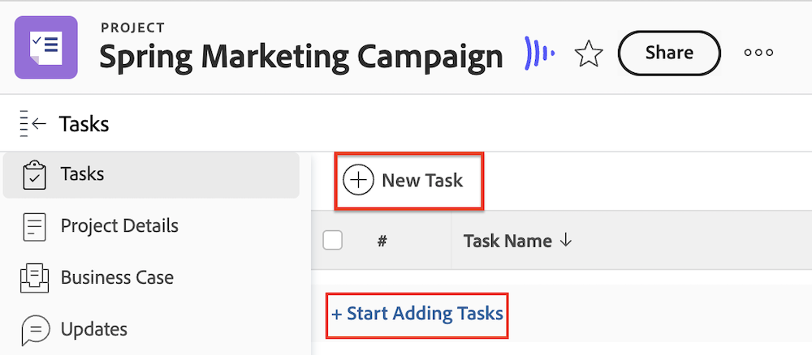

# 建立與Frame.io連線的專案

Workfront與Frame.io整合可讓您在Workfront中建立在Frame.io中映象的專案，提供順暢的檢閱和核准體驗。

當Workfront專案與Frame.io連線時，您可以

* **將Frame.io使用者指派給工作**：啟用Frame.io的使用者被指派給Workfront工作時，會收到電子郵件通知，以通知有工作要完成。
* **與Frame.io使用者共用專案**：當專案與已啟用Frame.io的使用者共用時，他們可存取Workfront和Frame.io內的專案。
* **與Frame.io共用創意素材**：專案專員可使用單向同步專案資料夾，直接從Workfront傳送指示和素材給Frame.io中的創意使用者。 [!BADGE 即將推出]{type=Informative}
* **追蹤任務進度**：創意人員可以傳送完成的資產，並將任務標示為完成 — 全部無需離開Frame.io。

## 存取需求

+++ 展開以檢視本文中功能的存取需求。 

>[!IMPORTANT]
>
>此功能僅適用於已加入[!DNL Adobe Admin Console]的組織。

您必須具備下列條件：

<table style="table-layout:auto"> 
 <col> 
 <col> 
 <tbody> 
  <tr> 
   <td role="rowheader">Adobe Workfront計畫</td> 
   <td> 
任何
 </td> 
  </tr> 
  <tr> 
   <td role="rowheader">Adobe Workfront授權</td> 
   <td> 
標準
 </td> 
  </tr> 
  <tr> 
   <td role="rowheader">存取層級設定</td> 
   <td> 
編輯專案的存取權
 </td> 
  </tr> 
  <tr> 
   <td role="rowheader">物件許可權</td> 
   <td> 
建立專案時，您會自動收到專案的管理許可權。
 </td> 
  </tr> 
 </tbody> 
</table>

如需有關此表格的詳細資訊，請參閱Workfront檔案中的[存取需求](/help/quicksilver/administration-and-setup/add-users/access-levels-and-object-permissions/access-level-requirements-in-documentation.md)。

+++

## 先決條件

* 在Workfront設定區域中設定預設的Frame.io帳戶
* 啟用Workfront使用者設定檔中的Frame.io使用者

如需上述必要條件的詳細資訊，請參閱[設定 [!DNL Workfront] 與 [!DNL Frame.io] 整合](/help/quicksilver/administration-and-setup/configure-integrations/configure-wf-and-frame.md)。

## 建立新的專案範本

建立新範本時，您可以為所有任務和未來專案設定輸入資訊。 然後，此資訊將傳輸至您從範本建立的任何專案。

Frame.io中的專案是由連線至Workfront群組的團隊所組織。 我們建議您使用專案範本來建立連線的專案，因為您之前可以設定專案群組。

如果您選擇從頭開始建立專案，Workfront會自動新增「預設」專案群組，而映象Frame.io專案則會在Frame.io中建立在該預設團隊下。

>[!NOTE]
>
>在專案建立後更新群組不會變更Frame.io群組。

### 建立範本並指定專案群組

{{step1-to-templates}}

1. 按一下&#x200B;**新增範本**。
1. 輸入範本的名稱，然後按&#x200B;**Enter**&#x200B;儲存名稱。
1. 在左側面板中，按一下&#x200B;**範本詳細資料**。
1. 在&#x200B;**範本關聯**&#x200B;區段中，確定指定群組。 如果您未新增群組，則會新增預設專案群組，且Frame.io中的專案會建立在Frame.io中對應的預設專案團隊下。

繼續下一節。

### 新增任務並指派啟用Frame.io的使用者

1. 在左側面板中，按一下&#x200B;**範本任務**。
1. 按一下&#x200B;**開始新增範本任務**&#x200B;以快速將任務新增至範本。 您稍後可以設定其他設定。

   或

   按一下&#x200B;**新增範本工作**，一次新增一個工作並設定其他設定。
   
1. 新增任務名稱。
1. 在&#x200B;**指派**&#x200B;區域中，指派使用者或團隊。 如果您指派已啟用Frame.io的使用者（無論是個別或團隊中），則會授予他們對Frame.io專案的共同作業人員存取權，並透過電子郵件通知他們有關Frame.io專案中的任務。 他們可以從該電子郵件加入Frame.io專案並開始工作。
1. 視需要重複步驟1和2。

繼續下一節。

### 設定其他範本詳細資訊

Workfront擁有強大的專案管理功能。 我們建議使用[編輯專案範本](/help/quicksilver/manage-work/projects/create-and-manage-templates/edit-templates.md)文章來設定範本的下列區域：

* 概觀
* 財務
* 自訂表單
* 專案設定
* 任務設定
* 問題設定
* 存取

### 從範本建立專案

建立範本後，您就可以用它來建立專案。

{{step1-to-projects}}

1. 按一下&#x200B;**從範本新增專案**。
1. 使用搜尋方塊，開始輸入您需要的範本名稱。
1. 選取範本名稱，然後按一下[使用範本]。**&#x200B;**
   
1. 視需要調整任何專案設定，然後按一下[建立專案]。**&#x200B;**
1. 在左側面板中，按一下&#x200B;**檔案**。
1. 使用單向同步資料夾，自動與Frame.io共用創意素材。 [!BADGE 即將推出]{type=Informative}

   >[!NOTE]
   >
   >此功能目前正在開發中。 若要與Frame.io中的使用者共用資訊，請將檔案上傳至「檔案」索引標籤。 當專案狀態設定為「目前」時，這些檔案會自動推送至Frame.io。

1. 在專案標題中，將專案從&#x200B;**計畫**&#x200B;變更為&#x200B;**目前**。

在建立專案且創意人員上傳完成的資產後，您可以在Workfront中指派檢閱和核准工作流程至資產。 如需詳細資訊，請參閱[建立檔案檢閱或核准要求](/help/quicksilver/review-and-approve-work/document-reviews-and-approvals/manage-document-approvals/create-a-document-approval.md)。<!-- name may need to change -->

## 從頭開始建立新專案

您可以視需要從頭開始建立新專案。

>[!IMPORTANT]
>
>* Frame.io中的專案是由連線至Workfront群組的團隊所組織。 我們建議您使用專案範本來建立連線的專案，因為您之前可以設定專案群組。
>
>
>* 如果您選擇從頭開始建立專案，Workfront會自動新增「預設」專案群組，而映象Frame.io專案則會在Frame.io中建立在該預設團隊下。
>
>在專案建立後更新群組不會變更Frame.io群組。

### 建立專案

{{step1-to-projects}}

1. 按一下&#x200B;**新增專案**。
1. 輸入專案名稱，然後按&#x200B;**Enter**&#x200B;儲存名稱。

繼續下一節。

### 新增任務並指派啟用Frame.io的使用者

1. 在左側面板中，按一下&#x200B;**工作**。
1. 按一下&#x200B;**開始新增任務**&#x200B;以快速將任務新增至您的專案。 您稍後可以設定其他設定。

   或

   按一下&#x200B;**新增工作**，一次新增一個工作並設定其他設定。
   
1. 新增任務名稱。
1. 在&#x200B;**指派**&#x200B;區域中，指派使用者或團隊。 如果您指派已啟用Frame.io的使用者（無論是個別或團隊中），則會授予他們對Frame.io專案的共同作業人員存取權，並透過電子郵件通知他們有關Frame.io專案中的任務。 他們可以從該電子郵件加入Frame.io專案並開始工作。
1. 視需要重複步驟1和2。

繼續下一節。

### 上傳創意素材

1. 在左側面板中，按一下&#x200B;**檔案**。
1. 使用單向同步資料夾，自動與Frame.io共用創意素材。 [!BADGE 即將推出]{type=Informative}

   >[!NOTE]
   >
   >此功能目前正在開發中。 若要與Frame.io中的使用者共用資訊，請將檔案上傳至「檔案」索引標籤。 當專案狀態設定為「目前」時，這些檔案會自動推送到Frame.io

繼續下一節。

### 設定其他專案詳細資訊

Workfront擁有強大的專案管理功能。 我們建議使用[編輯專案](/help/quicksilver/manage-work/projects/manage-projects/edit-projects.md)文章來設定專案的下列區域：

* 概觀
* 財務
* 自訂表單
* 專案設定
* 任務設定
* 問題設定
* 存取

### 將專案設定為目前

1. 在專案標題中，將專案從「計畫」變更為「目前」。
在建立專案且創意人員上傳完成的資產後，您可以在Workfront中指派檢閱和核准工作流程至資產。

在建立專案且創意人員上傳完成的資產後，您可以在Workfront中指派檢閱和核准工作流程至資產。

如需詳細資訊，請參閱[建立檔案檢閱或核准要求](/help/quicksilver/review-and-approve-work/document-reviews-and-approvals/manage-document-approvals/create-a-document-approval.md)。<!-- name may need to change -->
