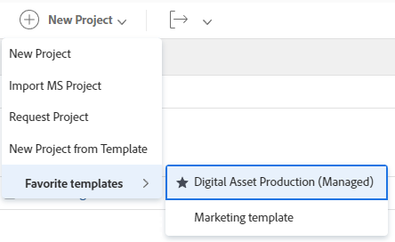

# 使用範本建立專案

<!-- Audited: 01/2024 -->

您可以使用範本作為框架，在Adobe Workfront中建立專案。 如果您的專案經常重複，則使用範本作為新專案的一般時間表，可讓您無須重複建立相同的專案。

範本提供您擷取與專案相關之可重複流程、資訊和設定的方式。 與範本相關的資訊會傳輸到專案。 這包括工作、指派、持續時間、檔案、財務詳細資訊、風險和自訂表單。

>[!TIP]
>
>Workfront會依照以下方式定義新專案的群組和狀態：
>
>* 從範本建立的新專案的預設狀態與您在主「專案偏好設定」區域中由Workfront管理員定義的狀態相對應，或與群組的「專案偏好設定」區域中的群組管理員(或Workfront管理員)相對應。 如需有關設定專案偏好設定的資訊，請參閱 [設定全系統專案偏好設定](../../../administration-and-setup/set-up-workfront/configure-system-defaults/set-project-preferences.md) 或 [設定群組的專案偏好設定](../../../administration-and-setup/manage-groups/create-and-manage-groups/configure-project-preferences-group.md).
>
>* 新專案的群組是範本的群組。 如果範本未與「群組」相關聯，則專案的「群組」是建立專案之使用者的「主群組」 。
>
>* 新專案的可用狀態與專案群組（範本群組，或建立專案之使用者的主群組）的狀態相符。

使用範本建立專案時，有以下選項：

* 從專案區域中的範本建立專案
* 在範本層級從範本建立專案
* 將範本附加至現有專案

  如需詳細資訊，請參閱 [將範本附加至專案](../../../manage-work/projects/create-and-manage-templates/attach-template-to-project.md).

* 從群組區域中的範本建立專案

## 存取需求

+++ 展開以檢視本文中功能的存取需求。

<!--drafted for P&P:

<table style="table-layout:auto"> 
 <col> 
 <col> 
 <tbody> 
  <tr> 
   <td role="rowheader">Adobe Workfront plan*</td> 
   <td> 
Any 
 </td> 
  </tr> 
  <tr> 
   <td role="rowheader">Workfront license*</td> 
   <td> 
Current license: Standard 

   Or
   
Legacy license: Plan 

    </td> 
  </tr> 
  <tr> 
   <td role="rowheader">Access level configurations*</td> 
   <td> 
Edit access to Projects and to Templates
 
<b>NOTE</b>
   
   If you still don't have access, ask your Workfront administrator if they set additional restrictions in your access level. For information about access to projects, see <a href="../../../administration-and-setup/add-users/configure-and-grant-access/grant-access-projects.md" class="MCXref xref">Grant access to projects</a>. For information on how a Workfront administrator can change your access level, see <a href="../../../administration-and-setup/add-users/configure-and-grant-access/create-modify-access-levels.md" class="MCXref xref">Create or modify custom access levels</a>. 
 </td> 
  </tr> 
  <tr> 
   <td role="rowheader">Object permissions</td> 
   <td> 
View permissions to a template
 
When you create a project you automatically receive Manage permissions to the project 
 
 For information about project permissions, see <a href="../../../workfront-basics/grant-and-request-access-to-objects/share-a-project.md" class="MCXref xref">Share a project in Adobe Workfront</a>.
 
For information on requesting additional access, see <a href="../../../workfront-basics/grant-and-request-access-to-objects/request-access.md" class="MCXref xref">Request access to objects </a>.
 </td> 
  </tr> 
 </tbody> 
</table>
-->

您必須具有下列存取權才能執行本文中的步驟：

<table style="table-layout:auto"> 
 <col> 
 <col> 
 <tbody> 
  <tr> 
   <td role="rowheader">Adobe Workfront計畫</td> 
   <td> 
任何 
 </td> 
  </tr> 
  <tr> 
   <td role="rowheader">Workfront授權</td> 
   <td> 
新增：標準

        
或

        
目前：計畫 
 </td> 
  </tr> 
  <tr> 
   <td role="rowheader">存取層級設定</td> 
   <td> 
編輯專案和範本的存取權
 </td> 
  </tr> 
  <tr> 
   <td role="rowheader">物件許可權</td> 
   <td> 
檢視範本的許可權
 
建立專案時，您會自動收到專案的管理許可權。
</td> 
  </tr> 
 </tbody> 
</table>

如需有關此表格的詳細資訊，請參閱 [Workfront檔案中的存取需求](/help/quicksilver/administration-and-setup/add-users/access-levels-and-object-permissions/access-level-requirements-in-documentation.md).

+++

## 從專案區域中的範本建立專案

您可以從主要功能表的「專案」區域，或從投資組合或方案的專案區域建立專案。

>[!NOTE]
>
>您的系統或群組管理員可能會使用版面配置範本修改您的介面。 在此情況下，以下步驟中參照的某些區段和區域名稱，在您的Workfront例項中可能不同。

1. 執行下列其中一項：

   * 按一下 **[!UICONTROL 主要功能表]** 圖示  在Adobe Workfront的右上角，或（如果有的話）按一下 **[!UICONTROL 主要功能表]** 圖示  左上角。 按一下 **專案**，然後展開 **新增專案**.
   * 前往投資組合，然後展開 **新增專案**.

     >[!TIP]
     >
     >當您使用專案組合中的範本建立專案時，新專案的「Portfolio」欄位會更新，以顯示您選擇建立專案的來源專案組合。 如果已指定，這會覆寫範本上的Portfolio欄位。

   * 前往程式，然後展開 **新增專案**.

     >[!TIP]
     >
     >使用方案中的範本建立專案時，新專案的「方案」欄位會更新，以顯示您選擇建立專案的方案。 範本的「Portfolio」欄位會更新，以顯示您選擇建立專案的計畫組合。 如果已指定，這會覆寫範本上的程式和Portfolio欄位。

   * 如果您是群組管理員，您也可以在您管理之群組的專案區段中建立專案。 如需詳細資訊，請參閱 [建立和修改群組的專案](../../../administration-and-setup/manage-groups/work-with-group-objects/create-and-modify-a-groups-projects.md).

     >[!TIP]
     >
     >使用群組的範本建立專案時，僅當未指定範本的群組欄位時，您從中建立專案的群組才會顯示在新專案的群組欄位中。 如果指定了範本「群組」欄位，則新專案的「群組」欄位就是範本的「群組」欄位。

   <!--
   
(this, above, is hyperlinked to the classic version of this article; the Milestone View steps are similar to creating a project in Classic than to the way you do it in NWE)

   -->

   

1. 按一下中範本的名稱 **我的最愛範本** 清單。

   

   或

   執行下列動作：

   1. 選取 **透過範本新增專案**.
   1. 在 **搜尋範本** 欄位，開始輸入範本的名稱，並在範本顯示在清單中時按一下它。
   1. 檢閱右側的範本詳細資訊。

      範本詳細資料包括：

      * 範本持續時間
      * 範本所有者
      * 最上層工作的數目，包括前三個工作的名稱
      * 範本中所有任務的數量
      * 範本自訂表單的名稱

   1. （可選）將滑鼠懸停在左窗格中的範本名稱上，然後按一下 **我的最愛** **圖示**  以標示為未來使用的最愛。

      或

      展開 **我的最愛範本** 清單並從下拉式清單中選取範本。

      >[!TIP]
      >
      >您最多可以有40個Workfront專案標示為我的最愛。 這包括範本和其他專案。

   1. 按一下 **使用範本** 當您已選取範本時。

      

      >[!NOTE]
      >
      >如果您已將「里程碑檢視」套用至專案清單，請在 **從範本區段新增**.
      >
      >
      >
      >

   此 **新增專案** 方塊開啟。

   

1. 如果欄位已填入範本中，則該欄位會預先填入 **新增專案** 方塊。 您可以編輯預先填入的值，以更符合您的專案。 如需詳細資訊，請參閱 [編輯專案](../../../manage-work/projects/manage-projects/edit-projects.md).
1. 按一下 **建立專案**.

   如果您在上一步沒有變更範本中定義的所有詳細資訊，這些詳細資訊會自動與新建立的專案建立關聯。

## 從範本區域中的範本建立專案

您可以從範本開始建立專案，而不是從專案區域開始。

{{step1-to-templates}}

1. 按一下您要使用的範本名稱。
1. 按一下 **更多** 功能表 ，然後按一下 **建立專案**.

   

   此 **新增專案** 方塊開啟。

1. 輸入專案名稱，然後檢閱每個區段並進行任何必要的變更。

   

   如果欄位已填入範本中，則該欄位會預先填入 **新增專案** 方塊。 您可以編輯預先填入的值，以更符合您的專案。 如需詳細資訊，請參閱 [編輯專案](../../../manage-work/projects/manage-projects/edit-projects.md).

1. 按一下 **建立專案**.

   如果您在上一步沒有變更範本中定義的所有詳細資訊，這些詳細資訊會自動與新建立的專案建立關聯。
