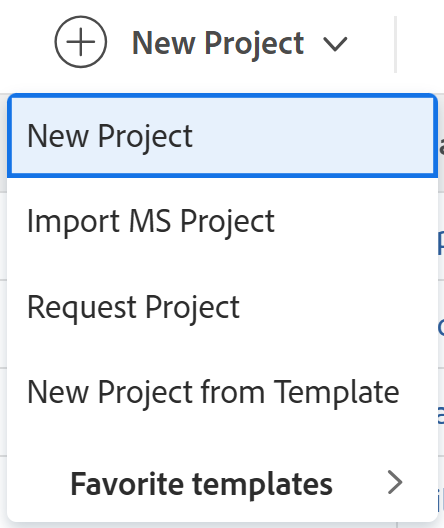

# 建立專案

<!--

(NOTE:this is linked from the UI from the Projects global nav section in classic. Do not change/ remove)

-->

項目代表了在Adobe Workfront需要完成的大量工作。

## 存取需求

<!--drafted for P&P - replace table below with this:

<table style="table-layout:auto"> 
 <col> 
 <col> 
 <tbody> 
  <tr> 
   <td role="rowheader">Workfront plan*</td> 
   <td> 
Any
 </td> 
  </tr> 
  <tr> 
   <td role="rowheader">Workfront license*</td> 
   <td> 
Current license: Standard 

   Or
   
Legacy license: Plan 

    </td> 
  </tr> 
  <tr> 
   <td role="rowheader">Access level*</td> 
   <td> 
Edit access to Projects
 
<b>NOTE</b>
   
   If you still don't have access, ask your Workfront administrator if they set additional restrictions in your access level. For information about access to projects, see <a href="../../../administration-and-setup/add-users/configure-and-grant-access/grant-access-projects.md" class="MCXref xref">Grant access to projects</a>. For information on how a Workfront administrator can change your access level, see <a href="../../../administration-and-setup/add-users/configure-and-grant-access/create-modify-access-levels.md" class="MCXref xref">Create or modify custom access levels</a>. 
 </td> 
  </tr> 
  <tr> 
   <td role="rowheader">Object permissions</td> 
   <td> 
When you create a project you automatically receive Manage permissions to the project 
 
 For information about project permissions, see <a href="../../../workfront-basics/grant-and-request-access-to-objects/share-a-project.md" class="MCXref xref">Share a project in Adobe Workfront</a>.
 
For information on requesting additional access, see <a href="../../../workfront-basics/grant-and-request-access-to-objects/request-access.md" class="MCXref xref">Request access to objects </a>.
 </td> 
  </tr> 
 </tbody> 
</table>

-->

您必須具備下列存取權，才能執行本文中的步驟：

<table style="table-layout:auto"> 
 <col> 
 <col> 
 <tbody> 
  <tr> 
   <td role="rowheader">Workfront計畫*</td> 
   <td> 
任何
 </td> 
  </tr> 
  <tr> 
   <td role="rowheader">Workfront授權*</td> 
   <td> 
計劃 
 </td> 
  </tr> 
  <tr> 
   <td role="rowheader">存取層級*</td> 
   <td> 
編輯專案的存取權
 
<b>附註</b>

如果您仍無權存取，請洽詢您的Workfront管理員，他們是否在您的存取層級設定其他限制。 如需存取專案的相關資訊，請參閱 <a href="../../../administration-and-setup/add-users/configure-and-grant-access/grant-access-projects.md" class="MCXref xref">授予專案的存取權</a>. 如需Workfront管理員如何變更您的存取層級的詳細資訊，請參閱 <a href="../../../administration-and-setup/add-users/configure-and-grant-access/create-modify-access-levels.md" class="MCXref xref">建立或修改自訂存取層級</a>. 
 </td>
</tr> 
  <tr> 
   <td role="rowheader">物件權限</td> 
   <td> 
建立專案時，您會自動收到專案的「管理」權限 
 
 如需專案權限的相關資訊，請參閱 <a href="../../../workfront-basics/grant-and-request-access-to-objects/share-a-project.md" class="MCXref xref">在Adobe Workfront中共用專案</a>.
 
有關請求其他訪問的資訊，請參閱 <a href="../../../workfront-basics/grant-and-request-access-to-objects/request-access.md" class="MCXref xref">請求對對象的訪問 </a>.
 </td> 
  </tr> 
 </tbody> 
</table>

&#42;若要了解您擁有的計畫、授權類型或存取權，請聯絡您的Workfront管理員。

## 建立專案的方式

您可以使用下列其中一種方法，在Workfront中建立專案：

* 從草稿開始建立專案，而不使用範本。 本文說明如何從頭建立專案。

* 複製現有專案。\
   如需複製專案的詳細資訊，請參閱 [複製專案](../../../manage-work/projects/manage-projects/copy-project.md).

* 使用範本。\
   如需使用範本建立新專案的詳細資訊，請參閱 [使用範本建立專案](../../../manage-work/projects/create-projects/create-project-from-template.md).

* 從Microsoft專案匯入專案。\
   有關從MS項目導入項目的詳細資訊，請參見 [從Microsoft專案匯入專案](../../../manage-work/projects/create-projects/import-project-from-ms-project.md).

* 使用啟動匯入專案。

   身為Workfront管理員，您可以使用啟動來匯入專案。

   如需有關在Workfront中使用啟動匯入資料的資訊，請參閱 [使用Kick-Start範本將資料匯入Adobe Workfront](../../../administration-and-setup/manage-workfront/using-kick-starts/import-data-via-kickstarts.md) .

   如需有關使用啟動匯入專案的資訊，請參閱 [Kick-Starts案例：簡單的項目和任務導入準備](../../../administration-and-setup/manage-workfront/using-kick-starts/kick-starts-scenario-simple-project-task-import-prep.md) .

* 從Adobe Workfront方案規劃器中的方案發佈方案。 方案規劃器需要附加許可證。 有關Workfront方案計畫器的資訊，請參閱 [方案計畫員概覽](../../../scenario-planner/scenario-planner-overview.md). 如需從發佈活動建立專案的相關資訊，請參閱  [通過在方案計畫器中發佈方案來更新或建立項目](../../../scenario-planner/publish-scenarios-update-projects.md).

## 必要條件

開始之前，您必須確保

* 您的系統或群組管理員在「設定」區域中啟用「允許使用者建立專案而不使用範本」偏好設定。

   如需詳細資訊，請參閱 [配置系統範圍的項目首選項](../../../administration-and-setup/set-up-workfront/configure-system-defaults/set-project-preferences.md).

## 新專案預設設定

建立專案時，Workfront會套用一組預設設定。 例如，建立專案時，預設了狀態、群組或排程模式。

請考量下列事項：

* 以Workfront管理員或群組管理員的身分，在設定專案偏好設定時，可以設定新專案的預設設定。
* Workfront會先套用群組的設定（如果有的話），再套用Workfront管理員設定的設定。
* 如果您使用範本建立專案，範本的設定優先於Workfront或群組管理員所建立的設定。

   >[!NOTE]
   >
   >建議新項目的預設狀態為「計畫」。 當您變更新專案時，這可確保通知不會觸發給指派給專案的使用者。
   >
   >有關為新項目設定預設狀態和其他預設設定的詳細資訊，請參閱 [配置系統範圍的項目首選項](../../../administration-and-setup/set-up-workfront/configure-system-defaults/set-project-preferences.md) 或 [配置組的項目首選項](../../../administration-and-setup/manage-groups/create-and-manage-groups/configure-project-preferences-group.md).

* Workfront將新專案的群組和狀態定義為：

   * 從模板建立的新項目的預設狀態與主「項目首選項」區域中的Workfront管理員或組的「項目首選項」區域中的組管理員(或Workfront管理員)所定義的狀態相對應。

   * 新項目組是模板組。 如果模板未與組關聯，則項目組是建立項目的用戶的首頁組。

   * 新項目可用的狀態與項目組的狀態匹配，該項目組是模板組或建立項目的用戶的首頁組。

   * 通過將問題轉換為項目而建立的新項目組是問題的現有項目組。 如果轉換問題的使用者無權存取問題的專案，則新專案的群組為轉換問題的使用者的首頁群組。 新項目的狀態與與項目關聯的組的組狀態匹配，該組是原始項目的組或轉換問題的用戶的主組。

## 從頭建立專案

1. 執行下列任一項作業：

   * 按一下 **主菜單** ，按一下 **專案**，然後展開 **新增專案**.
   * 前往產品組合，然後展開 **新增專案**.

      >[!TIP]
      >
      >當您使用產品組合中的範本建立專案時，新專案的「Portfolio」欄位會更新，以顯示您選擇建立專案的產品組合。 如果已指定，則會覆寫範本上的Portfolio欄位。

   * 前往程式，然後展開 **新增專案**.

      >[!TIP]
      >
      >使用方案的模板建立項目時，新項目的「方案」欄位將更新，以顯示您選擇建立項目的方案。 範本的「Portfolio」欄位會更新，以顯示您選擇建立專案的方案組合。 這會覆寫範本上的程式和Portfolio欄位（如果已指定）。

   * 如果您是群組管理員，也可以在您管理之群組的「專案」區段中建立專案。 如需詳細資訊，請參閱 [建立和修改群組的專案](../../../administration-and-setup/manage-groups/work-with-group-objects/create-and-modify-a-groups-projects.md).

      >[!TIP]
      >
      >使用組中的模板建立項目時，僅當未指定模板的「組」欄位時，才會在新項目的「組」欄位中顯示從中建立項目的組。 如果指定了模板組欄位，則新項目的組欄位為模板的組欄位。
   

1. 按一下 **新增專案** 如果您想從頭建立專案。
1. 輸入專案的名稱。 按Enter鍵保存名稱。

   

   專案頁面的標題會顯示專案目前狀況和進度的快速概覽。 專案標題中的資訊會隨著專案資訊的更新而變更。

1. 按一下 **開始添加** **工作**.

   或

   按一下 **新任務** 向項目添加任務並為其分配資源。\
   如需新增工作至專案的詳細資訊，請參閱 [在專案中建立任務](../../../manage-work/tasks/create-tasks/create-tasks-in-project.md).

1. 按一下&#x200B;**更多功能表** 然後 **編輯**  項目名稱旁邊。

   此 **編輯專案** 對話框。

   如需編輯專案的詳細資訊，請參閱 [編輯專案](../../../manage-work/projects/manage-projects/edit-projects.md).

1. （選用）設定專案設定並新增工作後，您可以將專案的狀態變更為 **目前**.

   這表示專案現在已準備好開始，指派給工作的使用者現在可以開始使用這些工作。

   如需專案狀態的詳細資訊，請參閱 [訪問系統項目狀態清單](../../../administration-and-setup/customize-workfront/creating-custom-status-and-priority-labels/project-statuses.md).
