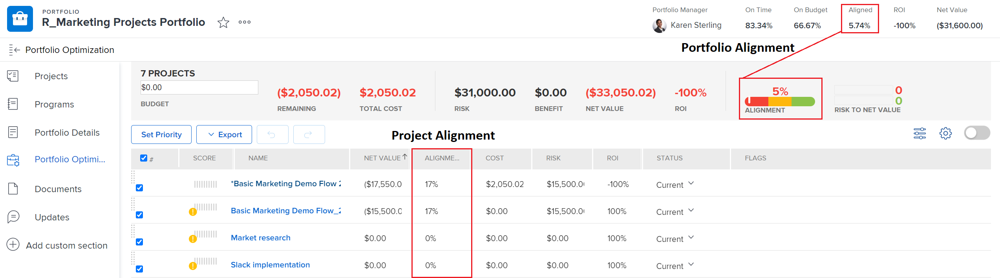

# 將計分卡套用至專案並產生一致性分數

<!-- Audited: 02/2024 -->

您可以使用計分卡來測量專案與先前建立的專案組合准則的符合程度。 計分卡通常可反映組織的使命、價值和策略目標。

如需計分卡及其建立方式的詳細資訊，請參閱 [建立計分卡](../../../administration-and-setup/set-up-workfront/configure-system-defaults/create-scorecard.md).

## 存取需求

+++ 展開以檢視本文中功能的存取需求。

您必須具有下列存取權才能執行本文中的步驟：

<table style="table-layout:auto"> 
 <col> 
 <col> 
 <tbody> 
  <tr> 
   <td role="rowheader">Adobe Workfront計畫</td> 
   <td>
   
新增：Prime或更高

   
或

   
目前：商務或以上
 </td>
  </tr> 
  <tr> 
   <td role="rowheader">Adobe Workfront授權</td> 
   <td>
   
新增：標準

   
或

   
目前：計畫
</td>  
  </tr> 
  <tr> 
   <td role="rowheader">存取層級設定</td> 
   <td> 
編輯專案的存取權
 
檢視或更高的Portfolio存取許可權
 </td> 
  </tr> 
  <tr> 
   <td role="rowheader">物件許可權</td> 
   <td>
管理專案的許可權
 
檢視或更高的投資組合許可權
 </td> 
  </tr> 
 </tbody> 
</table>

如需有關此表格的詳細資訊，請參閱 [Workfront檔案中的存取需求](/help/quicksilver/administration-and-setup/add-users/access-levels-and-object-permissions/access-level-requirements-in-documentation.md).

+++

## 專案計分卡 {#project-scorecards}

* [計分卡概觀](#scorecards-overview)
* [將計分卡套用至專案](#apply-a-scorecard-to-a-project)

### 計分卡概觀 {#scorecards-overview}

通常，專案經理會完成計分卡資訊，以便為專案產生介於0到100之間的對齊值。 產品組合經理在審查產品組合最佳化工具中的專案以進行比較時，稍後會使用產生的值。

如需產品組合最佳化的詳細資訊，請參閱 [Portfolio最佳化工具概觀](../../../manage-work/portfolios/portfolio-optimizer/portfolio-optimizer-overview.md).

### 將計分卡套用至專案

作為具有Standard或Plan授權和管理專案許可權的使用者，您可以附加計分卡到專案。

如需有關專案許可權的詳細資訊，請參閱 [在Adobe Workfront中共用專案](../../../workfront-basics/grant-and-request-access-to-objects/share-a-project.md).

您可以將計分卡新增至專案，作為建立專案業務案例的一部分。

如需建立業務案例的詳細資訊，請參閱 [為專案建立業務案例](../../../manage-work/projects/define-a-business-case/create-business-case.md).

您的Adobe Workfront管理員或群組管理員必須在您的專案的業務案例區域中啟用計分卡區段，然後才能從業務案例存取計分卡。 有關設定專案偏好設定和啟用業務案例區域的資訊，請參閱 [設定全系統專案偏好設定](../../../administration-and-setup/set-up-workfront/configure-system-defaults/set-project-preferences.md).

若要將計分卡套用至專案：

1. 前往您要套用計分卡的專案。
1. 按一下 **業務案例** 在左側面板中。
1. 尋找 **計分卡** 業務案例的區段。\
   您必須先建立計分卡，然後再執行 **計分卡** 區段會顯示在業務案例上。

   如需建立計分卡的相關資訊，請參閱 [建立計分卡](../../../administration-and-setup/set-up-workfront/configure-system-defaults/create-scorecard.md).

1. 從下拉式選單中選取計分卡。

   

1. 輸入計分卡中所有問題的答案。

   Workfront會對每個已回答的問題套用分數，並根據每個問題的個別分數計算整體專案分數。

   如需有關產生專案整體對齊分數的詳細資訊，請參閱 [產生專案的對齊分數](#generate-an-alignment-score-for-a-project).

1. 按一下 **儲存** 以儲存計分卡並對專案評分。

   計分卡現在與專案相關聯，且專案已評分。

<!--This functionality was removed when we redesigned bulk editing projects with 23.2: 

1. (Conditional) When changes occur in the values of scorecard questions, you must recalculate the scorecard to reflect the new values for the project score. To recaulate the scorecard, do the following: 

   1. Go to a list of projects and select all projects in the list. 
   1. Click the **Edit** icon at the top of the list. 
   1. Click **Settings** in the left panel, then check the **Recalculate Scorecards** option at the end of the Settings area. 
   1. Click Save. This recalculates the score value based on the scorecards attached for all the selected projects.  

      >[!NOTE]
      >
      >   The option to recalculate scorecards has been removed from the Preview environment, when editing projects in bulk. 

-->

## 產生一致性分數

* [產生專案的對齊分數](#generate-an-alignment-score-for-a-project)
* [產生投資組合的校準分數](#generate-an-alignment-score-for-a-portfolio)

### 產生專案的對齊分數 {#generate-an-alignment-score-for-a-project}

一致性分數是完成計分卡後產生的值。

計分卡中包含的問題具有已指派數值（稱為對齊點）的答案選項。 這些要點可用於確定專案與您的組織的對齊程度。 每個問題的對齊點包含一個介於0到100之間的數字。

計分卡完成時，Workfront會使用下列公式，以百分比計算專案的對齊分數：

`Project Alignment Score = The sum of the question points from the scorecard met at a given time / The sum of the possible points on the scorecard`

如需詳細資訊，請參閱 [建立計分卡](../../../administration-and-setup/set-up-workfront/configure-system-defaults/create-scorecard.md).

### 產生投資組合的校準分數 {#generate-an-alignment-score-for-a-portfolio}

投資組合的對齊分數是投資組合中所有專案的對齊分數的平均值。

專案的計分卡完成時，Workfront會使用這些值，透過下列公式以百分比計算投資組合的對齊分數：

`Portfolio Alignment Score = The sum of the percentages of the project alignment scores / Number of projects in the portfolio`

>[!NOTE]
>
>如果專案沒有關聯的計分卡，因此就沒有一致性分數，則會視為投資組合中的一致性為0%。 投資組合中的專案數量會考慮專案。

## 檢視一致性分數

您可以在專案層級或Portfolio最佳化工具中檢視專案的對齊分數。

* [檢視專案上的對齊分數](#view-the-alignment-score-on-a-project)
* [在Portfolio最佳化工具中檢視專案和專案組合的對齊分數](#view-the-alignment-scores-of-the-project-and-of-the-portfolio-in-the-portfolio-optimizer)

### 檢視專案上的對齊分數

如果您擁有專案的貢獻許可權，則可以在專案層級檢視專案的對齊分數。

1. 前往您要檢視其對齊分數的專案。
1. 按一下 **業務案例** 在左側面板中。
1. 前往 **業務案例摘要** 在熒幕的右側。

   一致性分數位於業務案例摘要中，位於 **已對齊** 值。

   

### 在Portfolio最佳化工具中檢視專案和專案組合的對齊分數

如果您擁有專案組合的管理存取權，可以在Portfolio最佳化工具中檢視專案或專案組合的對齊分數。

如需有關「Portfolio最佳化程式」中所顯示資訊的詳細資訊，請參閱 [Portfolio最佳化工具概觀](../../../manage-work/portfolios/portfolio-optimizer/portfolio-optimizer-overview.md).

* [在Portfolio最佳化工具中找出專案的對齊分數](#locate-the-alignment-score-of-the-project-in-the-portfolio-optimizer)
* [在Portfolio最佳化工具中找出專案組合的對齊分數](#locate-the-alignment-score-of-the-portfolio-in-the-portfolio-optimizer)

  

#### 在Portfolio最佳化工具中找出專案的對齊分數 {#locate-the-alignment-score-of-the-project-in-the-portfolio-optimizer}

{{step1-to-portfolios}}

1. 按一下投資組合的名稱。
1. 按一下 **Portfolio最佳化** 在左側面板中。

   隨即顯示Portfolio最佳化工具。

   專案的對齊方式分數會以百分比形式顯示於 **對齊方式** Portfolio最佳化處理程式的欄。

   這是根據與專案相關聯計分卡的專案一致性分數。

#### 在Portfolio最佳化工具中找出專案組合的對齊分數  {#locate-the-alignment-score-of-the-portfolio-in-the-portfolio-optimizer}

{{step1-to-portfolios}}

1. 按一下投資組合的名稱。
1. 按一下 **Portfolio最佳化** 在左側面板中。
1. 在Portfolio最佳化工具頂端找到 **已對齊** 值，以及 **對齊方式** 量測計，表示投資組合的對齊分數。

   這是投資組合的對齊分數。

   如需如何產生投資組合的對齊分數的相關資訊，請參閱 [產生投資組合的校準分數](#generate-an-alignment-score-for-a-portfolio).

## Portfolio最佳化工具分數概述

一致性分數和專案的投資組合最佳化工具分數之間有所差異。

專案的對齊分數是根據完成計分卡後獲得的點數來計算。 然後，會使用此分數來決定產品組合校準分數。 對齊分數會以百分比顯示。

專案的對齊方式分數會顯示在 **對齊方式** Portfolio最佳化處理程式的欄。

專案組合最佳化工具分數是在Portfolio最佳化工具中自動計算的排名，專案可依此排定優先順序。 專案組合最佳化工具分數會顯示為指標圖示並附上數字，且會顯示在 **分數** Portfolio最佳化處理程式的欄。 Portfolio最佳化工具分數只會在業務案例的所有區段（目標除外）完成後產生。

如需為專案建立業務案例的詳細資訊，請參閱 [為專案建立業務案例](../../../manage-work/projects/define-a-business-case/create-business-case.md).

如需有關計算專案之專案組合最佳化工具分數的詳細資訊，請參閱 [Portfolio最佳化工具分數概述](../../../manage-work/portfolios/portfolio-optimizer/portfolio-optimizer-score.md).
