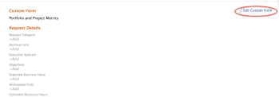

# 將自訂表格附加至業務案例

自訂Forms用於收集未顯示在現有Adobe Workfront欄位中的資訊。 

如需有關建立自訂Forms的詳細資訊，請參閱文章[使用表單設計工具設計表單](/help/quicksilver/administration-and-setup/customize-workfront/create-manage-custom-forms/form-designer/design-a-form/design-a-form.md)。

## 存取需求

您必須具有下列存取權才能執行本文中的步驟：

<table style="table-layout:auto"> 
 <col> 
 <col> 
 <tbody> 
  <tr> 
   <td role="rowheader">Adobe Workfront計畫*</td> 
   <td> 
Pro或更高
 </td> 
  </tr> 
  <tr> 
   <td role="rowheader">Adobe Workfront授權*</td> 
   <td> 
計劃 
 </td> 
  </tr> 
  <tr> 
   <td role="rowheader">存取層級設定*</td> 
   <td> 
編輯專案的存取權
 
注意：如果您還是沒有存取權，請詢問您的Workfront管理員，他們是否在您的存取層級中設定其他限制。 如需Workfront管理員如何修改存取層級的詳細資訊，請參閱<a href="../../../administration-and-setup/add-users/configure-and-grant-access/create-modify-access-levels.md" class="MCXref xref">建立或修改自訂存取層級</a>。
 </td> 
  </tr> 
  <tr> 
   <td role="rowheader">物件許可權</td> 
   <td> 
管理專案的許可權或更高版本
 
如需請求其他存取權的資訊，請參閱<a href="../../../workfront-basics/grant-and-request-access-to-objects/request-access.md" class="MCXref xref">請求物件</a>的存取權。
 </td> 
  </tr> 
 </tbody> 
</table>

&#42;若要瞭解您擁有的計畫、授權型別或存取權，請連絡您的Workfront管理員。

## 將自訂Forms附加至專案

您可以在下列區域將自訂Forms附加至專案：

* 編輯專案時，位於專案詳細資訊區段。
* 編輯專案時，在「編輯專案」方塊中。
* 從專案清單大量編輯多個專案時。

  如需有關在編輯一或多個專案時將自訂表單附加到專案的資訊，請參閱文章[編輯專案](../../../manage-work/projects/manage-projects/edit-projects.md)。

* 建立專案的業務案例時，請依照本文所述在業務案例中。

如需將自訂表單附加至物件的相關資訊，請參閱[將自訂表單新增至物件](../../../workfront-basics/work-with-custom-forms/add-a-custom-form-to-an-object.md)。

## 將自訂Forms附加至業務案例

若要將自訂從新增至業務案例，您的Workfront管理員需要在「設定」中選取此選項。 如需有關在設定中啟用自訂表單的詳細資訊，請參閱[設定全系統專案偏好設定](../../../administration-and-setup/set-up-workfront/configure-system-defaults/set-project-preferences.md)一文中的[設定全系統專案偏好設定](../../../administration-and-setup/set-up-workfront/configure-system-defaults/set-project-preferences.md)一節。

若要附加自訂表單：

1. 前往您要附加表單的專案，然後按一下左側面板中的&#x200B;**業務案例**。

   業務案例隨即顯示。

1. 在&#x200B;**自訂表單**&#x200B;區段中，從下拉式功能表中選取您要附加的自訂表單。

   

1. （選擇性）選取&#x200B;**編輯自訂表格**。\
   

1. （選擇性）在自訂表單的欄位中指定資訊，然後按一下&#x200B;**儲存** 。
