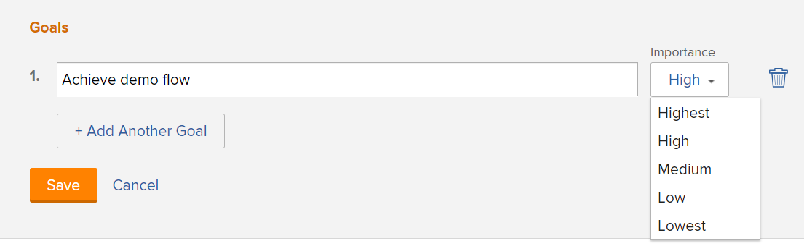

# 建立業務案例目標

建立業務案例時，您可以建立一組目標來定義專案的目標。 業務案例目標用於與Portfolio經理或項目贊助商溝通以完成項目。

<!--

(NOTE: below snippet: NWE only, not classic)

-->

>[!TIP]
>
>您可以為組織建立未與專案個別業務案例連結的策略目標。 您必須擁有Adobe Workfront目標的存取權，才能建立策略目標。 然後，您就可以將他們與其業務案例以外的專案連結。 如需使用Workfront目標建立目標的相關資訊，請參閱 [Adobe Workfront目標概覽](../../../workfront-goals/goal-management/wf-goals-overview.md).

為您的專案建立業務案例目標時，請考慮下列事項：

* 業務案例目標是專案專屬的。 您無法將目標從一個項目複製到另一個項目，也無法在系統級別建立目標。 必須在每個專案的層級定義。
* 您的Adobe Workfront管理員或群組管理員必須先啟用專案的「目標」區段，才會顯示在您專案的「業務案例」中。 有關為項目啟用「業務案例」欄位的資訊，請參閱 [配置系統範圍的項目首選項](../../../administration-and-setup/set-up-workfront/configure-system-defaults/set-project-preferences.md).

* 目標不是專案商業案例中的必要章節。

   即使未定義業務案例的「目標」部分，項目仍可接收要在Portfolio優化程式中排定優先順序的分數。

   如需Portfolio優化程式分數的詳細資訊，請參閱 [將計分卡套用至專案並產生對齊分數](../../../manage-work/projects/define-a-business-case/apply-scorecard-to-project-to-generate-alignment-score.md).

* 您無法報告業務案例目標。

## 存取需求

您必須具備下列存取權，才能執行本文中的步驟：

<table style="table-layout:auto"> 
 <col> 
 </col> 
 <col> 
 </col> 
 <tbody> 
  <tr> 
   <td role="rowheader">Adobe Workfront計畫*</td> 
   <td> 
Pro或更高版本
 </td> 
  </tr> 
  <tr> 
   <td role="rowheader">Adobe Workfront授權*</td> 
   <td> 
計劃 
 </td> 
  </tr> 
  <tr> 
   <td role="rowheader">訪問級別配置*</td> 
   <td> 
編輯專案的存取權
 
注意：如果您仍無權存取，請洽詢您的Workfront管理員，他們是否在您的存取層級設定其他限制。 如需Workfront管理員如何修改您的存取層級的詳細資訊，請參閱 <a href="../../../administration-and-setup/add-users/configure-and-grant-access/create-modify-access-levels.md" class="MCXref xref">建立或修改自訂存取層級</a>.
 </td> 
  </tr> 
  <tr> 
   <td role="rowheader">物件權限</td> 
   <td> 
管理專案的權限或更高權限
 
有關請求其他訪問的資訊，請參閱 <a href="../../../workfront-basics/grant-and-request-access-to-objects/request-access.md" class="MCXref xref">請求對對象的訪問 </a>.
 </td> 
  </tr> 
 </tbody> 
</table>

&#42;若要了解您擁有的計畫、授權類型或存取權，請聯絡您的Workfront管理員。

## 將目標新增至專案的業務案例

1. 轉到要為其定義業務案例目標的項目。
1. 按一下 **左側面板中的「業務案例」。**

   業務案例隨即顯示。

   

1. 在 **目標** ，按一下 **編輯目標**.

1. 指定您的目標。
 在 **重要性** 下拉式功能表中，選取重要性層級：

   * 最高
   * 高
   * 中
   * 低
   * 最低

      

      您無法自訂目標的「重要性」層級。

1. （選用）若要新增其他目標，請按一下 **新增其他目標**&#x200B;並重複步驟5和步驟6。
1. 按一下 **儲存**.
