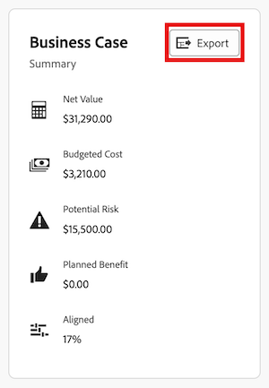

# 匯出專案的業務案例

您可以將業務案例匯出至PDF檔案，以備您需要列印時使用，或以更精簡的格式附加至電子郵件。

## 存取需求

+++ 展開以檢視本文中功能的存取需求。

<table style="table-layout:auto"> 
 <col> 
 <col> 
 <tbody> 
  <tr> 
   <td role="rowheader">
Adobe Workfront計畫*
</td> 
   <td> 
目前：Prime或更新版本 
 
舊版：Pro或更高版本 
 </td> 
  </tr> 
  <tr> 
   <td role="rowheader">
Adobe Workfront授權*
</td> 
   <td> 
   
目前：淺色或更高

   
舊版：檢閱或更高版本
 </td> 
  </tr> 
  <tr> 
   <td role="rowheader">存取層級設定</td> 
   <td> 
檢視專案、財務資料及資源管理的存取權
 </td> 
  </tr> 
  <tr> 
   <td role="rowheader">物件許可權</td> 
   <td> 
檢視專案或更高的許可權
 </td> 
  </tr> 
 </tbody> 
</table>

*如需詳細資訊，請參閱Workfront檔案中的[存取需求](/help/quicksilver/administration-and-setup/add-users/access-levels-and-object-permissions/access-level-requirements-in-documentation.md)。

+++

## 匯出業務案例

{{step1-to-projects}}

1. 在&#x200B;**專案**&#x200B;頁面上，選取您要匯出業務案例的專案。
1. 按一下左側面板中的&#x200B;**業務案例**。
1. 在&#x200B;**業務案例摘要**&#x200B;區域的右上角，按一下&#x200B;**匯出**。 PDF檔案已下載至您的電腦。

   

