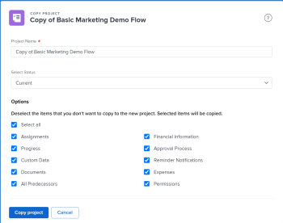

# 複製專案

<!--
<(LINKED TO THE PRODUCT IN THE COPY PROJECT BOX)

-->

您可以複製專案，而不是從頭開始建立。 您一次只能複製一個專案。 您無法大量複製專案。

>[!IMPORTANT]
>
>下列專案絕不會從現有專案複製到新專案：
>
>* 問題
>* 收費率
>* 付費記錄
>* 附註
>* 時數
>* 跨專案前置任務
>* 預算時數
>
>下列專案一律會從現有專案複製到新專案：
>
>* 任務
>* 範本
>* 風險
>* 佇列設定資訊
>* Portfolio與計畫
>* 計分卡
>* 任務預設資訊(任務預設核准流程、任務預設自訂Forms)
>
> 專案上原始任務的日期複製到新專案。 您必須變更專案的開始或完成日期（視其排程模式而定）以更新任務的日期。 任務限制可能會阻止您變更專案的日期。

## 存取需求

<!-- drafted for P&P:
<table style="table-layout:auto"> 
 <col> 
 <col> 
 <tbody> 
  <tr> 
   <td> 
Adobe Workfront plan*
 </td> 
   <td>Any</td> 
  </tr> 
  <tr> 
   <td> 
Adobe Workfront license*
 </td> 
   <td> 
Current license: Standard 
 
   Or
   
Legacy license: Plan 

   </td> 
  </tr> 
  <tr data-mc-conditions=""> 
   <td><strong>Access level configurations*</strong> </td> 
   <td> 
Edit access to Projects with ability to Create and Copy projects
 
<b>NOTE</b>
   
   If you still don't have access, ask your Workfront administrator if they set additional restrictions in your access level. For information on how a Workfront administrator can change your access level, see <a href="../../../administration-and-setup/add-users/configure-and-grant-access/create-modify-access-levels.md" class="MCXref xref">Create or modify custom access levels</a>.
 </td> 
  </tr> 
  <tr data-mc-conditions=""> 
   <td> 
<strong>Object permissions</strong> 
 </td> 
   <td> 
View permissions or higher to the project
 
For information on requesting additional access, see <a href="../../../workfront-basics/grant-and-request-access-to-objects/request-access.md" class="MCXref xref">Request access to objects </a>.
 </td> 
  </tr> 
 </tbody> 
</table>
-->
您必須具備下列條件：

<table style="table-layout:auto"> 
 <col> 
 <col> 
 <tbody> 
  <tr> 
   <td> 
Adobe Workfront計畫*
 </td> 
   <td>任何</td> 
  </tr> 
  <tr> 
   <td> 
Adobe Workfront授權*
 </td> 
   <td> 
計劃 
 </td> 
  </tr> 
  <tr data-mc-conditions=""> 
   <td><strong>存取層級設定*</strong> </td> 
   <td> 
編輯對專案的存取權並具備建立能力 和複製 專案
 
<b>附註</b>

如果您仍然沒有存取權，請詢問您的Workfront管理員是否對您的存取層級設定了其他限制。 如需Workfront管理員如何變更存取層級的詳細資訊，請參閱 <a href="../../../administration-and-setup/add-users/configure-and-grant-access/create-modify-access-levels.md" class="MCXref xref">建立或修改自訂存取層級</a>.
 </td>
</tr> 
  <tr data-mc-conditions=""> 
   <td> 
<strong>物件許可權</strong> 
 </td> 
   <td> 
檢視專案的許可權或更高版本
 
如需請求其他存取許可權的詳細資訊，請參閱 <a href="../../../workfront-basics/grant-and-request-access-to-objects/request-access.md" class="MCXref xref">要求物件的存取權 </a>.
 </td> 
  </tr> 
 </tbody> 
</table>

&#42;若要瞭解您擁有的計畫、授權型別或存取權，請聯絡您的Workfront管理員。

## 複製單一專案

複製專案也會將一些資訊從原始專案複製到新專案。 您也可以指定在復製程式期間不要將哪些專案複製到新專案。

若要複製專案，請執行下列動作：

1. 前往您要複製的專案，然後按一下 **更多** 圖示  專案名稱右側

   

   或

   前往專案清單或報告，並選取專案，然後按一下 **更多** 圖示  位於清單頂端。

   

1. 按一下 **複製**.

1. 更新新專案的名稱。

   依預設，新名稱是 **副本 `<Original project name>`.**

   

1. 選取 **狀態** 新專案的。

   根據預設， **狀態** 與原始專案的相符。

1. （可選）取消選取您不想複製到新專案的專案。 下表說明取消選取專案時會發生什麼情況：

   <table style="table-layout:auto"> 
    <col> 
    <col> 
    <tbody> 
     <tr> 
      <td role="rowheader">全選</td> 
      <td> 
選取所有選項並清除新專案中列出的所有欄位和物件。
 
<b>秘訣</b>

   取消選取 <strong>全選</strong> 取消選取所有專案。 
 </td>
   </tr> 
     <tr> 
      <td role="rowheader">指派</td> 
      <td>移除所有專案和任務指派</td> 
     </tr> 
     <tr> 
      <td role="rowheader">進度</td> 
      <td>移除所有任務的進度，且顯示為新任務。 </td> 
     </tr> 
     <tr> 
      <td role="rowheader">自訂資料</td> 
      <td> 
移除專案上自訂表單的資訊，以及與下列專案相關聯之自訂表單上的資訊：
 
       <ul> 
        <li>任務</li> 
        <li>費用</li> 
        <li> 文件</li> 
       </ul> 
<b>附註</b>

   自訂表單仍附加到任務、費用、檔案和專案，但表單的自訂欄位中的資訊不會複製到新專案。 
 </td>
   </tr> 
     <tr> 
      <td role="rowheader">文件</td> 
      <td> 
移除檔案標籤中的所有內容，包括檔案版本、連結的檔案和資料夾。
 
依預設，檔案校訂和核准無法複製到另一個專案。 
 </td> 
     </tr> 
     <tr> 
      <td role="rowheader">所有前置任務</td> 
      <td> 
移除專案上任務之間的所有前置任務關係。 
 
<b>秘訣</b>

   跨專案前置任務絕不會轉移到新專案，無論是否選取此選項。 
 </td>
   </tr>

<tr> 
      <td role="rowheader">預算時數</td> 
      <td> 
從複製的專案中移除專案之業務案例的資源規劃區域中預算的時數。

<b>附註</b>

使用「情境規劃工具」的預算時數永遠不會複製到新專案，因為新專案未連結到「情境規劃工具」中的方案。 如需詳細資訊，請參閱 <a href="../../../manage-work/projects/define-a-business-case/budget-resources-in-business-case-use-scenario-planner.md">使用案例規劃工具之業務案例中的預算資源</a>
</tr></td>
    <tr> 
      <td role="rowheader">財務資訊</td> 
      <td> 
移除下列區域中的資訊： 
 
       <ul> 
        <li>專案的財務子標籤</li> 
        <li> 業務案例中的計畫收益</li> 
        <li>所有工作的財務資訊 </li> 
       </ul> 
如需有關專案財務子標籤的詳細資訊，請參閱 <a href="../../../manage-work/projects/project-finances/manage-project-finance-area.md" class="MCXref xref">管理專案財務區中的資訊</a>.
 </td> 
     </tr> 
     <tr> 
      <td role="rowheader">核准流程</td> 
      <td>移除與任務或專案相關的所有核准。 </td> 
     </tr> 
     <tr> 
      <td role="rowheader">提醒通知</td> 
      <td> 移除與任務或專案關聯的提醒通知。 </td> 
     </tr> 
     <tr> 
      <td role="rowheader">費用</td> 
      <td>移除與任務或專案相關聯的費用。 </td> 
     </tr> 
     <tr> 
      <td role="rowheader">權限</td> 
      <td> 移除任務或專案上所有使用者的許可權。</td> 
     </tr> 
    </tbody> 
   </table>

1. 按一下 **複製** 以建立專案的復本。

   這會建立一個新專案，其類似於您複製的專案。

   您可以開始變更新複製的專案，例如稽核任務指派或調整時間表。
