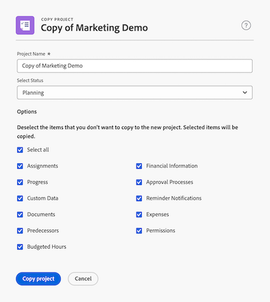

# 複製專案

<!--
<(LINKED TO THE PRODUCT IN THE COPY PROJECT BOX)

-->

<!-- Audited: 5/2025 -->

您可以從現有專案複製專案，而不用從頭開始建立，這樣有助於節省時間。

請注意，您無法大量複製專案。

>[!IMPORTANT]
>
>下列專案絕不會從現有專案複製到新專案：
>
>* 問題
>* 計費費率
>* 付費記錄
>* 附註
>* 時數
>* 跨專案前置任務
>* 預算時數
>
>下列專案一律會從現有專案複製到新專案：
>
>* 任務
>* 範本
>* 風險
>* 佇列設定資訊
>* Portfolio與程式
>* 計分卡
>* 任務預設資訊(任務預設核准流程、任務預設自訂Forms)
>
> 原始專案任務的日期將複製到新專案。 您必須變更專案的開始或完成日期（視其排程模式而定）以更新作業日期。 任務限制可能會阻止您變更專案日期。

## 存取需求

<!-- drafted for P&P:
<table style="table-layout:auto"> 
 <col> 
 <col> 
 <tbody> 
  <tr> 
   <td> 
Adobe Workfront plan*
 </td> 
   <td>Any</td> 
  </tr> 
  <tr> 
   <td> 
Adobe Workfront license*
 </td> 
   <td> 
Current license: Standard 
 
   Or
   
Legacy license: Plan 

   </td> 
  </tr> 
  <tr data-mc-conditions=""> 
   <td><strong>Access level configurations*</strong> </td> 
   <td> 
Edit access to Projects with ability to Create and Copy projects
 
<b>NOTE</b>
   
   If you still don't have access, ask your Workfront administrator if they set additional restrictions in your access level. For information on how a Workfront administrator can change your access level, see <a href="../../../administration-and-setup/add-users/configure-and-grant-access/create-modify-access-levels.md" class="MCXref xref">Create or modify custom access levels</a>.
 </td> 
  </tr> 
  <tr data-mc-conditions=""> 
   <td> 
<strong>Object permissions</strong> 
 </td> 
   <td> 
View permissions or higher to the project
 
For information on requesting additional access, see <a href="../../../workfront-basics/grant-and-request-access-to-objects/request-access.md" class="MCXref xref">Request access to objects </a>.
 </td> 
  </tr> 
 </tbody> 
</table>
-->

+++ 展開以檢視本文中功能的存取需求。
您必須具有下列存取權才能執行本文中的步驟：

<table style="table-layout:auto"> 
 <col> 
 <col> 
 <tbody> 
  <tr> 
   <td> 
Adobe Workfront計畫
 </td> 
   <td>任何</td> 
  </tr> 
  <tr> 
   <td> 
Adobe Workfront授權
 </td> 
   <td> 
新增：標準 
 
   
或

   
目前：計畫 

</td> 
  </tr> 
  <tr data-mc-conditions=""> 
   <td>存取層級設定 </td> 
   <td> 
編輯具有建立和複製專案功能的專案存取權
 </td> 
  </tr> 
  <tr data-mc-conditions=""> 
   <td> 
物件許可權 
 </td> 
   <td> 
檢視專案或更高的許可權
  </td> 
  </tr> 
 </tbody> 
</table>

如需有關此表格的詳細資訊，請參閱Workfront檔案中的[存取需求](/help/quicksilver/administration-and-setup/add-users/access-levels-and-object-permissions/access-level-requirements-in-documentation.md)。

+++

## 複製單一專案

複製專案也會將一些資訊從原始專案複製到新專案。 您也可以在複製過程中指定哪些專案不應複製到新專案。

若要複製專案：

{{step1-to-projects}}

1. 從專案清單中選取您要複製的專案，然後按一下專案名稱右側的&#x200B;**更多**&#x200B;圖示。

   或

   前往專案清單或報告並選取專案，然後按一下清單頂端的&#x200B;**更多**&#x200B;圖示。

1. 在&#x200B;**更多**&#x200B;下拉式功能表中，按一下&#x200B;**複製**。 [專案名稱&#x200B;]**的**&#x200B;復本對話方塊就會顯示。

1. （選用）更新&#x200B;**專案名稱**。 依預設，新名稱是&#x200B;**[原始專案名稱]**&#x200B;的復本。

   

1. 選取&#x200B;**狀態**。 依預設，會選取原始專案的狀態。

1. （選擇性）取消選取您不想要複製到新專案的專案。 下表說明取消選取專案時所發生的情況：

   <table style="table-layout:auto"> 
    <col> 
    <col> 
    <tbody> 
     <tr> 
      <td role="rowheader">全選</td> 
      <td> 
選取所有選項，並清除新專案中列出的所有欄位和物件。 

   
 取消選取此選項會取消選取所有專案。 
 </td> 
     </tr> 
     <tr> 
      <td role="rowheader">指派</td> 
      <td>移除所有專案和任務指派。</td> 
     </tr> 
     <tr> 
      <td role="rowheader">進度</td> 
      <td>移除所有任務的進度，顯示為新任務。 </td> 
     </tr> 
     <tr> 
      <td role="rowheader">自訂資料</td> 
      <td> 
從專案的自訂表單中移除資訊，以及與以下專案相關聯的自訂表單上的資訊：
 
       <ul> 
        <li>任務</li> 
        <li>費用</li> 
        <li> 文件</li> 
       </ul> 
      
自訂表單仍附加到任務、費用、檔案和專案，但表單的自訂欄位中的資訊不會複製到新專案。 
 </td> 
     </tr> 
     <tr> 
      <td role="rowheader">文件</td> 
      <td> 
移除「檔案」標籤中的所有專案，包括檔案版本、連結的檔案和資料夾。
 
依預設，檔案校訂和核准無法複製到另一個專案。 
 </td> 
     </tr> 
     <tr> 
      <td role="rowheader">所有前置任務</td> 
      <td> 
移除專案上任務間的所有前置任務關係。 
 

   跨專案前置任務絕不會轉移到新專案，無論是否選取此選項。 
 </td>
   </tr>

<tr> 
      <td role="rowheader">預算時數</td> 
      <td> 
從複製的專案中移除專案之業務案例的資源規劃區域中預算的時數。
 
    

   使用「情境規劃工具」的預算時數永遠不會複製到新專案，因為新專案未連結到「情境規劃工具」中的方案。 如需詳細資訊，請參閱使用案例規劃工具</a>的業務案例中的<a href="../../../manage-work/projects/define-a-business-case/budget-resources-in-business-case-use-scenario-planner.md">預算資源

   </tr></td>
    <tr> 
      <td role="rowheader">財務資訊</td> 
      <td> 
移除下列區域中的資訊： 
 
       <ul> 
        <li>專案的財務子頁標</li> 
        <li> 業務案例中的計畫收益</li> 
        <li>所有工作的財務資訊 </li> 
       </ul> 
如需有關專案財務子頁簽的詳細資訊，請參閱<a href="../../../manage-work/projects/project-finances/manage-project-finance-area.md" class="MCXref xref">管理專案財務區域的資訊</a>。
 </td> 
     </tr> 
     <tr> 
      <td role="rowheader">核准流程</td> 
      <td>移除與任務或專案相關的所有核准。 </td> 
     </tr> 
     <tr> 
      <td role="rowheader">提醒通知</td> 
      <td> 移除與任務或專案關聯的提醒通知。 </td> 
     </tr> 
     <tr> 
      <td role="rowheader">費用</td> 
      <td>移除與任務或專案相關聯的費用。 </td> 
     </tr> 
     <tr> 
      <td role="rowheader">權限</td> 
      <td> 移除任務或專案上所有使用者的許可權。</td> 
     </tr> 
    </tbody> 
   </table>

1. 按一下&#x200B;**複製專案**。 複製的專案隨即建立。
