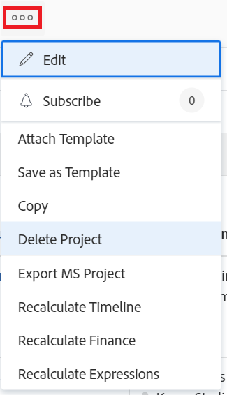

# 刪除專案

<!--Audited: 07/2024-->

如果不再需要專案及其資料，您可以刪除該專案。

建議您編輯專案並將狀態變更為「完成」或「廢棄」，作為刪除專案的替代方法。 這會從使用者的任務清單中移除與專案相關的所有目前任務，但儲存與專案相關的所有資料。

您可以刪除專案清單中的專案或專案層級的專案。

## 存取需求

+++ 展開以檢視本文中功能的存取需求。

您必須具有下列存取權才能執行本文中的步驟：

<table style="table-layout:auto"> 
 <col> 
 <col> 
 <tbody> 
  <tr> 
   <td> 
Adobe Workfront計畫
 </td> 
   <td>任何</td> 
  </tr> 
  <tr> 
   <td> 
Adobe Workfront授權*
 </td> 
   <td> 
新授權： Standard 

   
目前授權：計畫 
 
   </td> 
  </tr> 
  <tr data-mc-conditions=""> 
   <td>存取層級設定</td> 
   <td> 
編輯專案的存取權，並具備建立和刪除專案的能力
 </td> 
  </tr> 
  <tr data-mc-conditions=""> 
   <td> 
物件許可權 
 </td> 
   <td> 
編輯對專案、任務、問題的存取權，並具備刪除專案、任務和問題的能力
 </td> 
  </tr> 
 </tbody> 
</table>

*如需詳細資訊，請參閱Workfront檔案中的[存取需求](/help/quicksilver/administration-and-setup/add-users/access-levels-and-object-permissions/access-level-requirements-in-documentation.md)。

+++

## 瞭解刪除專案的程式

* [刪除專案的限制](#limitations-for-deleting-projects)
* [刪除專案的影響](#the-impact-of-deleting-projects)

### 刪除專案的限制  {#limitations-for-deleting-projects}

* 刪除的專案會移至資源回收筒並保留30天，且只有Workfront管理員才能復原。

  如需有關還原物件的詳細資訊，請參閱文章[還原已刪除的專案](../../../administration-and-setup/manage-workfront/manage-deleted-items/restore-deleted-items.md)。

* 如果專案具有任務或問題，記錄時數，Workfront或群組管理員必須透過在您的Workfront執行個體中設定任務和問題偏好設定，以允許刪除這些任務，您才能刪除包含任務的專案。

  如需有關啟用刪除記錄時數的任務、問題或專案的詳細資訊，請參閱[設定系統範圍的任務和問題偏好設定](../../../administration-and-setup/set-up-workfront/configure-system-defaults/set-task-issue-preferences.md)中的「刪除」一節。

  <!--
  
(NOTE: this bullet stays in NWE only forever)

  -->

### 刪除專案的影響 {#the-impact-of-deleting-projects}

* 刪除專案時，會影響連結至專案的其他物件。

  當您刪除專案時，也會刪除附加至專案的下列物件：

   * 文件

     您無法刪除具有已出庫之附加檔案的專案。 如需簽出檔案的詳細資訊，請參閱[簽出檔案](../../../documents/managing-documents/check-out-documents.md)。

   * 任務
   * 子任務
   * 問題
   * 更新
   * 核准
   * 費用
   * 風險
   * 基準線
   * 業務案例資訊
   * 佇列詳細資訊
   * 收費率
   * 付費記錄

     您無法刪除記帳記錄狀態為「已記帳」的專案。 如需詳細資訊，請參閱[建立付費記錄](../../projects/project-finances/create-billing-records.md)。

* 根據Workfront管理員如何在Workfront執行個體的時程表和時數偏好設定中設定專案、任務或問題刪除偏好設定，任務、問題或專案的記錄時數在刪除專案時以下列方式之一處理：

   * 小時會作為一般時間保留在時程表中。
   * 時數會遭到刪除，如果專案已還原，則會還原時數。

  如需有關為登入問題時數設定刪除偏好設定的詳細資訊，請參閱[設定時程表和時數偏好設定](../../../administration-and-setup/set-up-workfront/configure-timesheets-schedules/timesheet-and-hour-preferences.md)。

* 如果您刪除的專案連結至「Workfront情境規劃工具」中的方案：

   * 方案會保留在計畫上，但專案的連結會被移除。
   * 如果您刪除的專案連結至計畫中唯一發佈的方案，則也會移除已發佈計畫的指示。
   * 如果您復原已刪除的專案，專案將會復原，但其方案連結並未復原，且「情境規劃工具」區域不再顯示在「專案詳細資料」中。

     Scenario Planner需要額外的授權。 如需Workfront Scenario Planner的相關資訊，請參閱[Scenario Planner概觀](../../../scenario-planner/scenario-planner-overview.md)。

     如需連結至Scenario Planner中方案之專案的資訊，請參閱[在Scenario Planner](../../../scenario-planner/publish-scenarios-update-projects.md)中發佈方案以更新或建立專案。

* 如果專案也是Workfront目標中的目標活動：

   * 專案會從目標中刪除。 專案在目標上指出的進度也會被移除。

   * 如果您復原已刪除的專案，該專案也會還原為目標活動。

     這需要額外的授權。 如需Workfront目標的相關資訊，請參閱[Adobe Workfront目標總覽](../../../workfront-goals/goal-management/wf-goals-overview.md)。

     如需將專案與目標建立關聯的資訊，請參閱[在Adobe Workfront目標中新增專案](../../../workfront-goals/results-and-activities/connect-projects-to-goals-overview.md)。

## 刪除清單中的專案

您可以從專案清單中刪除專案。

1. 前往專案清單或專案報告。
1. 選取您要刪除的一或多個專案，然後按一下清單頂端的&#x200B;**刪除**&#x200B;圖示。

1. 按一下&#x200B;**是，刪除**&#x200B;以確認刪除。

   專案會刪除並儲存在資源回收筒中30天。 在此期間，您的Workfront管理員可以從資源回收筒還原已刪除的專案。

## 刪除專案層級的專案

1. 前往您要刪除的專案。
1. 按一下專案名稱右側的&#x200B;**更多**&#x200B;圖示，然後按一下&#x200B;**刪除專案**。

   

1. 按一下&#x200B;**是，刪除**。

   專案會刪除並儲存在資源回收筒中30天。 在這段期間，您的Workfront管理員可以從資源回收筒將其還原。

## 還原已刪除的專案

系統或群組管理員可以在刪除專案後30天內還原專案，如文章[還原已刪除的專案](../../../administration-and-setup/manage-workfront/manage-deleted-items/restore-deleted-items.md)所述。
