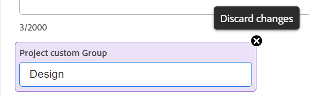

# 編輯專案

本頁強調顯示的資訊指的是尚未普遍提供的功能。 它僅在預覽環境中可用。

<!--

***Linked to many articles,

The Resource Pools part also duplicates in the "Working with Resource Pools" article 

The Update Type section is also documented in Selecting the Project Update Type article

Keep the reference link to the other article that also documents the Update Type) 

(NOTE 2: information described here also exists in these articles:

** Project Overview area

**Manage project Finance area

If you need to update just one field, check to see if that field is also listed there and update in both places.)

-->

您可以視需要經常編輯Adobe Workfront中的專案。 建議您在專案的狀態變更為「目前」後，盡量減少編輯的次數，借此傳送變更通知給整個專案團隊，以避免混淆。 理想情況下，當項目處於「計畫」狀態時，您應編輯項目。 如需專案團隊的相關資訊，請參閱 [專案團隊概觀](../../../manage-work/projects/planning-a-project/project-team-overview.md).

## 存取需求

<!--drafted - replace table at P&P:

<table style="table-layout:auto"> 
 <col> 
 <col> 
 <tbody> 
  <tr> 
   <td role="rowheader">Adobe Workfront plan*</td> 
   <td> 
Any
 </td> 
  </tr> 
  <tr> 
   <td role="rowheader">Adobe Workfront license*</td> 
   <td>
Current license: Standard 
 
   Or
   
Legacy license: Plan 
 </td> 
  </tr> 
  <tr> 
   <td role="rowheader">Access level configurations*</td> 
   <td> 
Edit access to Projects
 
If you still don't have access, ask your Workfront administrator if they set additional restrictions in your access level. For information about access to projects, see <a href="../../../administration-and-setup/add-users/configure-and-grant-access/grant-access-projects.md" class="MCXref xref">Grant access to projects</a>. For information on how a Workfront administrator can change your access level, see <a href="../../../administration-and-setup/add-users/configure-and-grant-access/create-modify-access-levels.md" class="MCXref xref">Create or modify custom access levels</a>. 
 </td> 
  </tr> 
  <tr> 
   <td role="rowheader">Object permissions</td> 
   <td> 
    <ul> 
     <li> 
Contribute permissions to a project to edit it in the Project Details area 
 </li> 
     <li> 
Manage permissions to a project to edit it in the Edit Project box
 </li> 
    </ul> 
 For information about project permissions, see <a href="../../../workfront-basics/grant-and-request-access-to-objects/share-a-project.md" class="MCXref xref">Share a project in Adobe Workfront</a>.
 
For information on requesting additional access, see <a href="../../../workfront-basics/grant-and-request-access-to-objects/request-access.md" class="MCXref xref">Request access to objects </a>.
 </td> 
  </tr> 
 </tbody> 
</table>
-->

您必須具備下列存取權，才能執行本文中的步驟：

<table style="table-layout:auto"> 
 <col> 
 <col> 
 <tbody> 
  <tr> 
   <td role="rowheader">Adobe Workfront計畫*</td> 
   <td> 
任何
 </td> 
  </tr> 
  <tr> 
   <td role="rowheader">Adobe Workfront授權*</td> 
   <td> 
計劃 
 </td> 
  </tr> 
  <tr> 
   <td role="rowheader">訪問級別配置*</td> 
   <td> 
編輯專案的存取權
 
如果您仍無權存取，請洽詢您的Workfront管理員，他們是否在您的存取層級設定其他限制。 如需存取專案的相關資訊，請參閱 <a href="../../../administration-and-setup/add-users/configure-and-grant-access/grant-access-projects.md" class="MCXref xref">授予專案的存取權</a>. 如需Workfront管理員如何變更您的存取層級的詳細資訊，請參閱 <a href="../../../administration-and-setup/add-users/configure-and-grant-access/create-modify-access-levels.md" class="MCXref xref">建立或修改自訂存取層級</a>. 
 </td> 
  </tr> 
  <tr> 
   <td role="rowheader">物件權限</td> 
   <td> 
    <ul> 
     <li> 
將權限貢獻給專案，以在「專案詳細資料」區域中編輯 
 </li> 
     <li> 
管理專案的權限，以便在「編輯專案」方塊中編輯專案
 </li> 
    </ul> 
 如需專案權限的相關資訊，請參閱 <a href="../../../workfront-basics/grant-and-request-access-to-objects/share-a-project.md" class="MCXref xref">在Adobe Workfront中共用專案</a>.
 
有關請求其他訪問的資訊，請參閱 <a href="../../../workfront-basics/grant-and-request-access-to-objects/request-access.md" class="MCXref xref">請求對對象的訪問 </a>.
 </td> 
  </tr> 
 </tbody> 
</table>

*若要了解您擁有的計畫、授權類型或存取權，請聯絡您的Workfront管理員。

## 編輯專案的限制

有些限制可能會讓您無法編輯專案。

編輯專案時，請考量下列事項：

* 除了記錄時間外，您無法編輯處於核准流程中的專案。
* 只有在您的Workfront管理員或群組管理員在「專案偏好設定」區域中啟用了此功能時，您才能將檔案或範本附加至狀態為「完成」、「無效」或「處於待核准狀態」的專案。 有關設定項目首選項的資訊，請參閱 [配置系統範圍的項目首選項](../../../administration-and-setup/set-up-workfront/configure-system-defaults/set-project-preferences.md).
* 您只能編輯處於「已停用」或「已完成」狀態的專案的下列資訊：

   * 修改現有費用。
   * 新增、移除或編輯自訂表單。

## 編輯專案

通過編輯項目，您可以修改項目的資訊和設定，以及項目上的任務和問題。

本文中提及的某些設定，可能會依其在建立專案的範本中的狀態，從預設狀態修改。 如需編輯範本的詳細資訊，請參閱 [編輯專案範本](../../../manage-work/projects/create-and-manage-templates/edit-templates.md).

1. 按一下 **主菜單** 圖示  在Adobe Workfront的右上角，然後按一下 **專案**.
1. （選用）按一下 **正在執行的項目** 或 **我擁有的專案** 在右上角，顯示您是專案團隊的擁有者或專案。

   

1. 按一下您要編輯的專案名稱，以開啟專案頁面。

   >[!NOTE]
   >
   >如果您是群組管理員，則可以在「群組」區域以及「專案」區域中查看和編輯群組的專案。 如需詳細資訊，請參閱 [建立和修改群組的專案](../../../administration-and-setup/manage-groups/work-with-group-objects/create-and-modify-a-groups-projects.md).

1. （可選）若要編輯專案的有限資訊，請按一下 **專案詳細資料** 中。

   

   >[!NOTE]
   >
   >視您的Workfront管理員或群組管理員修改配置範本的方式而定，「專案詳細資料」區域中的欄位可能會重新排列或不顯示。 如需詳細資訊，請參閱 [使用版面範本自訂「詳細資料」檢視](../../../administration-and-setup/customize-workfront/use-layout-templates/customize-details-view-layout-template.md).

   要編輯「詳細資訊」部分中的資訊，請執行以下操作：

   1. （選用）按一下 **全部折疊** 圖示來折疊所有區域。
   1. （選用和條件性）收合區域時，按一下 **右箭頭**  展開要編輯的區域。
   1. 如需在「專案詳細資料」標籤中編輯資訊的詳細資訊，請參閱下列文章：

      * [在項目概覽區域中管理資訊](../../../manage-work/projects/manage-projects/understand-project-overview-area.md)
      * [管理項目財務區域中的資訊](../../../manage-work/projects/project-finances/manage-project-finance-area.md)
   1. （可選）若要附加自訂表單，請開始在 **新增自訂表單** 欄位，然後在清單中顯示時選取，然後按一下 **儲存變更**.
   1. （選用）按一下 **匯出** 圖示  若要將綜覽和自訂表單資訊匯出至PDF檔案，請按一下 **匯出**. 從以下項目中選取：

      * 全選（僅在至少附加一個自訂表單時顯示）
      * 總覽
      * 一或多個自訂表單的名稱

      PDF檔案下載至您的電腦。

      

      如需詳細資訊，請參閱 [匯出自訂表單和物件詳細資訊](../../../workfront-basics/work-with-custom-forms/export-custom-forms-details.md).
   有關「項目詳細資訊」部分中可見欄位的資訊，請繼續編輯「編輯項目」框中的項目，如下所述。
1. 若要編輯專案的所有資訊，請按一下 **更多** 功能表  在專案名稱旁，按一下 **編輯**.

   或

   從專案清單中選取專案，然後按一下 **編輯** 圖示  清單頂端。

   此 **編輯專案** 框。

   >[!IMPORTANT]
   >
   >您必須擁有專案的「管理」權限，才能看到「編輯」選項。

   「編輯專案」方塊中提供所有專案欄位，並依左側面板所列區域分組。

   >[!NOTE]
   >
   >視您的Workfront管理員或群組管理員修改版面範本的方式而定，「編輯專案」方塊左側面板中的區域，或這些區域中列出的任何欄位，可能會重新排列或不會顯示。 如需詳細資訊，請參閱 [使用版面範本自訂「詳細資料」檢視](../../../administration-and-setup/customize-workfront/use-layout-templates/customize-details-view-layout-template.md).

1. （條件性）如果您按一下 **更多** ，然後 **編輯**，請考慮更新左側面板所列區域中的任何區域：

   * [專案名稱](#project-name)
   * [總覽](#overview)
   * [自訂表單](#custom-forms)
   * [財務](#finance)
   * [專案設定](#project-settings)
   * [任務設定](#task-settings)
   * [問題設定](#issue-settings)
   * [存取](#access)

   >[!NOTE]
   >
   >根據您的Workfront管理員為專案的「詳細資訊」區域設定「版面範本」的方式，「編輯專案」方塊中的區段和欄位可能會在您的環境中有所不同。 如需詳細資訊，請參閱 [使用版面範本自訂「詳細資料」檢視](../../../administration-and-setup/customize-workfront/use-layout-templates/customize-details-view-layout-template.md).

### 專案名稱 {#project-name}

1. 依上述方式開始編輯專案。
1. 按一下 **專案名稱** 中。

   

1. 更新專案名稱。

   大量編輯專案時，無法編輯專案名稱。

### 總覽 {#overview}

1. 依上述方式開始編輯專案。
1. 按一下 **概述** 中。

   

1. 更新下列專案相關資訊：

   <table style="table-layout:auto"> 
    <col> 
    <col> 
    <tbody> 
     <tr> 
      <td role="rowheader"><strong>說明</strong> </td> 
      <td> 
新增有關專案的其他資訊。
 </td> 
     </tr> 
     <tr> 
      <td role="rowheader"><strong>狀態</strong> </td> 
      <td> 
選取專案的狀態。 您無法在完成所有任務和問題之前將項目標籤為已完成。 如需專案狀態的相關資訊，請參閱 <a href="../../../administration-and-setup/customize-workfront/creating-custom-status-and-priority-labels/project-statuses.md" class="MCXref xref">訪問系統項目狀態清單</a>
 </td> 
     </tr> 
     <tr> 
      <td role="rowheader"><strong>優先順序</strong> </td> 
      <td> 
 
這只是視覺標幟，可讓您為專案排定優先順序。
 
視您的Workfront管理員選取的「專案偏好設定」而定，優先順序的名稱可能會有所不同。 如需有關編輯優先順序的詳細資訊，請參閱 <a href="../../../administration-and-setup/customize-workfront/creating-custom-status-and-priority-labels/create-customize-priorities.md" class="MCXref xref">建立和自訂優先順序</a>
 
 </td> 
     </tr> 
     <tr> 
      <td role="rowheader"><strong>URL</strong> </td> 
      <td> 
指定與本專案相關資訊的網頁連結。
 </td> 
     </tr> 
     <tr> 
      <td role="rowheader"><strong>狀態類型</strong> </td> 
      <td> 
在下列條件類型之間選取： 
       <ul> 
       <li><strong>手動：</strong> 專案擁有者會手動設定專案的條件。</li> 
       <li><strong>進度狀態：</strong> Workfront會根據關鍵路徑上任務的進度狀態自動設定條件。 有關了解進度狀態的詳細資訊，請參閱 <a href="../../../manage-work/tasks/task-information/task-progress-status.md" class="MCXref xref">任務進度狀態概述</a>.</li> 
       </ul>
您的Workfront管理員 或組管理員 為系統選擇項目條件計算方式的預設值 或您的群組. 有關設定項目預設值的資訊，請參閱 <a href="../../../administration-and-setup/set-up-workfront/configure-system-defaults/set-project-preferences.md" class="MCXref xref">配置系統範圍的項目首選項</a>. 

 </td> 
     </tr> 
     <tr> 
      <td role="rowheader"><strong>狀況</strong> </td> 
      <td> 
 
(只有在您選取 <strong>手動</strong> 針對 <strong>條件類型</strong>):選取條件以指出專案進行中的方式。 
 
如需如何自動或手動設定專案條件的詳細資訊，請參閱 <a href="../../../manage-work/projects/manage-projects/project-condition-and-condition-type.md" class="MCXref xref">專案條件和條件類型概觀</a>
 
 </td> 
     </tr> 
     <tr> 
      <td role="rowheader"><strong>時程表模式</strong> </td> 
      <td> 
指定項目是從「開始日期」還是從「完成日期」計畫。 此選擇確定項目上任務的計畫日期。 
       <ul> 
       <li><strong>開始日期</strong>:預設情況下，項目的第一個任務與項目具有相同的計畫起始日期。 有關任務計畫起始日期的資訊，請參閱 <a href="../../../manage-work/tasks/task-information/task-planned-start-date.md" class="MCXref xref">任務計畫起始日期概覽</a>. 項目時間表從起始日期開始計算，項目的完成日期由系統根據所有任務的持續時間計算。 </li> 
       <li><strong>完成日期</strong>:項目的最後一個任務與項目具有相同的計畫完成日期。 項目時間表從完成日期計算，項目的起始日期由系統計算，方法是從項目的完成日期減去所有任務的持續時間。 </li> 
       </ul>
您的Workfront管理員 或組管理員 選擇系統或組的預設「計畫模式」設定。 有關設定項目預設值的資訊，請參閱 <a href="../../../administration-and-setup/set-up-workfront/configure-system-defaults/set-project-preferences.md" class="MCXref xref">配置系統範圍的項目首選項</a>.

 </td> 
     </tr> 
     <tr> 
      <td role="rowheader"><strong>計畫的開始日期和時間</strong> </td> 
      <td> 
 
指定您選取的日期 <strong>從開始日期開始排程</strong>.  
 
這是您選取時的唯讀欄位 <strong>從完成日期開始計畫</strong>. 
 
 </td> 
     </tr> 
     <tr> 
      <td role="rowheader"><strong>計畫完成日期和時間</strong> </td> 
      <td> 
指定您選取的日期 <strong>從完成日期開始計畫</strong>. 
 
這是您選取時的唯讀欄位 <strong>從開始日期開始排程</strong>. 
 </td> 
     </tr> 
     <tr> 
      <td role="rowheader"><strong>專案組合</strong></td> 
      <td>指定專案所屬的Portfolio。 您必須先建立Portfolio，才會顯示在下拉式清單中。 只能將作用中的產品組合與專案相關聯。 如需建立產品組合的詳細資訊，請參閱 <a href="../../../manage-work/portfolios/create-and-manage-portfolios/create-portfolios.md" class="MCXref xref">建立產品組合 </a>.</td> 
     </tr> 
     <tr> 
      <td role="rowheader"><strong>方案</strong></td> 
      <td> 
如果為項目選擇了Portfolio，請為項目指定方案。 某些Portfolio可能沒有方案。 您必須先建立程式，才會顯示在此下拉式清單中。 只能將活動程式與項目關聯。 
 
如需建立方案的詳細資訊，請參閱 <a href="../../../manage-work/portfolios/create-and-manage-programs/create-program.md" class="MCXref xref">建立方案</a>.
 </td> 
     </tr> 
     <tr> 
      <td role="rowheader"><strong>群組</strong></td> 
      <td> 
 
指定與專案相關聯的群組名稱。 
這是必填欄位. 您不能有未與組關聯的項目。 
 
您可以將游標移至群組上並按一下資訊圖示，以確定您正在選取正確的群組  顯示於其旁。 此工具提示會列出群組的相關資訊，例如上方的群組階層及其管理員。
 除非您指定其他群組，否則在建立專案時，下列其中一個群組會自動與該專案相關聯：
 
       <ul> 
       <li> 
從「項目」區域建立項目時，項目建立者的「主組」與項目相關聯。 
 
從產品組合或方案的「專案」區段建立專案時，也是如此。
 </li> 
       <li> 
從「設定」區域的組首頁建立項目時，該組與項目相關聯。
 </li> 
       </ul> 
 
  
 
如果項目或其任務或問題已與使用組層自定義狀態的組層審批流程關聯，則更改組可能會在上一組的審批狀態和系統層的現有狀態之間產生衝突。 在更新組之前，請考慮刪除項目上的組級審批流程，或刪除其任務或問題。 如需建立群組層級核准程式的相關資訊，請參閱 <a href="../../../administration-and-setup/manage-groups/work-with-group-objects/create-and-modify-groups-approval-processes.md" class="MCXref xref">組級審批流程</a>. 如需建立群組層級自訂狀態的相關資訊，請參閱 <a href="../../../administration-and-setup/manage-groups/manage-group-statuses/create-or-edit-a-group-status.md" class="MCXref xref">建立或編輯群組狀態</a>
 </td> 
     </tr> 
     <tr> 
      <td role="rowheader"><strong>公司</strong> </td> 
      <td> 
指定與專案相關聯的公司。 您必須先建立公司，才能將其與專案建立關聯。 只有有效的公司才能與專案相關聯。 如需建立公司的相關資訊，請參閱 <a href="../../../administration-and-setup/set-up-workfront/organizational-setup/create-and-edit-companies.md" class="MCXref xref">建立和編輯公司</a>.
 </td> 
     </tr> 
     <tr> 
      <td role="rowheader"><strong>專案所有者</strong> </td> 
      <td> 
開始鍵入用戶名以將其添加到項目，然後在清單中顯示時選擇它。 系統會將使用者新增至專案團隊，並自動為專案授予「管理」權限。 指定為專案擁有者的使用者必須是Workfront作用中使用者。

      </td> 
     </tr> 
     <tr> 
      <td role="rowheader"><strong>專案贊助者</strong> </td> 
      <td> 
開始鍵入用戶名以將其添加到項目，然後在清單中顯示時選擇它。 系統會將使用者新增至專案團隊，並自動為專案授予「檢視」權限。 指定為專案贊助商的使用者必須是Workfront活躍使用者。 
 </td> 
     </tr> 
     <tr> 
      <td role="rowheader"><strong>資源管理員</strong> </td> 
      <td> 
 開始鍵入用戶的名稱以將其添加到項目中，然後在清單中顯示時選擇它們。 系統會將使用者新增至專案團隊，並自動為專案授予「管理」權限，且可為專案的工作和問題指派資源。 即使從資源管理器欄位中刪除了項目，用戶也會維護項目的管理權限。 您可以指定多個資源管理器。 
 </td> 
     </tr> 
    </tbody> 
   </table>

   >[!TIP]
   >
   >更新「項目所有者」、「項目贊助商」和「資源管理器」欄位時，請注意頭像、用戶的主要角色或其電子郵件地址，以區分名稱相同的用戶。 用戶必須至少與一個作業角色關聯，才能在添加時查看該角色。

1. （選用）根據您要修改的資訊，繼續編輯下列章節。

   或

   按一下&#x200B;**儲存**。

### 自訂表單 {#custom-forms}

根據您的存取層級和您對專案的權限，會出現下列情況：

* 如果您沒有專案的「編輯自訂表單」權限，則無法編輯任何附加自訂表單上的欄位。 您只能檢視附加至專案的自訂表單欄位。
* 如果您有自訂表單上某個區段的「檢視」（而非「編輯」）存取權，則無法編輯該區段中的欄位。
* 如果您無法存取附加至專案的其中一個自訂表單上的區段，該區段不會顯示在「編輯專案」方塊中。

選取多個專案進行大量編輯時，會出現下列情況：

* 如果您至少對一個選取的專案沒有「編輯自訂表單」權限，則無法編輯任何附加自訂表單上的欄位。 您只能檢視附加自訂表單上的欄位
* 如果您有自訂表單上某個區段的「檢視」（而非「編輯」）存取權，則無法編輯該區段中的欄位。 您只能檢視該區段中的欄位。
* 如果您無法存取附加至至少一個專案的其中一個自訂表單上的區段，該區段不會顯示在「編輯專案」方塊中。

如需自訂表單存取的相關資訊，請參閱下列文章：

* [共用自訂表單](../../../administration-and-setup/customize-workfront/create-manage-custom-forms/share-access-to-a-custom-form.md)
* [為自訂表單新增區段分頁](../../../administration-and-setup/customize-workfront/create-manage-custom-forms/add-a-section-break-to-a-custom-form.md)

若要編輯自訂表單的資訊：

1. 依上述方式開始編輯專案。
1. 按一下 **自訂Forms** 中。

   

1. 按一下 **新增自訂表單** 框中，從清單中選擇一個表單以將其附加到項目。 依預設，前40個表單會以字母順序顯示。 如果您在清單中未看到表單，請開始輸入表單名稱，然後在表單中出現時選取它。

   >[!NOTE]
   >
   >您必須先建置自訂表單，才能在此欄位中供選取。 清單中只顯示活動的自訂表單。 如需建立自訂表單的詳細資訊，請參閱 [建立或編輯自訂表單](../../../administration-and-setup/customize-workfront/create-manage-custom-forms/create-or-edit-a-custom-form.md). 您最多可將10個自訂表單新增至專案。

1. （條件性）如果您將自訂表單附加至專案，請編輯表單上的任何欄位。 您必須先指定所有必填欄位，才能儲存專案。
1. （選用）按一下 **X圖示** 按一下自訂表單名稱的右側以將其移除，然後按一下 **移除**.
1. （可選）根據您要修改的資訊，繼續編輯以下部分

   或

   按一下&#x200B;**儲存**。

### 財務 {#finance}

根據您的存取層級和您對專案的權限，會出現下列情況：

* 如果您對項目具有「查看」訪問權限和「查看財務」權限，則只能查看「財務」部分中的欄位。 您無法編輯此區段中的欄位。
* 如果您對項目具有「編輯」訪問權限和「管理財務」權限，則可以更新本節中的欄位。

選取多個專案以大量編輯，且會出現下列情況：

* 如果您至少選擇一個具有「查看財務」（而非「管理財務」）權限的項目，則只能查看此部分中所有選定項目的欄位。 無法批量編輯「財務」部分中的欄位。
* 如果您至少選擇一個沒有財務權限的項目，則完全不顯示此部分。

要編輯「財務」區域中的欄位：

1. 依上述方式開始編輯專案。
1. 按一下 **金融** 中。

   

1. 更新項目的以下財務資訊：

   <table style="table-layout:auto"> 
    <col> 
    <col> 
    <tbody> 
     <tr data-mc-conditions=""> 
      <td role="rowheader"><strong>貨幣</strong> </td> 
      <td> 
 
如果項目的貨幣與系統的預設貨幣不同，請指定該貨幣。 如果項目上已有財務資訊，則不能更改項目的貨幣。 如果系統中只有預設貨幣，則此欄位不會顯示。 
 
如需貨幣的詳細資訊，請參閱 <a href="../../../administration-and-setup/manage-workfront/exchange-rates/set-up-exchange-rates.md" class="MCXref xref">設定匯率</a>. 
 
 </td> 
     </tr> 
     <tr> 
      <td role="rowheader"><strong>預算</strong> </td> 
      <td> 
指定專案的預算。 
 </td> 
     </tr> 
     <tr> 
      <td role="rowheader"><strong>績效指數方法</strong> </td> 
      <td> 
選擇 <b>小時型</b>，或 <b>成本型</b> 指明項目的「掙值」度量（如「成本效能指數」或「估計實際成本」）是否使用小時或成本計算。 
 
有關效能索引方法的詳細資訊，請參見 <a href="../../../manage-work/projects/project-finances/set-pim.md" class="MCXref xref">設定效能索引方法(PIM)</a>. 
 
您的Workfront管理員 或組管理員 選擇系統或組的預設效能索引方法設定。 有關設定項目預設值的資訊，請參閱 <a href="../../../administration-and-setup/set-up-workfront/configure-system-defaults/set-project-preferences.md" class="MCXref xref">配置系統範圍的項目首選項</a>.
 </td> 
     </tr> 
     <tr> 
      <td role="rowheader"><strong>預估完成成本</strong> </td> 
      <td> 
 
指定Workfront應如何計算完成時的估計(EAC)。 

      從下列選項中選取： 
      <ul><li><b>在專案層級上計算</b></li>
      <li><b>從任務/子任務積存</b></li> </ul>
      
有關「完成時的估計」計算方式的詳細資訊，請參閱 <a href="../../../manage-work/projects/project-finances/calculate-eac.md" class="MCXref xref">完成時計算估計值(EAC)</a>.
 
您的Workfront或群組管理員會為您的系統或群組選取預設的「完成時預估」設定。 有關設定項目預設值的資訊，請參閱 <a href="../../../administration-and-setup/set-up-workfront/configure-system-defaults/set-project-preferences.md" class="MCXref xref">配置系統範圍的項目首選項</a>.
 
 </td> 
     </tr> 
     <tr> 
      <td role="rowheader"><strong>計畫收益</strong> </td> 
      <td> 
估計項目的計畫效益。 這用於項目和Portfolio優化程式的業務案例。 有關項目的計畫效益的詳細資訊，請參閱 <a href="../../../manage-work/projects/project-finances/project-planned-benefit.md" class="MCXref xref">項目計畫收益概覽</a>. 在計算項目的淨值時，將考慮項目的計畫效益。 
 
如需詳細資訊，請參閱 <a href="../../../manage-work/portfolios/portfolio-optimizer/manage-projects-in-portfolio-optimizer.md" class="MCXref xref">在Portfolio優化程式中管理專案</a> . 
 </td> 
     </tr> 
     <tr> 
      <td role="rowheader"><strong>實際收益</strong> </td> 
      <td> 
估計項目的實際效益。 這是表示公司或部門在完成此項目後將獲得的好處的貨幣金額。 
 </td> 
     </tr> 
      <tr> 
      <td role="rowheader"><strong>固定成本</strong> </td> 
      <td> 
指定項目的固定成本。 這與「人工成本」不同，「人工成本」來自項目的工時，而「費用成本」來自項目的費用金額。 在計算項目的淨值時，將考慮項目的固定成本，它是預算成本的一部分。 
 </td> 
     </tr> 
     <tr> 
      <td role="rowheader"><strong>固定收入</strong> </td> 
      <td> 
指定專案的「固定收入」。 
 </td> 
     </tr> 
    </tbody> 
   </table>

1. （選用）根據您要修改的資訊，繼續編輯下列章節。

   或

   按一下&#x200B;**儲存**。

### 專案設定 {#project-settings}

1. 依上述方式開始編輯專案。
1. 按一下 **專案設定** 中。

   

1. 更新下列資訊：

   <table style="table-layout:auto"> 
      <col> 
      <col> 
      <tbody> 
      <tr> 
      <td role="rowheader"><strong>里程碑路徑</strong> </td> 
       <td> 
為項目選擇里程碑路徑。 清單中只會顯示作用中的里程碑路徑。
 
如需里程碑路徑的詳細資訊，請參閱 <a href="../../../administration-and-setup/customize-workfront/configure-approval-milestone-processes/create-milestone-path.md" class="MCXref xref">建立里程碑路徑</a>.
 </td> 
      </tr> 
      <tr> 
      <td role="rowheader"><strong>完成模式</strong> </td> 
      <td> 
控制項目標籤為「完成」的方式。 從下列選項中選取： 
       <ul> 
       <li>
<strong>自動</strong>:完成所有任務和問題後，項目將標籤為「完成」。

僅當任務完成時，項目狀態為「當前」時，項目狀態才會自動更改為「完成」。 
</li> 
       <li><strong>手動</strong>:完成所有任務和問題後，必須手動選擇項目的「完成」狀態。</li> 
       </ul>
 </td> 
       </tr> 
       <tr> 
       <td role="rowheader"><strong>摘要完成模式</strong></td> 
       <td> 
控制父任務標籤為「完成」的方式。 從下列選項中選取： 
       <ul> 
       <li><strong>自動</strong>:父任務標籤為「完成」，並且隨著子任務完成和子任務的完成百分比更新，父任務將自動更新其完成百分比。 </li> 
       <li><strong>手動</strong>:您必須手動更新父任務的完成百分比和狀態，而不受子任務的更改影響。</li> 
       </ul>
 </td> 
       </tr> 
       <tr> 
       <td role="rowheader"><strong>更新類型</strong></td> 
       <td> 
控制您對專案時間軸所做的變更在專案或父任務上儲存的時間。 例如，對專案所做的下列變更會觸發對專案時間軸的更新： 
       <ul> 
       <li>更新任務日期</li> 
       <li>更改任務的前置關係</li> 
       <li>
更改父子關係、添加或刪除分配以及更改任務約束或持續時間類型。

當任務更新時，其父對象（父任務或項目）會在更新類型指示的時間更新。 

如果在選擇「自動」和「更改時」或「僅更改」更新類型時，父對象在更改後未立即更新，請刷新頁

從下列選項中選取： 

- <strong>自動和更改</strong> （預設設定）:每次在項目中或項目所依賴的另一個項目中發生更改時（更改時），都會更新項目時間軸。 每晚也會更新專案時間軸（自動）。

這是此欄位建議的設定，因為它可確保專案隨時保持最新狀態。

當您對觸發時間軸重新計算的任務或專案執行動作時，會立即顯示所有可用日期，讓您繼續工作。 在工作超過100個的專案中，需要更長時間重新計算的日期會短暫地顯示為問號（介於1秒和5秒之間，或大型專案則最多一分鐘）。 這表示重新計算尚未完成，日期可能會有所變更。

- <strong>僅更改</strong>:每次在項目中或項目所依賴的另一個項目中發生更改時，都會更新項目時間軸。 如果項目或時間軸所依賴的其他項目中很少發生更改，則可能需要選擇此選項。

- <strong>僅自動</strong>:每晚更新項目時間表；進行變更後，時間軸不會立即更新。

如果每天在項目中或時間軸所依賴的其他項目中發生許多更改，則可能要選擇此選項。 但請注意，您已選取此設定，因為專案不會在進行變更的同時更新。

- <strong>僅手動</strong>:僅當選擇「重新計算時間軸」選項時，項目時間軸才會更新。 如需手動重新計算專案時間軸的詳細資訊，請參閱 <a href="../../../manage-work/projects/manage-projects/recalculate-project-timeline.md" class="MCXref xref">重新計算項目時間表</a>. 

如果您同時對專案進行許多變更，且希望時間軸重新計算在所有變更完成之後（而非每次個別變更後），您可以選取此選項。
</li> 
       </ul>
 </td> 
       </tr> 
       <tr> 
       <td role="rowheader"><strong>排程</strong> </td> 
       <td> 
選取專案的排程。 這應該與指派給大多數從事專案工作的人員的排程相同。 您必須先建立排程，才能將其指派給專案或使用者。 如果您尚未在系統中建立自訂排程，則會選取「預設排程」。
 
如需建立排程的詳細資訊，請參閱 <a href="../../../administration-and-setup/set-up-workfront/configure-timesheets-schedules/create-schedules.md" class="MCXref xref">建立排程</a>. 
 </td> 
       </tr> 
       <tr> 
       <td role="rowheader"><strong>使用者休假</strong> </td> 
       <td> 
確定任務的主要受託人的休息時間是否調整項目的任務計畫日期。 

您的Workfront管理員 或組管理員 為系統選擇此設定的預設值 或您的群組. 有關設定項目預設值的資訊，請參閱 <a href="../../../administration-and-setup/set-up-workfront/configure-system-defaults/set-project-preferences.md" class="MCXref xref">配置系統範圍的項目首選項</a>. 

從下列選項中選取： - <strong>考慮任務持續時間中的用戶超時</strong>:選擇此選項時，任務的計畫日期會根據任務的主要受託人的休假時間進行調整，如果在任務期間發生休假。 

例如，如果計畫在6月1日開始並在6月3日完成具有「盡快」約束的任務，並且在啟用此選擇時，主要受託人在6月2日標籤為「暫停」，則任務計畫日期為6月1日到6月4日。 根據任務約束，存在以下情況： 
 
       <ul> 
       <li>對於與從起始日期開始的計畫相關的任務約束（盡快、最早可用時間、開始時間不早於、開始時間不晚於、必須開始），計畫起始日期不會更改，但計畫完成日期會更改。</li> 
       <li>對於與從完成日期開始的計畫相關的任務約束（盡可能晚、最新可用時間、不早於完成、不遲於完成、必須完成），計畫完成日期不會更改，但計畫起始日期會更改。</li> 
       <li>對於限制為「固定日期」的任務，「計畫起始日期」和「完成日期」均不更改。 </li> 
       </ul>
選擇此設定時，任務的持續時間不會更改。 根據「任務約束」，僅更改計畫日期。 有關任務約束的資訊，請參閱 <a href="../../../manage-work/tasks/task-constraints/task-constraint-overview.md" class="MCXref xref">任務約束概覽</a>. 

- <strong>忽略任務持續時間中的用戶超時</strong>:選擇此選項時，即使任務的主要受託人在任務期間有時間休息，項目上任務的計畫日期仍保持原計畫日期。 

為此設定選取選項時，請考量下列事項：
 
       <ul> 
       <li>
新項目的此設定的預設選項與系統級項目首選項相同。 

有關係統級別的項目首選項的資訊，請參見 <a href="../../../administration-and-setup/set-up-workfront/configure-system-defaults/set-project-preferences.md" class="MCXref xref">配置系統範圍的項目首選項</a>. 
</li> 
       <li>將模板附加到現有項目時，將更新項目上的設定以匹配其中一個模板。 </li> 
       <li>
Workfront根據任務的「任務約束」值決定要調整的計畫任務日期。 根據具體情況，計畫的開始日期或計畫的完成日期，或者兩者都可能受到影響，或者甚至可能保持不變。 例如，如果任務的約束為「固定日期」，則當主要受託人休息時，即使在 <strong>考慮任務持續時間中的用戶超時</strong> 中所有規則的URL。 
</li> 
       </ul></td> 
      </tr> 
      <tr> 
       <td role="rowheader"><strong>資源平準模式</strong> </td> 
       <td> 
 
從下列選項中選取：
 
- <strong>手動</strong>:您必須手動排定資源等級（此為預設設定）
 
- <strong>自動</strong>:Workfront會分級您的資源。
 
有關資源調平的詳細資訊，請參閱 <a href="../../../manage-work/gantt-chart/use-the-gantt-chart/level-resources-in-gantt.md" class="MCXref xref">甘特圖中的層資源 </a>.
 
 </td> 
      </tr> 
      <tr> 
       <td role="rowheader"><strong>風險</strong> </td> 
       <td> 
 
定義專案的風險等級。 風險只是一個項目風險程度的指標。 您可以根據風險等級排定執行專案的優先順序。
 
 
請考慮從以下風險級別中選擇：
 
- 極低
 
- 低
 
- 中
 
- 高
 
- 極高
 
您在此處指出的風險等級無法自訂。
 
這些風險與項目生命週期中可能發生的潛在風險無關，您應在項目的「風險」頁簽或「業務案例」中記錄這些風險。 有關潛在項目風險的資訊，請參見 <a href="../../../administration-and-setup/set-up-workfront/configure-system-defaults/edit-create-risk-types.md" class="MCXref xref">編輯和建立風險類型</a>. 
 
 
 </td> 
      </tr> 
      <tr> 
       <td role="rowheader"><strong>資源集區</strong> </td> 
       <td> 
 
指定與項目關聯的資源池。 資源池是完成項目同時需要的用戶集合，並允許在資源計畫器中進行項目預算。 有關資源池的詳細資訊，請參見 <a href="../../../resource-mgmt/resource-planning/resource-pools/work-with-resource-pools.md" class="MCXref xref"> 資源池概述 </a>. 
 
批量編輯項目時，此欄位中只會顯示所有選定項目的共同資源池。 如果所選項目沒有共用資源池，則此欄位將為空。 您在此處指定的資源池將覆蓋項目的各個資源池。
 
 </td> 
      </tr> 
      <tr> 
       <td role="rowheader"> <strong>允許公司層級的收費率覆寫專案層級的收費率</strong></td> 
       <td>選擇此選項可允許公司層開單費率改寫歷史任務職責費率，除非這些費率標籤為開單。 啟用此選項將覆蓋歷史任務職責費率，除非標籤為已開單。  如需詳細資訊，請參閱 <a href="../../../manage-work/projects/project-finances/override-project-level-with-company-level-billing-rates.md" class="MCXref xref">用公司層開單費率改寫項目層開單費率</a>.</td> 
      </tr> 
      <tr> 
       <td role="rowheader"><strong>此專案需要時間核准</strong></td> 
       <td> 
 選擇此選項可要求項目所有者批准項目上記錄的時間。 如果您使用「開單記錄」，並且選擇了此選項，則只有項目上批准的小時數才會顯示為「開單記錄」的可開單小時數。 項目批准時間與批准時間表無關。 
 
如需需要在專案上核准時間的詳細資訊，請參閱 <a href="../../../manage-work/projects/manage-projects/require-time-approval-for-projects.md" class="MCXref xref">需要為項目批准的時間</a>.
 </td> 
      </tr> 
      <tr> 
       <td role="rowheader"><strong>篩選小時類型</strong> 和 <strong>小時類型</strong></td> 
       <td> 
 
從下列選項中選取：
 
       <ul> 
       <li> 
選擇 <strong>否</strong> 讓專案上可使用所有專屬小時類型。 （這是預設選取項目）
 
或
 </li> 
       <li>選擇 <strong>是</strong> 要使項目上僅提供項目特定小時類型的子集，請選擇要提供的小時類型。 （按住Shift鍵可選擇多個小時類型。）</li> 
       
如果選擇此選項，則在記錄項目小時數時（或在項目內的任務和問題時），將僅提供您選擇的小時數類型。 至少必須選擇一個小時類型；如果選擇此選項，並且未選擇任何小時類型，則項目上將提供所有小時類型。
 </ul>

   
必須在個別使用者層級選取相同的小時類型，才能讓使用者在專案中查看這些小時類型選項。 如需在使用者層級定義小時類型的詳細資訊，請參閱 <a href="../../../timesheets/create-and-manage-timesheets/log-time.md" class="MCXref xref">記錄時間</a>. 
 
 </td> 
      </tr> 
      <tr data-mc-conditions=""> 
       <td role="rowheader"><strong>提醒通知</strong> </td> 
       <td> 
 
選擇應與項目關聯的提醒通知。 您必須為專案設定提醒通知，此欄位才會在編輯專案時顯示。 有關配置提醒通知的詳細資訊，請參閱 <a href="../../../administration-and-setup/manage-workfront/emails/set-up-reminder-notifications.md"><a href="../../../administration-and-setup/manage-workfront/emails/set-up-reminder-notifications.md" class="MCXref xref">設定提醒通知</a> .</a>
 
 </td> 
      </tr> 
      <tr data-mc-conditions=""> 
       <td role="rowheader"><strong>核准流程</strong></td> 
       <td> 
選擇要與項目關聯的審批流程。 您的Workfront管理員必須先定義系統層級的核准程式，才能將它們與專案建立關聯。 具有管理存取權的核准程式使用者也可以建立群組專屬的核准程式。 如需建立核准程式的詳細資訊，請參閱 <a href="../../../administration-and-setup/customize-workfront/configure-approval-milestone-processes/create-approval-processes.md" class="MCXref xref">建立工作項的審批流程</a>.
 
新增核准程式時，請考量下列事項： 
 
       <ul> 
       <li>清單中只會顯示作用中的核准程式。 </li> 
       <li> 
清單中顯示系統範圍和組特定的批准流程。 與項目組以外的組相關聯的審批流程不會顯示在清單中。
 
如果與項目關聯的組發生更改，則特定於組的審批流程將變成一次性審批流程。 有關項目組的更改或審批流程中的更改如何影響審批設定的詳細資訊，請參閱 <a href="../../../administration-and-setup/customize-workfront/configure-approval-milestone-processes/how-changes-affect-group-approvals.md" class="MCXref xref">組和審批流程更改如何影響分配的審批流程</a>. 
 </li> <!--(NOTE: this bullet stays here although the sections it might appear in are QS only, so we can use the snippet for both Qs and classic)-->
       
大量編輯專案時，會出現下列情況：
 
       <ul> 
       <li> 
從同一組中選擇項目時，系統級和組級審批流程都顯示在此欄位中。
 </li> 
       <li> 
從不同群組選取專案時，此欄位中只會顯示系統層級的核准程式。
 </li> 
       <li> 
如果任何項目附加了一次性審批流程，則會由您選擇的系統級或組級審批流程替換。 
 </li> 
      </ul> </td> 
      </tr> 
      <tr> 
      </tr> 
      </tbody> 
      </table>

1. （選用）根據您要修改的資訊，繼續編輯下列章節。

   或

   按一下&#x200B;**儲存**。

### 任務設定 {#task-settings}

您可以將新任務添加到項目時，定義將與所有新任務關聯的預設值。

有關這些設定如何影響建立新任務的資訊，請參閱 [將任務添加到項目時，任務預設值](../../../manage-work/tasks/create-tasks/create-tasks-overview.md#understa) 在文章中 [建立任務概述](../../../manage-work/tasks/create-tasks/create-tasks-overview.md).

1. 依上述方式開始編輯專案。
1. 按一下 **任務設定** 中。

   

1. 在 **任務預設審批流程** 框中，選擇在將所有新任務添加到項目時要與其關聯的任務審批流程。

   您的Workfront管理員（或具有核准程式管理存取權的使用者）必須先為任務建立系統層級的核准程式，才能將其與專案建立關聯。 清單中只會顯示作用中的核准程式。 有關建立批准流程的資訊，請參閱 [建立工作項的審批流程](../../../administration-and-setup/customize-workfront/configure-approval-milestone-processes/create-approval-processes.md). 有關項目組的更改或審批流程中的更改如何影響審批設定的資訊，請參閱 [組和審批流程更改如何影響分配的審批流程](../../../administration-and-setup/customize-workfront/configure-approval-milestone-processes/how-changes-affect-group-approvals.md).

   大量編輯專案時，會出現下列情況：

   * 從同一組中選擇多個項目時，系統級別和特定於組的任務審批流程都顯示在此欄位中。
   * 從不同組中選擇多個項目時，此欄位中只顯示系統級任務審批流程。

1. 在 **任務預設自定義Forms** 框中，選擇要在將新任務添加到項目時與所有新任務關聯的自定義表單。 您必須先建置自訂表單，才能在此欄位中供選取。 清單中只會顯示使用中的自訂表單。 如需建立自訂表單的詳細資訊，請參閱 [建立或編輯自訂表單](../../../administration-and-setup/customize-workfront/create-manage-custom-forms/create-or-edit-a-custom-form.md). 您最多可以將10個自訂表單與任務建立關聯。
1. （選用）選取 **使用工作量自動計算任務計畫小時數** 如果要通過使用「工作」(Work Work)而非「計畫小時」(Planned Hours)來啟用管理任務工作。

   

1. （條件式和可選）如果您選擇了「使用工作量」以自動計算任務計畫小時數，請按一下每個工作層的下拉菜單，並為每個層選擇一個百分比。 預設值如下：

   | 大小 | 百分比 |
   |---|---|
   | 小 | 25% |
   | 中 | 50% |
   | 大 | 75% |

   >[!TIP]
   >
   >將項目更新類型設定為「自動」並選擇此設定時，任務的「計畫小時數」將根據任務持續時間和工作工作百分比進行更新（如果設定為零）。 有關使用工作量來規劃任務工作量的詳細資訊，請參閱 [工作成果概觀](../../../manage-work/tasks/task-information/work-effort.md).

1. （選用）根據您要修改的資訊，繼續編輯下列章節。

   或

   按一下&#x200B;**儲存**。

### 問題設定 {#issue-settings}

1. 依上述方式開始編輯專案。
1. 按一下 **問題設定** 中。

   

1. （選用）取消選取 **允許使用者內嵌新增問題** 選項。 預設會選取。

   取消選取此選項時，使用者無法內嵌問題至專案或「問題」區段中的任務。

   >[!TIP]
   >
   >如果您想要強制使用者填寫新問題欄位或與新問題相關聯的自訂表單，請取消選取此選項。 讓使用者在內嵌中輸入問題，可讓他們在建立問題時略過「新問題」欄位和自訂表單。 如需針對新問題設定欄位和自訂表單的相關資訊，請參閱 [建立請求佇列](../../../manage-work/requests/create-and-manage-request-queues/create-request-queue.md).

   取消選取此選項時，具有將問題新增至專案的權限的使用者或工作可透過下列方式這麼做：

   * 按一下專案或工作中「問題」區段問題清單頂端的「新問題」 。
   * 將專案設為請求佇列時，他們可以在「請求」區域中輸入新請求。

   >[!NOTE]
   >
   >大量編輯專案時，如果至少有一個專案已啟用此設定，則會啟用此設定；如果所有選取的專案皆已停用，則會停用此設定。

   <!--drafted for bulk edit projects: the statement above needs to be corrected when the new UI for bulk edit projects is updated; not sure if we'll need to describe this at all or we can cover this in  a "Considerations" mini section inside the Editing in bulk section below- ??? -->

1. （選用）根據您要修改的資訊，繼續編輯下列章節。

   或

   按一下&#x200B;**儲存**。

### 存取 {#access}

1. 依上述方式開始編輯專案。
1. 按一下 **存取** 中。

   

1. 指定下列項目 **存取** 項目資訊：

   <table style="table-layout:auto"> 
    <col> 
    <col> 
    <tbody> 
     <tr data-mc-conditions=""> 
      <td role="rowheader"><strong>將某人指派給任務時</strong></td> 
      <td>
從 <strong>檢視</strong>, <strong>貢獻、</strong> 或 <strong>管理</strong> 對任務的訪問。 分配給任務的用戶將自動授予該任務的訪問權限。
</td> 
     </tr> 
     <tr data-mc-conditions=""> 
      <td role="rowheader"><strong>同時授予專案的存取權</strong></td> 
      <td>
從 <strong>檢視</strong>, <strong>Contribute</strong>，或 <strong>管理</strong> 存取專案。 指派給任務的使用者也會自動獲得此專案存取權。 
</td> 
     </tr> 
     <tr data-mc-conditions=""> 
      <td role="rowheader"><strong>將某人指派給問題時</strong></td> 
      <td>
從 <strong>檢視</strong>, <strong>貢獻、</strong> 或 <strong>管理</strong> 存取問題。 指派給問題的使用者會自動獲得此問題存取權。 如需詳細資訊，請參閱 <a href="../../../workfront-basics/grant-and-request-access-to-objects/share-an-issue.md" class="MCXref xref">共用問題 </a>. 
</td> 
     </tr> 
     <tr data-mc-conditions=""> 
      <td role="rowheader"><strong>同時授予專案的存取權</strong></td> 
      <td>
從 <strong>檢視</strong>, <strong>Contribute</strong>，或 <strong>管理</strong> 存取專案。 指派給問題的使用者也會自動獲得此專案存取權。 
</td> 
     </tr> 
     <tr data-mc-conditions=""> 
      <td role="rowheader"><strong>當有人提交請求時：授予他們存取權</strong></td> 
      <td>
從 <strong>檢視</strong>, <strong>Contribute</strong>，或 <strong>管理</strong> 存取請求。 當項目也是請求隊列，並且用戶向項目提交請求時，他們將被授予對他們提交的請求的訪問權限。 如需將專案設為請求佇列的相關資訊，請參閱 <a href="../../../manage-work/requests/create-and-manage-request-queues/create-request-queue.md" class="MCXref xref">建立請求佇列</a>. 
</td> 
     </tr> 
     <tr data-mc-conditions=""> 
      <td role="rowheader"><strong>來自同一公司的人員將繼承所有請求的相同權限</strong></td> 
      <td>
如果您希望來自相同公司的人員對專案上的所有請求擁有相同的存取權，無論他們是否已提交，請選取此欄位。 
</td> 
     </tr> 
     <tr> 
      <td role="rowheader"><strong>當某人獲得此項目的訪問權限時：授予他們……</strong></td> 
      <td>
如果已與使用者共用專案，請選取您希望使用者在專案上擁有的存取選項。 如果指定為，請為其訪問選擇特定選項 <strong>檢視器</strong>, <strong>貢獻者</strong>，或 <strong>經理</strong> 與他們共用專案時。 

此 <strong>刪除</strong> 在 <strong>管理</strong> 權限層級會決定使用者是否可以刪除專案本身。 具有 <strong>管理</strong> 無論是否選取此選項，只要項目中有 <strong>管理</strong> 任務和問題的權限。 
</td> 
     </tr> 
    </tbody> 
   </table>

1. 按一下&#x200B;**儲存**。

## 在專案標題中編輯專案（有限）

您可以在專案標題中編輯有限的資訊量。

您的系統或群組管理員可以自訂您在專案標題中看到的欄位。

依預設，專案標題中包含下列欄位。

* 專案名稱
* 專案所有者
* 計畫完成日期和時間

   >[!NOTE]
   >
   >只有在計畫項目從完成日期開始時，才可以編輯此欄位。 從起始日期開始計畫項目時，Workfront會根據任務的持續時間計算計畫完成日期和時間。

* 狀況

   >[!NOTE]
   >
   >只有在項目的「條件類型」為「手動」時，才能編輯此欄位。 當「條件類型」設為「進度狀態」時，Workfront會根據工作進度計算條件。 如需詳細資訊，請參閱 [專案條件和條件類型概觀](../../../manage-work/projects/manage-projects/project-condition-and-condition-type.md).

* 狀態
* 如果您被設定為當前審批流程中的審批人，則進行審批決策

## 大量編輯專案

您可以大量編輯專案，並同時更新所有選取專案的資訊。

您正在更改的所有選定項目的資訊將覆蓋各個項目的現有資訊，但資源管理器欄位除外。

大量編輯專案時新增資源管理員，會將該管理員新增至所有選取的專案。 如果其他資源管理器與所選項目相關聯，則除了通過批量編輯添加的資源管理器之外，它們還保留在項目上。

依您選擇在哪個環境中更新專案，大量編輯專案的方式會有所不同。

### 在生產環境中大量編輯專案

若要大量編輯專案：

1. 按一下 **主菜單** 圖示  在Adobe Workfront的右上角。

1. 按一下 **專案**.
1. 在清單中選取數個專案。
1. 按一下 **編輯**.

   此 **編輯專案** 對話框。

   

1. 在以下各節中指定所有所選項目的資訊：

   * **總覽**

      如需詳細資訊，請參閱 [概述](#overview) 一節。

   * **財務**

      如需詳細資訊，請參閱 [金融](#finance) 一節。

   * **專案組合**

      如需詳細資訊，請參閱 [概述](#overview) 一節。

   * **設定**

      如需詳細資訊，請參閱 [專案設定](#project-settings) 一節。

   * **存取**

      如需詳細資訊，請參閱 [存取](#access) 一節。

   * **自訂表單**

      如需詳細資訊，請繼續執行下列步驟7。

      <!--   
     
(NOTE:&nbsp;make sure this stays accurate)
   
     -->

   * **任務**

      如需詳細資訊，請參閱 [任務設定](#task-settings) 一節。

   * **問題**

      如需詳細資訊，請參閱   [問題設定](#issue-settings) 一節。

   * **評論**

      如需詳細資訊，請繼續執行下列步驟9。

      <!--   
     
(NOTE: ensure this step stays accurate)
   
     -->

1. （可選）在「設定」區域中，選取下列任一選項：

   * **重新計算成本和收入**:選擇此選項可重新計算選定所有項目的成本和收入。
   * **重新計算時間表**:選擇此選項可重新計算所選項目的時間軸。
   * **重新計算計分卡**:選擇此選項可重新計算所選項目的記分卡值。

   

1. 按一下 **自訂Forms** 編輯附加到所有選定項目的自定義表單。

   如果選取的專案沒有任何常見的自訂表單，則此區段不會列出任何表單。

   您只能編輯附加至所選所有專案且您有權編輯的表單欄位。

1. （選用）在自訂Forms區段中，選取 **重新計算自定義運算式** 選項，確保附加至所選專案的自訂Forms上的所有計算自訂欄位都為最新。

   >[!IMPORTANT]
   >
   >建議您在重新計算自訂運算式時，不要一次選取超過500個專案。

1. （選用）按一下 **註解**，然後選取「張貼更新至每個專案」方塊，並在「可用」欄位中指定要顯示在專案更新資料流中的留言，並執行下列其中一項操作：

   * 按一下 **人員** 圖示  標籤將收到您評論通知的使用者。
   * 按一下 **鎖定** 圖示  僅限公司內部人員發表意見。

   對於具有「查看」訪問項目權限和「查看附註」訪問權限的每個人，此注釋都可見。

1. 按一下 **儲存變更**.

   您所做的所有變更現在都會顯示在所有選取的專案上。

### 在預覽環境中編輯專案

在「預覽」環境中大量編輯專案時，請考量下列事項：

* 當您為相同欄位選取具有不同值的專案時，欄位會在「編輯專案」方塊中顯示「多個值」指標。 核取方塊、選項按鈕及切換的欄位旁會有「多個值」指標。

   

* 除了「多值」指標外，當所選選項在至少一個所選項目上不同時，具有多個選項的欄位將以下列方式之一顯示：

   * 核取方塊欄位有一行，而非選取某些選項的核取方塊，但不會針對所有選取的專案核取。

      

   * 切換類型欄位會呈現灰色，中間的切換按鈕會顯示為已針對部分專案啟用，但不會針對所有選取專案啟用的選項。

   

   * 選擇鈕類型欄位，選擇了某些選項，但並非全部，將所有選項按鈕顯示為空。

      

* 在多選項欄位中更新一個選項時（例如顯示為一組切換或核取方塊的欄位），所有其他選項必須在選取的專案之間相符。

   >[!IMPORTANT]
   >
   >例如，您可能有一個核取方塊欄位，其中有三個核取方塊（選項1、選項2和選項3），且所有專案都未勾選選項1，而您選取的其他專案則已勾選選項2和選項3。 如果要為所有項目選中「選項1」，則還必須使「選項2」和「選項3」與所有選定項目匹配，然後才能保存更改，因此您必須選擇或取消選擇它們，以便它們能夠匹配所有選定項目。 如果不更改任何選項，則可以按原樣保存該欄位，並且項目將保留其當前對所有選項的選擇。

* 當您選擇屬於不同組的多個項目時，「狀態」欄位中顯示的狀態為系統級狀態，而不是組級狀態。

若要在「預覽」環境中編輯專案：

1. 按一下 **主菜單** 圖示  在Adobe Workfront的右上角。
1. 按一下 **專案**.
1. 在清單中選取數個專案。
1. 按一下 **編輯** 圖示  清單頂端。
此 **編輯專案** 對話框。

   

視您的Workfront管理員或群組管理員修改版面範本的方式而定，「編輯專案」方塊左側面板中的區域，或這些區域中列出的任何欄位，可能會重新排列或不會顯示。 如需詳細資訊，請參閱 [使用版面範本自訂「詳細資料」檢視](../../../administration-and-setup/customize-workfront/use-layout-templates/customize-details-view-layout-template.md).

1. 按一下 **概述** 編輯有關所選項目的一般資訊。  如需編輯「概述」區域的詳細資訊，請參閱區段 [概述](#overview) 這篇文章。

   >[!TIP]
   >
   >您編輯的欄位會以淡紫色背景顯示。

1. 按一下 **自訂Forms** 要編輯、添加或替換與所選項目關聯的自定義表單，請執行以下操作：

   附加至所有選取專案的自訂表單會顯示在 **共用的自訂表單** 子節 **自訂Forms** 的上界。

   

   >[!TIP]
   >
   >   所有選定項目共同的表單名稱顯示在「編輯項目」框的左側面板中。

1. 開始在 **新增自訂表單** 欄位。

   

   已附加至所選專案的自訂表單會顯示在 **附加表單** 子節 **新增自訂表單** 欄位。

   可與專案相關聯但未附加至任何選取專案的其他自訂表單，會顯示在 **Forms以新增** 子節 **新增自訂表單** 欄位。

1. 按一下以選取 **新增自訂表單** 或 **Forms以新增** 子區段。

   當自訂表單已附加至某些選取的專案時，在新增表單時，表單名稱旁會顯示有多少專案已選取表單。

1. （選用）按一下 **x** 圖示（位於自訂表單名稱的右側），然後按一下 **移除** 從所有選定項目中刪除它。

   >[!CAUTION]
   >
   >移除自訂表單會導致表單上所有現有的自訂欄位資訊遺失。 無法復原。

   如需編輯自訂表單的詳細資訊，請參閱區段 [自訂Forms](#custom-forms) 這篇文章。

1. 按一下 **金融** 編輯所有選定項目的財務資訊。
有關編輯「財務」區域的詳細資訊，請參見 [金融](#finance) 這篇文章。
1. 按一下 **專案設定** 來編輯所有所選項目的設定。
如需編輯「專案設定」區域的詳細資訊，請參閱區段 [專案設定](#project-settings) 這篇文章。
1. 按一下 **任務設定** 編輯所有選定項目的任務設定。
有關編輯「任務設定」區域的詳細資訊，請參閱 [任務設定](#task-settings) 這篇文章。
1. 按一下 **問題設定** 編輯所有選定項目的問題設定。
有關編輯「問題設定」區域的詳細資訊，請參閱 [問題設定](#issue-settings) 這篇文章。
1. 按一下 **存取** 編輯所有選定項目的訪問設定。
有關編輯「訪問」區域的詳細資訊，請參閱 [存取](#access) 這篇文章。
1. （可選）若要移除您在「編輯專案」方塊中新增的任何資訊，請將滑鼠指標暫留在已編輯的欄位上，然後按一下 **x** 捨棄欄位右上角的圖示。

   

1. （選用）按一下 **取消** 在 **編輯專案** 頁面，移除對所有專案所做的所有變更。
1. 按一下&#x200B;**儲存**。
