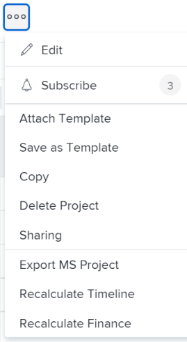

# 重新計算專案時間表

重新計算時間表可讓經理檢視與專案相關的不同因素如何影響專案的時間表。 專案的時間表是指計畫和預計日期。

變更排程、人員休假和專案範圍以外的其他專案不會立即影響專案時間表。 重新計算時間表時，專案時間表會受到影響。 在重新計算發生之前，外部影響不會對您的專案生效。

本文會說明時間表重新計算的方式。

## 存取需求

<!--drafted for P&P: 

<table style="table-layout:auto"> 
 <col> 
 <col> 
 <tbody> 
  <tr> 
   <td role="rowheader">Adobe Workfront plan*</td> 
   <td> 
Any
 </td> 
  </tr> 
  <tr> 
   <td role="rowheader">Adobe Workfront license*</td> 
   <td> 
Current license: Standard 
 
   Or
   
Legacy license: Plan 

   </td> 
  </tr> 
  <tr> 
   <td role="rowheader">Access level configurations*</td> 
   <td> 
Edit access to Projects
 
System administrator to recalculate timeline for all projects in the system
 
<b>NOTE</b>
   
   If you still don't have access, ask your Workfront administrator if they set additional restrictions in your access level. For information on how a Workfront administrator can modify your access level, see <a href="../../../administration-and-setup/add-users/configure-and-grant-access/create-modify-access-levels.md" class="MCXref xref">Create or modify custom access levels</a>.
 </td> 
  </tr> 
  <tr> 
   <td role="rowheader">Object permissions</td> 
   <td> 
Manage permissions to a project
 
For information on requesting additional access, see <a href="../../../workfront-basics/grant-and-request-access-to-objects/request-access.md" class="MCXref xref">Request access to objects </a>.
 </td> 
  </tr> 
 </tbody> 
</table>
-->
自動重新計算時間表會在沒有參與專案工作之任何使用者特殊存取權的情況下進行。

但是，您必須具有下列存取權才能手動重新計算專案的時間表：

<table style="table-layout:auto"> 
 <col> 
 <col> 
 <tbody> 
  <tr> 
   <td role="rowheader">Adobe Workfront計畫*</td> 
   <td> 
任何
 </td> 
  </tr> 
  <tr> 
   <td role="rowheader">Adobe Workfront授權*</td> 
   <td> 
計劃 
 </td> 
  </tr> 
  <tr> 
   <td role="rowheader">存取層級設定*</td> 
   <td> 
編輯專案的存取權
 
系統管理員重新計算系統中所有專案的時間表
 
<b>附註</b>

如果您還是沒有存取權，請詢問您的Workfront管理員，他們是否在您的存取層級中設定其他限制。 如需Workfront管理員如何修改存取層級的詳細資訊，請參閱<a href="../../../administration-and-setup/add-users/configure-and-grant-access/create-modify-access-levels.md" class="MCXref xref">建立或修改自訂存取層級</a>。
 </td>
</tr> 
  <tr> 
   <td role="rowheader">物件許可權</td> 
   <td> 
管理專案的許可權
 
如需請求其他存取權的資訊，請參閱<a href="../../../workfront-basics/grant-and-request-access-to-objects/request-access.md" class="MCXref xref">請求物件</a>的存取權。
 </td> 
  </tr> 
 </tbody> 
</table>

&#42;若要瞭解您擁有的計畫、授權型別或存取權，請連絡您的Workfront管理員。

## 自動重新計算

根據預設，專案時間表會在每天或每晚變更專案範圍時自動重新計算。 Workfront管理員藉由管理「設定」中「專案偏好設定」區域的「時間表」設定，決定是每晚自動計算時間表，還是隨著每次範圍變更自動計算時間表。 如需詳細資訊，請參閱[設定專案的時間表重新計算](../../../administration-and-setup/set-up-workfront/configure-system-defaults/configure-timeline-recalculations-projects.md)。

>[!NOTE]
>
>如果專案的時間表超過15年，則會停用該專案的自動重新計算。 您只能為超過15年的專案選取「手動更新型別」。 如果您將專案日期變更為少於15年，則必須在自動計算時間表之前手動重新計算一次。

* [自動重新計算專案時間表](#automatic-recalculation-of-project-timelines)
* [觸發自動重新計算專案時程表的動作](#actions-that-trigger-an-automatic-recalculation-of-project-timelines)

>[!IMPORTANT]
>
>針對「預覽」和「自訂重新整理沙箱」環境，會停用每晚重新計算，且不會自動重新計算專案時間表。 您必須手動重新計算預覽和自訂重新整理沙箱環境的專案時間表。

### 自動重新計算專案時間表 {#automatic-recalculation-of-project-timelines}

Adobe Workfront只會在符合下列所有條件的專案中，每天重新計算時間表：

* 具有目前狀態
* 專案的更新型別設定為「自動」或「自動」及「變更時」

  如需有關專案更新型別的資訊，請參閱[專案更新型別總覽](../../../manage-work/projects/planning-a-project/project-update-type-overview.md)。

* 具有過去三個月內的上次更新日期\
  Workfront管理員可以變更此預設功能，如[設定專案的時間表重新計算](../../../administration-and-setup/set-up-workfront/configure-system-defaults/configure-timeline-recalculations-projects.md)中所述。

* 專案時間表的最後計算日期不在目前行事曆日期內。 這表示專案時間表的最後計算日期在當天的00:00之前。

您可以設定專案時間表的更新頻率。 更新專案時間表時，會根據對專案所做的變更重新計算。

<!--
<MadCap:conditionalText data-mc-conditions="QuicksilverOrClassic.Draft mode">
or changes made to another project that the timeline is dependent on
</MadCap:conditionalText>
-->

<!--

(NOTE: above, the last part is drafted because of this: I don't think this is right because we told people that in the case of cross-project predecessors, the timeline must be calculated manually for the successor to see the updates in the predecessor's project. Drafting for now.)

-->

如需詳細資訊，請參閱[選取專案更新型別](../../../manage-work/projects/manage-projects/select-project-update-type.md)。

<!--

(NOTE:&nbsp;content moved to the article linked above)

You can configure how the timeline for your project is updated:

<ol>
<li value="1">Go to the project for which you want to configure how the timeline is updated.</li>
<li value="2"> 
  Click the <strong>More</strong> icon  to the right of the project name, then click&nbsp; <strong>Edit</strong>. 
 
The <strong>Edit Project</strong> dialog box is displayed.
 </li>
<li value="3"> 
Click<strong>Settings.</strong> 
 </li>
<li value="4">In the <strong>Update Type</strong> drop-down list, select from the following options: <strong>- Automatic and On Change:</strong> (Default setting) The project timeline is updated each time a change occurs in the project or in another project that the timeline is dependent on. The project timeline is also updated each night.  This is the recommended setting for this field because it ensures that the project timeline is always up to date. When you update a task or the project and trigger a timeline recalculation, all available dates are immediately displayed, allowing you to continue working. On projects with more than 100 tasks, dates that require longer calculations are dimmed.

 This indicates that the recalculation is not yet finished, and the dates are subject to change.  <strong>- Change Only:</strong> The project timeline is updated each time a change occurs in the project or in another project that the timeline is dependent on; scheduled updates do not occur. You might want to select this option if changes rarely occur in the project or in other projects that the timeline is dependent on. <strong>- Automatic Only:</strong> The project timeline is updated each night; it is not updated immediately after changes are made. You might want to select this option if many changes occur each day in the project or in other projects that the timeline is dependent on. <note type="note">
A project does not automatically recalculate each night if it is in Planning status. It only recalculates on change.
</note> <strong>- Manual Only:</strong> The project timeline is updated only when you select the option to Recalculate Timelines, as described in <a href="#manual-recalculation" class="MCXref xref">Manual recalculation</a>. You might want to select this option if you are making many changes to the project at one time, and you want the timeline recalculation to occur after all of the changes have been made (rather than after each individual change). For more information about the project Update Type, see <a href="../../../manage-work/projects/manage-projects/select-project-update-type.md" class="MCXref xref">Select the project Update Type </a><note type="note">
If the timeline of a project is longer than 15 years, the automatic recalculation is disabled. If you change the dates on the project to less than 15 years, you must manually recalculate your timeline one time before it is calculated automatically.
</note></li>
<li value="5">Click <strong>Save Changes.</strong></li>
</ol>

-->

### 觸發自動重新計算專案時程表的動作 {#actions-that-trigger-an-automatic-recalculation-of-project-timelines}

專案生命週期中的各種範圍變更會自動重新計算專案時間表，包括下列動作：

* 正在更新任務狀態。
* 將任務移至其他專案。
* 更新任務的計畫日期或計畫完成日期。
* 更新工期型別、作業限制或作業上的受指派人數目。
* 更新任務前置任務關係。
* 將核准新增至任務，該任務也會將時間新增至任務的規劃完成日期。\
  如需核准設定的詳細資訊，請參閱[設定全域核准設定](../../../administration-and-setup/customize-workfront/configure-approval-milestone-processes/establish-approval-settings.md)。

## 手動重新計算 {#manual-recalculation}

身為專案所有者，您可以手動重新計算個別專案的時間表。 Workfront管理員可以在Workfront中手動重新計算所有時間表。

* [重新計算個別專案或大量專案的時間表](#recalculate-timelines-for-individual-projects-or-in-bulk)
* [在編輯專案方塊中大量手動重新計算時間表](#manually-recalculate-timelines-in-bulk-in-the-edit-projects-box)
* [重新計算系統中所有專案的時間表(僅限Workfront管理員)](#recalculate-timelines-for-all-projects-in-the-system-workfront-administrators-only)

### 重新計算個別專案或大量專案的時間表 {#recalculate-timelines-for-individual-projects-or-in-bulk}

您可以從專案頁面或專案清單或報告，在Workfront中重新計算專案的時間表。

1. 前往您要重新計算時間表之專案，然後按一下專案名稱左邊的&#x200B;**更多**&#x200B;圖示

   

   或

   前往專案清單或報告，選取一或多個專案，然後按一下清單頂端的&#x200B;**更多**&#x200B;圖示。

   

   >[!TIP]
   >
   >根據您專案的複雜性，我們建議不要在大量重新計算專案的時間表時選取大量專案，以確保最佳效能。 某些因素會導致專案過於複雜，例如依賴關係或指派過多，或是自訂欄位過多。

1. 按一下&#x200B;**重新計算時間表**。

   重新計算時間表後，您會看到一則訊息，指出重新計算成功。

   >[!TIP]
   >
   >在時間表重新計算完成之前，某些計畫或預計日期可能會顯示為灰色。 這表示重新計算尚未完成，日期可能會變更。

### 在「編輯專案」方塊中大量手動重新計算時間表 {#manually-recalculate-timelines-in-bulk-in-the-edit-projects-box}

您可以手動重新計算數個專案的時間表，方法是大量編輯專案。

>[!TIP]
>
>根據您專案的複雜性，我們建議不要在大量編輯專案時選取大量專案，以確保最佳效能。 有些因素會導致專案過於複雜，包括多重相依性或指派，或大量自訂欄位。

1. 前往專案清單。
1. 選取清單中的多個專案，然後按一下[編輯]。****
1. 按一下&#x200B;**設定**，然後選取&#x200B;**重新計算時間表**。

1. 按一下「**儲存變更**」。

### 重新計算系統中所有專案的時間表(僅限Workfront管理員) {#recalculate-timelines-for-all-projects-in-the-system-workfront-administrators-only}

Workfront管理員可以執行重新計算時間表診斷，以立即重新計算Workfront系統中的所有時間表。 這可讓所有專案經理立即檢視外部變更對計畫和預計日期的影響。

如需重新計算整個Workfront網站時間表的相關資訊，請參閱[設定專案時間表重新計算](../../../administration-and-setup/set-up-workfront/configure-system-defaults/configure-timeline-recalculations-projects.md)中的「重新計算整個Workfront執行個體的時間表」一節。

<!--

<h2>Project Update Types</h2>

(NOTE: drafted and moved to thisa rticle: /Content/Manage work/Projects/Planning a Project/project-update-type-overview.htm)

For information about how to update the project's Update Type, see <a href="../../../manage-work/projects/manage-projects/select-project-update-type.md" class="MCXref xref">Select the project Update Type </a>. 
 <note type="important">
If the timeline of a project is longer than 15 years, Workfront does not calculate the timeline automatically or on change. The Update Type of a project longer than 15 years is always Manual.
</note>

You can select how each project calculates its timeline by choosing between the following Update Types:
 <note type="important">
If the timeline of a project is longer than 15 years, Workfront does not calculate the timeline automatically or on change. The Update Type of a project longer than 15 years is always Manual.
</note>
<ul>
<li> 
<strong>Automatic and On Change:</strong>&nbsp;This is the default setting. The project timeline is updated each time a change occurs&nbsp;in the project or in another project that the timeline is dependent on. The project timeline is also updated each night.&nbsp;  This is the recommended setting as it ensures that the project timeline is always up to date.
 
When you update a task or the project and trigger a timeline recalculation, all available dates are immediately displayed, allowing you to continue working. On projects with more than 100 tasks, dates that require longer calculations are dimmed. 
 
  
 
This indicates that the recalculation is not yet finished, and the dates are subject to change. 
 </li>
<li><strong>Change Only:</strong>&nbsp;The project timeline is updated each time a change occurs in the project or in another project that the timeline is dependent on; scheduled updates do not occur.  You might want to select this option if you are concerned about system performance and if&nbsp;changes rarely occur in the project or in other projects that the timeline is dependent on.</li>
<li> 
<strong>Automatic Only:</strong>&nbsp;The project timeline is updated each night; it is not updated immediately after changes are made. You might want to select this option if you are concerned about system performance and if many changes occur each day in the project or in other projects that the timeline is dependent on.
 <note type="note">
A project does not automatically recalculate each night if it is in Planning status. It only recalculates on change.
</note> </li>
<li><strong>Manual Only:</strong>&nbsp;The project timeline is updated only&nbsp;when you select the option to <strong>Recalculate Timelines</strong>, as described in the section "Manual Recalculation" in&nbsp;the article <a href="#" class="MCXref xref selected">Recalculate project timelines</a>. You might want to select this option if you are making many changes to the project at one time, and you want the timeline recalculation to occur after all of the changes have been made (rather than after each individual change).</li>
</ul>

-->
